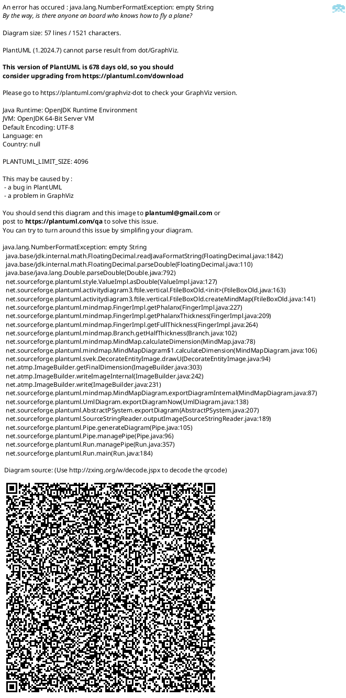
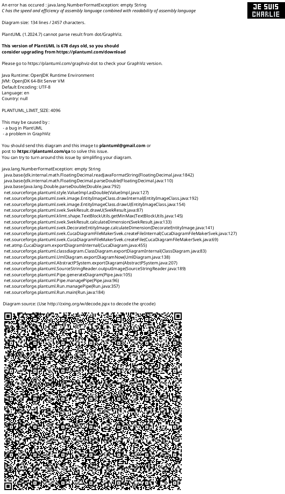

### **Recopilación de Códigos PlantUML para PeluDog**

A continuación se presentan los códigos finales para cada uno de los diagramas realizados:

> **Nota:** Los diagramas específicos del módulo de autenticación se encuentran en el archivo `DiagramasAutenticacion.md`

---

### **1. Modelo de Unidades Organizacionales (Organigrama)**

Este diagrama muestra la estructura jerárquica formal y las líneas de reporte dentro del consultorio PeluDog.

---

### **2. Modelo Jerárquico de Objetivos**

Este diagrama de mente (Mind Map) visualiza cómo los objetivos específicos (SMART) contribuyen a las áreas estratégicas y al objetivo general del negocio.

---

### **3. Modelo de Proceso de Negocio (Diagrama de Actividad)**

Este diagrama de actividad con carriles (swimlanes) modela el flujo de trabajo principal, mostrando las responsabilidades de cada actor en el ciclo de atención al cliente.

---

### **4. Modelo de Objetos de Negocio (Diagrama de Clases Completo)**

Este es el diagrama de clases final y completo, que representa todos los objetos de negocio, incluyendo usuarios, servicios, turnos y los registros detallados del historial clínico, así como sus relaciones.

