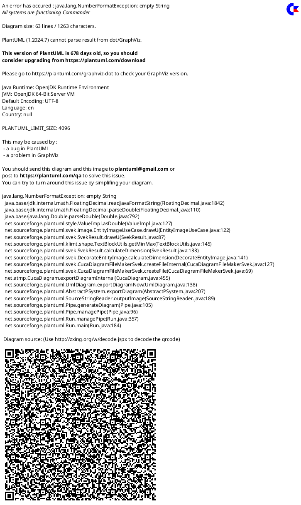

### **Códigos PlantUML para Módulo de Autenticación - PeluDog**

A continuación se presentan los códigos PlantUML para generar todos los diagramas relacionados con el módulo de autenticación de usuarios.

---

### **1. Diagrama de Caso de Uso de Autenticación**

Este diagrama muestra el caso de uso de autenticación y sus relaciones con todos los usuarios del sistema.

---

### **2. Diagrama de Secuencia Principal - CU-AU01**

Este diagrama muestra la secuencia completa del caso de uso de autenticación, incluyendo inicio de sesión, gestión de sesión y cierre de sesión.

---

### **3. Flujo Alternativo FA-AU01-01: Credenciales Incorrectas**

Este diagrama muestra el flujo cuando el usuario ingresa credenciales incorrectas y las políticas de bloqueo.

---

### **4. Flujo Alternativo FA-AU01-02: Cuenta Bloqueada**

Este diagrama muestra el comportamiento cuando un usuario intenta acceder con una cuenta ya bloqueada.

---

### **5. Flujo Alternativo FA-AU01-03: Contraseña Expirada**

Este diagrama muestra el flujo cuando la contraseña del usuario ha expirado según las políticas establecidas.

---

### **6. Flujo Alternativo FA-AU01-04: Enlace de Recuperación Expirado**

Este diagrama muestra el comportamiento cuando el usuario intenta usar un enlace de recuperación que ya ha expirado.

