### **Recopilación de Códigos PlantUML para Flujos Alternativos**

A continuación se presentan los códigos para modelar los flujos alternativos y de error de los principales casos de uso.

---

### **1. CU-GP01: Gestionar Información de Clientes y Mascotas**

#### **Flujo Alternativo: Cliente ya existe al intentar registrar**

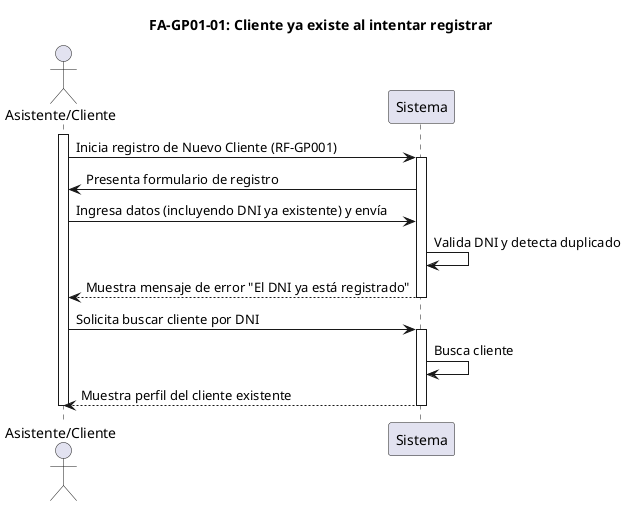

#### **Flujo Alternativo: Datos inválidos en formulario**

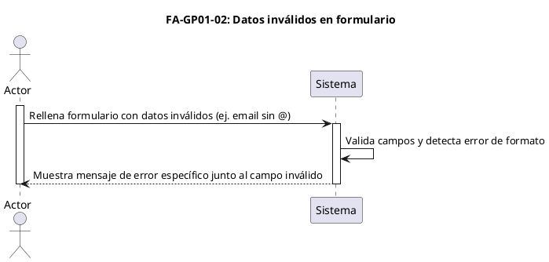

---

### **2. CU-GA01: Gestionar Citas**

#### **Flujo Alternativo: Horario seleccionado ya no está disponible**

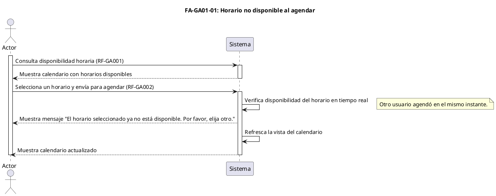

#### **Flujo Alternativo: Cancelación de cita fuera del plazo permitido**

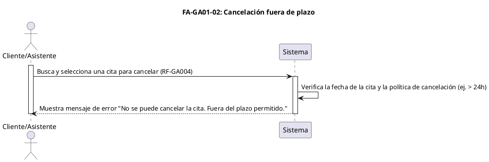

---

### **3. CU-AC02: Registrar Nueva Consulta**

#### **Flujo Alternativo: Intento de edición de historial clínico fuera de plazo**

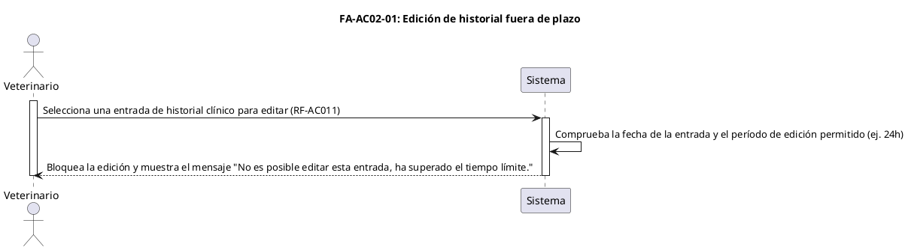

#### **Flujo Alternativo: Carga de archivo no soportado**

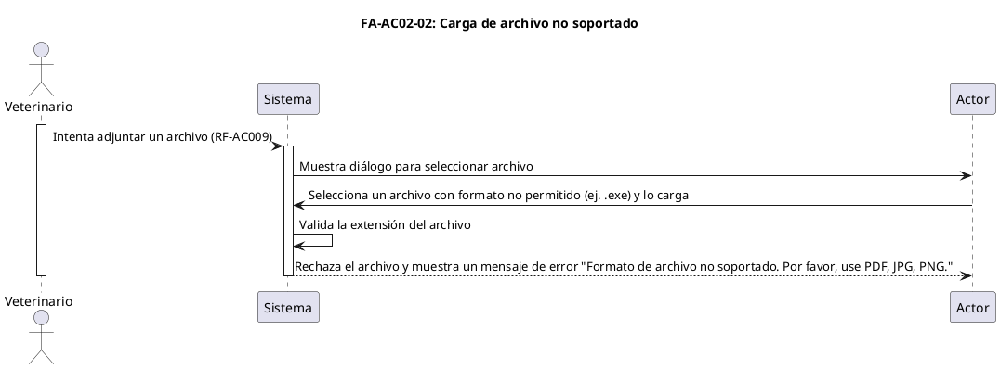

---

### **4. CU-PG01: Registrar Pagos**

#### **Flujo Alternativo: Se registra un pago parcial**

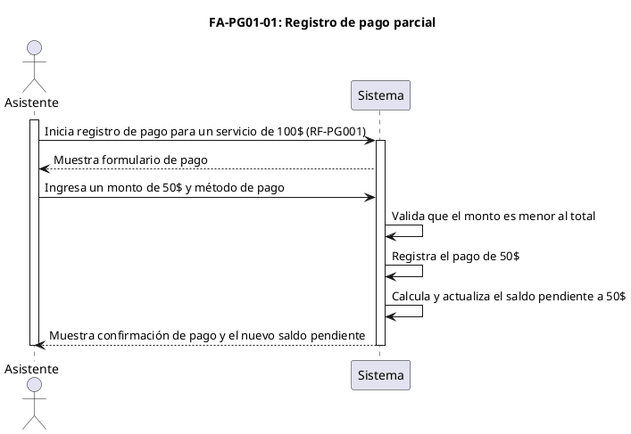

---

### **5. CU-AC01: Consultar Historial Clínico**

#### **Flujo Alternativo: Búsqueda de mascota sin resultados**

Este es un flujo muy común que ocurre cuando el Asistente o Veterinario busca una mascota que no está registrada o comete un error al escribir el criterio de búsqueda.

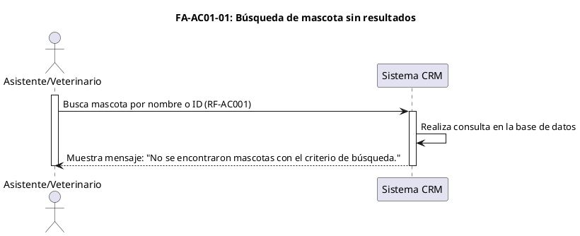

---

### **6. CU-GA02: Gestionar Recordatorios de Citas**

#### **Flujo Alternativo: Falla en el servicio de envío de notificaciones**

Este flujo es crucial para la robustez del sistema. Ocurre cuando el servicio externo (para enviar emails o SMS) no está disponible o responde con un error.

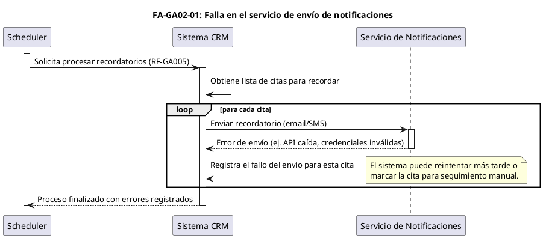

---

### **7. CU-PG01: Registrar Pagos**

#### **Flujo Alternativo: Transacción de pago con tarjeta rechazada**

Este flujo se activa cuando se utiliza una pasarela de pago y la transacción es denegada por el banco emisor o la propia pasarela.

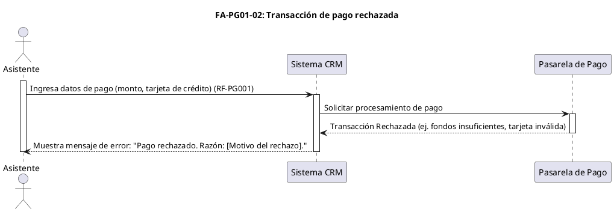

---

### **8. CU-PG03: Generar Reportes Financieros**

#### **Flujo Alternativo: Generación de reporte sin datos**

Este escenario ocurre si el Administrador selecciona un rango de fechas o filtros para los cuales no existe ninguna transacción o dato.

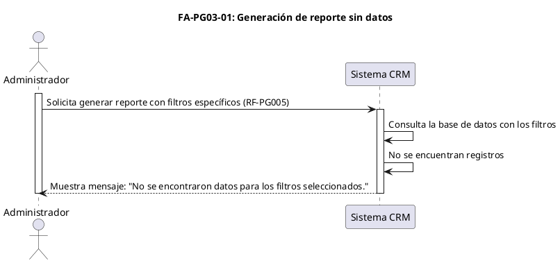

---

### **9. CU-RH01: Gestionar Personal de la Clínica**

#### **Flujo Alternativo: Intento de registrar empleado con DNI/email duplicado**

Similar al registro de clientes, es fundamental evitar la duplicidad de empleados para mantener la integridad de los datos.

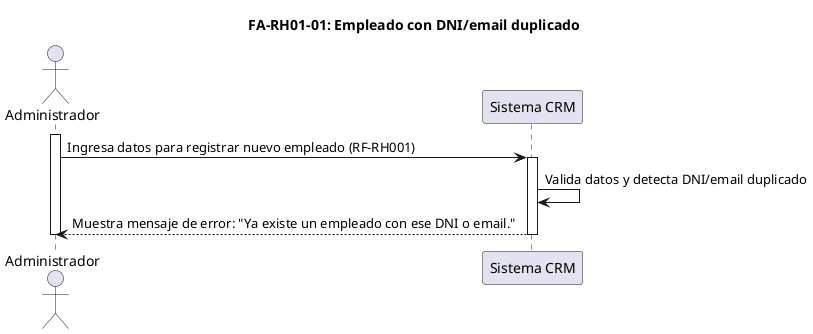

---

### **10. CU-RH02: Gestionar Turnos y Guardias**

#### **Flujo Alternativo: Conflicto de horario al asignar turno**

Este flujo previene que un administrador asigne a un empleado un turno que se solape con otro ya existente en su calendario.

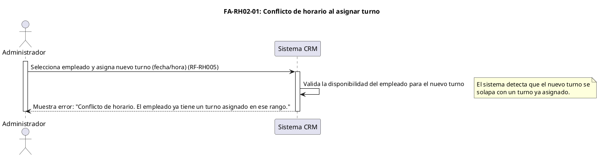

---

### **11. CU-RH03: Gestionar Servicios de la Clínica**

#### **Flujo Alternativo: Intento de crear servicio con nombre duplicado**

Para evitar confusión, el nombre de cada servicio ofrecido por la clínica debería ser único.

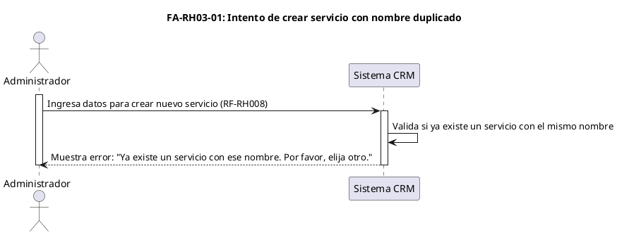
