<html>
  <head>
    <meta content="text/html; charset=UTF-8" http-equiv="content-type" />
    
  </head>
  <body class="c1 c7 doc-content">
    

      Universidad Nacional Experimental de las Telecomunicaciones y la
        Inform&aacute;tica.
    

    

    

    

    

    

    

    

    

    

    
PST: Plataforma de gestión CRM para PeluDog.

    

    

    

    

    

    

    

    

    

    

    

    

    

    

    

    

    
Miguel Figuera C.I: 23.558.789

    

      Iromy Leon C.I: V-30.243.131
    

    
Alejandra Herde C.I: V-23.711.974

    
Tutor: Yuly Delgado

    

        

    

    

    

    

    

    

    

    

    

    

 

    

    

    

    

    

    

    

    

    

    
Venezuela, Julio 2025

    

  </body>
</html>
   

# **PST - Plataforma de gestión CRM para PeluDog.**

## **Integrantes:**

- Miguel Figuera C.I: 23.558.789
- Iromy Leon C.I: V-30.243.131
- Alejandra Herde C.I: V-23.711.974
- Tutor: Yuly Delgado.

### **Resumen:**

La propuesta plantea desarrollar un sistema CRM integral para el consultorio veterinario PeluDog, ubicado en La Mora I (La Victoria, Aragua), con el fin de digitalizar la gestión de citas, historias clínicas, vacunaciones, comunicaciones y pagos. El diagnóstico participativo detecta ineficiencias en los procesos manuales actuales y define como prioridad automatizar la agenda y los registros médicos. El plan de acción contempla fases de levantamiento de requerimientos, desarrollo, pruebas, capacitación e implementación, aprovechando los recursos humanos, tecnológicos y financieros disponibles. Los objetivos SMART se enfocan en elevar la satisfacción y retención de clientes, mejorar la eficiencia operativa, incrementar la rentabilidad y asegurar el cumplimiento normativo. El dominio de la aplicación abarca la gestión de clientes, mascotas, servicios y reportes, dejando fuera facturación fiscal e inventario avanzado.

# **Descripción:**

El presente diagnóstico participativo tiene como objetivo evaluar las necesidades, recursos y oportunidades existentes en el consultorio veterinario _PeluDog_, ubicado en la urbanización La Mora I, tercera entrada, calle 36, la Victoria Edo. Aragua. El consultorio, liderado por la Dra. Génesis Conesa, ofrece servicios de consulta, hospedaje y peluquería canina a precios accesibles. Reconociendo la importancia de la tecnología para optimizar la gestión y mejorar la calidad de los servicios, este diagnóstico se centra en la implementación de un Sistema de Gestión de Relaciones con los Clientes (CRM) adaptado a las necesidades específicas del consultorio.

La Dra. Génesis y PeluDog son pilares comunitarios pues participan tambien con regularidad en campañas de vacunación, y consultas veterinarias en servicios comunitarios.

Esto hace que tenga una cantidad de pacientes considerable dado que presta su servicios a la comunidad de la ciudad de La Victoria en distintos espacios a personas de distintos grupos socioeconómicos.

La participación activa de la Dra. Génesis y su asistente es fundamental para garantizar que el CRM resultante sea una herramienta verdaderamente útil y sostenible. Este proceso se alinea con los principios del desarrollo comunitario, buscando fortalecer la capacidad del consultorio para servir a su comunidad de manera eficiente y efectiva.

La implementación de un CRM para esta comunidad podria fomentar la atencion constante de sus mascotas, dando como resultado la detección temprana de enfermedades y un mejor control veterinario con dos consultas al año y los recordatorios para vacunación.

## **Localización Geográfica:**

Las coordenadas de peluDog según [maps.google.com](https://www.google.com/maps/place/10%C2%B013'45.9%22N+67%C2%B018'09.6%22W/@10.2293452,-67.3026976,91m/data=!3m1!1e3!4m5!3m4!4b1!8m2!3d10.2294169!4d-67.3026786?hl=es&entry=ttu&g_ep=EgoyMDI1MDYzMC4wIKXMDSoASAFQAw%3D%3D) son: long:10.2294169, lat: \-67.3026786

Esta ubicado en el urbanismo La Mora I, tercera entrada, av.11 con av.36, La Victoria Edo. Aragua.
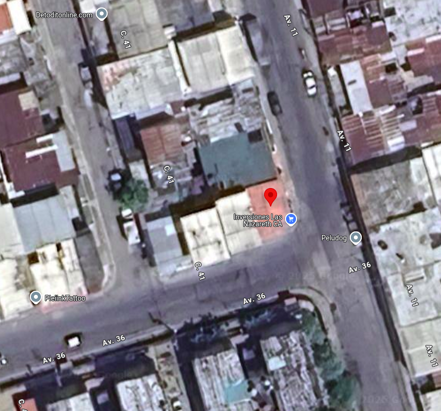

   

## **Identificación de Problemas:**

El principal problema identificado es la falta de herramientas digitales que automaticen procesos clave en la gestión del consultorio. Esto se manifiesta en las siguientes áreas:

- **Gestión de citas:** El sistema actual de gestión de citas es manual, lo que puede generar errores, duplicaciones y dificultades para optimizar la agenda, afectando así la relación con los clientes de Pelugod.
- **Historias clínicas:** La información de los pacientes se registra de manera manual, lo que dificulta el acceso rápido a la información, el seguimiento de enfermedades crónicas y la generación de informes; incluso, en algunos casos se pueden traspapelar las historias.
- **Control de vacunación:** El seguimiento de los esquemas de vacunación se realiza manualmente, lo que aumenta el riesgo de olvidar fechas importantes y no recordar a los clientes la necesidad de refuerzos.
- **Comunicación con los clientes:** La falta de un sistema automatizado dificulta la comunicación proactiva con los clientes, como el envío de recordatorios de citas, consejos de cuidado o promociones.
- **Gestión de referencias y resultados de laboratorio:** La coordinación con otros profesionales y el registro de resultados de laboratorio se realiza de manera manual, lo que puede generar retrasos y errores en la comunicación.
- **Servicios**: Dada la naturaleza de multiples servicios que ofrece Peludog, es recomendable diferenciarlos dentro del CRM y estructurar los procesos requeridos para cada uno, siendo peluqueria, hospedaje y consulta servicios que tienen procesos y costos distintos.
- **Registro de Pagos:** Se realiza de forma manual por lo que no hay forma de entender el flujo de caja del negocio de forma rapida.

Estos problemas impactan negativamente la eficiencia del consultorio, la calidad de la atención al cliente y la capacidad de crecimiento del negocio.

**Análisis de Recursos:**

El consultorio La Mora I cuenta con una serie de recursos que facilitan la implementación del CRM:

- **Recursos humanos:** La Dra. Génesis Conesa y su asistente están comprometidas con el proyecto y dispuestas a participar activamente en el proceso de levantamiento de requerimientos y capacitación.
- **Recursos tecnológicos:** El consultorio cuenta con acceso a internet, un mini ups, una laptop, teléfonos inteligentes y una tablet, lo que facilita el uso de herramientas digitales y permitiría el acceso al crm incluso sin luz.
- **Recursos financieros:** El consultorio está dispuesto a invertir en el alojamiento mensual de la aplicación en un servidor (aproximadamente $25 dólares al mes), lo que demuestra su compromiso con la sostenibilidad del proyecto.
- **Conocimientos:** El equipo tiene conocimientos suficientes para ser usuario de un CRM sencillo y comprender los beneficios de la digitalización.
- **Ubicación y reputación:** El consultorio está bien ubicado en la urbanización La Mora I y goza de una buena reputación en la comunidad, lo que facilita la captación y retención de clientes.
- **Infraestructura física:** El espacio físico del consultorio, aunque integrado en una casa familiar, es adecuado para la prestación de servicios veterinarios y cuenta con todos los elementos necesarios para las consultas, el hospedaje y la peluquería.

**Priorización de Actividades:**

Considerando los problemas identificados y los recursos disponibles, se priorizan las siguientes actividades:

1. **Levantamiento de requerimientos:** Esta es la actividad prioritaria, ya que definirá las funcionalidades esenciales del CRM y garantizará que se adapte a las necesidades del consultorio. Se priorizarán las funcionalidades de gestión de citas e historias clínicas.
2. **Diseño y desarrollo del CRM:** Una vez definidos los requerimientos, se procederá al diseño y desarrollo del CRM. Se priorizará la creación de una interfaz amigable y fácil de usar.
3. **Pruebas y validación:** Antes de la implementación, se realizarán pruebas exhaustivas para garantizar que el CRM funcione correctamente y cumpla con los requerimientos definidos.
4. **Capacitación:** Se proporcionará capacitación al equipo del consultorio sobre el uso del CRM y la gestión de datos.
5. **Implementación y seguimiento:** Se implementará el CRM en el consultorio y se realizará un seguimiento continuo para identificar problemas y oportunidades de mejora.
6. **Mejora continua:** Se realizarán actualizaciones y mejoras al CRM en función de la retroalimentación del equipo del consultorio y las nuevas necesidades que surjan.

**Plan de Acción:**

El plan de acción se divide en las siguientes etapas:

**Fase 1: Preparación (Duración estimada: 1 día)**

- **Objetivo:** Establecer las bases para el proceso participativo.
- **Actividades:**
  - **Reunión inicial:** Realizar una reunión con la Dra. Génesis y su asistente para explicar el proceso de diagnóstico participativo, definir roles y responsabilidades, y establecer un cronograma de trabajo.
  - **Definir el alcance del CRM:** Aclarar los límites de las funcionalidades a incluir (inicialmente: citas, historias clínicas, recordatorios, registro de pagos, referencias).
  - **Preparar una guía de entrevista:** Elaborar preguntas clave para las entrevistas, enfocándose en los procesos actuales, puntos débiles, necesidades y expectativas.
  - **Crear plantillas para documentación:** Diseñar formatos para registrar la información recopilada (requerimientos funcionales, no funcionales, casos de uso).
- **Responsable:** El especialista en el levantamiento de requerimientos.

**Fase 2: Recopilación de Información (Duración estimada: 2-3 días)**

- **Objetivo:** Comprender a fondo los procesos actuales y las necesidades del consultorio.
- **Actividades:**
  - **Entrevistas individuales:** Realizar entrevistas detalladas con la Dra. Génesis y su asistente para comprender sus roles, tareas diarias y desafíos.
    - **Preguntas clave:**
      - ¿Cómo gestionan actualmente las citas? (Herramientas, procesos, problemas)
      - ¿Cómo registran la información de los pacientes? (Historias clínicas, vacunas, tratamientos)
      - ¿Cómo se comunican con los clientes? (Recordatorios, seguimiento)
      - ¿Qué información consideran crítica para la gestión del consultorio?
      - ¿Qué les gustaría automatizar o mejorar?
    -
  - **Observación directa (si es posible):** Observar el flujo de trabajo en el consultorio para identificar cuellos de botella y oportunidades de mejora.
  - **Análisis de documentos existentes:** Revisar los formatos de historias clínicas, hojas de citas, etc., para identificar la información relevante.
- **Responsables:** El especialista en levantamiento de requerimientos, Dra. Génesis y asistente.

**Fase 3: Análisis y Documentación de Requerimientos (Duración estimada: 2-3 días)**

- **Objetivo:** Traducir las necesidades del consultorio en requerimientos concretos para el CRM.
- **Actividades:**
  - **Taller participativo:** Realizar un taller con la Dra. Génesis y su asistente para analizar la información recopilada y definir los requerimientos funcionales y no funcionales del CRM.
    - **Ejemplo:** "El sistema debe permitir programar citas con diferentes tipos de servicios" (requerimiento funcional). "El sistema debe ser fácil de usar" (requerimiento no funcional).
  - **Creación de casos de uso:** Describir cómo los usuarios interactuarán con el CRM para realizar tareas específicas (ej., "Crear una nueva cita", "Consultar el historial de un paciente").
  - **Priorización de requerimientos:** Asignar prioridades a los requerimientos (alta, media, baja) según su importancia para el negocio.
- **Responsables:** El especialista en levantamiento de requerimientos, Dra. Génesis y asistente.

**Fase 4: Validación y Ajuste (Duración estimada: 1 día)**

- **Objetivo:** Asegurar que los requerimientos documentados reflejen las necesidades reales del consultorio.
- **Actividades:**
  - **Presentación de los requerimientos documentados:** Mostrar a la Dra. Génesis y a su asistente la lista de requerimientos, casos de uso y prioridades.
  - **Sesión de retroalimentación:** Solicitar comentarios y sugerencias para mejorar la precisión y claridad de los requerimientos.
  - **Ajuste de los requerimientos:** Modificar los requerimientos según la retroalimentación recibida.
- **Responsables:** El especialista en levantamiento de requerimientos, Dra. Génesis y asistente.

**Fase 5: Desarrollo, Implementación y Evaluación.**

- **Objetivo:** Crear un CRM funcional y adaptado a las necesidades del consultorio, y evaluar su impacto en la gestión y la calidad de los servicios.
- **Actividades:**
  - **Desarrollo del CRM:** Contratar a un desarrollador para construir el CRM según los requerimientos definidos.
  - **Pruebas y validación:** Realizar pruebas exhaustivas para asegurar que el CRM funcione correctamente.
  - **Capacitación:** Proporcionar capacitación al equipo del consultorio sobre el uso del CRM.
  - **Implementación:** Implementar el CRM en el consultorio.
  - **Seguimiento y evaluación:** Monitorear el uso del CRM y evaluar su impacto en la eficiencia, la calidad de la atención al cliente y la satisfacción del equipo.
  - **Mejora continua:** Realizar ajustes y mejoras al CRM según la retroalimentación del equipo del consultorio y las nuevas necesidades que surjan.
- **Responsables:** El especialista en levantamiento de requerimientos, el desarrollador del CRM, Dra. Génesis y asistente.

**Indicadores de Éxito:**

- Participación activa de la Dra. Génesis y su asistente en todas las fases del proyecto.
- Documento de requerimientos completo, claro y preciso.
- CRM funcional y adaptado a las necesidades del consultorio.
- Mejora en la eficiencia de la gestión de citas, historias clínicas y comunicación con los clientes.
- Aumento en la satisfacción del equipo del consultorio.
- Mejora en la calidad de la atención al cliente.

Este plan de acción busca empoderar al consultorio veterinario La Mora I para que utilice la tecnología de manera efectiva y sostenible, mejorando la calidad de sus servicios y fortaleciendo su papel en la comunidad al automatizar ciertas tareas y funcionando de respaldo de las historias clínicas de los pacientes.

   

# **PST: Plataforma de gestión CRM para PeluDog.**

## **1\) Sistema de Negocios:**

**Consultorio Veterinario: PeluDog**.

Este es el entorno completo donde se realizan las actividades para proveer servicios de salud y bienestar animal. Incluye al personal (veterinarios, asistentes, administrativos), las instalaciones físicas, el equipamiento, los procesos de atención, la gestión administrativa y financiera, y la relación con los clientes (dueños de mascotas) y proveedores.

**Dominio de la Aplicación (Plataforma para CRM):** La aplicación se centrará en la gestión de la relación con los clientes (dueños de mascotas) y la gestión de la información clínica de las mascotas, así como los procesos administrativos directamente vinculados a la atención.

**Dentro del Dominio para la plataforma de gestión de CRM:**

1. Gestión de datos de clientes (dueños) y sus mascotas.
2. Gestión integral de la agenda de citas, en local o a domicilio (creación, modificación, cancelación, recordatorios, confirmaciones).
3. Gestión de esquemas de vacunación de los pacientes: recordatorios, costos y agenda de citas.
4. Gestión de la historia clínica electrónica de las mascotas (consultas, diagnósticos, tratamientos, vacunaciones, desparasitaciones, archivos adjuntos como exámenes).
5. Prescripción de tratamientos y generación de récipes.
6. Solicitud de exámenes de laboratorio.
7. Registro básico de ingresos y egresos por servicios y productos directamente relacionados con la consulta.
8. Gestión de recordatorios (citas, vacunas, desparasitaciones).
9. Gestión de servicios relacionados con la atención a las mascotas: hospedaje, cirugía, hospitalización, grooming (peluquería).
10. Gestión de personal y sus turnos en caso de multiples veterinarios o ayudantes (permisos y roles dentro de la aplicación).
11. Gestión de servicios y productos (usos dentro de las consultas de material médico) disponibles.

    **Fuera del Dominio**

12. Contabilidad financiera avanzada del consultorio (estados de resultados complejos, balances, impuestos).
13. Marketing y campañas publicitarias complejas.
14. Gestión avanzada de proveedores y compras.
15. Integración directa con equipos de laboratorio para recepción automática de resultados.

   

## **2\) Determinar los objetivos del sistema de negocio (Consultorio Veterinario):**

**Objetivo General**

Proveer atención médica veterinaria de alta calidad para mantener y mejorar la salud y el bienestar de las mascotas.

**Objetivos Específicos (S.M.A.R.T.)**

1. **Satisfacción del Cliente:**

- Lograr una tasa de retencion de clientes del 85% para el cierre del año en curso, medida como el porcentaje de clientes que regresan para una segunda cita o servicio en un periodo de 12 meses.
- Implementar encuestas de satisfacción automatizadas post-consulta en el primer mes, y alcanzar un puntaje promedio de 75/100 o superior para el final del primer trimestre, manteniendo o mejorando ese nivel durante el resto del año
- Aumentar los referidos directos inscritos en la plataforma de gestión CRM (recomendaciones de clientes y pacientes satisfechos) en un 50% en los proximos 3 meses.

2. **Eficiencia Operativa**:

- Reducir el número de discrepancias en las auditorías de caja semanales en un 90% para final de año, pasando de un promedio de 20 errores a 2 errores por semana.
- Reducir en un 15% el tiempo promedio por consulta (sin sacrificar calidad) mediante la digitalización de historiales clínicos y el uso de plantillas predefinidas para diagnósticos comunes, a implementar en 4 meses.
- Reducir el tiempo invertido en recordatorios de citas en un 70% dentro de los primeros 2 meses.

3. **Rentabilidad y Sostenibilidad**:

- Aumentar el número de clientes nuevos en un 20% para finales de año..
- Aumentar el número total de citas facturadas en un 15% para finales de año.
- Aumentar la tasa de cumplimiento del esquema de vacunación en un 50% en los próximos 6 meses, medido por el número de mascotas que reciben su dosis de refuerzo a tiempo gracias a los recordatorios automatizados.

4. **Cumplimiento Normativo**:

- Mantener un 100% del cumplimiento con todas las normativas del colegio de Médicos veterinarios de Venezuela y las regulaciones sanitarias a través del proceso presente en el software para las consultas veterinarias y su historial.
  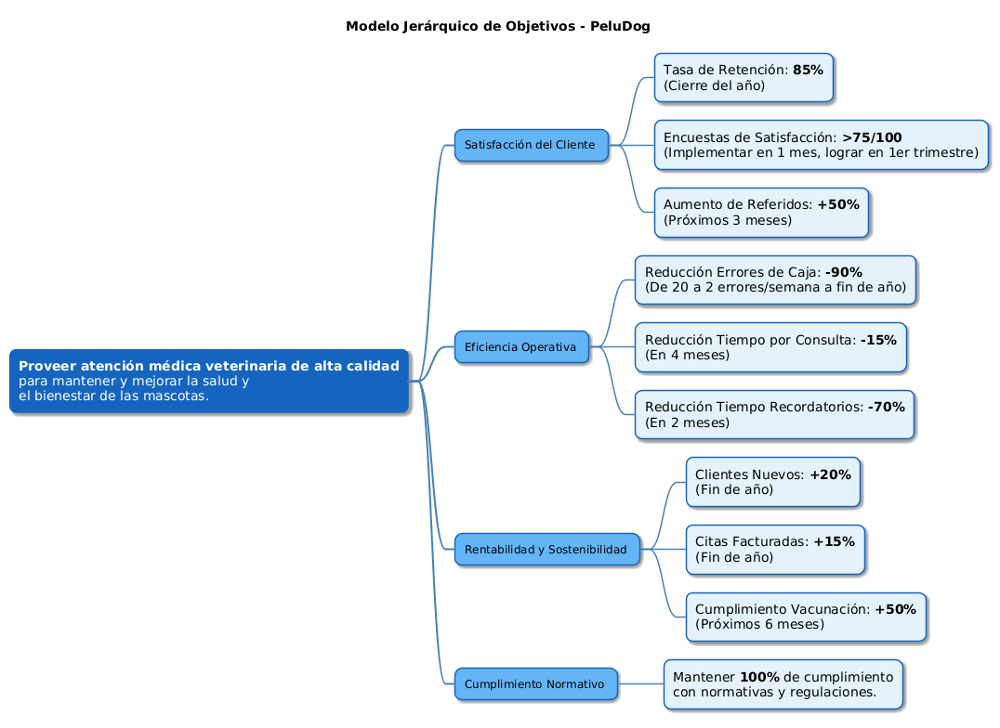
  

## **3)Procesos de Negocio Principales del Consultorio Veterinario:**

Como criterio general, solo seran apoyados aquellos procesos que impacten de forma clara en las relaciones entre la clínica y sus clientes (dueños de mascotas), favoreciendo así el objetivo de prestar atención veterinaria de calidad a las mascotas.

### **Gestión de Clientes y Pacientes Nuevos:**

- Objetivo: Registro de datos de identificación y creación de registro en el sistema.

- Justificación: Los datos de identificación de los pacientes y sus dueños son el activo fundamental para la gestión de las relaciones con el cliente. Sin un registro centralizado y preciso, es imposible medir la retención, personalizar la comunicación o implementar una estrategia de CRM efectiva. Este proceso es la base sobre la cual se construyen la lealtad del cliente y el crecimiento a largo plazo del consultorio "PeluDog".

- **Apoyado por la plataforma de gestión de CRM.**

### **Gestión de Agenda y Citas:**

- Objetivo: Manejo de la agenda de forma eficiente y eficaz promoviendo así una atención de alta calidad a los dueños y a las mascotas.

- Justificación: La agenda es el motor operativo y financiero del consultorio. Una gestión ineficiente provoca tiempos de espera prolongados (insatisfacción del cliente), espacios muertos (pérdida de ingresos) y estrés en el personal. Centralizar y automatizar este proceso con la plataforma CRM permite optimizar el tiempo del veterinario, reducir el ausentismo mediante recordatorios automáticos y ofrecer una experiencia de agendamiento fluida y profesional, impactando directamente en la eficiencia y la satisfacción del cliente.

- **Apoyado por la plataforma de gestión de CRM.**

### **Atención Clínica (Consulta Médica):**

- Objetivo: Proveer atención médica y tratamiento a las mascotas, así como atención médica preventiva.

- Justificación: Este es el proceso central que entrega el valor principal del negocio. Un historial clínico digitalizado, accesible y estandarizado es crucial para garantizar la calidad y continuidad de la atención médica. Reduce drásticamente el riesgo de errores médicos, agiliza el tiempo de consulta al tener toda la información al alcance y asegura que cada decisión clínica se base en un historial completo. Es una herramienta indispensable para cumplir con la misión de proveer atención de alta calidad y para mitigar riesgos profesionales.

- **Apoyado por la plataforma de gestión de CRM.**

### **Gestión de Procedimientos Especiales (Cirugías, Hospitalización \- si aplica):**

- Objetivo: Manejo adecuado de la agenda para dar prioridad a los procedimientos especiales.

- Justificación: Los procedimientos especiales representan eventos de alto valor económico y de alta criticidad para la salud del paciente. Su gestión requiere una coordinación superior a la de una consulta de rutina, involucrando la reserva de espacios, equipos y personal específico. Utilizar la plataforma para este fin asegura una planificación sin conflictos, una comunicación clara con el dueño (instrucciones pre y post operatorias) y un seguimiento riguroso, lo cual maximiza la rentabilidad y refuerza la confianza del cliente en los momentos más delicados.

- **Apoyado por la plataforma de gestión de CRM.**

### **Facturación:**

- Objetivo: Cumplimiento de las ordenanzas y leyes fiscales del país.

- Justificación: La legislación venezolana establece una serie de normativas para la homologación de cualquier sistema vinculado a la facturación que dificultan la adaptación de este software a dichos procesos y normativas. Por lo tanto, para minimizar la complejidad del proyecto y asegurar un enfoque en las áreas de mayor impacto CRM, se ha tomado la decisión estratégica de delimitar el alcance de la aplicación, excluyendo el manejo de facturas fiscales.

- **No Apoyado por la plataforma de gestión de CRM.**

### **Seguimiento Post-Atención:**

- Objetivo: Cuidado preventivo y educativo para la mascota y su dueño, así como fomento de la atención temprana y el mantenimiento de procesos de inmunidad como las vacunaciones y las desparasitaciones en los tiempos adecuados de acuerdo a las últimas dosis.

- Justificación: La lealtad del cliente se consolida después de que sale del consultorio. Un seguimiento proactivo demuestra un interés genuino en el bienestar de la mascota, transformando una visita transaccional en una relación a largo plazo. Automatizar este proceso a través del CRM es la única forma escalable de garantizar que ningún paciente se pierda de sus refuerzos de vacunas o seguimientos críticos, lo que no solo asegura ingresos recurrentes (rentabilidad), sino que también eleva la percepción de calidad y fomenta la medicina preventiva.

- **Apoyado por la plataforma de gestión de CRM.**

### **Gestión de Inventario (Básico):**

- Objetivo: Manejo adecuado de los recursos para la salud y el bienestar de los pacientes.

- Justificación: Aunque la gestión de inventario es vital para la rentabilidad y para evitar quiebres de stock de insumos críticos, su implementación completa (control de lotes, fechas de vencimiento, integración con proveedores) añade una capa significativa de complejidad al proyecto. Como decisión estratégica de alcance, se ha optado por enfocar los recursos de desarrollo en las funcionalidades de CRM y gestión clínica, que son el núcleo de la interacción con el cliente. El control de inventario podrá ser manejado por un sistema externo o en una fase posterior del proyecto.

- **No Apoyado por la plataforma de gestión de CRM.**

### **Gestión Administrativa General:**

- Objetivo: Reporte mensual sobre casos atendidos, casos comunes (posibles epidemias o focos de contagio), y otros datos similares para la toma de decisiones estratégica.

- \*: No se puede gestionar lo que no se mide. Este proceso convierte los datos operativos diarios en inteligencia de negocio. Los reportes generados por la plataforma permiten pasar de la intuición a la toma de decisiones basada en evidencia, identificando tendencias (ej. qué servicio es más rentable), midiendo el progreso hacia los objetivos SMART (ej. tasa de retención) y detectando oportunidades de crecimiento o problemas operativos. Es el proceso que permite al director del consultorio "trabajar en el negocio", no solo "dentro del negocio".

- **Apoyado por la plataforma de gestión de CRM.**
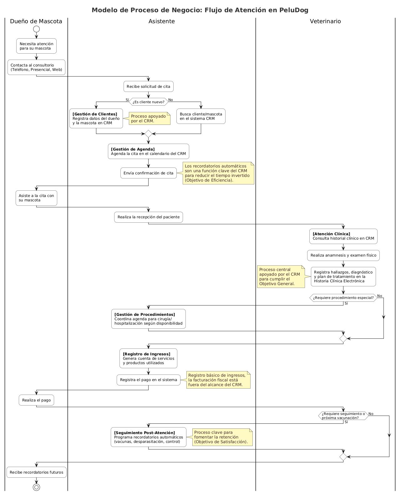
   

## **4\) Identificar los actores y especificar cómo ellos están organizados estructuralmente; esto es, determinar cuál es la estructura organizacional del sistema de negocios y qué actores participan en la ejecución de sus procesos de negocio.**

### **Organigrama**

La jerarquía dentro de PeluDog es la siguiente de acuerdo con un organigrama sencillo:

1. **Veterinaria Principal**: Dra. Génesis Conesa.
2. **Veterinarios.**.
3. **Asistente Administrativo.**
4. **Veterinarios auxiliares** / **Técnicos Veterinarios** (solo para cirugía o procedimientos que los requieran).
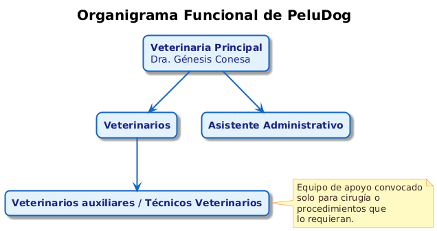

   

### **Actores del sistema de negocios**

- **Veterinario**:Gestión de Clientes y Pacientes (consulta de datos), Atención Clínica (registro completo), Prescripción, Solicitud de exámenes, Seguimiento (revisión de historial para recordatorios), gestion de inventario (uso de productos).

- **Asistente**:Gestión de Clientes y Pacientes Nuevos, Gestión de Agenda y Citas, Facturación y Cobro, Seguimiento Post-Atención (envío de recordatorios manuales), gestión de inventario (entradas y salidas de productos).

- **Dueño de Mascota:** Proporciona información para registro, solicita citas, recibe recordatorios, recibe atención para su mascota, realiza pagos. También conocido como cliente.

   

## **5\) Determinar y modelar los objetos de negocio que participan, intervienen o están relacionados con cada uno de los procesos de negocio del dominio.**

Estos son los principales "conceptos" o "entidades" con los que el consultorio veterinario trabaja y que la plataforma para manejo de CRM gestionará.

- **Objeto de Negocio: Cliente (Dueño de Mascota)**

  - **Descripción:** Persona responsable de la mascota.

  - **Atributos Clave:** Nombre, Apellido, DNI/Identificación, Dirección, Teléfono, Email.

  - **Relación con Procesos:** Creado en "Gestión de Clientes y Pacientes Nuevos". Utilizado en "Gestión de Agenda", "Atención Clínica", "Ingresos/Egresos", "Seguimiento", "Recordatorios de vacunacion y consultas"..

  - **Relación con otros Objetos:** Un Cliente _tiene_ una o más Mascotas. Un Cliente _recibe_ Notas de pago.

- **Objeto de Negocio: Mascota**

  - **Descripción:** Animal paciente del consultorio.

  - **Atributos Clave:** Nombre, Especie, Raza, Sexo, Fecha de Nacimiento/Edad Estimada, Color, Señas Particulares, Número de Chip, Alergias Conocidas, Estado (Activo/Fallecido), peso, enfermedades cronicas.

  - **Relación con Procesos:** Creado/actualizado en "Gestión de Clientes y Pacientes Nuevos". Es el sujeto principal en "Atención Clínica" y "Gestión de Agenda".

  - **Relación con otros Objetos:** Una Mascota _pertenece a_ un Cliente. Una Mascota _tiene una_ Historia Clínica. Una Mascota _tiene_ Citas, Una mascota tiene varios veterinarios.

- **Objeto de Negocio: Cita**

  - **Descripción:** Reserva de tiempo para una consulta o procedimiento.

  - **Atributos Clave:** Fecha, Hora, Veterinario Asignado, Mascota, Cliente, Motivo de la Cita, Estado (Programada, Confirmada, Cancelada, Realizada, No Asistió).

  - **Relación con Procesos:** Creada, modificada y gestionada en "Gestión de Agenda y Citas". Da origen a una "Consulta" dentro de la "Atención Clínica", da origen a un "Recordatorio".

  - **Relación con otros Objetos:** Una Cita _es para_ una Mascota (y su Cliente). Una Cita _es atendida por_ un Veterinario, una cita genera una entrada nueva en historia clinica.

- **Objeto de Negocio: Historia Clínica**

  - **Descripción:** Registro cronológico de todos los eventos médicos de una mascota.

  - **Atributos Clave:** Es más un contenedor que una entidad con atributos propios, su contenido son las Entradas de Consulta.

  - **Relación con Procesos:** Consultada y actualizada constantemente durante la "Atención Clínica".

  - **Relación con otros Objetos:** Una Historia Clínica _pertenece a_ una Mascota. Una Historia Clínica _contiene múltiples_ Entradas de Consulta/Visita.

- **Objeto de Negocio: Entrada de Consulta/Visita Médica**

  - **Descripción:** Registro detallado de una interacción médica específica.

  - **Atributos Clave:** Fecha, Veterinario, Peso, Temperatura, Anamnesis, Hallazgos Examen Físico, Diagnóstico(s), Plan de Tratamiento, Notas.

  - **Relación con Procesos:** Creada durante la "Atención Clínica".

  - **Relación con otros Objetos:** Una Entrada de Consulta _es parte de_ una Historia Clínica. Puede _tener asociados_ Archivos Adjuntos, Prescripciones, Solicitudes de Exámenes.

- **Objeto de Negocio: Prescripción (Récipe)**

  - **Descripción:** Indicación de un tratamiento farmacológico.

  - **Atributos Clave:** Fecha, Medicamento, Dosis, Frecuencia, Duración, Vía de Administración.

  - **Relación con Procesos:** Creada durante la "Atención Clínica".

  - **Relación con otros Objetos:** Una Prescripción _es parte de_ una Entrada de Consulta. Se refiere a un _Medicamento_ (puede ser un objeto de negocio separado si se gestiona inventario detallado).

- **Objeto de Negocio: Solicitud de Examen**

  - **Descripción:** Petición de pruebas diagnósticas.

  - **Atributos Clave:** Fecha, Tipo de Examen(es) Solicitado(s), Muestra(s) Requerida(s).

  - **Relación con Procesos:** Creada durante la "Atención Clínica".

  - **Relación con otros Objetos:** Una Solicitud de Examen _es parte de_ una Entrada de Consulta.

- **Objeto de Negocio: Archivo Adjunto**

  - **Descripción:** Documento o imagen digital asociado a una historia clínica.

  - **Atributos Clave:** Nombre del Archivo, Tipo de Archivo, Fecha de Carga, Descripción.

  - **Relación con Procesos:** Creado/adjuntado durante la "Atención Clínica".

  - **Relación con otros Objetos:** Un Archivo Adjunto _está asociado a_ una Entrada de Consulta.

- **Objeto de Negocio: Vacunación/Desparasitación (Registro)**

  - **Descripción:** Evento específico de administración de vacuna o desparasitante.

  - **Atributos Clave:** Fecha, Producto Utilizado, Lote, Fecha de Vencimiento del Producto, Próxima Dosis.

  - **Relación con Procesos:** Registrado durante la "Atención Clínica".

  - **Relación con otros Objetos:** Es un tipo especial de evento dentro de una Entrada de Consulta o puede ser una entidad separada vinculada.

- **Objeto de Negocio: Factura/Comprobante de Venta**

  - **Descripción:** Documento que detalla los servicios y productos cobrados.

  - **Atributos Clave:** Número de Factura, Fecha, Cliente, Mascota, Detalle de Ítems (Servicio/Producto, Cantidad, Precio Unitario, Precio Total), Subtotal, Impuestos, Total a Pagar, Estado del Pago.

  - **Relación con Procesos:** Generada en "Facturación y Cobro".

  - **Relación con otros Objetos:** Una Factura _se emite a_ un Cliente. Una Factura _puede estar relacionada con_ una o más Entradas de Consulta. _Contiene_ Ítems de Factura.

- **Objeto de Negocio: Ítem de Factura/Servicio/Producto**

  - **Descripción:** Un servicio prestado o producto vendido.

  - **Atributos Clave:** Código, Descripción, Precio. Si es producto de inventario: Stock actual.

  - **Relación con Procesos:** Utilizado en "Atención Clínica" (al prescribir o usar), "Gestión de Inventario" y "Facturación".

  - **Relación con otros Objetos:** Un Ítem _forma parte de_ una Factura.

- **Objeto de Negocio: Pago**

  - **Descripción:** Registro de un abono o pago completo de una factura.

  - **Atributos Clave:** Fecha, Monto, Método de Pago.

  - **Relación con Procesos:** Registrado en "Facturación y Cobro".

  - **Relación con otros Objetos:** Un Pago _se aplica a_ una Factura.

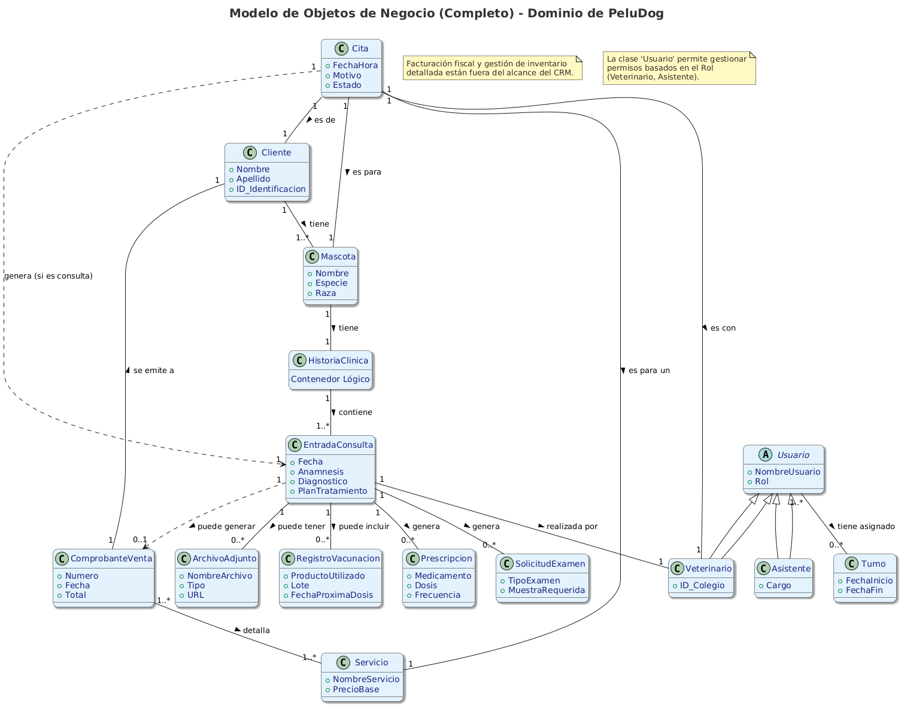

   

### **Matriz de Objetos vs. Procesos de Negocio (CRUD)**

| Objeto de Negocio      | Gestión de Clientes y Pacientes Nuevos | Gestión de Agenda y Citas | Atención Clínica (Consulta Médica) | Seguimiento Post-Atención | Registro de Ingresos (Básico) | Gestión Administrativa     |
| :--------------------- | :------------------------------------- | :------------------------ | :--------------------------------- | :------------------------ | :---------------------------- | :------------------------- |
| **Cliente (Dueño)**    | **C**, R, U                            | R                         | R                                  | R, U                      | R                             | R                          |
| **Mascota**            | **C**, R, U                            | R                         | R, U                               | R                         | R                             | R                          |
| **Cita**               |                                        | **C**, R, U, D            | R                                  | R, U                      |                               | R                          |
| **Historia Clínica**   |                                        |                           | **R**                              | R                         |                               | R                          |
| **EntradaConsulta**    |                                        |                           | **C**, R, U                        | R                         | R                             | R                          |
| **Prescripción**       |                                        |                           | **C**, R, U, D                     | R                         |                               | R                          |
| **SolicitudExamen**    |                                        |                           | **C**, R, U, D                     | R                         |                               | R                          |
| **ArchivoAdjunto**     |                                        |                           | **C**, R, D                        | R                         |                               | R                          |
| **RegistroVacunación** |                                        |                           | **C**, R, U                        | **R**, **U**              |                               | R                          |
| **ComprobanteVenta**   |                                        |                           | R                                  |                           | **C**, R                      | R                          |
| **Pago**               |                                        |                           |                                    |                           | **C**, R, U                   | R                          |
| **Servicio**           | R                                      | R                         | R                                  |                           | R                             | **C**, **R**, **U**        |
| **Usuario**            |                                        |                           |                                    |                           |                               | **C**, **R**, **U**, **D** |
| **Turno**              |                                        |                           |                                    |                           |                               | **C**, **R**, **U**, **D** |

---

**Leyenda CRUD:**

- **C** = Create (Crear)
- **R** = Read (Leer/Consultar)
- **U** = Update (Actualizar/Modificar)
- **D** = Delete (Borrar/Archivar)

   

### **Modelo de unidades:**

### **Matriz de Relaciones: Actores/Unidades vs. Procesos de Negocio (RACI)**

| Proceso de Negocio                             | Veterinaria Principal | Veterinario(s) | Asistente Administrativo | Veterinario Auxiliar | Dueño de Mascota (Cliente) |
| :--------------------------------------------- | :-------------------- | :------------- | :----------------------- | :------------------- | :------------------------- |
| **Gestión de Clientes y Pacientes Nuevos**     | **A**                 | I              | **R**                    | -                    | **C**                      |
| **Gestión de Agenda y Citas**                  | **A**                 | C              | **R**                    | -                    | **C**                      |
| **Atención Clínica (Consulta Médica)**         | **A**                 | **R**          | C                        | I                    | **C**                      |
| **Gestión de Procedimientos Especiales**       | **A**                 | **R**          | **R** (Coordina)         | **R** (Asiste)       | **C**                      |
| **Seguimiento Post-Atención**                  | **A**                 | C              | **R**                    | -                    | **I**                      |
| **Registro de Ingresos (Básico)**              | **A**                 | I              | **R**                    | -                    | **C**                      |
| **Gestión Administrativa (Reportes, Config.)** | **A**, **R**          | I              | I                        | -                    | -                          |

---

**Leyenda RACI:**

- **R** = Responsible (Responsable de ejecutar)
- **A** = Accountable (Responsable final)
- **C** = Consulted (Consultado)
- **I** = Informed (Informado)

   

REQUISITOS

## **Requisitos Funcionales**

### **Módulo: Gestión de Pacientes (Clientes y Mascotas)**

**CU-GP01: Gestionar Información de Clientes y Mascotas**

- **Actores Principales:** Asistente, Veterinario, Cliente/Propietario de Mascotas
- **Descripción:** Permite al personal del consultorio y a los propios clientes crear nuevos registros, así como buscar, visualizar y actualizar la información existente.

#### **RF-GP001: Registrar Nuevo Cliente**

- **Descripción:** El Asistente o el Cliente/Propietario de Mascota podrán registrar la información de un nuevo dueño de mascota en el sistema.
- **Prioridad:** Alta
- **Justificación:** Necesario para iniciar el flujo de alta de clientes descrito en CU-GP01 y para disponer de datos de contacto confiables.
- **Criterios de Aceptación:**
  - El sistema debe mostrar un formulario para el ingreso de datos del cliente (nombre, apellido, DNI, teléfono, email, dirección)
  - El sistema debe validar los campos obligatorios (nombre, teléfono)
  - Al guardar, el nuevo cliente debe crearse en la base de datos
  - El sistema debe permitir asociar una o más mascotas a este cliente

#### **RF-GP002: Registrar Nueva Mascota**

- **Descripción:** El Asistente, Cliente/Propietario de Mascota o Veterinario podrá registrar la información de una nueva mascota, asociándola a un cliente existente.
- **Prioridad:** Alta
- **Justificación:** Esencial para asociar mascotas a sus propietarios según CU-GP01 y mantener la base clínica completa.
- **Criterios de Aceptación:**
  - El sistema debe permitir seleccionar un cliente existente al cual asociar la mascota
  - El sistema debe mostrar un formulario para el ingreso de datos de la mascota (nombre, especie, raza, sexo, fecha de nacimiento, número de chip, color, señas particulares, foto)
  - El sistema debe validar los campos obligatorios (nombre de mascota, especie)
  - Al guardar, la nueva mascota debe crearse y vincularse correctamente al cliente

#### **RF-GP003: Buscar Cliente y/o Mascota**

- **Descripción:** El Asistente o Veterinario podrá buscar clientes y/o mascotas existentes en el sistema utilizando diversos criterios.
- **Prioridad:** Alta
- **Justificación:** Facilita la localización rápida de clientes y mascotas durante la atención, soportando CU-GP01.
- **Criterios de Aceptación:**
  - El sistema debe proveer campos de búsqueda para clientes (por nombre, DNI, teléfono)
  - El sistema debe proveer campos de búsqueda para mascotas (por nombre, número de chip, nombre del dueño)
  - Los resultados de la búsqueda deben mostrar información clave para identificar al cliente/mascota
  - El usuario debe poder seleccionar un cliente/mascota de los resultados para ver su información detallada

#### **RF-GP004: Visualizar y Actualizar Datos de Cliente (Staff)**

- **Descripción:** El Asistente o Veterinario podrá ver y modificar la información de un cliente existente.
- **Prioridad:** Alta
- **Justificación:** Permite mantener actualizada la información de los clientes, mejorando la calidad de los datos según CU-GP01.
- **Criterios de Aceptación:**
  - Tras seleccionar un cliente, el sistema debe mostrar toda su información registrada
  - El sistema debe permitir la edición de los campos del cliente
  - El sistema debe guardar los cambios realizados en la base de datos
  - El sistema debe mostrar la lista de mascotas asociadas al cliente

#### **RF-GP005: Visualizar y Actualizar Datos de Mascota (Staff)**

- **Descripción:** El Asistente o Veterinario podrá ver y modificar la información general de una mascota existente.
- **Prioridad:** Alta
- **Justificación:** Asegura que la información de las mascotas esté actualizada para decisiones clínicas, acorde a CU-GP01.
- **Criterios de Aceptación:**
  - Tras seleccionar una mascota, el sistema debe mostrar toda su información general registrada
  - El sistema debe permitir la edición de los campos de la mascota
  - El sistema debe guardar los cambios realizados en la base de datos
  - El sistema debe mostrar la información del cliente dueño de la mascota

#### **RF-GP006: Visualizar y Actualizar Datos de Mascota (Cliente/Propietario)**

- **Descripción:** El Cliente/Propietario de Mascota podrá ver y modificar la información de sus propias mascotas registradas.
- **Prioridad:** Alta
- **Justificación:** Empodera al cliente para gestionar los datos de sus mascotas, reduciendo carga administrativa; parte de CU-GP01.
- **Criterios de Aceptación:**
  - Tras seleccionar una de sus mascotas, el sistema debe mostrar toda su información general registrada
  - El sistema debe permitir la edición de los campos de la mascota por parte de su dueño
  - El sistema debe guardar los cambios realizados en la base de datos

#### **RF-GP007: Visualizar y Actualizar Datos Personales (Cliente/Propietario)**

- **Descripción:** El Cliente/Propietario de Mascota podrá ver y modificar la información de su propio perfil.
- **Prioridad:** Alta
- **Justificación:** Permite al cliente mantener sus datos actualizados, garantizando la exactitud de contacto y cumplimiento de CU-GP01.
- **Criterios de Aceptación:**
  - Tras acceder a su perfil, el sistema debe mostrar al Cliente/Propietario toda su información personal registrada
  - El sistema debe permitir la edición de sus propios campos
  - El sistema debe guardar los cambios realizados en la base de datos

---

### **Módulo: Gestión de Agenda y Citas**

**CU-GA01: Gestionar Citas**

- **Actores Principales:** Asistente, Cliente/Propietario de Mascotas, Veterinario
- **Descripción:** Permite al Asistente y al Cliente/Propietario agendar, reprogramar, cancelar y consultar citas. Permite al personal consultar la agenda y confirmar asistencias.

#### **RF-GA001: Consultar Disponibilidad Horaria**

- **Descripción:** El Asistente o Cliente/Propietario de Mascota podrá consultar los horarios disponibles en la agenda del consultorio.
- **Prioridad:** Alta
- **Justificación:** Proporciona visibilidad de horarios disponibles indispensable para programar citas según CU-GA01.
- **Criterios de Aceptación:**
  - El sistema debe mostrar una vista de calendario (diaria, semanal, mensual)
  - El sistema debe permitir filtrar la disponibilidad por veterinario
  - Los bloques horarios ocupados deben estar claramente diferenciados de los disponibles

#### **RF-GA002: Agendar Nueva Cita**

- **Descripción:** El Asistente o Cliente/Propietario de Mascota podrá reservar una nueva cita para una mascota.
- **Prioridad:** Alta
- **Justificación:** Habilita el flujo de reserva de citas descrito en CU-GA01, pieza clave del servicio.
- **Criterios de Aceptación:**
  - El sistema debe permitir seleccionar una mascota existente
  - El sistema debe permitir seleccionar un veterinario, fecha y hora de la cita
  - El sistema debe permitir ingresar el motivo de la cita
  - Al confirmar, la cita debe registrarse y el horario debe marcarse como ocupado
  - El sistema debe poder enviar una confirmación de cita al cliente

#### **RF-GA003: Reprogramar Cita**

- **Descripción:** El Asistente o Cliente/Propietario de Mascota podrá cambiar la fecha y/o hora de una cita existente.
- **Prioridad:** Media
- **Justificación:** Ofrece flexibilidad a clientes y staff para cambios de agenda, evitando cancelaciones; CU-GA01.
- **Criterios de Aceptación:**
  - El sistema debe permitir buscar y seleccionar una cita existente
  - El sistema debe permitir elegir una nueva fecha/hora disponible
  - Al confirmar, la cita original debe actualizarse y el bloqueo horario debe moverse
  - El sistema debe poder enviar una notificación de reprogramación al cliente

#### **RF-GA004: Cancelar Cita**

- **Descripción:** El Asistente o Cliente/Propietario de Mascota podrá cancelar una cita agendada.
- **Prioridad:** Media
- **Justificación:** Gestiona anulaciones de citas liberando horarios y evitando ausencias; CU-GA01.
- **Criterios de Aceptación:**
  - El sistema debe permitir buscar y seleccionar una cita existente
  - Al confirmar la cancelación, la cita debe marcarse como cancelada y el horario liberarse
  - El sistema debe poder enviar una notificación de cancelación al cliente

#### **RF-GA005: Consultar Agenda (Vista Staff)**

- **Descripción:** El Asistente o Veterinario podrá visualizar la agenda de citas programadas.
- **Prioridad:** Alta
- **Justificación:** Permite al personal visualizar la carga de trabajo y confirmar asistencia; CU-GA01.
- **Criterios de Aceptación:**
  - El sistema debe mostrar una vista de calendario con todas las citas
  - Debe ser posible filtrar por veterinario
  - Cada cita debe mostrar información clave (hora, mascota, cliente, motivo)
  - El sistema debe permitir al Asistente confirmar la asistencia del cliente

**CU-GA02: Gestionar Recordatorios de Citas**

- **Actor Principal:** Sistema, Asistente
- **Descripción:** El sistema se encarga de enviar recordatorios automáticos de citas.

#### **RF-GA006: Enviar Recordatorio Automático de Cita**

- **Descripción:** El sistema enviará recordatorios automáticos a los clientes sobre sus próximas citas.
- **Prioridad:** Alta
- **Justificación:** Reduce inasistencias enviando recordatorios automáticos; vital para eficiencia operativa (CU-GA02).
- **Criterios de Aceptación:**
  - El sistema debe permitir configurar el canal de envío (email, SMS)
  - El sistema debe permitir configurar la antelación del recordatorio
  - El recordatorio debe incluir los detalles de la cita (fecha, hora, mascota)
  - El recordatorio puede incluir un enlace para confirmar o cancelar la cita

---

### **Módulo: Atención Clínica (Historia Clínica Electrónica)**

**CU-AC01: Consultar Historial Clínico de Mascota**

- **Actores Principales:** Veterinario, Asistente
- **Descripción:** Permite al Veterinario acceder y revisar toda la información médica registrada para una mascota.

#### **RF-AC001: Visualizar Historial Clínico Completo**

- **Descripción:** El Veterinario podrá ver todas las entradas previas del historial clínico de la mascota seleccionada.
- **Prioridad:** Alta
- **Justificación:** Permite revisión completa de antecedentes clínicos para mejor diagnóstico; CU-AC01.
- **Criterios de Aceptación:**
  - El sistema debe mostrar las entradas del historial en orden cronológico inverso
  - Cada entrada debe mostrar fecha, motivo de consulta, diagnóstico principal, y veterinario
  - El usuario debe poder expandir una entrada para ver todos sus detalles

#### **RF-AC002: Visualizar Resumen de Alergias y Datos Relevantes**

- **Descripción:** El sistema mostrará información crucial de la mascota de forma destacada.
- **Prioridad:** Alta
- **Justificación:** Destaca información crítica (alergias) mejorando la seguridad clínica; CU-AC01.
- **Criterios de Aceptación:**
  - El sistema debe mostrar claramente las alergias conocidas de la mascota
  - El sistema debe mostrar datos básicos (especie, raza, sexo, edad, último peso registrado)

#### **RF-AC003: Visualizar Archivos Adjuntos del Historial**

- **Descripción:** El Veterinario podrá acceder a los archivos digitales asociados a las entradas del historial clínico.
- **Prioridad:** Alta
- **Justificación:** Facilita acceso a pruebas complementarias adjuntas, esencial en CU-AC01.
- **Criterios de Aceptación:**
  - Para cada entrada del historial, el sistema debe listar los archivos adjuntos
  - El sistema debe permitir la visualización o descarga de estos archivos
  - Se deben mostrar las descripciones o etiquetas de los archivos adjuntos

#### **RF-AC004: Consultar Registros Específicos de Vacunación y Desparasitación**

- **Descripción:** El Veterinario podrá filtrar el historial para ver únicamente los registros de vacunación y desparasitación.
- **Prioridad:** Media
- **Justificación:** Agiliza consulta de vacunas/desparasitaciones para cumplimiento sanitario; CU-AC01.
- **Criterios de Aceptación:**
  - El sistema debe permitir filtrar el historial para mostrar solo eventos de vacunación
  - Para cada vacuna: mostrar fecha, nombre, lote, vencimiento, próxima revacunación
  - El sistema debe permitir filtrar para mostrar solo eventos de desparasitación
  - Para cada desparasitación: mostrar fecha, producto, dosis, próxima desparasitación

**CU-AC02: Registrar Nueva Consulta / Actualizar Historia Clínica**

- **Actor Principal:** Veterinario
- **Descripción:** Permite al Veterinario crear una nueva entrada en la historia clínica durante una consulta.

#### **RF-AC005: Iniciar Nueva Entrada de Historial Clínico**

- **Descripción:** El Veterinario podrá crear una nueva entrada en el historial clínico para la mascota en consulta.
- **Prioridad:** Alta
- **Justificación:** Inicia la documentación de una consulta, base de la historia clínica; CU-AC02.
- **Criterios de Aceptación:**
  - El sistema debe permitir seleccionar la mascota
  - La fecha y hora de la consulta deben autocompletarse con la actual
  - La entrada debe asociarse al veterinario que está logueado

#### **RF-AC006: Registrar Datos de la Consulta**

- **Descripción:** El Veterinario podrá registrar toda la información clínica relevante de la consulta.
- **Prioridad:** Alta
- **Justificación:** Captura la información detallada de la consulta asegurando continuidad clínica; CU-AC02.
- **Criterios de Aceptación:**
  - El sistema debe proveer campos para: Peso, Temperatura
  - El sistema debe proveer campo para Motivo de la consulta
  - El sistema debe proveer campo para Anamnesis
  - El sistema debe proveer campo para Hallazgos del examen físico
  - El sistema debe proveer campo para Diagnóstico(s)
  - El sistema debe proveer campo para Plan de tratamiento
  - El sistema debe proveer campo para Notas adicionales
  - Al guardar, la nueva entrada se añade al historial de la mascota

#### **RF-AC007: Prescribir Tratamiento (Generar Récipe)**

- **Descripción:** Dentro de una consulta, el Veterinario podrá añadir prescripciones de medicamentos y generar un récipe.
- **Prioridad:** Alta
- **Justificación:** Estandariza y registra prescripciones, generando récipe imprimible; CU-AC02.
- **Criterios de Aceptación:**
  - El sistema debe permitir añadir uno o más medicamentos a la prescripción
  - Para cada medicamento: registrar nombre, presentación, dosis, vía, frecuencia, duración
  - Las prescripciones deben quedar guardadas como parte de la entrada del historial clínico
  - El sistema debe permitir generar un documento de récipe (PDF imprimible)

#### **RF-AC008: Solicitar Exámenes de Laboratorio**

- **Descripción:** Dentro de una consulta, el Veterinario podrá solicitar exámenes de laboratorio y generar una orden.
- **Prioridad:** Alta
- **Justificación:** Permite solicitudes de laboratorio integradas en la historia, evitando papel; CU-AC02.
- **Criterios de Aceptación:**
  - El sistema debe permitir seleccionar o ingresar los exámenes solicitados
  - Las solicitudes de exámenes deben quedar guardadas como parte de la entrada del historial clínico
  - El sistema debe permitir generar una orden de exámenes (PDF imprimible)

#### **RF-AC009: Adjuntar Archivos a la Entrada Clínica**

- **Descripción:** Durante la creación o edición de una entrada clínica, el Veterinario podrá adjuntar archivos digitales.
- **Prioridad:** Alta
- **Justificación:** Conserva evidencias (imágenes, documentos) ligadas a la consulta; CU-AC02.
- **Criterios de Aceptación:**
  - El sistema debe permitir cargar uno o más archivos
  - El sistema debe soportar formatos comunes (PDF, JPG, PNG, DOCX, DICOM)
  - Los archivos deben quedar vinculados a la entrada específica del historial
  - El sistema debe permitir añadir una descripción/etiqueta a cada archivo

#### **RF-AC010: Registrar Aplicación de Vacunas y Desparasitantes**

- **Descripción:** El Veterinario podrá registrar la aplicación de vacunas o desparasitantes como parte de la consulta.
- **Prioridad:** Alta
- **Justificación:** Registra vacunaciones y desparasitaciones con recordatorios futuros; CU-AC02 & AC004.
- **Criterios de Aceptación:**
  - El sistema debe permitir seleccionar/ingresar el nombre de la vacuna, lote, fecha de vencimiento
  - El sistema debe permitir calcular y/o registrar la próxima fecha de revacunación
  - El sistema debe permitir seleccionar/ingresar el nombre del desparasitante, dosis
  - El sistema debe permitir calcular y/o registrar la próxima fecha de desparasitación
  - Esta información debe quedar registrada en la entrada del historial clínico

#### **RF-AC011: Editar Entrada de Historial Clínico Reciente**

- **Descripción:** El Veterinario podrá modificar una entrada de historial clínico recientemente creada, con auditoría.
- **Prioridad:** Media
- **Justificación:** Ofrece ventana de corrección con trazabilidad auditada; CU-AC02.
- **Criterios de Aceptación:**
  - El sistema debe permitir la edición de una entrada dentro de un período configurable
  - Cualquier modificación debe registrarse en una bitácora de auditoría
  - Los campos críticos pueden tener restricciones adicionales o requerir justificación

---

### **Módulo: Autenticación y Gestión de Usuarios**

Este módulo maneja el acceso al sistema mediante la autenticación de usuarios y la gestión de sesiones.

**CU-AU01: Autenticar Usuario**

- **Actores Principales:** Todos los usuarios del sistema
- **Descripción:** Permite a los usuarios acceder al sistema mediante credenciales válidas.
- **RFs Asociados:**

  - **RF-AU001: Iniciar Sesión**

    - **Descripción:** Los usuarios podrán iniciar sesión en el sistema usando nombre de usuario y contraseña.
    - **Prioridad:** Alta
    - **Justificación:** Acceso básico al sistema que garantiza seguridad y control de acceso.
    - **Criterios de Aceptación:**
      - El sistema debe mostrar un formulario de login con campos de usuario y contraseña
      - El sistema debe validar las credenciales contra la base de datos
      - El sistema debe crear una sesión válida tras una autenticación exitosa
      - El sistema debe mostrar mensajes de error apropiados para credenciales inválidas
      - El sistema debe aplicar políticas de bloqueo tras múltiples intentos fallidos

  - **RF-AU002: Cerrar Sesión**

    - **Descripción:** Los usuarios podrán cerrar su sesión activa en el sistema.
    - **Prioridad:** Alta
    - **Justificación:** Garantiza la seguridad permitiendo terminación explícita de sesiones.
    - **Criterios de Aceptación:**
      - El sistema debe proporcionar una opción visible para cerrar sesión
      - El sistema debe invalidar completamente la sesión del usuario
      - El sistema debe redirigir al usuario a la página de login tras cerrar sesión

  - **RF-AU003: Gestionar Políticas de Contraseña**

    - **Descripción:** El sistema debe aplicar políticas de seguridad para contraseñas de usuario.
    - **Prioridad:** Alta
    - **Justificación:** Asegura que las contraseñas cumplan estándares de seguridad.
    - **Criterios de Aceptación:**
      - El sistema debe requerir contraseñas con longitud mínima de 8 caracteres
      - El sistema debe exigir al menos una letra mayúscula, una minúscula y un número
      - El sistema debe prevenir el uso de contraseñas comunes
      - El sistema debe forzar el cambio de contraseña según política configurable
      - El sistema debe bloquear cuentas tras múltiples intentos fallidos consecutivos

  - **RF-AU004: Recuperar Contraseña**

    - **Descripción:** Los usuarios podrán recuperar el acceso a su cuenta mediante un proceso de recuperación de contraseña.
    - **Prioridad:** Media
    - **Justificación:** Proporciona mecanismo de recuperación para usuarios que olviden sus credenciales.
    - **Criterios de Aceptación:**
      - El sistema debe permitir solicitar recuperación mediante email registrado
      - El sistema debe generar un enlace temporal y seguro para restablecer contraseña
      - El sistema debe permitir establecer nueva contraseña mediante el enlace temporal
      - El enlace de recuperación debe expirar después de un tiempo configurable

---

### **Módulo: Gestión de Recursos Humanos y Servicios Internos**

**CU-RH01: Gestionar Personal de la Clínica**

- **Actores Principales:** Administrador/Gerente
- **Descripción:** Permite al Administrador/Gerente registrar, actualizar y gestionar la información del personal de la clínica.

#### **RF-RH001: Registrar Nuevo Empleado**

- **Descripción:** El Administrador/Gerente podrá registrar la información de un nuevo empleado en el sistema.
- **Prioridad:** Alta
- **Justificación:** Impulsa la gestión de personal creando cuentas de empleados; CU-RH01.
- **Criterios de Aceptación:**
  - El sistema debe mostrar un formulario para el ingreso de datos del empleado
  - El sistema debe validar los campos obligatorios (nombre, DNI, rol)
  - Al guardar, el nuevo empleado debe crearse en la base de datos
  - El sistema debe permitir asignar uno o más roles al empleado

#### **RF-RH002: Visualizar y Actualizar Datos de Empleado**

- **Descripción:** El Administrador/Gerente podrá ver y modificar la información de un empleado existente.
- **Prioridad:** Alta
- **Justificación:** Mantiene actualizados los datos del personal para procesos internos; CU-RH01.
- **Criterios de Aceptación:**
  - Tras seleccionar un empleado, el sistema debe mostrar toda su información registrada
  - El sistema debe permitir la edición de los campos del empleado
  - El sistema debe guardar los cambios realizados en la base de datos

#### **RF-RH003: Asignar/Modificar Rol de Empleado**

- **Descripción:** El Administrador/Gerente podrá asignar o modificar los roles de un empleado.
- **Prioridad:** Alta
- **Justificación:** Controla roles y permisos del personal garantizando seguridad; CU-RH01.
- **Criterios de Aceptación:**
  - El sistema debe permitir seleccionar uno o varios roles predefinidos para un empleado
  - El sistema debe actualizar los permisos de acceso del empleado según su rol

#### **RF-RH004: Desactivar/Activar Empleado**

- **Descripción:** El Administrador/Gerente podrá desactivar temporal o permanentemente la cuenta de un empleado.
- **Prioridad:** Media
- **Justificación:** Permite gestionar altas/bajas de empleados asegurando control de acceso; CU-RH01.
- **Criterios de Aceptación:**
  - El sistema debe permitir cambiar el estado de un empleado a "activo" o "inactivo"
  - Los empleados inactivos no deben poder iniciar sesión
  - El historial de acciones del empleado debe conservarse

**CU-RH02: Gestionar Turnos y Guardias**

- **Actores Principales:** Administrador/Gerente, Veterinario, Asistente
- **Descripción:** Permite al Administrador/Gerente planificar y asignar turnos al personal.

#### **RF-RH005: Crear/Modificar Turno**

- **Descripción:** El Administrador/Gerente podrá definir y modificar los tipos de turnos y guardias.
- **Prioridad:** Alta
- **Justificación:** Define turnos tipo necesarios para programación; CU-RH02.
- **Criterios de Aceptación:**
  - El sistema debe permitir definir un nombre, hora de inicio y fin para cada tipo de turno
  - El sistema debe permitir asociar un turno a un día específico o a un rango de fechas

#### **RF-RH006: Asignar Turno a Empleado**

- **Descripción:** El Administrador/Gerente podrá asignar turnos y guardias a empleados específicos.
- **Prioridad:** Alta
- **Justificación:** Asigna turnos a empleados, clave en planificación operativa; CU-RH02.
- **Criterios de Aceptación:**
  - El sistema debe permitir seleccionar un empleado y asignarle turnos para días específicos
  - El sistema debe mostrar posibles conflictos de horario al asignar turnos
  - El sistema debe guardar las asignaciones de turnos

#### **RF-RH007: Consultar Horario de Empleado**

- **Descripción:** Cualquier empleado podrá consultar su propio horario de turnos asignados.
- **Prioridad:** Alta
- **Justificación:** Da visibilidad al personal de su horario, reduciendo confusión; CU-RH02.
- **Criterios de Aceptación:**
  - El sistema debe mostrar una vista de calendario con los turnos asignados al empleado
  - Debe ser posible filtrar por semana o mes

#### **RF-RH008: Consultar Disponibilidad de Personal**

- **Descripción:** El Administrador/Gerente podrá consultar la disponibilidad general del personal.
- **Prioridad:** Media
- **Justificación:** Brinda vista global de disponibilidad para planificación; CU-RH02.
- **Criterios de Aceptación:**
  - El sistema debe mostrar una vista consolidada de los turnos de todo el personal
  - Debe ser posible filtrar por rol o por fecha

**CU-RH03: Gestionar Servicios de la Clínica**

- **Actores Principales:** Administrador/Gerente
- **Descripción:** Permite al Administrador/Gerente definir y gestionar los tipos de servicios que ofrece la clínica.

#### **RF-RH009: Crear/Modificar Tipo de Servicio Interno**

- **Descripción:** El Administrador/Gerente podrá definir nuevos tipos de servicios que la clínica ofrece.
- **Prioridad:** Alta
- **Justificación:** Permite definir servicios internos que mejoran oferta clínica; CU-RH03.
- **Criterios de Aceptación:**
  - El sistema debe permitir crear un nombre y una descripción para cada servicio
  - El sistema debe permitir activar o desactivar un servicio

#### **RF-RH010: Asignar Personal a Servicio Interno**

- **Descripción:** El Administrador/Gerente podrá asignar personal específico como responsable de un servicio interno.
- **Prioridad:** Media
- **Justificación:** Asigna responsables a servicios internos asegurando seguimiento; CU-RH03.
- **Criterios de Aceptación:**
  - El sistema debe permitir seleccionar empleados para asociarlos a un tipo de servicio
  - Esta asignación puede influir en la visibilidad de tareas relacionadas con ese servicio

#### **RF-RH011: Consultar Servicios Internos Activos**

- **Descripción:** El Administrador/Gerente podrá consultar la lista de servicios internos activos.
- **Prioridad:** Baja
- **Justificación:** Ofrece inventario de servicios activos para control y reporte; CU-RH03.
- **Criterios de Aceptación:**
  - El sistema debe mostrar una lista de todos los servicios internos con su estado y descripción

---

### **Módulo: Gestión de Pagos y Facturación**

**CU-PG01: Registrar Pagos**

- **Actores Principales:** Asistente
- **Descripción:** Permite al Asistente registrar los pagos recibidos de los clientes.

#### **RF-PG001: Registrar Pago de Servicio/Producto**

- **Descripción:** El Asistente podrá registrar un pago recibido de un cliente.
- **Prioridad:** Alta
- **Justificación:** Registra ingresos de manera formal y asocia servicios, base financiera; CU-PG01.
- **Criterios de Aceptación:**
  - El sistema debe permitir seleccionar el cliente y/o la mascota asociada al pago
  - El sistema debe permitir seleccionar los servicios o productos por los cuales se realiza el pago
  - El sistema debe permitir ingresar el monto pagado
  - El sistema debe permitir seleccionar el método de pago
  - El sistema debe validar que el monto pagado sea consistente con el total a pagar
  - Al guardar, el pago debe registrarse en la base de datos

#### **RF-PG002: Generar Comprobante de Pago**

- **Descripción:** El sistema debe poder generar un comprobante o recibo de pago para el cliente.
- **Prioridad:** Alta
- **Justificación:** Genera notas de pago para transparencia con clientes; CU-PG01.
- **Criterios de Aceptación:**
  - El comprobante debe incluir detalles del consultorio, fecha, monto, método de pago
  - El comprobante debe ser imprimible (PDF)

**CU-PG02: Consultar Historial de Pagos**

- **Actores Principales:** Asistente, Administrador/Gerente, Cliente/Propietario de Mascotas
- **Descripción:** Permite a los usuarios consultar los registros de pagos.

#### **RF-PG003: Consultar Pagos por Cliente/Mascota (Staff)**

- **Descripción:** El Asistente o Administrador/Gerente podrá consultar todos los pagos realizados por un cliente.
- **Prioridad:** Alta
- **Justificación:** Permite rastrear pagos por cliente, apoyo a atención y cobranza; CU-PG02.
- **Criterios de Aceptación:**
  - El sistema debe permitir buscar pagos asociados a un cliente o mascota
  - Los resultados deben mostrar la fecha, monto, servicios/productos pagados y método de pago

#### **RF-PG004: Consultar Pagos por Fecha/Servicio (Staff)**

- **Descripción:** El Administrador/Gerente podrá consultar pagos filtrados por rango de fechas o por tipo de servicio.
- **Prioridad:** Media
- **Justificación:** Facilita análisis histórico de ingresos por fechas/servicios; CU-PG02.
- **Criterios de Aceptación:**
  - El sistema debe permitir filtrar pagos por un rango de fechas
  - El sistema debe permitir filtrar pagos por uno o varios tipos de servicio/producto

#### **RF-PG006: Consultar Propio Historial de Pagos y Facturas (Cliente/Propietario)**

- **Descripción:** El Cliente/Propietario de Mascota podrá consultar su propio historial de pagos.
- **Prioridad:** Media
- **Justificación:** Empodera al cliente a revisar sus pagos, fomentando confianza; CU-PG02.
- **Criterios de Aceptación:**
  - El sistema debe mostrar al Cliente/Propietario una lista de sus pagos realizados
  - El sistema debe permitir al Cliente/Propietario visualizar y/o descargar los comprobantes

**CU-PG03: Generar Reportes Financieros**

- **Actores Principales:** Administrador/Gerente
- **Descripción:** Permite al Administrador/Gerente generar reportes resumidos de los ingresos de la clínica.

#### **RF-PG005: Generar Reporte de Ingresos**

- **Descripción:** El sistema debe poder generar reportes de ingresos consolidados por períodos.
- **Prioridad:** Alta
- **Justificación:** Provee reportes de ingresos para decisiones financieras; CU-PG03.
- **Criterios de Aceptación:**
  - El reporte debe mostrar el total de ingresos para el período seleccionado
  - El reporte puede desglosar los ingresos por tipo de servicio/producto o método de pago
  - El reporte debe ser exportable (CSV, PDF)

---

   

## **Requisitos No Funcionales**

### **1. Usabilidad**

#### **RNF-USA-001: Facilidad de Aprendizaje**

Un veterinario o asistente nuevo, con conocimientos informáticos básicos, debería poder realizar tareas principales (crear una nueva entrada clínica, consultar el historial, prescribir medicación) con menos de 2 horas de formación.

#### **RNF-USA-002: Eficiencia de Uso**

Una vez que dominen el sistema, los usuarios deben poder completar tareas comunes y frecuentes (crear una receta estándar después de ingresar un diagnóstico) en un promedio de 3-5 interacciones del usuario (clics o selecciones).

#### **RNF-USA-003: Satisfacción del Usuario**

El sistema debería alcanzar una puntuación de satisfacción del usuario de al menos 7/10 en encuestas posteriores a la implementación centradas en la facilidad de uso y el soporte al flujo de trabajo.

#### **RNF-USA-004: Prevención y Recuperación de Errores**

El sistema debería proporcionar mensajes de confirmación claros para acciones críticas (guardar un registro clínico, eliminar un archivo adjunto) y permitir la corrección fácil de errores de ingreso de datos antes del envío final. La eliminación de datos críticos debería requerir una confirmación explícita.

### **2. Rendimiento y Escalabilidad**

#### **RNF-PER-001: Tiempo de Respuesta**

- La carga del historial clínico completo de una mascota (hasta 50 entradas) no debería tardar más de 3 segundos
- El guardado de una nueva entrada clínica (incluyendo datos básicos de consulta, una receta y una orden de laboratorio) debería completarse en 2 segundos
- Los resultados de búsqueda de pacientes o clientes deberían aparecer en 2 segundos para consultas típicas

#### **RNF-PER-002: Usuarios Concurrentes**

El sistema debe soportar hasta 10 usuarios concurrentes activos (veterinarios y asistentes) realizando tareas clínicas y administrativas típicas sin una degradación notable del rendimiento (los tiempos de respuesta no deberían aumentar en más del 20% en comparación con un escenario de un solo usuario).

#### **RNF-PER-003: Volumen de Datos**

El sistema debe gestionar y recuperar datos de manera eficiente para al menos 10.000 mascotas y 500.000 entradas de historial clínico durante 5 años sin una degradación significativa del rendimiento.

#### **RNF-SCL-001: Escalabilidad**

La arquitectura del sistema debería permitir un aumento del 50% en el número de usuarios y del 100% en el volumen de datos durante los próximos 3 años solo con escalado de hardware o cambios mínimos de configuración de software, sin requerir una re-arquitectura importante.

### **3. Disponibilidad y Fiabilidad**

#### **RNF-AVA-001: Tiempo de Actividad del Sistema**

El módulo clínico debe estar disponible el 99.5% del tiempo durante las horas operativas definidas de la clínica (de lunes a sábado, de 8 AM a 8 PM).

#### **RNF-REL-001: Integridad de los Datos**

Todos los datos clínicos guardados en el sistema deben almacenarse y recuperarse con precisión sin corrupción ni pérdida. Las transacciones (guardar una entrada clínica) deben ser atómicas.

#### **RNF-REL-002: Copia de Seguridad y Recuperación**

- **Objetivo de Punto de Recuperación (RPO):** En caso de una falla mayor, la pérdida de datos no debe exceder las 24 horas (copias de seguridad diarias)
- **Objetivo de Tiempo de Recuperación (RTO):** El sistema debería ser restaurable a un estado operativo en un plazo de 4 horas tras una falla mayor

#### **RNF-REL-003: Tolerancia a Fallos**

El sistema debería manejar los errores comunes con elegancia (interrupciones de red durante el envío de datos) e informar al usuario adecuadamente, intentando preservar los datos ingresados siempre que sea posible.

#### **RNF-REL-004: Offline First**

El sistema deberá manejar alternativas para los casos donde se pierda la conexión con el servidor a través de localStorage en movil.

### **4. Seguridad**

#### **RNF-SEC-001: Control de Acceso**

El acceso a los datos clínicos del paciente debe estar restringido según los roles de usuario (el Veterinario puede crear/editar/ver todos los datos clínicos; el Asistente puede tener acceso de solo lectura al historial clínico o acceso de escritura restringido a ciertas secciones).

#### **RNF-SEC-002: Confidencialidad de los Datos**

Los datos sensibles de pacientes y clientes (información de identificación personal, registros clínicos) deben protegerse contra el acceso no autorizado. Los datos deberían estar encriptados en tránsito (HTTPS) y en reposo (para la base de datos).

#### **RNF-SEC-003: Pistas de Auditoría**

Todas las creaciones, modificaciones y eliminaciones de registros clínicos, recetas y órdenes de laboratorio deben registrarse con el ID de usuario, la marca de tiempo y los detalles del cambio.

#### **RNF-SEC-004: Validación de Entradas**

El sistema debe validar todas las entradas del usuario para prevenir vulnerabilidades de seguridad comunes como la inyección SQL o Cross-Site Scripting (XSS).

### **5. Mantenibilidad y Compatibilidad**

#### **RNF-MAI-001: Modularidad**

El módulo clínico debería desarrollarse con un diseño modular para facilitar actualizaciones, correcciones de errores y futuras mejoras con un impacto mínimo en otras partes del CRM.

#### **RNF-MAI-002: Testeabilidad**

El sistema debería diseñarse para permitir pruebas automatizadas de funcionalidades clave.

#### **RNF-COM-001: Compatibilidad con Navegadores**

La interfaz de usuario debe ser completamente funcional y mostrarse correctamente en las dos últimas versiones de los principales navegadores web (Chrome, Firefox, Edge, Safari).

#### **RNF-COM-002: Exportación de Datos**

El sistema debería proporcionar un mecanismo para que los usuarios autorizados exporten datos clínicos de pacientes en un formato común y estructurado (CSV, PDF) para mascotas individuales si se requiere para transferencia o por razones legales.

---

   

## **Casos de Uso**

### **Diagrama General de Casos de Uso**

El siguiente diagrama muestra una visión consolidada de los principales casos de uso del sistema PeluDog CRM y las interacciones de los actores con ellos:

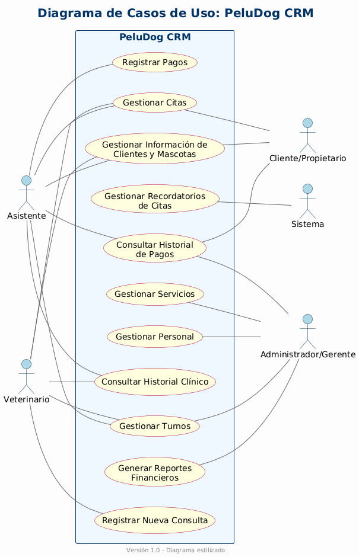

### **Actores Principales del Sistema**

- **Asistente:** Encargado de la gestión de citas, registro de clientes y mascotas, facturación y comunicación inicial. Requiere autenticación para acceder al sistema.
- **Veterinario:** Encargado de la atención clínica, registro de diagnósticos, tratamientos, prescripciones y seguimiento. Requiere autenticación para acceder al sistema.
- **Cliente/Propietario de Mascotas:** Propietario de la mascota que interactúa con el sistema para ciertas funciones (portal de citas, gestión de información). Requiere autenticación para acceder al portal.
- **Administrador/Gerente:** Responsable de la gestión de personal, configuración de servicios, reportes financieros y supervisión general. Requiere autenticación y tiene privilegios administrativos.
- **Sistema:** Realiza acciones automáticas (envío de recordatorios)

### **Casos de Uso Detallados por Módulo**

#### **Módulo: Gestión de Pacientes (Clientes y Mascotas)**

**CU-GP01: Gestionar Información de Clientes y Mascotas**

- **Actores:** Asistente, Veterinario, Cliente/Propietario de Mascotas
- **Descripción:** Permite crear, buscar, visualizar y actualizar información de clientes y mascotas
- **Flujo Principal:**
  1. El actor inicia la gestión según su rol
  2. El sistema presenta opciones específicas para cada tipo de usuario
  3. Se ejecutan las operaciones correspondientes (registro, búsqueda, actualización)
  4. El sistema valida y guarda los cambios

### Flujos Alternativos

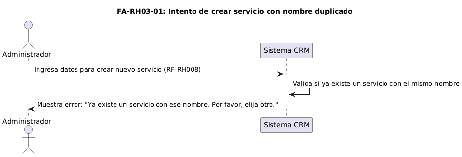

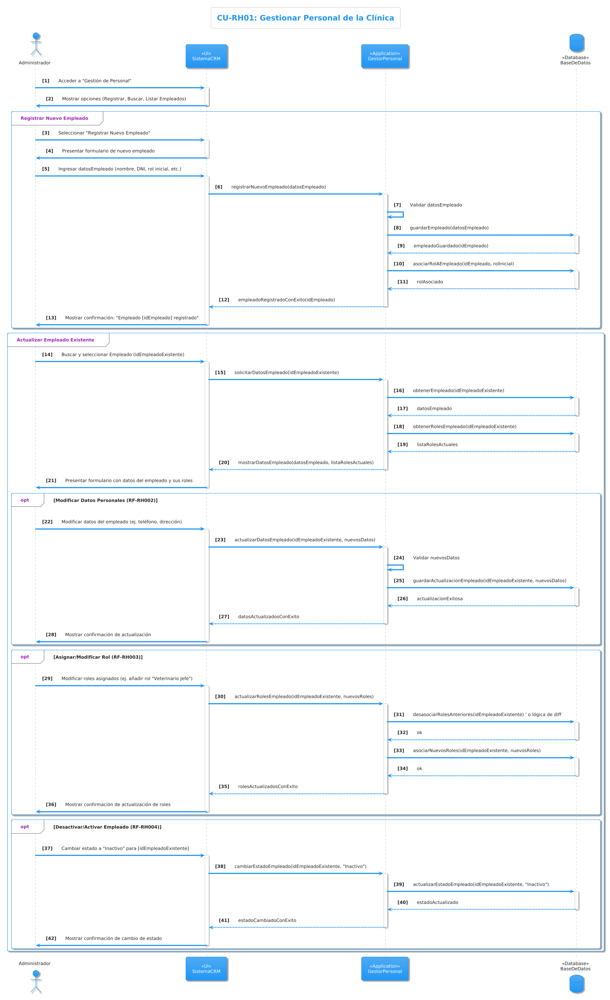

### Flujos Alternativos

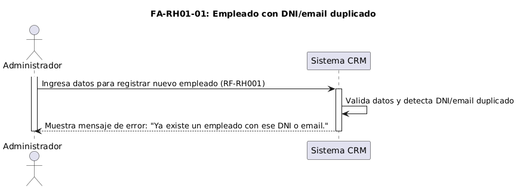

### Flujos Alternativos

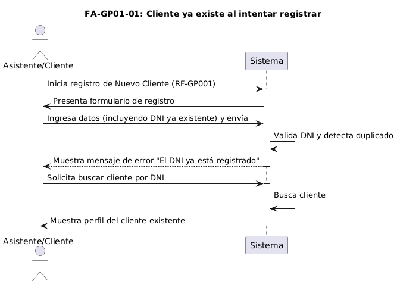

#### **Módulo: Gestión de Agenda y Citas**

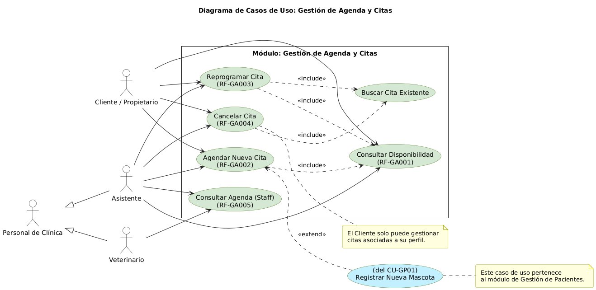

**CU-GA01: Gestionar Citas**

- **Actores:** Asistente, Cliente/Propietario de Mascotas, Veterinario
- **Descripción:** Permite consultar disponibilidad, agendar, reprogramar y cancelar citas
- **Flujo Principal:**
  1. El actor consulta disponibilidad horaria
  2. Selecciona mascota, veterinario, fecha y hora
  3. El sistema registra la cita y actualiza la agenda
  4. Se envían confirmaciones automáticas

### Flujos Alternativos

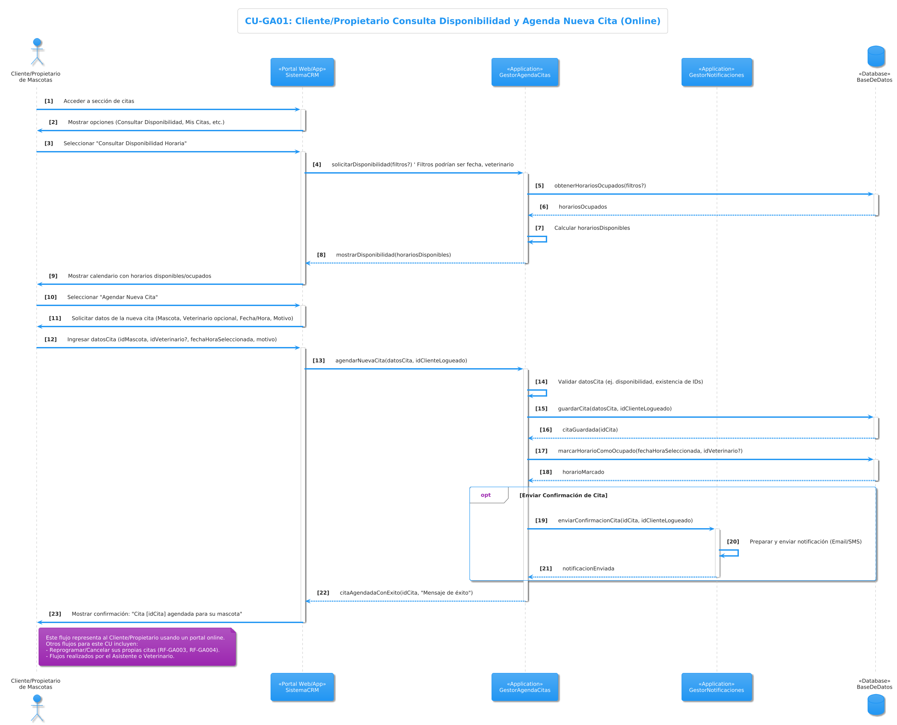

### Flujos Alternativos

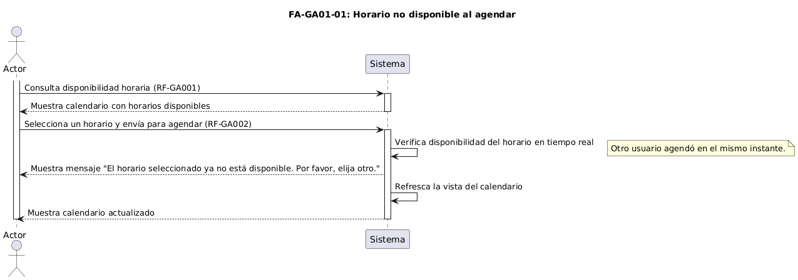

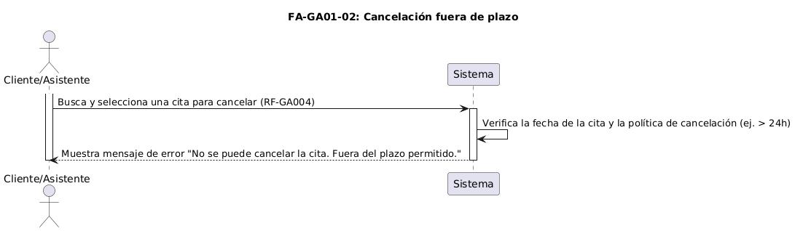

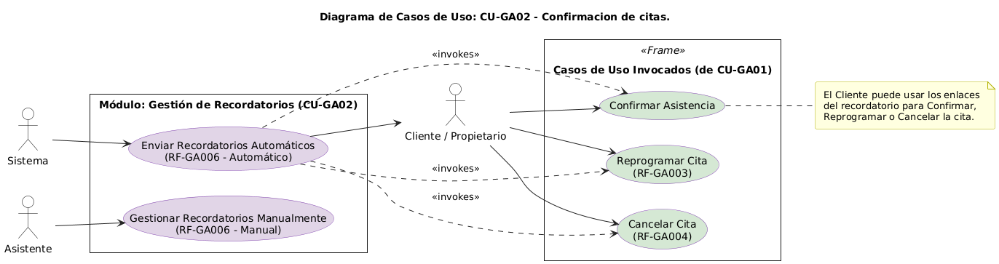

**CU-GA02: Gestionar Recordatorios de Citas**

- **Actores:** Sistema, Asistente
- **Descripción:** Envío automático de recordatorios de citas
- **Flujo Principal:**
  1. El sistema identifica citas próximas
  2. Genera y envía recordatorios automáticos
  3. Los clientes pueden confirmar o solicitar cambios

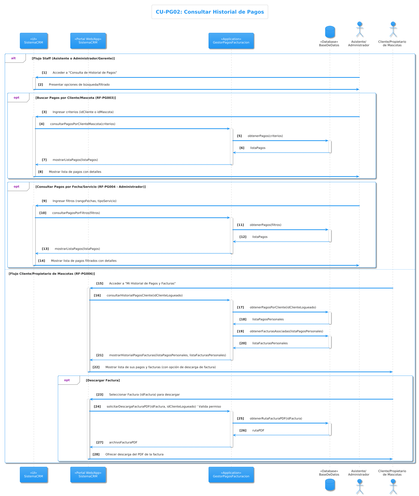

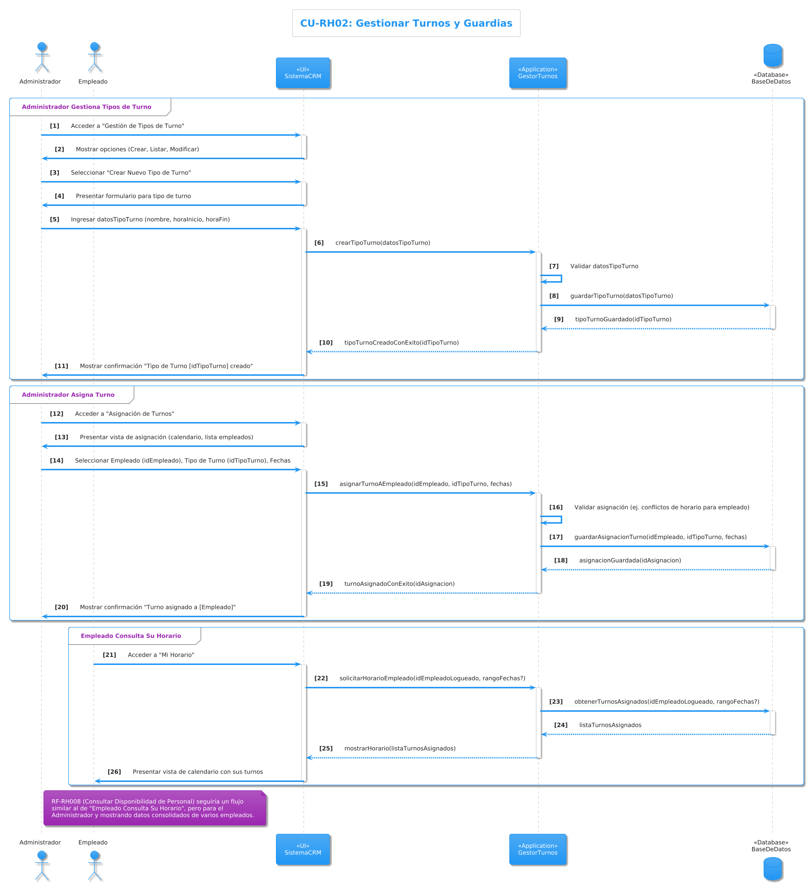

### Flujos Alternativos

### Flujos Alternativos

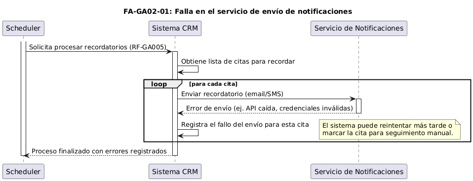

#### **Módulo: Autenticación y Gestión de Usuarios**

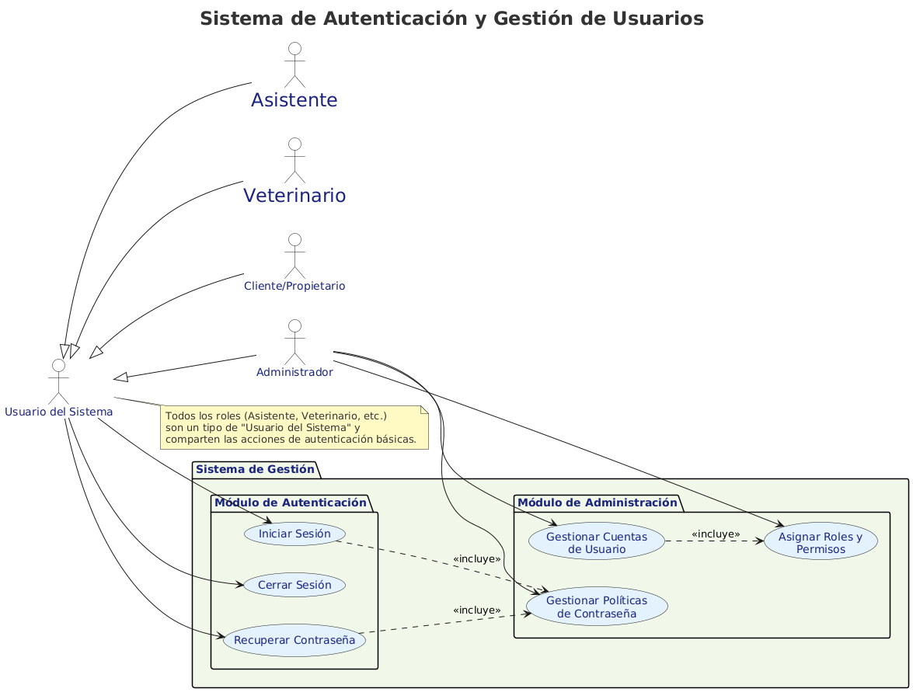

**CU-AU01: Autenticar Usuario**

- **Actores:** Todos los usuarios del sistema
- **Descripción:** Permite a los usuarios acceder al sistema mediante credenciales válidas y gestionar su sesión
- **Flujo Principal:**
  1. **Para iniciar sesión (RF-AU001):**
     - El usuario accede a la página de login
     - Ingresa nombre de usuario y contraseña
     - El sistema valida las credenciales
     - Si son válidas, se crea una sesión activa
     - El usuario es redirigido al dashboard principal
  2. **Para cerrar sesión (RF-AU002):**
     - El usuario selecciona la opción "Cerrar sesión"
     - El sistema invalida la sesión actual
     - El usuario es redirigido a la página de login
  3. **Para recuperar contraseña (RF-AU004):**
     - El usuario solicita recuperación desde el login
     - Ingresa su email registrado
     - El sistema genera y envía un enlace temporal
     - El usuario establece una nueva contraseña
- **Flujos Alternativos:**
  - **FA-AU01-01:** Credenciales incorrectas - mostrar error y aplicar políticas de bloqueo
  - **FA-AU01-02:** Cuenta bloqueada - mostrar mensaje informativo
  - **FA-AU01-03:** Contraseña expirada - forzar cambio de contraseña

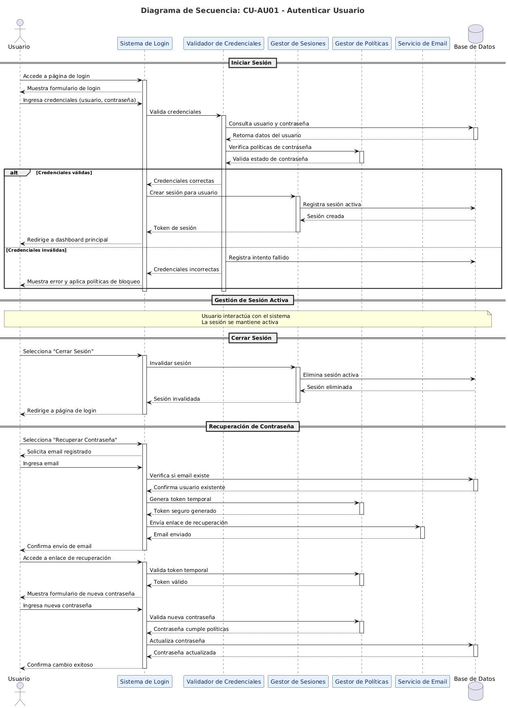

### Flujos Alternativos

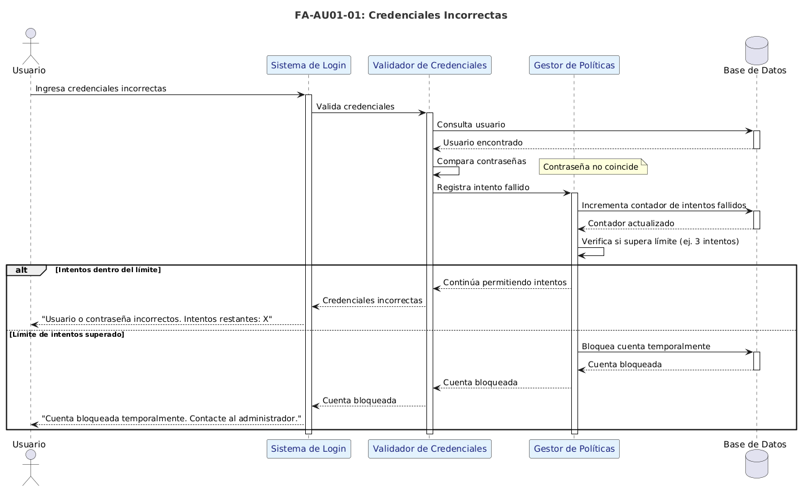

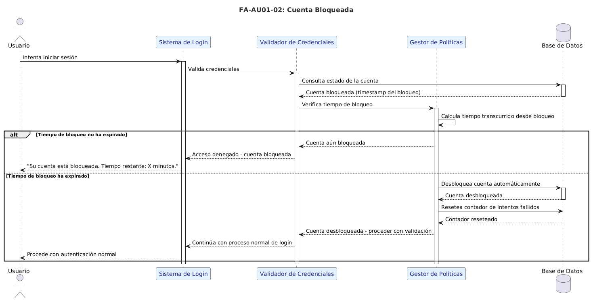

#### **Módulo: Atención Clínica**

**CU-AC01: Consultar Historial Clínico de Mascota**

- **Actores:** Veterinario, Asistente
- **Descripción:** Acceso y revisión de información médica completa de mascotas
- **Flujo Principal:**
  1. Selección de mascota
  2. Visualización del historial completo
  3. Acceso a archivos adjuntos y registros específicos
  4. Consulta de alergias y datos relevantes

### Flujos Alternativos

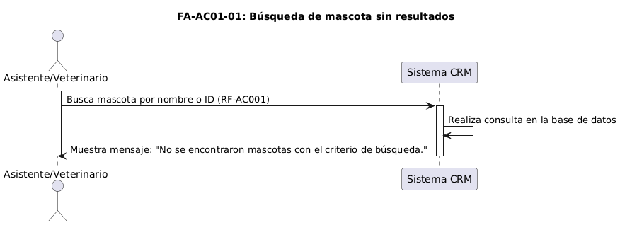

**CU-AC02: Registrar Nueva Consulta / Actualizar Historia Clínica**

- **Actores:** Veterinario
- **Descripción:** Creación y actualización de entradas en la historia clínica
- **Flujo Principal:**
  1. Inicio de nueva entrada clínica
  2. Registro de datos de consulta
  3. Prescripción de tratamientos
  4. Solicitud de exámenes
  5. Adjuntar archivos digitales
  6. Registro de vacunas y desparasitantes

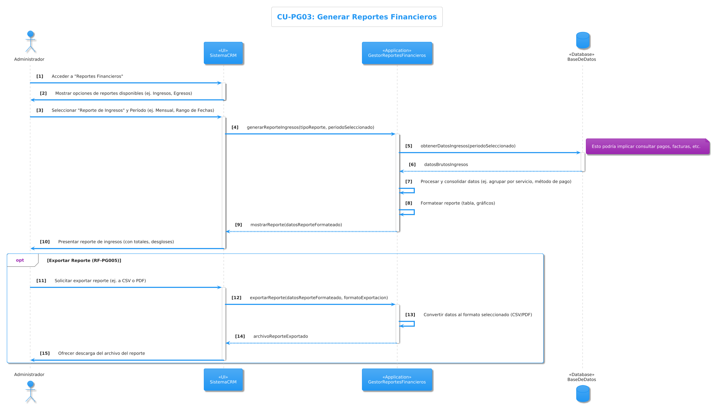

### Flujos Alternativos

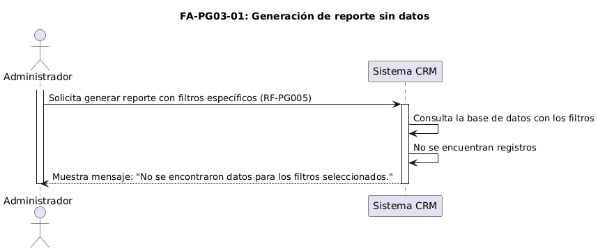

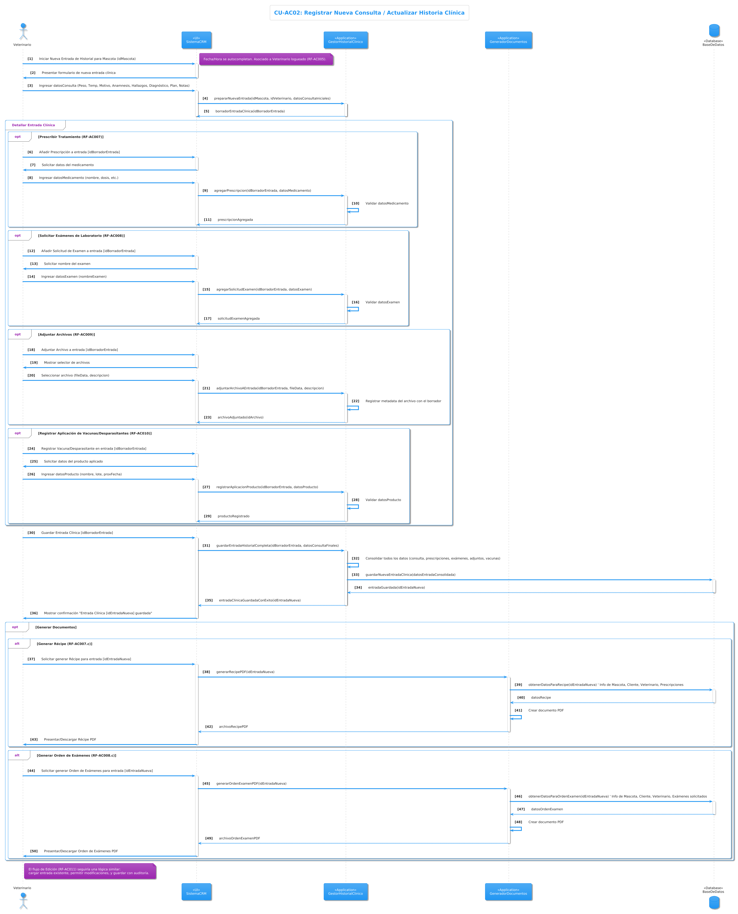

### Flujos Alternativos

---

   

ANEXOS

