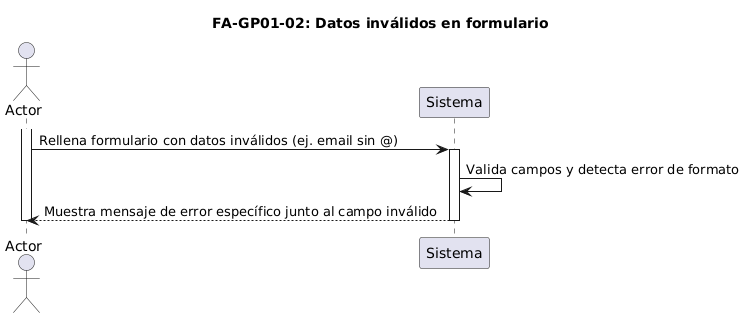

<html>
  <head>
    <meta content="text/html; charset=UTF-8" http-equiv="content-type" />
    
  </head>
  <body class="c1 c7 doc-content">
    

      Universidad Nacional Experimental de las Telecomunicaciones y la
        Inform&aacute;tica.
    

    

    

    

    

    

    

    

    

    

    
Documento de Requisitos - Plataforma de gesti&oacute;n de CRM - PeluDog

    

    

    

    

    

    

    

    

    

    

    

    

    

    

    

    

    
Miguel Figuera C.I: 23.558.789

    

      Iromy Leon C.I: V-30.243.131
    

    
Alejandra Herde C.I: V-23.711.974

    
Tutor: Yuly Delgado

    

        

    

    

    

    

    

    

    

    

    

    

 

    

    

    

    

    

    

    

    

    

    
Venezuela, Julio 2025

    

  </body>
</html>
   

# **Documento de Requisitos - Sistema CRM PeluDog**

## **Tabla de Contenidos**

1. [Introducción](#introducción)
2. [Objetivos](#objetivos)
3. [Alcance del Sistema](#alcance-del-sistema)
4. [Descripción General del Proyecto](#descripción-general-del-proyecto)
5. [Requisitos Funcionales](#requisitos-funcionales)
6. [Requisitos No Funcionales](#requisitos-no-funcionales)
7. [Casos de Uso](#casos-de-uso)
8. [Modelo Estructural](#modelo-estructural)
9. [Riesgos y Mitigación](#riesgos-y-mitigación)
10. [Estrategias de Validación y Seguimiento](#estrategias-de-validación-y-seguimiento)

---

   

## **Introducción**

### **Descripción General del Proyecto y su Propósito**

El presente documento especifica los requisitos para el desarrollo de un Sistema de Gestión de Relaciones con los Clientes (CRM) integral para el consultorio veterinario **PeluDog**, ubicado en la urbanización La Mora I, La Victoria, Estado Aragua, Venezuela. El consultorio, liderado por la Dra. Génesis Conesa, ofrece servicios de consulta veterinaria, hospedaje y peluquería canina a precios accesibles, atendiendo a una comunidad diversa de propietarios de mascotas.

La Dra. Génesis y PeluDog son pilares comunitarios que participan regularmente en campañas de vacunación y consultas veterinarias en servicios comunitarios, lo que les permite atender a una cantidad considerable de pacientes de distintos grupos socioeconómicos de la ciudad de La Victoria.

### **Justificación**

El diagnóstico participativo realizado identificó la necesidad crítica de digitalizar los procesos manuales actuales del consultorio, que incluyen:

- **Gestión de citas manual** que genera errores, duplicaciones y dificultades para optimizar la agenda
- **Historias clínicas en papel** que dificultan el acceso rápido a la información y pueden extraviarse
- **Control de vacunación manual** que aumenta el riesgo de olvidar fechas importantes
- **Comunicación reactiva** con los clientes por falta de herramientas automatizadas
- **Registro de pagos manual** que impide el análisis rápido del flujo de caja

### **Alcance**

El sistema CRM abarcará la digitalización completa de los procesos core del consultorio veterinario, incluyendo gestión de clientes y mascotas, agenda de citas, historias clínicas electrónicas, recordatorios automáticos, gestión de personal, y registro básico de pagos. El sistema excluye deliberadamente la facturación fiscal compleja y la gestión avanzada de inventarios para mantener la simplicidad y el enfoque en las relaciones con los clientes.

---

   

## **Objetivos**

### **Objetivo General**

Desarrollar e implementar un sistema CRM integral que digitalice y optimice los procesos de gestión del consultorio veterinario PeluDog, mejorando la eficiencia operativa, la calidad de atención al cliente y la rentabilidad del negocio.

### **Objetivos Específicos (S.M.A.R.T.)**

#### **1. Satisfacción del Cliente**

- Lograr una tasa de retención de clientes del 85% para el cierre del año en curso
- Implementar encuestas de satisfacción automatizadas post-consulta y alcanzar un puntaje promedio de 75/100 o superior
- Aumentar los referidos directos inscritos en la plataforma CRM en un 50% en los próximos 3 meses

#### **2. Eficiencia Operativa**

- Reducir el número de discrepancias en las auditorías de caja semanales en un 90%
- Reducir en un 15% el tiempo promedio por consulta mediante la digitalización de historiales clínicos
- Reducir el tiempo invertido en recordatorios de citas en un 70% dentro de los primeros 2 meses

#### **3. Rentabilidad y Sostenibilidad**

- Aumentar el número de clientes nuevos en un 20% para finales de año
- Aumentar el número total de citas facturadas en un 15% para finales de año
- Aumentar la tasa de cumplimiento del esquema de vacunación en un 50% en los próximos 6 meses

#### **4. Cumplimiento Normativo**

- Mantener un 100% del cumplimiento con las normativas del Colegio de Médicos Veterinarios de Venezuela

---

   

## **Alcance del Sistema**

### **Dentro del Dominio de la Aplicación**

1. Gestión de datos de clientes (dueños) y sus mascotas
2. Gestión integral de la agenda de citas (creación, modificación, cancelación, recordatorios)
3. Gestión de esquemas de vacunación de los pacientes
4. Gestión de la historia clínica electrónica de las mascotas
5. Prescripción de tratamientos y generación de récipes
6. Solicitud de exámenes de laboratorio
7. Registro básico de ingresos y egresos por servicios
8. Gestión de recordatorios automáticos
9. Gestión de servicios relacionados con la atención (hospedaje, cirugía, grooming)
10. Gestión de personal y turnos
11. Gestión de servicios y productos disponibles

### **Fuera del Dominio de la Aplicación**

1. Contabilidad financiera avanzada (estados de resultados complejos, balances, impuestos)
2. Marketing y campañas publicitarias complejas
3. Gestión avanzada de proveedores y compras
4. Integración directa con equipos de laboratorio
5. Facturación fiscal según normativas venezolanas

### **Usuarios Directos**

- **Veterinario Principal:** Dra. Génesis Conesa
- **Veterinarios:** Personal médico veterinario
- **Asistente Administrativo:** Personal de apoyo administrativo
- **Cliente/Propietario de Mascotas:** Dueños de las mascotas (acceso limitado vía portal)
- **Administrador/Gerente:** Responsable de configuración y reportes

### **Ámbito de Operación**

El sistema operará en las instalaciones del consultorio veterinario PeluDog, con acceso remoto para clientes a través de un portal web. El sistema debe funcionar con la infraestructura tecnológica existente (laptop, tablet, teléfonos inteligentes) y mantener disponibilidad durante las horas operativas (lunes a sábado, 8 AM a 8 PM).

---

   

## **Descripción General del Proyecto**

### **Contexto del Negocio**

**PeluDog** es un consultorio veterinario ubicado en La Victoria, Estado Aragua, que ofrece servicios integrales de salud animal incluyendo consultas veterinarias, hospedaje y peluquería canina. El consultorio atiende a una comunidad diversa y participa activamente en campañas de vacunación comunitarias.

### **Modelo de Negocio**

#### **Propuesta de Valor**

- Cuidado médico integral y especializado para mascotas
- Atención personalizada y empática
- Bienestar animal y salud preventiva
- Respuesta rápida en casos de urgencia
- Asesoramiento y educación a dueños

#### **Segmentos de Clientes**

- Dueños de mascotas domésticas (perros y gatos principalmente)
- Dueños de animales exóticos
- Criadores de animales
- Organizaciones de rescate animal

#### **Fuentes de Ingresos**

- Consultas veterinarias
- Servicios médicos y quirúrgicos
- Pruebas diagnósticas
- Venta de productos
- Servicios adicionales (hospitalización, peluquería, guardería)

### **Recursos Disponibles**

#### **Recursos Humanos**

- Dra. Génesis Conesa (Veterinaria Principal)
- Asistente administrativo
- Personal de apoyo según necesidades

#### **Recursos Tecnológicos**

- Acceso a internet
- Mini UPS para respaldo eléctrico
- Laptop principal
- Tablet para movilidad
- Teléfonos inteligentes

#### **Recursos Financieros**

- Presupuesto disponible para alojamiento del sistema (~$25 USD/mes)
- Inversión en capacitación del personal

---

   

## **Requisitos Funcionales**

### **Módulo: Gestión de Pacientes (Clientes y Mascotas)**

**CU-GP01: Gestionar Información de Clientes y Mascotas**

- **Actores Principales:** Asistente, Veterinario, Cliente/Propietario de Mascotas
- **Descripción:** Permite al personal del consultorio y a los propios clientes crear nuevos registros, así como buscar, visualizar y actualizar la información existente.

#### **RF-GP001: Registrar Nuevo Cliente**

- **Descripción:** El Asistente o el Cliente/Propietario de Mascota podrán registrar la información de un nuevo dueño de mascota en el sistema.
- **Prioridad:** Alta
- **Justificación:** Necesario para iniciar el flujo de alta de clientes descrito en CU-GP01 y para disponer de datos de contacto confiables.
- **Criterios de Aceptación:**
  - El sistema debe mostrar un formulario para el ingreso de datos del cliente (nombre, apellido, DNI, teléfono, email, dirección)
  - El sistema debe validar los campos obligatorios (nombre, teléfono)
  - Al guardar, el nuevo cliente debe crearse en la base de datos
  - El sistema debe permitir asociar una o más mascotas a este cliente

#### **RF-GP002: Registrar Nueva Mascota**

- **Descripción:** El Asistente, Cliente/Propietario de Mascota o Veterinario podrá registrar la información de una nueva mascota, asociándola a un cliente existente.
- **Prioridad:** Alta
- **Justificación:** Esencial para asociar mascotas a sus propietarios según CU-GP01 y mantener la base clínica completa.
- **Criterios de Aceptación:**
  - El sistema debe permitir seleccionar un cliente existente al cual asociar la mascota
  - El sistema debe mostrar un formulario para el ingreso de datos de la mascota (nombre, especie, raza, sexo, fecha de nacimiento, número de chip, color, señas particulares, foto)
  - El sistema debe validar los campos obligatorios (nombre de mascota, especie)
  - Al guardar, la nueva mascota debe crearse y vincularse correctamente al cliente

#### **RF-GP003: Buscar Cliente y/o Mascota**

- **Descripción:** El Asistente o Veterinario podrá buscar clientes y/o mascotas existentes en el sistema utilizando diversos criterios.
- **Prioridad:** Alta
- **Justificación:** Facilita la localización rápida de clientes y mascotas durante la atención, soportando CU-GP01.
- **Criterios de Aceptación:**
  - El sistema debe proveer campos de búsqueda para clientes (por nombre, DNI, teléfono)
  - El sistema debe proveer campos de búsqueda para mascotas (por nombre, número de chip, nombre del dueño)
  - Los resultados de la búsqueda deben mostrar información clave para identificar al cliente/mascota
  - El usuario debe poder seleccionar un cliente/mascota de los resultados para ver su información detallada

#### **RF-GP004: Visualizar y Actualizar Datos de Cliente (Staff)**

- **Descripción:** El Asistente o Veterinario podrá ver y modificar la información de un cliente existente.
- **Prioridad:** Alta
- **Justificación:** Permite mantener actualizada la información de los clientes, mejorando la calidad de los datos según CU-GP01.
- **Criterios de Aceptación:**
  - Tras seleccionar un cliente, el sistema debe mostrar toda su información registrada
  - El sistema debe permitir la edición de los campos del cliente
  - El sistema debe guardar los cambios realizados en la base de datos
  - El sistema debe mostrar la lista de mascotas asociadas al cliente

#### **RF-GP005: Visualizar y Actualizar Datos de Mascota (Staff)**

- **Descripción:** El Asistente o Veterinario podrá ver y modificar la información general de una mascota existente.
- **Prioridad:** Alta
- **Justificación:** Asegura que la información de las mascotas esté actualizada para decisiones clínicas, acorde a CU-GP01.
- **Criterios de Aceptación:**
  - Tras seleccionar una mascota, el sistema debe mostrar toda su información general registrada
  - El sistema debe permitir la edición de los campos de la mascota
  - El sistema debe guardar los cambios realizados en la base de datos
  - El sistema debe mostrar la información del cliente dueño de la mascota

#### **RF-GP006: Visualizar y Actualizar Datos de Mascota (Cliente/Propietario)**

- **Descripción:** El Cliente/Propietario de Mascota podrá ver y modificar la información de sus propias mascotas registradas.
- **Prioridad:** Alta
- **Justificación:** Empodera al cliente para gestionar los datos de sus mascotas, reduciendo carga administrativa; parte de CU-GP01.
- **Criterios de Aceptación:**
  - Tras seleccionar una de sus mascotas, el sistema debe mostrar toda su información general registrada
  - El sistema debe permitir la edición de los campos de la mascota por parte de su dueño
  - El sistema debe guardar los cambios realizados en la base de datos

#### **RF-GP007: Visualizar y Actualizar Datos Personales (Cliente/Propietario)**

- **Descripción:** El Cliente/Propietario de Mascota podrá ver y modificar la información de su propio perfil.
- **Prioridad:** Alta
- **Justificación:** Permite al cliente mantener sus datos actualizados, garantizando la exactitud de contacto y cumplimiento de CU-GP01.
- **Criterios de Aceptación:**
  - Tras acceder a su perfil, el sistema debe mostrar al Cliente/Propietario toda su información personal registrada
  - El sistema debe permitir la edición de sus propios campos
  - El sistema debe guardar los cambios realizados en la base de datos

---

### **Módulo: Gestión de Agenda y Citas**

**CU-GA01: Gestionar Citas**

- **Actores Principales:** Asistente, Cliente/Propietario de Mascotas, Veterinario
- **Descripción:** Permite al Asistente y al Cliente/Propietario agendar, reprogramar, cancelar y consultar citas. Permite al personal consultar la agenda y confirmar asistencias.

#### **RF-GA001: Consultar Disponibilidad Horaria**

- **Descripción:** El Asistente o Cliente/Propietario de Mascota podrá consultar los horarios disponibles en la agenda del consultorio.
- **Prioridad:** Alta
- **Justificación:** Proporciona visibilidad de horarios disponibles indispensable para programar citas según CU-GA01.
- **Criterios de Aceptación:**
  - El sistema debe mostrar una vista de calendario (diaria, semanal, mensual)
  - El sistema debe permitir filtrar la disponibilidad por veterinario
  - Los bloques horarios ocupados deben estar claramente diferenciados de los disponibles

#### **RF-GA002: Agendar Nueva Cita**

- **Descripción:** El Asistente o Cliente/Propietario de Mascota podrá reservar una nueva cita para una mascota.
- **Prioridad:** Alta
- **Justificación:** Habilita el flujo de reserva de citas descrito en CU-GA01, pieza clave del servicio.
- **Criterios de Aceptación:**
  - El sistema debe permitir seleccionar una mascota existente
  - El sistema debe permitir seleccionar un veterinario, fecha y hora de la cita
  - El sistema debe permitir ingresar el motivo de la cita
  - Al confirmar, la cita debe registrarse y el horario debe marcarse como ocupado
  - El sistema debe poder enviar una confirmación de cita al cliente

#### **RF-GA003: Reprogramar Cita**

- **Descripción:** El Asistente o Cliente/Propietario de Mascota podrá cambiar la fecha y/o hora de una cita existente.
- **Prioridad:** Media
- **Justificación:** Ofrece flexibilidad a clientes y staff para cambios de agenda, evitando cancelaciones; CU-GA01.
- **Criterios de Aceptación:**
  - El sistema debe permitir buscar y seleccionar una cita existente
  - El sistema debe permitir elegir una nueva fecha/hora disponible
  - Al confirmar, la cita original debe actualizarse y el bloqueo horario debe moverse
  - El sistema debe poder enviar una notificación de reprogramación al cliente

#### **RF-GA004: Cancelar Cita**

- **Descripción:** El Asistente o Cliente/Propietario de Mascota podrá cancelar una cita agendada.
- **Prioridad:** Media
- **Justificación:** Gestiona anulaciones de citas liberando horarios y evitando ausencias; CU-GA01.
- **Criterios de Aceptación:**
  - El sistema debe permitir buscar y seleccionar una cita existente
  - Al confirmar la cancelación, la cita debe marcarse como cancelada y el horario liberarse
  - El sistema debe poder enviar una notificación de cancelación al cliente

#### **RF-GA005: Consultar Agenda (Vista Staff)**

- **Descripción:** El Asistente o Veterinario podrá visualizar la agenda de citas programadas.
- **Prioridad:** Alta
- **Justificación:** Permite al personal visualizar la carga de trabajo y confirmar asistencia; CU-GA01.
- **Criterios de Aceptación:**
  - El sistema debe mostrar una vista de calendario con todas las citas
  - Debe ser posible filtrar por veterinario
  - Cada cita debe mostrar información clave (hora, mascota, cliente, motivo)
  - El sistema debe permitir al Asistente confirmar la asistencia del cliente

**CU-GA02: Gestionar Recordatorios de Citas**

- **Actor Principal:** Sistema, Asistente
- **Descripción:** El sistema se encarga de enviar recordatorios automáticos de citas.

#### **RF-GA006: Enviar Recordatorio Automático de Cita**

- **Descripción:** El sistema enviará recordatorios automáticos a los clientes sobre sus próximas citas.
- **Prioridad:** Alta
- **Justificación:** Reduce inasistencias enviando recordatorios automáticos; vital para eficiencia operativa (CU-GA02).
- **Criterios de Aceptación:**
  - El sistema debe permitir configurar el canal de envío (email, SMS)
  - El sistema debe permitir configurar la antelación del recordatorio
  - El recordatorio debe incluir los detalles de la cita (fecha, hora, mascota)
  - El recordatorio puede incluir un enlace para confirmar o cancelar la cita

---

### **Módulo: Atención Clínica (Historia Clínica Electrónica)**

**CU-AC01: Consultar Historial Clínico de Mascota**

- **Actores Principales:** Veterinario, Asistente
- **Descripción:** Permite al Veterinario acceder y revisar toda la información médica registrada para una mascota.

#### **RF-AC001: Visualizar Historial Clínico Completo**

- **Descripción:** El Veterinario podrá ver todas las entradas previas del historial clínico de la mascota seleccionada.
- **Prioridad:** Alta
- **Justificación:** Permite revisión completa de antecedentes clínicos para mejor diagnóstico; CU-AC01.
- **Criterios de Aceptación:**
  - El sistema debe mostrar las entradas del historial en orden cronológico inverso
  - Cada entrada debe mostrar fecha, motivo de consulta, diagnóstico principal, y veterinario
  - El usuario debe poder expandir una entrada para ver todos sus detalles

#### **RF-AC002: Visualizar Resumen de Alergias y Datos Relevantes**

- **Descripción:** El sistema mostrará información crucial de la mascota de forma destacada.
- **Prioridad:** Alta
- **Justificación:** Destaca información crítica (alergias) mejorando la seguridad clínica; CU-AC01.
- **Criterios de Aceptación:**
  - El sistema debe mostrar claramente las alergias conocidas de la mascota
  - El sistema debe mostrar datos básicos (especie, raza, sexo, edad, último peso registrado)

#### **RF-AC003: Visualizar Archivos Adjuntos del Historial**

- **Descripción:** El Veterinario podrá acceder a los archivos digitales asociados a las entradas del historial clínico.
- **Prioridad:** Alta
- **Justificación:** Facilita acceso a pruebas complementarias adjuntas, esencial en CU-AC01.
- **Criterios de Aceptación:**
  - Para cada entrada del historial, el sistema debe listar los archivos adjuntos
  - El sistema debe permitir la visualización o descarga de estos archivos
  - Se deben mostrar las descripciones o etiquetas de los archivos adjuntos

#### **RF-AC004: Consultar Registros Específicos de Vacunación y Desparasitación**

- **Descripción:** El Veterinario podrá filtrar el historial para ver únicamente los registros de vacunación y desparasitación.
- **Prioridad:** Media
- **Justificación:** Agiliza consulta de vacunas/desparasitaciones para cumplimiento sanitario; CU-AC01.
- **Criterios de Aceptación:**
  - El sistema debe permitir filtrar el historial para mostrar solo eventos de vacunación
  - Para cada vacuna: mostrar fecha, nombre, lote, vencimiento, próxima revacunación
  - El sistema debe permitir filtrar para mostrar solo eventos de desparasitación
  - Para cada desparasitación: mostrar fecha, producto, dosis, próxima desparasitación

**CU-AC02: Registrar Nueva Consulta / Actualizar Historia Clínica**

- **Actor Principal:** Veterinario
- **Descripción:** Permite al Veterinario crear una nueva entrada en la historia clínica durante una consulta.

#### **RF-AC005: Iniciar Nueva Entrada de Historial Clínico**

- **Descripción:** El Veterinario podrá crear una nueva entrada en el historial clínico para la mascota en consulta.
- **Prioridad:** Alta
- **Justificación:** Inicia la documentación de una consulta, base de la historia clínica; CU-AC02.
- **Criterios de Aceptación:**
  - El sistema debe permitir seleccionar la mascota
  - La fecha y hora de la consulta deben autocompletarse con la actual
  - La entrada debe asociarse al veterinario que está logueado

#### **RF-AC006: Registrar Datos de la Consulta**

- **Descripción:** El Veterinario podrá registrar toda la información clínica relevante de la consulta.
- **Prioridad:** Alta
- **Justificación:** Captura la información detallada de la consulta asegurando continuidad clínica; CU-AC02.
- **Criterios de Aceptación:**
  - El sistema debe proveer campos para: Peso, Temperatura
  - El sistema debe proveer campo para Motivo de la consulta
  - El sistema debe proveer campo para Anamnesis
  - El sistema debe proveer campo para Hallazgos del examen físico
  - El sistema debe proveer campo para Diagnóstico(s)
  - El sistema debe proveer campo para Plan de tratamiento
  - El sistema debe proveer campo para Notas adicionales
  - Al guardar, la nueva entrada se añade al historial de la mascota

#### **RF-AC007: Prescribir Tratamiento (Generar Récipe)**

- **Descripción:** Dentro de una consulta, el Veterinario podrá añadir prescripciones de medicamentos y generar un récipe.
- **Prioridad:** Alta
- **Justificación:** Estandariza y registra prescripciones, generando récipe imprimible; CU-AC02.
- **Criterios de Aceptación:**
  - El sistema debe permitir añadir uno o más medicamentos a la prescripción
  - Para cada medicamento: registrar nombre, presentación, dosis, vía, frecuencia, duración
  - Las prescripciones deben quedar guardadas como parte de la entrada del historial clínico
  - El sistema debe permitir generar un documento de récipe (PDF imprimible)

#### **RF-AC008: Solicitar Exámenes de Laboratorio**

- **Descripción:** Dentro de una consulta, el Veterinario podrá solicitar exámenes de laboratorio y generar una orden.
- **Prioridad:** Alta
- **Justificación:** Permite solicitudes de laboratorio integradas en la historia, evitando papel; CU-AC02.
- **Criterios de Aceptación:**
  - El sistema debe permitir seleccionar o ingresar los exámenes solicitados
  - Las solicitudes de exámenes deben quedar guardadas como parte de la entrada del historial clínico
  - El sistema debe permitir generar una orden de exámenes (PDF imprimible)

#### **RF-AC009: Adjuntar Archivos a la Entrada Clínica**

- **Descripción:** Durante la creación o edición de una entrada clínica, el Veterinario podrá adjuntar archivos digitales.
- **Prioridad:** Alta
- **Justificación:** Conserva evidencias (imágenes, documentos) ligadas a la consulta; CU-AC02.
- **Criterios de Aceptación:**
  - El sistema debe permitir cargar uno o más archivos
  - El sistema debe soportar formatos comunes (PDF, JPG, PNG, DOCX, DICOM)
  - Los archivos deben quedar vinculados a la entrada específica del historial
  - El sistema debe permitir añadir una descripción/etiqueta a cada archivo

#### **RF-AC010: Registrar Aplicación de Vacunas y Desparasitantes**

- **Descripción:** El Veterinario podrá registrar la aplicación de vacunas o desparasitantes como parte de la consulta.
- **Prioridad:** Alta
- **Justificación:** Registra vacunaciones y desparasitaciones con recordatorios futuros; CU-AC02 & AC004.
- **Criterios de Aceptación:**
  - El sistema debe permitir seleccionar/ingresar el nombre de la vacuna, lote, fecha de vencimiento
  - El sistema debe permitir calcular y/o registrar la próxima fecha de revacunación
  - El sistema debe permitir seleccionar/ingresar el nombre del desparasitante, dosis
  - El sistema debe permitir calcular y/o registrar la próxima fecha de desparasitación
  - Esta información debe quedar registrada en la entrada del historial clínico

#### **RF-AC011: Editar Entrada de Historial Clínico Reciente**

- **Descripción:** El Veterinario podrá modificar una entrada de historial clínico recientemente creada, con auditoría.
- **Prioridad:** Media
- **Justificación:** Ofrece ventana de corrección con trazabilidad auditada; CU-AC02.
- **Criterios de Aceptación:**
  - El sistema debe permitir la edición de una entrada dentro de un período configurable
  - Cualquier modificación debe registrarse en una bitácora de auditoría
  - Los campos críticos pueden tener restricciones adicionales o requerir justificación

---

### **Módulo: Autenticación y Gestión de Usuarios**

Este módulo maneja el acceso al sistema mediante la autenticación de usuarios y la gestión de sesiones.

**CU-AU01: Autenticar Usuario**

- **Actores Principales:** Todos los usuarios del sistema
- **Descripción:** Permite a los usuarios acceder al sistema mediante credenciales válidas.
- **RFs Asociados:**

  - **RF-AU001: Iniciar Sesión**

    - **Descripción:** Los usuarios podrán iniciar sesión en el sistema usando nombre de usuario y contraseña.
    - **Prioridad:** Alta
    - **Justificación:** Acceso básico al sistema que garantiza seguridad y control de acceso.
    - **Criterios de Aceptación:**
      - El sistema debe mostrar un formulario de login con campos de usuario y contraseña
      - El sistema debe validar las credenciales contra la base de datos
      - El sistema debe crear una sesión válida tras una autenticación exitosa
      - El sistema debe mostrar mensajes de error apropiados para credenciales inválidas
      - El sistema debe aplicar políticas de bloqueo tras múltiples intentos fallidos

  - **RF-AU002: Cerrar Sesión**

    - **Descripción:** Los usuarios podrán cerrar su sesión activa en el sistema.
    - **Prioridad:** Alta
    - **Justificación:** Garantiza la seguridad permitiendo terminación explícita de sesiones.
    - **Criterios de Aceptación:**
      - El sistema debe proporcionar una opción visible para cerrar sesión
      - El sistema debe invalidar completamente la sesión del usuario
      - El sistema debe redirigir al usuario a la página de login tras cerrar sesión

  - **RF-AU003: Gestionar Políticas de Contraseña**

    - **Descripción:** El sistema debe aplicar políticas de seguridad para contraseñas de usuario.
    - **Prioridad:** Alta
    - **Justificación:** Asegura que las contraseñas cumplan estándares de seguridad.
    - **Criterios de Aceptación:**
      - El sistema debe requerir contraseñas con longitud mínima de 8 caracteres
      - El sistema debe exigir al menos una letra mayúscula, una minúscula y un número
      - El sistema debe prevenir el uso de contraseñas comunes
      - El sistema debe forzar el cambio de contraseña según política configurable
      - El sistema debe bloquear cuentas tras múltiples intentos fallidos consecutivos

  - **RF-AU004: Recuperar Contraseña**

    - **Descripción:** Los usuarios podrán recuperar el acceso a su cuenta mediante un proceso de recuperación de contraseña.
    - **Prioridad:** Media
    - **Justificación:** Proporciona mecanismo de recuperación para usuarios que olviden sus credenciales.
    - **Criterios de Aceptación:**
      - El sistema debe permitir solicitar recuperación mediante email registrado
      - El sistema debe generar un enlace temporal y seguro para restablecer contraseña
      - El sistema debe permitir establecer nueva contraseña mediante el enlace temporal
      - El enlace de recuperación debe expirar después de un tiempo configurable

---

### **Módulo: Gestión de Recursos Humanos y Servicios Internos**

**CU-RH01: Gestionar Personal de la Clínica**

- **Actores Principales:** Administrador/Gerente
- **Descripción:** Permite al Administrador/Gerente registrar, actualizar y gestionar la información del personal de la clínica.

#### **RF-RH001: Registrar Nuevo Empleado**

- **Descripción:** El Administrador/Gerente podrá registrar la información de un nuevo empleado en el sistema.
- **Prioridad:** Alta
- **Justificación:** Impulsa la gestión de personal creando cuentas de empleados; CU-RH01.
- **Criterios de Aceptación:**
  - El sistema debe mostrar un formulario para el ingreso de datos del empleado
  - El sistema debe validar los campos obligatorios (nombre, DNI, rol)
  - Al guardar, el nuevo empleado debe crearse en la base de datos
  - El sistema debe permitir asignar uno o más roles al empleado

#### **RF-RH002: Visualizar y Actualizar Datos de Empleado**

- **Descripción:** El Administrador/Gerente podrá ver y modificar la información de un empleado existente.
- **Prioridad:** Alta
- **Justificación:** Mantiene actualizados los datos del personal para procesos internos; CU-RH01.
- **Criterios de Aceptación:**
  - Tras seleccionar un empleado, el sistema debe mostrar toda su información registrada
  - El sistema debe permitir la edición de los campos del empleado
  - El sistema debe guardar los cambios realizados en la base de datos

#### **RF-RH003: Asignar/Modificar Rol de Empleado**

- **Descripción:** El Administrador/Gerente podrá asignar o modificar los roles de un empleado.
- **Prioridad:** Alta
- **Justificación:** Controla roles y permisos del personal garantizando seguridad; CU-RH01.
- **Criterios de Aceptación:**
  - El sistema debe permitir seleccionar uno o varios roles predefinidos para un empleado
  - El sistema debe actualizar los permisos de acceso del empleado según su rol

#### **RF-RH004: Desactivar/Activar Empleado**

- **Descripción:** El Administrador/Gerente podrá desactivar temporal o permanentemente la cuenta de un empleado.
- **Prioridad:** Media
- **Justificación:** Permite gestionar altas/bajas de empleados asegurando control de acceso; CU-RH01.
- **Criterios de Aceptación:**
  - El sistema debe permitir cambiar el estado de un empleado a "activo" o "inactivo"
  - Los empleados inactivos no deben poder iniciar sesión
  - El historial de acciones del empleado debe conservarse

**CU-RH02: Gestionar Turnos y Guardias**

- **Actores Principales:** Administrador/Gerente, Veterinario, Asistente
- **Descripción:** Permite al Administrador/Gerente planificar y asignar turnos al personal.

#### **RF-RH005: Crear/Modificar Turno**

- **Descripción:** El Administrador/Gerente podrá definir y modificar los tipos de turnos y guardias.
- **Prioridad:** Alta
- **Justificación:** Define turnos tipo necesarios para programación; CU-RH02.
- **Criterios de Aceptación:**
  - El sistema debe permitir definir un nombre, hora de inicio y fin para cada tipo de turno
  - El sistema debe permitir asociar un turno a un día específico o a un rango de fechas

#### **RF-RH006: Asignar Turno a Empleado**

- **Descripción:** El Administrador/Gerente podrá asignar turnos y guardias a empleados específicos.
- **Prioridad:** Alta
- **Justificación:** Asigna turnos a empleados, clave en planificación operativa; CU-RH02.
- **Criterios de Aceptación:**
  - El sistema debe permitir seleccionar un empleado y asignarle turnos para días específicos
  - El sistema debe mostrar posibles conflictos de horario al asignar turnos
  - El sistema debe guardar las asignaciones de turnos

#### **RF-RH007: Consultar Horario de Empleado**

- **Descripción:** Cualquier empleado podrá consultar su propio horario de turnos asignados.
- **Prioridad:** Alta
- **Justificación:** Da visibilidad al personal de su horario, reduciendo confusión; CU-RH02.
- **Criterios de Aceptación:**
  - El sistema debe mostrar una vista de calendario con los turnos asignados al empleado
  - Debe ser posible filtrar por semana o mes

#### **RF-RH008: Consultar Disponibilidad de Personal**

- **Descripción:** El Administrador/Gerente podrá consultar la disponibilidad general del personal.
- **Prioridad:** Media
- **Justificación:** Brinda vista global de disponibilidad para planificación; CU-RH02.
- **Criterios de Aceptación:**
  - El sistema debe mostrar una vista consolidada de los turnos de todo el personal
  - Debe ser posible filtrar por rol o por fecha

**CU-RH03: Gestionar Servicios de la Clínica**

- **Actores Principales:** Administrador/Gerente
- **Descripción:** Permite al Administrador/Gerente definir y gestionar los tipos de servicios que ofrece la clínica.

#### **RF-RH009: Crear/Modificar Tipo de Servicio Interno**

- **Descripción:** El Administrador/Gerente podrá definir nuevos tipos de servicios que la clínica ofrece.
- **Prioridad:** Alta
- **Justificación:** Permite definir servicios internos que mejoran oferta clínica; CU-RH03.
- **Criterios de Aceptación:**
  - El sistema debe permitir crear un nombre y una descripción para cada servicio
  - El sistema debe permitir activar o desactivar un servicio

#### **RF-RH010: Asignar Personal a Servicio Interno**

- **Descripción:** El Administrador/Gerente podrá asignar personal específico como responsable de un servicio interno.
- **Prioridad:** Media
- **Justificación:** Asigna responsables a servicios internos asegurando seguimiento; CU-RH03.
- **Criterios de Aceptación:**
  - El sistema debe permitir seleccionar empleados para asociarlos a un tipo de servicio
  - Esta asignación puede influir en la visibilidad de tareas relacionadas con ese servicio

#### **RF-RH011: Consultar Servicios Internos Activos**

- **Descripción:** El Administrador/Gerente podrá consultar la lista de servicios internos activos.
- **Prioridad:** Baja
- **Justificación:** Ofrece inventario de servicios activos para control y reporte; CU-RH03.
- **Criterios de Aceptación:**
  - El sistema debe mostrar una lista de todos los servicios internos con su estado y descripción

---

### **Módulo: Gestión de Pagos y Facturación**

**CU-PG01: Registrar Pagos**

- **Actores Principales:** Asistente
- **Descripción:** Permite al Asistente registrar los pagos recibidos de los clientes.

#### **RF-PG001: Registrar Pago de Servicio/Producto**

- **Descripción:** El Asistente podrá registrar un pago recibido de un cliente.
- **Prioridad:** Alta
- **Justificación:** Registra ingresos de manera formal y asocia servicios, base financiera; CU-PG01.
- **Criterios de Aceptación:**
  - El sistema debe permitir seleccionar el cliente y/o la mascota asociada al pago
  - El sistema debe permitir seleccionar los servicios o productos por los cuales se realiza el pago
  - El sistema debe permitir ingresar el monto pagado
  - El sistema debe permitir seleccionar el método de pago
  - El sistema debe validar que el monto pagado sea consistente con el total a pagar
  - Al guardar, el pago debe registrarse en la base de datos

#### **RF-PG002: Generar Comprobante de Pago**

- **Descripción:** El sistema debe poder generar un comprobante o recibo de pago para el cliente.
- **Prioridad:** Alta
- **Justificación:** Genera notas de pago para transparencia con clientes; CU-PG01.
- **Criterios de Aceptación:**
  - El comprobante debe incluir detalles del consultorio, fecha, monto, método de pago
  - El comprobante debe ser imprimible (PDF)

**CU-PG02: Consultar Historial de Pagos**

- **Actores Principales:** Asistente, Administrador/Gerente, Cliente/Propietario de Mascotas
- **Descripción:** Permite a los usuarios consultar los registros de pagos.

#### **RF-PG003: Consultar Pagos por Cliente/Mascota (Staff)**

- **Descripción:** El Asistente o Administrador/Gerente podrá consultar todos los pagos realizados por un cliente.
- **Prioridad:** Alta
- **Justificación:** Permite rastrear pagos por cliente, apoyo a atención y cobranza; CU-PG02.
- **Criterios de Aceptación:**
  - El sistema debe permitir buscar pagos asociados a un cliente o mascota
  - Los resultados deben mostrar la fecha, monto, servicios/productos pagados y método de pago

#### **RF-PG004: Consultar Pagos por Fecha/Servicio (Staff)**

- **Descripción:** El Administrador/Gerente podrá consultar pagos filtrados por rango de fechas o por tipo de servicio.
- **Prioridad:** Media
- **Justificación:** Facilita análisis histórico de ingresos por fechas/servicios; CU-PG02.
- **Criterios de Aceptación:**
  - El sistema debe permitir filtrar pagos por un rango de fechas
  - El sistema debe permitir filtrar pagos por uno o varios tipos de servicio/producto

#### **RF-PG006: Consultar Propio Historial de Pagos y Facturas (Cliente/Propietario)**

- **Descripción:** El Cliente/Propietario de Mascota podrá consultar su propio historial de pagos.
- **Prioridad:** Media
- **Justificación:** Empodera al cliente a revisar sus pagos, fomentando confianza; CU-PG02.
- **Criterios de Aceptación:**
  - El sistema debe mostrar al Cliente/Propietario una lista de sus pagos realizados
  - El sistema debe permitir al Cliente/Propietario visualizar y/o descargar los comprobantes

**CU-PG03: Generar Reportes Financieros**

- **Actores Principales:** Administrador/Gerente
- **Descripción:** Permite al Administrador/Gerente generar reportes resumidos de los ingresos de la clínica.

#### **RF-PG005: Generar Reporte de Ingresos**

- **Descripción:** El sistema debe poder generar reportes de ingresos consolidados por períodos.
- **Prioridad:** Alta
- **Justificación:** Provee reportes de ingresos para decisiones financieras; CU-PG03.
- **Criterios de Aceptación:**
  - El reporte debe mostrar el total de ingresos para el período seleccionado
  - El reporte puede desglosar los ingresos por tipo de servicio/producto o método de pago
  - El reporte debe ser exportable (CSV, PDF)

---

   

## **Requisitos No Funcionales**

### **1. Usabilidad**

#### **RNF-USA-001: Facilidad de Aprendizaje**

Un veterinario o asistente nuevo, con conocimientos informáticos básicos, debería poder realizar tareas principales (crear una nueva entrada clínica, consultar el historial, prescribir medicación) con menos de 2 horas de formación.

#### **RNF-USA-002: Eficiencia de Uso**

Una vez que dominen el sistema, los usuarios deben poder completar tareas comunes y frecuentes (crear una receta estándar después de ingresar un diagnóstico) en un promedio de 3-5 interacciones del usuario (clics o selecciones).

#### **RNF-USA-003: Satisfacción del Usuario**

El sistema debería alcanzar una puntuación de satisfacción del usuario de al menos 7/10 en encuestas posteriores a la implementación centradas en la facilidad de uso y el soporte al flujo de trabajo.

#### **RNF-USA-004: Prevención y Recuperación de Errores**

El sistema debería proporcionar mensajes de confirmación claros para acciones críticas (guardar un registro clínico, eliminar un archivo adjunto) y permitir la corrección fácil de errores de ingreso de datos antes del envío final. La eliminación de datos críticos debería requerir una confirmación explícita.

### **2. Rendimiento y Escalabilidad**

#### **RNF-PER-001: Tiempo de Respuesta**

- La carga del historial clínico completo de una mascota (hasta 50 entradas) no debería tardar más de 3 segundos
- El guardado de una nueva entrada clínica (incluyendo datos básicos de consulta, una receta y una orden de laboratorio) debería completarse en 2 segundos
- Los resultados de búsqueda de pacientes o clientes deberían aparecer en 2 segundos para consultas típicas

#### **RNF-PER-002: Usuarios Concurrentes**

El sistema debe soportar hasta 10 usuarios concurrentes activos (veterinarios y asistentes) realizando tareas clínicas y administrativas típicas sin una degradación notable del rendimiento (los tiempos de respuesta no deberían aumentar en más del 20% en comparación con un escenario de un solo usuario).

#### **RNF-PER-003: Volumen de Datos**

El sistema debe gestionar y recuperar datos de manera eficiente para al menos 10.000 mascotas y 500.000 entradas de historial clínico durante 5 años sin una degradación significativa del rendimiento.

#### **RNF-SCL-001: Escalabilidad**

La arquitectura del sistema debería permitir un aumento del 50% en el número de usuarios y del 100% en el volumen de datos durante los próximos 3 años solo con escalado de hardware o cambios mínimos de configuración de software, sin requerir una re-arquitectura importante.

### **3. Disponibilidad y Fiabilidad**

#### **RNF-AVA-001: Tiempo de Actividad del Sistema**

El módulo clínico debe estar disponible el 99.5% del tiempo durante las horas operativas definidas de la clínica (de lunes a sábado, de 8 AM a 8 PM).

#### **RNF-REL-001: Integridad de los Datos**

Todos los datos clínicos guardados en el sistema deben almacenarse y recuperarse con precisión sin corrupción ni pérdida. Las transacciones (guardar una entrada clínica) deben ser atómicas.

#### **RNF-REL-002: Copia de Seguridad y Recuperación**

- **Objetivo de Punto de Recuperación (RPO):** En caso de una falla mayor, la pérdida de datos no debe exceder las 24 horas (copias de seguridad diarias)
- **Objetivo de Tiempo de Recuperación (RTO):** El sistema debería ser restaurable a un estado operativo en un plazo de 4 horas tras una falla mayor

#### **RNF-REL-003: Tolerancia a Fallos**

El sistema debería manejar los errores comunes con elegancia (interrupciones de red durante el envío de datos) e informar al usuario adecuadamente, intentando preservar los datos ingresados siempre que sea posible.

#### **RNF-REL-004: Offline First**

El sistema deberá manejar alternativas para los casos donde se pierda la conexión con el servidor a través de localStorage en movil.

### **4. Seguridad**

#### **RNF-SEC-001: Control de Acceso**

El acceso a los datos clínicos del paciente debe estar restringido según los roles de usuario (el Veterinario puede crear/editar/ver todos los datos clínicos; el Asistente puede tener acceso de solo lectura al historial clínico o acceso de escritura restringido a ciertas secciones).

#### **RNF-SEC-002: Confidencialidad de los Datos**

Los datos sensibles de pacientes y clientes (información de identificación personal, registros clínicos) deben protegerse contra el acceso no autorizado. Los datos deberían estar encriptados en tránsito (HTTPS) y en reposo (para la base de datos).

#### **RNF-SEC-003: Pistas de Auditoría**

Todas las creaciones, modificaciones y eliminaciones de registros clínicos, recetas y órdenes de laboratorio deben registrarse con el ID de usuario, la marca de tiempo y los detalles del cambio.

#### **RNF-SEC-004: Validación de Entradas**

El sistema debe validar todas las entradas del usuario para prevenir vulnerabilidades de seguridad comunes como la inyección SQL o Cross-Site Scripting (XSS).

### **5. Mantenibilidad y Compatibilidad**

#### **RNF-MAI-001: Modularidad**

El módulo clínico debería desarrollarse con un diseño modular para facilitar actualizaciones, correcciones de errores y futuras mejoras con un impacto mínimo en otras partes del CRM.

#### **RNF-MAI-002: Testeabilidad**

El sistema debería diseñarse para permitir pruebas automatizadas de funcionalidades clave.

#### **RNF-COM-001: Compatibilidad con Navegadores**

La interfaz de usuario debe ser completamente funcional y mostrarse correctamente en las dos últimas versiones de los principales navegadores web (Chrome, Firefox, Edge, Safari).

#### **RNF-COM-002: Exportación de Datos**

El sistema debería proporcionar un mecanismo para que los usuarios autorizados exporten datos clínicos de pacientes en un formato común y estructurado (CSV, PDF) para mascotas individuales si se requiere para transferencia o por razones legales.

---

   

## **Casos de Uso**

### **Diagrama General de Casos de Uso**

El siguiente diagrama muestra una visión consolidada de los principales casos de uso del sistema PeluDog CRM y las interacciones de los actores con ellos:

### **Actores Principales del Sistema**

- **Asistente:** Encargado de la gestión de citas, registro de clientes y mascotas, facturación y comunicación inicial. Requiere autenticación para acceder al sistema.
- **Veterinario:** Encargado de la atención clínica, registro de diagnósticos, tratamientos, prescripciones y seguimiento. Requiere autenticación para acceder al sistema.
- **Cliente/Propietario de Mascotas:** Propietario de la mascota que interactúa con el sistema para ciertas funciones (portal de citas, gestión de información). Requiere autenticación para acceder al portal.
- **Administrador/Gerente:** Responsable de la gestión de personal, configuración de servicios, reportes financieros y supervisión general. Requiere autenticación y tiene privilegios administrativos.
- **Sistema:** Realiza acciones automáticas (envío de recordatorios)

### **Casos de Uso Detallados por Módulo**

#### **Módulo: Gestión de Pacientes (Clientes y Mascotas)**

**CU-GP01: Gestionar Información de Clientes y Mascotas**

- **Actores:** Asistente, Veterinario, Cliente/Propietario de Mascotas
- **Descripción:** Permite crear, buscar, visualizar y actualizar información de clientes y mascotas
- **Flujo Principal:**
  1. El actor inicia la gestión según su rol
  2. El sistema presenta opciones específicas para cada tipo de usuario
  3. Se ejecutan las operaciones correspondientes (registro, búsqueda, actualización)
  4. El sistema valida y guarda los cambios

### Flujos Alternativos

### Flujos Alternativos

### Flujos Alternativos

#### **Módulo: Gestión de Agenda y Citas**

**CU-GA01: Gestionar Citas**

- **Actores:** Asistente, Cliente/Propietario de Mascotas, Veterinario
- **Descripción:** Permite consultar disponibilidad, agendar, reprogramar y cancelar citas
- **Flujo Principal:**
  1. El actor consulta disponibilidad horaria
  2. Selecciona mascota, veterinario, fecha y hora
  3. El sistema registra la cita y actualiza la agenda
  4. Se envían confirmaciones automáticas

### Flujos Alternativos

### Flujos Alternativos

**CU-GA02: Gestionar Recordatorios de Citas**

- **Actores:** Sistema, Asistente
- **Descripción:** Envío automático de recordatorios de citas
- **Flujo Principal:**
  1. El sistema identifica citas próximas
  2. Genera y envía recordatorios automáticos
  3. Los clientes pueden confirmar o solicitar cambios

### Flujos Alternativos

### Flujos Alternativos

#### **Módulo: Autenticación y Gestión de Usuarios**

**CU-AU01: Autenticar Usuario**

- **Actores:** Todos los usuarios del sistema
- **Descripción:** Permite a los usuarios acceder al sistema mediante credenciales válidas y gestionar su sesión
- **Flujo Principal:**
  1. **Para iniciar sesión (RF-AU001):**
     - El usuario accede a la página de login
     - Ingresa nombre de usuario y contraseña
     - El sistema valida las credenciales
     - Si son válidas, se crea una sesión activa
     - El usuario es redirigido al dashboard principal
  2. **Para cerrar sesión (RF-AU002):**
     - El usuario selecciona la opción "Cerrar sesión"
     - El sistema invalida la sesión actual
     - El usuario es redirigido a la página de login
  3. **Para recuperar contraseña (RF-AU004):**
     - El usuario solicita recuperación desde el login
     - Ingresa su email registrado
     - El sistema genera y envía un enlace temporal
     - El usuario establece una nueva contraseña
- **Flujos Alternativos:**
  - **FA-AU01-01:** Credenciales incorrectas - mostrar error y aplicar políticas de bloqueo
  - **FA-AU01-02:** Cuenta bloqueada - mostrar mensaje informativo
  - **FA-AU01-03:** Contraseña expirada - forzar cambio de contraseña

### Flujos Alternativos

#### **Módulo: Atención Clínica**

**CU-AC01: Consultar Historial Clínico de Mascota**

- **Actores:** Veterinario, Asistente
- **Descripción:** Acceso y revisión de información médica completa de mascotas
- **Flujo Principal:**
  1. Selección de mascota
  2. Visualización del historial completo
  3. Acceso a archivos adjuntos y registros específicos
  4. Consulta de alergias y datos relevantes

### Flujos Alternativos

**CU-AC02: Registrar Nueva Consulta / Actualizar Historia Clínica**

- **Actores:** Veterinario
- **Descripción:** Creación y actualización de entradas en la historia clínica
- **Flujo Principal:**
  1. Inicio de nueva entrada clínica
  2. Registro de datos de consulta
  3. Prescripción de tratamientos
  4. Solicitud de exámenes
  5. Adjuntar archivos digitales
  6. Registro de vacunas y desparasitantes

### Flujos Alternativos

### Flujos Alternativos

---

   

## **Modelo Estructural**

### **Diagrama de Clases del Dominio**

El siguiente diagrama representa los objetos de negocio del dominio y sus relaciones:

### **Objetos de Negocio Principales**

#### **Cliente (Dueño de Mascota)**

- **Atributos:** Nombre, Apellido, DNI, Dirección, Teléfono, Email
- **Relaciones:** Tiene una o más Mascotas, Recibe Comprobantes de pago

#### **Mascota**

- **Atributos:** Nombre, Especie, Raza, Sexo, Fecha de Nacimiento, Color, Número de Chip, Alergias, Estado, Peso
- **Relaciones:** Pertenece a un Cliente, Tiene una Historia Clínica, Tiene Citas

#### **Cita**

- **Atributos:** Fecha, Hora, Motivo, Estado (Programada, Confirmada, Cancelada, Realizada)
- **Relaciones:** Es para una Mascota, Es atendida por un Veterinario

#### **Historia Clínica**

- **Descripción:** Contenedor de todas las entradas médicas de una mascota
- **Relaciones:** Pertenece a una Mascota, Contiene múltiples Entradas de Consulta

#### **Entrada de Consulta**

- **Atributos:** Fecha, Peso, Temperatura, Anamnesis, Hallazgos, Diagnóstico, Plan de Tratamiento, Notas
- **Relaciones:** Parte de una Historia Clínica, Puede tener Prescripciones, Solicitudes de Exámenes, Archivos Adjuntos

#### **Prescripción**

- **Atributos:** Medicamento, Dosis, Frecuencia, Duración, Vía de Administración
- **Relaciones:** Parte de una Entrada de Consulta

#### **Pago**

- **Atributos:** Fecha, Monto, Método de Pago
- **Relaciones:** Se aplica a servicios específicos, Asociado a un Cliente

### **Matriz de Objetos vs. Procesos de Negocio (CRUD)**

| Objeto de Negocio    | Gestión Clientes | Gestión Citas  | Atención Clínica | Seguimiento | Pagos       | Gestión Admin |
| -------------------- | ---------------- | -------------- | ---------------- | ----------- | ----------- | ------------- |
| **Cliente**          | **C**, R, U      | R              | R                | R, U        | R           | R             |
| **Mascota**          | **C**, R, U      | R              | R, U             | R           | R           | R             |
| **Cita**             |                  | **C**, R, U, D | R                | R, U        |             | R             |
| **Historia Clínica** |                  |                | **R**            | R           |             | R             |
| **Entrada Consulta** |                  |                | **C**, R, U      | R           | R           | R             |
| **Prescripción**     |                  |                | **C**, R, U, D   | R           |             | R             |
| **Pago**             |                  |                |                  |             | **C**, R, U | R             |

**Leyenda:** C = Create, R = Read, U = Update, D = Delete

---

   

## **Riesgos y Mitigación**

### **Riesgos Técnicos**

#### **R-TEC-001: Pérdida de Datos**

- **Probabilidad:** Media
- **Impacto:** Alto
- **Mitigación:**
  - Implementar copias de seguridad automáticas diarias
  - Usar base de datos con replicación
  - Implementar transacciones atómicas
  - Pruebas regulares de recuperación

#### **R-TEC-002: Fallas de Conectividad**

- **Probabilidad:** Alta
- **Impacto:** Medio
- **Mitigación:**
  - Implementar funcionalidad offline-first
  - Usar localStorage para datos críticos
  - Sincronización automática al restaurar conectividad
  - UPS para respaldo eléctrico

#### **R-TEC-003: Problemas de Rendimiento**

- **Probabilidad:** Media
- **Impacto:** Medio
- **Mitigación:**
  - Optimización de consultas a base de datos
  - Implementar caché para datos frecuentes
  - Paginación en listados largos
  - Monitoreo continuo de performance

### **Riesgos Operacionales**

#### **R-OPE-001: Resistencia al Cambio**

- **Probabilidad:** Media
- **Impacto:** Alto
- **Mitigación:**
  - Programa de capacitación intensiva
  - Implementación gradual por módulos
  - Soporte técnico continuo
  - Involucrar al personal en el proceso de diseño

#### **R-OPE-002: Falta de Adopción por Clientes**

- **Probabilidad:** Baja
- **Impacto:** Medio
- **Mitigación:**
  - Portal de cliente opcional, no obligatorio
  - Interfaz intuitiva y simple
  - Beneficios claros para los clientes
  - Soporte y tutoriales disponibles

#### **R-OPE-003: Dependencia de Personal Clave**

- **Probabilidad:** Media
- **Impacto:** Alto
- **Mitigación:**
  - Documentación completa del sistema
  - Capacitación de múltiples usuarios
  - Procedimientos de respaldo
  - Soporte técnico externo disponible

### **Riesgos de Seguridad**

#### **R-SEG-001: Acceso No Autorizado**

- **Probabilidad:** Baja
- **Impacto:** Alto
- **Mitigación:**
  - Autenticación robusta con políticas de contraseña
  - Control de acceso basado en roles
  - Auditoría completa de accesos
  - Encriptación de datos sensibles

#### **R-SEG-002: Vulnerabilidades de Aplicación**

- **Probabilidad:** Media
- **Impacto:** Alto
- **Mitigación:**
  - Validación exhaustiva de entradas
  - Pruebas de seguridad regulares
  - Actualizaciones de seguridad oportunas
  - Revisión de código por seguridad

### **Riesgos Financieros**

#### **R-FIN-001: Sobrecosto de Desarrollo**

- **Probabilidad:** Media
- **Impacto:** Medio
- **Mitigación:**
  - Desarrollo iterativo con entregas parciales
  - Priorización clara de funcionalidades
  - Monitoreo continuo del presupuesto
  - Alcance bien definido y controlado

#### **R-FIN-002: Costos Operacionales Elevados**

- **Probabilidad:** Baja
- **Impacto:** Medio
- **Mitigación:**
  - Selección cuidadosa de proveedores de hosting
  - Monitoreo de uso de recursos
  - Optimización continua de costos
  - Planes de escalabilidad definidos

---

   

## **Estrategias de Validación y Seguimiento**

### **Validación de Requisitos**

#### **Técnicas de Validación**

1. **Revisiones con Stakeholders**

   - Reuniones semanales con Dra. Génesis y asistente
   - Validación de prototipos y mockups
   - Feedback continuo durante el desarrollo

2. **Pruebas de Usabilidad**

   - Sesiones de prueba con usuarios reales
   - Evaluación de flujos de trabajo
   - Medición de tiempos de tarea

3. **Pruebas de Aceptación**

   - Criterios de aceptación específicos para cada RF
   - Pruebas funcionales completas
   - Validación de integración entre módulos

4. **Prototipado Iterativo**
   - Desarrollo de prototipos funcionales
   - Validación temprana de conceptos
   - Ajustes basados en feedback

#### **Criterios de Validación**

- **Completitud:** Todos los requisitos identificados están cubiertos
- **Consistencia:** No hay conflictos entre requisitos
- **Viabilidad:** Los requisitos son técnicamente realizables
- **Trazabilidad:** Cada requisito se puede rastrear hasta su origen
- **Verificabilidad:** Cada requisito puede ser probado

### **Seguimiento de Requisitos**

#### **Matriz de Trazabilidad**

| ID Requisito | Caso de Uso | Módulo            | Prioridad | Estado        | Responsable | Fecha      |
| ------------ | ----------- | ----------------- | --------- | ------------- | ----------- | ---------- |
| RF-GP001     | CU-GP01     | Gestión Pacientes | Alta      | En Desarrollo | Dev Team    | 2025-08-15 |
| RF-GA001     | CU-GA01     | Gestión Citas     | Alta      | Planificado   | Dev Team    | 2025-08-20 |

#### **Herramientas de Seguimiento**

1. **Sistema de Gestión de Requisitos**

   - Herramienta centralizada para tracking
   - Versionado de requisitos
   - Enlaces entre requisitos y casos de prueba

2. **Reportes de Estado**

   - Reportes semanales de progreso
   - Métricas de cobertura de requisitos
   - Identificación de riesgos tempranos

3. **Revisiones Regulares**
   - Reuniones de revisión quincenal
   - Evaluación de cambios de requisitos
   - Aprobación de modificaciones

### **Control de Cambios**

#### **Proceso de Control de Cambios**

1. **Solicitud de Cambio**

   - Formato estándar para solicitudes
   - Justificación del cambio
   - Impacto estimado

2. **Evaluación de Impacto**

   - Análisis técnico del cambio
   - Estimación de esfuerzo
   - Identificación de riesgos

3. **Aprobación**

   - Comité de control de cambios
   - Criterios de aprobación definidos
   - Comunicación de decisiones

4. **Implementación**
   - Actualización de documentación
   - Modificación del código
   - Pruebas de regresión

#### **Categorías de Cambios**

- **Cambios Menores:** Correcciones de bugs, mejoras de usabilidad
- **Cambios Mayores:** Nuevas funcionalidades, modificaciones de arquitectura
- **Cambios Críticos:** Cambios que afectan la seguridad o integridad de datos

#### **Métricas de Control**

- **Número de cambios por categoría**
- **Tiempo promedio de implementación**
- **Impacto en cronograma y presupuesto**
- **Satisfacción del cliente con los cambios**

---

## **Conclusiones**

El presente documento de requisitos establece las bases sólidas para el desarrollo del sistema CRM PeluDog, un proyecto que transformará la operación del consultorio veterinario mediante la digitalización de sus procesos core. El sistema propuesto no solo aborda las necesidades inmediatas identificadas en el diagnóstico participativo, sino que también proporciona una plataforma escalable para el crecimiento futuro del negocio.

La implementación exitosa de este sistema permitirá al consultorio PeluDog:

- Mejorar significativamente la eficiencia operativa
- Elevar la calidad de atención al cliente
- Incrementar la rentabilidad del negocio
- Fortalecer su posición como pilar comunitario en La Victoria

El enfoque participativo adoptado, junto con las estrategias de validación y seguimiento definidas, asegura que el sistema resultante será verdaderamente útil y adoptado por todos los stakeholders involucrados.

---

**Documento preparado por:** Miguel Figuera, Alejandra Herder, Iromy Valero  
**Fecha:** Julio 2025  
**Versión:** 1.0
