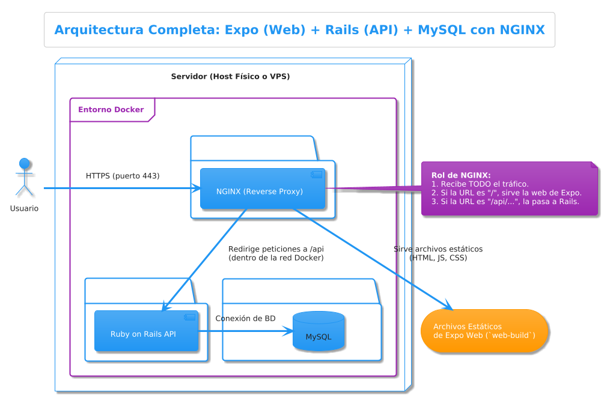

# Arquitectura Técnica Tentativa - PeluDog CRM

## 1. Introducción y Filosofía

Este documento describe la arquitectura técnica inicial propuesta para el sistema PeluDog CRM. La filosofía central es crear un sistema robusto, mantenible y, fundamentalmente, fácil de instalar y desplegar para la comunidad de código abierto. Para lograr esto, se ha optado por una arquitectura de tres capas, completamente containerizada con Docker, diseñada para operar eficientemente en un único servidor.

La elección de tecnologías busca un equilibrio entre madurez, productividad de desarrollo y un ecosistema sólido que facilite la implementación de las funcionalidades requeridas.

---

## 2. Arquitectura de 3 Capas

El sistema se divide en tres capas lógicas bien diferenciadas: la capa de presentación (frontend), la capa de negocio (backend) y la capa de persistencia (base de datos). Todas estas capas se ejecutan como servicios independientes dentro de un entorno Docker.

### **Capa de Backend (Servidor)**

- **Tecnología (En Discusión):** La elección principal es **Ruby on Rails (en modo `api_only`)** por su principio de "Convención sobre Configuración" y su robusto ORM (ActiveRecord). Como alternativa, se está considerando **Laravel (PHP)**, que ofrece un ecosistema igualmente maduro y un potente ORM (Eloquent). La decisión final se basará en la velocidad de desarrollo y la facilidad para implementar la lógica de negocio específica.
- **Responsabilidades:**
  - Exponer una **API RESTful** segura para que el frontend consuma los datos.
  - Implementar toda la **lógica de negocio** y las reglas del dominio (ej. cómo se calcula la próxima fecha de vacunación, qué sucede cuando se cancela una cita).
  - Gestionar la **autenticación y autorización** de usuarios mediante JWT.
  - Realizar **validaciones de datos** a nivel de modelo para garantizar la integridad en la base de datos.
- **Modo `api_only`:** Independientemente del framework, el backend no generará vistas HTML. Su única responsabilidad es recibir y responder a peticiones con formato JSON, lo que lo hace ligero y enfocado.
- **Autenticación (JWT):**
  - Se implementará un sistema de autenticación stateless basado en **JSON Web Tokens**.
  - **No se usarán sesiones del lado del servidor**. Esto simplifica la arquitectura y la hace ideal para una API.
  - Se crearán controladores específicos para manejar el registro, inicio de sesión y recuperación de contraseña, emulando la funcionalidad de librerías como Devise/Sanctum pero con control total sobre el flujo.
  - El flujo de login generará un token JWT firmado que el cliente almacenará. Cada petición subsecuente del cliente deberá incluir este token en la cabecera `Authorization: Bearer <token>`.

### **Capa de Frontend (Aplicación Cliente)**

- **Tecnología:** **Expo (React Native) con TypeScript**. Expo permite desarrollar una aplicación móvil para iOS y Android, y una aplicación web progresiva (PWA) a partir de una única base de código.
- **Responsabilidades:**
  - Renderizar la **interfaz de usuario** con la que interactúan los veterinarios, asistentes y clientes.
  - Gestionar el **estado de la aplicación** y la lógica de la interfaz de usuario, que será separada en **React Hooks** reutilizables.
  - Realizar todas las **peticiones a la API del backend** para obtener y enviar datos.
  - Incluir una **Landing Page personalizable** como pantalla de inicio, que sirva como presentación del consultorio antes del login.
- **Estilos y Notificaciones:**
  - Los estilos de la aplicación se construirán utilizando **Tailwind CSS**, permitiendo un desarrollo rápido y consistente de la interfaz.
  - Para las notificaciones y alertas dentro de la aplicación (ej. "Cita creada exitosamente", "Error de conexión"), se utilizará la librería **`react-native-toast-message`**.
- **Comunicación con la API:**
  - Se utilizará la librería **Axios** para gestionar las peticiones HTTP.
  - Se configurará una instancia de Axios para que, una vez que el usuario inicie sesión, el token JWT se añada automáticamente a las cabeceras de todas las peticiones salientes.
- **Tipado Seguro:** El uso de TypeScript garantizará que los datos que fluyen entre los componentes y desde la API se ajusten a las interfaces y tipos definidos, reduciendo errores en tiempo de ejecución.

### **Capa de Persistencia (Base de Datos)**

- **Tecnología:** **MySQL**. Es una base de datos relacional robusta, de código abierto y ampliamente utilizada, con un excelente soporte por parte de Rails y Laravel.
- **Responsabilidades:**
  - Almacenar de forma persistente y segura todos los datos de la aplicación: usuarios, clientes, mascotas, historias clínicas, citas, pagos, etc.
- **Interacción:** La aplicación backend interactuará con la base de datos exclusivamente a través de su ORM (**ActiveRecord** para Rails o **Eloquent** para Laravel). Esto abstrae las consultas SQL y permite que las migraciones de la base de datos se gestionen directamente desde el código, facilitando las actualizaciones del esquema.

---

## 3. Orquestación y Despliegue

### **Docker y Docker Compose**

Para cumplir con el objetivo de una instalación sencilla, toda la arquitectura estará orquestada por **Docker y Docker Compose**.

- **Visión General:** Un único archivo `docker-compose.yml` definirá y configurará todos los servicios necesarios para levantar la aplicación completa con un solo comando (`docker-compose up`).
- **Contenedores:**
  1.  **Contenedor Backend (`backend-app`):** Ejecutará la API de Rails o Laravel.
  2.  **Contenedor Frontend (`frontend-web`):** Servirá la compilación web de la aplicación Expo.
  3.  **Contenedor Base de Datos (`database-mysql`):** Ejecutará el servidor MySQL, con sus datos en un volumen persistente.
  4.  **Contenedor Proxy Inverso (`proxy-nginx`):** Actuará como el punto de entrada único, gestionando SSL y enrutando el tráfico a los contenedores correspondientes.

### **Objetivo Estratégico de la Contenerización**

La decisión de usar Docker no es solo técnica, sino estratégica. El objetivo es que esta aplicación de código abierto pueda ser **fácilmente replicable con un nivel mínimo de personalización** para otras clínicas veterinarias en Venezuela.

Al mantener una **estructura de datos común y estandarizada**, se abre la posibilidad de que, en el futuro, diferentes clínicas que usen el sistema puedan **compartir información de manera segura y sencilla**, facilitando la referencia de pacientes entre veterinarios sin la necesidad de transferir historiales en papel o formatos incompatibles.
