# **VI Caso de uso**:

## **Diagrama General de Casos de Uso**

A continuación, se presenta el diagrama general que muestra una visión consolidada de los principales casos de uso del sistema PeluDog CRM y las interacciones de los actores con ellos.

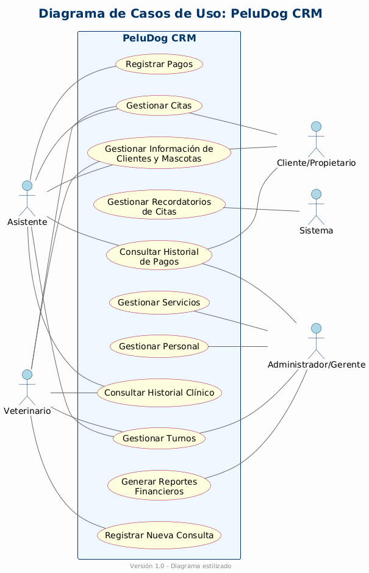

## **Detalle de Casos de Uso por Módulo**

A continuación, se detallan los casos de uso individuales, agrupados por módulo funcional.

**Actores Principales del CRM (Reconfirmados):**

- **Asistente:** Encargado de la gestión de citas, registro de clientes y mascotas, facturación y comunicación inicial. Requiere autenticación para acceder al sistema.
- **Veterinario:** Encargado de la atención clínica, registro de diagnósticos, tratamientos, prescripciones y seguimiento. Requiere autenticación para acceder al sistema.
- **Cliente/Propietario de Mascotas:** Propietario de la mascota que interactúa con el sistema para ciertas funciones (ej. portal de citas, gestión de su información y la de sus mascotas, consulta de historial de pagos). Requiere autenticación para acceder al portal.
- **Administrador/Gerente:** Responsable de la gestión de personal, configuración de servicios, reportes financieros y supervisión general. Requiere autenticación y tiene privilegios administrativos.
- **Sistema:** Realiza acciones automáticas (ej. envío de recordatorios).

---

### **Módulo: Gestión de Pacientes (Clientes y Mascotas)**

**CU-GP01: Gestionar Información de Clientes y Mascotas**

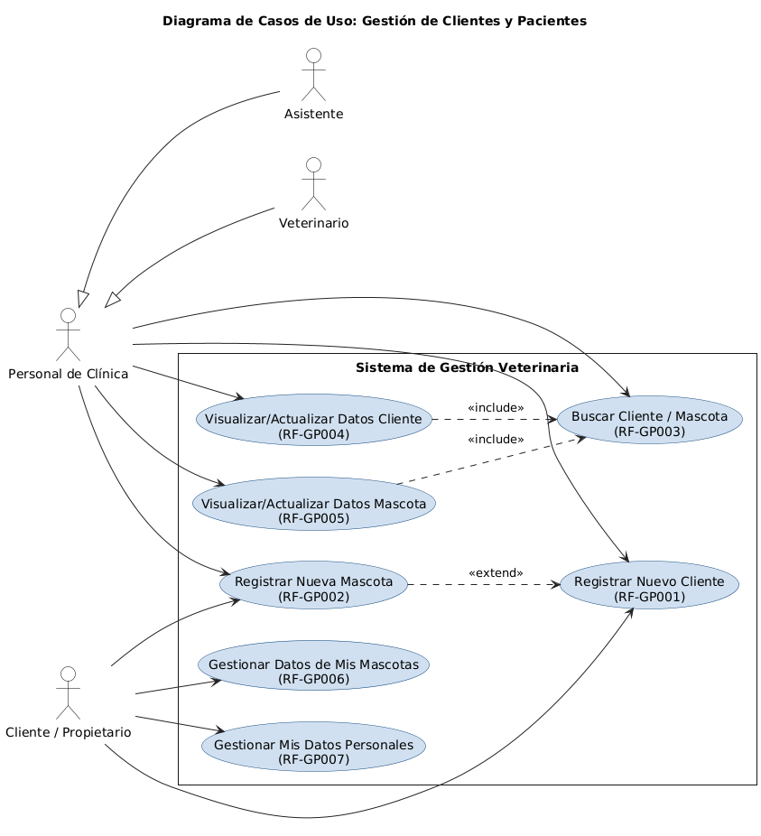

- **Actores Principales:** Asistente, Veterinario, Cliente/Propietario de Mascotas
- **Descripción:** Permite al personal del consultorio y a los propios Clientes/Propietarios (para su información y la de sus mascotas) crear nuevos registros, así como buscar, visualizar y actualizar la información existente.
- **Flujo Principal:**
  1.  El actor (Asistente, Veterinario o Cliente/Propietario) inicia la gestión.
  2.  El Sistema presenta opciones según el actor:
      - **Asistente/Veterinario:**
        - Iniciar registro de Nuevo Cliente (invoca RF-GP001).
        - Iniciar registro de Nueva Mascota (asociada a un cliente existente) (invoca RF-GP002).
        - Buscar Cliente y/o Mascota (invoca RF-GP003) para luego visualizar/actualizar (invoca RF-GP004, RF-GP005).
      - **Cliente/Propietario de Mascotas (vía portal):**
        - Registrarse como Nuevo Cliente (si el sistema lo permite directamente) (invoca RF-GP001).
        - Visualizar/Actualizar sus Datos Personales (invoca RF-GP007).
        - Registrar Nueva Mascota (asociada a su perfil) (invoca RF-GP002).
        - Visualizar/Actualizar Datos de sus Mascotas (invoca RF-GP006).
  3.  **Si se registra nuevo cliente (RF-GP001):**
      a. El Actor (Asistente o Cliente/Propietario) ingresa los datos del cliente en el formulario provisto.
      b. El Sistema valida los datos y guarda el cliente.
      c. Si es el Asistente, el Sistema permite asociar mascotas. Si es el Cliente/Propietario, puede proceder a registrar sus mascotas.
  4.  **Si se registra nueva mascota (RF-GP002):**
      a. El Actor (Asistente, Veterinario o Cliente/Propietario) selecciona un cliente existente (si aplica Asistente/Veterinario) o la mascota se asocia automáticamente al perfil del Cliente/Propietario.
      b. El Actor ingresa los datos de la mascota en el formulario provisto.
      c. El Sistema valida los datos y guarda la mascota, vinculándola al cliente.
  5.  **Si se busca cliente/mascota (Asistente/Veterinario) (RF-GP003):**
      a. El Actor ingresa criterios de búsqueda.
      b. El Sistema muestra los resultados.
      c. El Actor selecciona un cliente/mascota de la lista.
  6.  **Si se visualiza/actualiza cliente (Asistente/Veterinario) (RF-GP004):**
      a. Tras seleccionar un cliente, el Sistema muestra sus datos.
      b. El Actor puede modificar los datos y el Sistema guarda los cambios.
      d. El Sistema muestra las mascotas asociadas al cliente.
  7.  **Si se visualiza/actualiza mascota (Asistente/Veterinario) (RF-GP005):**
      a. Tras seleccionar una mascota, el Sistema muestra sus datos generales.
      b. El Actor puede modificar los datos y el Sistema guarda los cambios.
      d. El Sistema muestra información del dueño.
  8.  **Si el Cliente/Propietario visualiza/actualiza sus datos personales (RF-GP007):**
      a. El Cliente/Propietario accede a su perfil. El Sistema muestra sus datos.
      b. El Cliente/Propietario modifica sus datos. El Sistema guarda los cambios.
  9.  **Si el Cliente/Propietario visualiza/actualiza datos de su mascota (RF-GP006):**
      a. El Cliente/Propietario selecciona una de sus mascotas. El Sistema muestra sus datos.
      b. El Cliente/Propietario modifica los datos. El Sistema guarda los cambios.

---

### **Módulo: Gestión de Agenda y Citas**

**CU-GA01: Gestionar Citas**

- **Actores Principales:** Asistente, Cliente/Propietario de Mascotas, Veterinario
- **Descripción:** Permite al Asistente y al Cliente/Propietario (a través de un portal) consultar disponibilidad, agendar, reprogramar y cancelar citas. Permite al personal (Asistente, Veterinario) consultar la agenda y confirmar asistencias.
- **Flujo Principal :**

  1.  El actor (Asistente o Cliente/Propietario) inicia la gestión de citas. El Veterinario puede iniciarla para consultar la agenda.
  2.  **Para consultar disponibilidad (RF-GA001):**
      a. El Actor (Asistente/Cliente/Propietario) accede a la función.
      b. El Sistema muestra una vista de calendario con horarios disponibles/ocupados, filtrable por veterinario.
  3.  **Para agendar nueva cita (RF-GA002):**
      a. El Actor (Asistente/Cliente/Propietario) selecciona mascota (previamente registrada o la registra en el flujo si es necesario - ver CU-GP01), veterinario (si aplica), fecha/hora disponible y motivo.
      b. El Sistema registra la cita, marca el horario como ocupado y (opcionalmente) envía confirmación al Cliente/Propietario.
  4.  **Para reprogramar cita (RF-GA003):**
      a. El Actor (Asistente/Cliente/Propietario) busca y selecciona una cita existente (Cliente/Propietario solo las suyas).
      b. El Actor elige una nueva fecha/hora disponible.
      c. El Sistema actualiza la cita, mueve el bloqueo horario y (opcionalmente) envía notificación al Cliente/Propietario.
  5.  **Para cancelar cita (RF-GA004):**
      a. El Actor (Asistente/Cliente/Propietario) busca y selecciona una cita existente (Cliente/Propietario solo las suyas).
      b. El Sistema marca la cita como cancelada, libera el horario y (opcionalmente) envía notificación al Cliente/Propietario.
  6.  **Para consultar agenda (Vista Staff - Asistente/Veterinario) (RF-GA005):**
      a. El Actor (Asistente/Veterinario) accede a la agenda.
      b. El Sistema muestra el calendario con todas las citas (filtrable por veterinario), mostrando detalles clave (hora, mascota, cliente, motivo).
      c. El Asistente puede usar esta vista para confirmar la asistencia del cliente a una cita.

**CU-GA02: Gestionar Recordatorios de Citas**

- **Actor Principal:** Sistema, Asistente
- **Descripción:** El Sistema se encarga de enviar recordatorios automáticos de citas, o permite al Asistente gestionarlos.
- **Flujo Principal (RF-GA006):**
  1.  El Sistema, basado en configuraciones (canal de envío, antelación), identifica citas próximas.
  2.  El Sistema envía recordatorios a los Clientes/Propietarios con los detalles de la cita.
  3.  (Opcional) El recordatorio incluye enlaces para que el Cliente/Propietario pueda confirmar o solicitar cancelación/reprogramación (invocando partes de CU-GA01).
  4.  (Alternativa) El Asistente puede revisar una lista de recordatorios pendientes generada por el sistema y gestionarlos manualmente (ej. llamada telefónica).

---

### **Módulo: Autenticación y Gestión de Usuarios**

**CU-AU01: Autenticar Usuario**

- **Actores Principales:** Todos los usuarios del sistema
- **Descripción:** Permite a los usuarios acceder al sistema mediante credenciales válidas y gestionar su sesión activa, incluyendo el inicio de sesión, cierre de sesión y recuperación de contraseña.
- **Flujo Principal:**

  1. El usuario accede al sistema e inicia el proceso de autenticación.
  2. **Para iniciar sesión (invoca RF-AU001):**
     a. El Sistema presenta el formulario de login con campos de usuario y contraseña.
     b. El usuario ingresa sus credenciales.
     c. El Sistema valida las credenciales contra la base de datos.
     d. Si las credenciales son válidas, el Sistema crea una sesión activa y redirige al usuario al dashboard principal según su rol.
     e. Si las credenciales son inválidas, el Sistema muestra un mensaje de error y aplica políticas de bloqueo tras múltiples intentos.
  3. **Para cerrar sesión (invoca RF-AU002):**
     a. El usuario selecciona la opción "Cerrar sesión" desde cualquier parte del sistema.
     b. El Sistema invalida completamente la sesión del usuario.
     c. El Sistema redirige al usuario a la página de login.
  4. **Para recuperar contraseña (invoca RF-AU004):**
     a. Desde la página de login, el usuario selecciona "Recuperar contraseña".
     b. El Sistema solicita el email registrado del usuario.
     c. El Sistema genera un enlace temporal y seguro, enviándolo al email del usuario.
     d. El usuario accede al enlace y establece una nueva contraseña que cumpla las políticas de seguridad (invoca RF-AU003).
     e. El Sistema actualiza la contraseña y permite al usuario iniciar sesión.
  5. **Aplicación continua de políticas de contraseña (invoca RF-AU003):**
     a. El Sistema valida que las contraseñas cumplan los requisitos de seguridad (longitud, complejidad).
     b. El Sistema fuerza el cambio de contraseña según la política configurada.
     c. El Sistema bloquea cuentas tras múltiples intentos fallidos consecutivos.

- **Flujos Alternativos:**
  - **FA-AU01-01:** Credenciales incorrectas - El sistema muestra mensaje de error específico y registra el intento.
  - **FA-AU01-02:** Cuenta bloqueada - El sistema muestra mensaje informativo y requiere intervención del administrador.
  - **FA-AU01-03:** Contraseña expirada - El sistema fuerza el cambio de contraseña antes de permitir el acceso.
  - **FA-AU01-04:** Enlace de recuperación expirado - El sistema informa al usuario y permite solicitar un nuevo enlace.

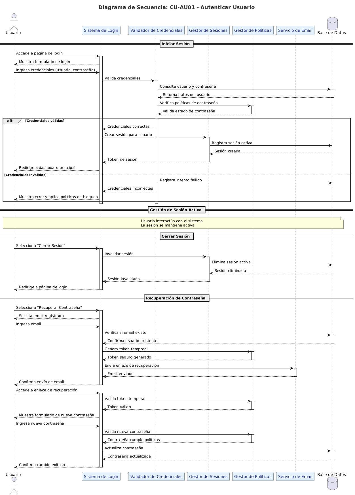

### Flujos Alternativos

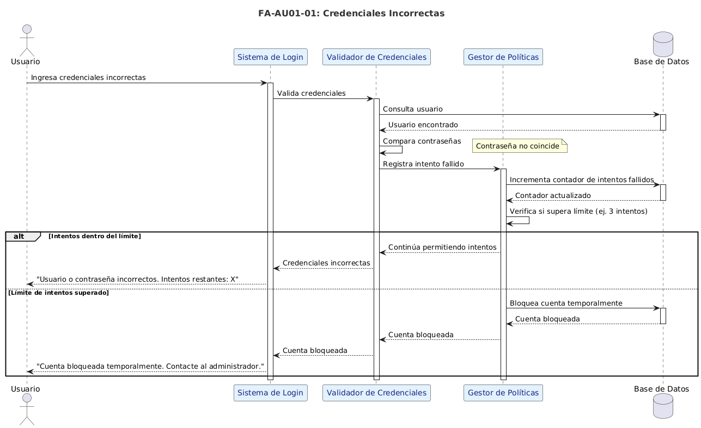

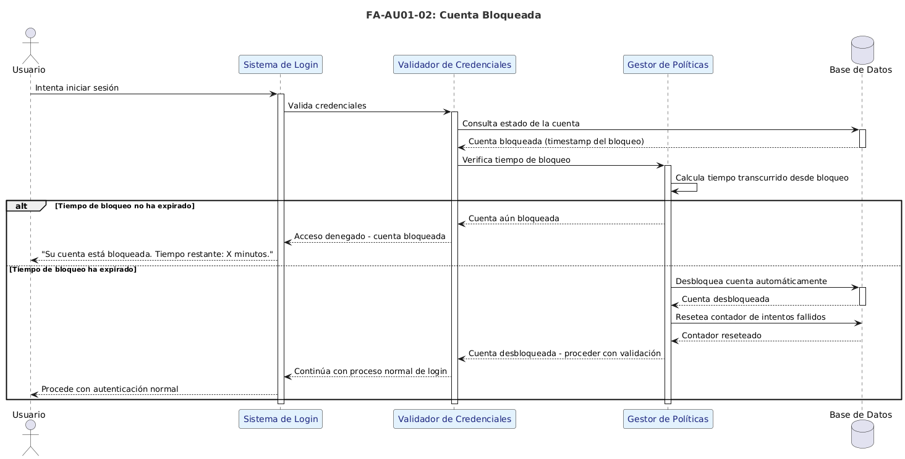

---

### **Módulo: Atención Clínica (Historia Clínica Electrónica)**

**CU-AC01: Consultar Historial Clínico de Mascota**

- **Actores Principales:** Veterinario, Asistente (con vista potencialmente limitada)
- **Descripción:** Permite al Veterinario (y Asistente) acceder y revisar toda la información médica registrada para una mascota, incluyendo resúmenes, archivos adjuntos y registros específicos de vacunación/desparasitación.
- **Flujo Principal :**

  1.  El Actor (Veterinario/Asistente) selecciona una mascota (puede heredar de CU-GP01 o una cita).
  2.  **Para visualizar historial completo (RF-AC001):**
      a. El Sistema muestra las entradas del historial en orden cronológico (o configurable), con datos clave (fecha, motivo, diagnóstico, veterinario).
      b. El Actor puede expandir una entrada para ver todos sus detalles (anamnesis, examen, tratamientos, notas, etc.).
  3.  **Para visualizar resumen de alergias y datos relevantes (RF-AC002):**
      a. El Sistema muestra de forma destacada alergias conocidas y datos básicos de la mascota (especie, raza, sexo, edad/fecha de nacimiento, último peso registrado).
  4.  **Para visualizar archivos adjuntos (RF-AC003):**
      a. Para cada entrada del historial, o en una sección dedicada, el Sistema lista los archivos adjuntos.
      b. El Actor puede visualizar o descargar los archivos. Se muestra descripción/etiqueta.
  5.  **Para consultar registros específicos de vacunación y desparasitación (RF-AC004):**
      a. El Actor utiliza filtros o accede a una sección específica para ver solo eventos de vacunación o desparasitación.
      b. El Sistema muestra detalles relevantes para cada tipo de evento (fecha, producto, lote, próxima dosis, etc.).

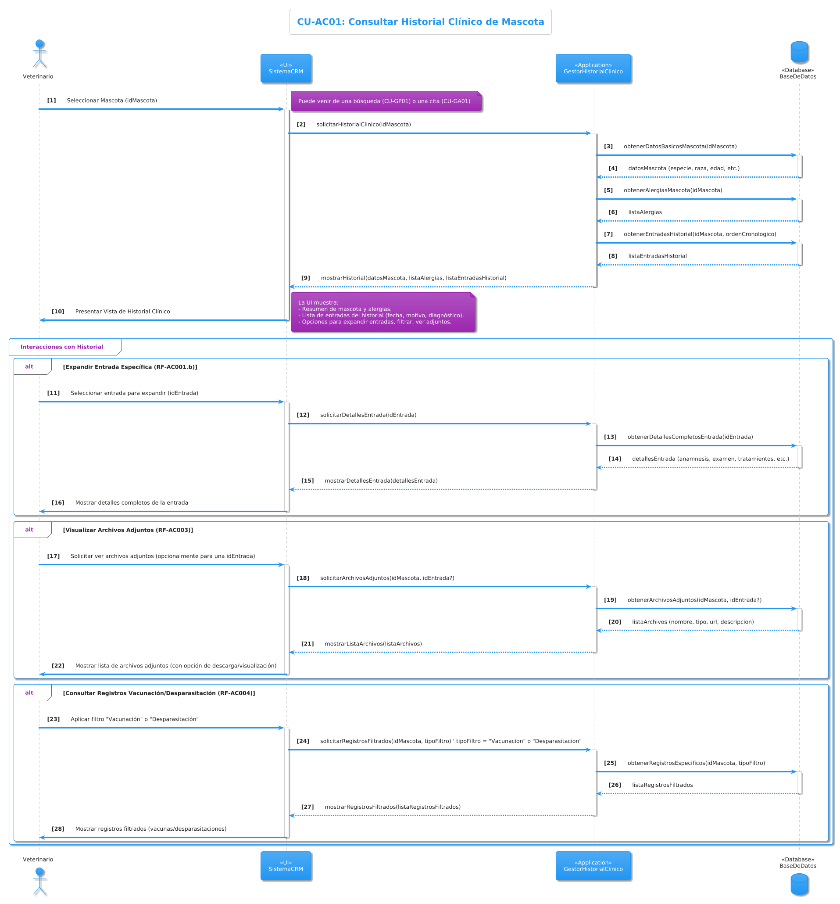

**CU-AC02: Registrar Nueva Consulta / Actualizar Historia Clínica**

- **Actor Principal:** Veterinario
- **Descripción:** Permite al Veterinario crear una nueva entrada en la historia clínica durante una consulta, o actualizar una existente (bajo condiciones). Incluye registro de hallazgos, diagnósticos, tratamientos, solicitud de exámenes, aplicación de vacunas/desparasitantes y adjuntar archivos.
- **Flujo Principal :**
  1.  El Veterinario inicia una nueva entrada de historial clínico para una mascota seleccionada (invoca RF-AC005). La fecha/hora se autocompletan (editables), y se asocia al veterinario logueado.
  2.  **Registrar datos de la consulta (invoca RF-AC006):**
      a. El Sistema provee campos para Peso, Temperatura, Motivo de consulta, Anamnesis, Hallazgos del examen físico, Diagnóstico(s) (con opción de catálogo), Plan de tratamiento, Notas adicionales.
      b. El Veterinario ingresa la información correspondiente.
  3.  **Prescribir tratamiento (Generar Récipe) (invoca RF-AC007):**
      a. Dentro de la entrada, el Veterinario añade uno o más medicamentos con detalles (nombre, dosis, vía, frecuencia, duración; opcionalmente desde catálogo).
      b. Las prescripciones se guardan como parte de la entrada del historial.
      c. El Sistema permite generar un documento de récipe (PDF) con todos los datos necesarios.
  4.  **Solicitar exámenes de laboratorio (invoca RF-AC008):**
      a. Dentro de la entrada, el Veterinario selecciona/ingresa los exámenes requeridos (opcionalmente desde catálogo).
      b. Las solicitudes se guardan como parte de la entrada del historial.
      c. El Sistema permite generar una orden de exámenes (PDF) con todos los datos necesarios.
  5.  **Adjuntar archivos a la entrada clínica (invoca RF-AC009):**
      a. El Veterinario carga uno o más archivos digitales (PDF, JPG, DICOM, etc.) con descripciones/etiquetas.
      b. Los archivos se vinculan a la entrada específica del historial.
  6.  **Registrar aplicación de vacunas y desparasitantes (invoca RF-AC010):**
      a. El Veterinario registra detalles de la vacuna/desparasitante aplicado (nombre, lote, próxima fecha, etc.).
      b. Esta información se guarda en la entrada del historial clínico y es visible en la consulta de registros específicos (RF-AC004).
  7.  El Veterinario guarda la entrada completa. El Sistema la añade al historial de la mascota.
  8.  **Editar entrada de historial clínico reciente (invoca RF-AC011) (Flujo Alternativo/Posterior):**
      a. Dentro de un período configurable (ej. 24h), el Veterinario puede seleccionar y modificar una entrada reciente.
      b. El Sistema registra cualquier modificación en una bitácora de auditoría (quién, qué, cuándo). Campos críticos pueden tener restricciones adicionales.

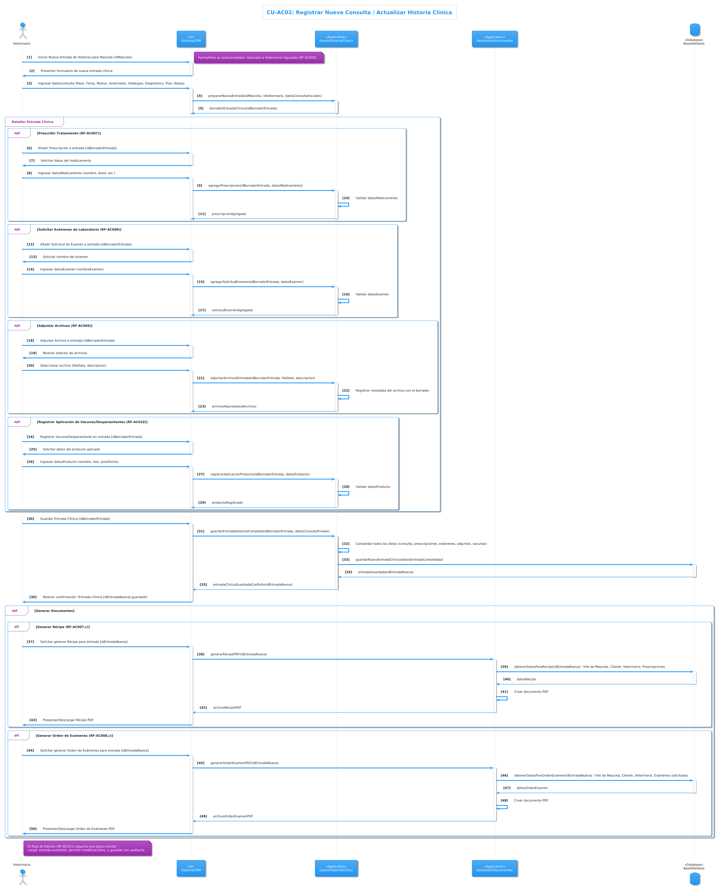

---

### **Módulo: Gestión de Recursos Humanos y Servicios Internos**

**CU-RH01: Gestionar Personal de la Clínica**

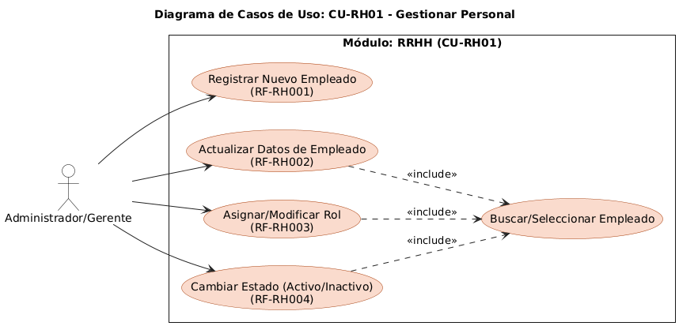

- **Actor Principal:** Administrador/Gerente
- **Descripción:** Permite al Administrador/Gerente registrar, actualizar y gestionar la información del personal de la clínica, incluyendo sus roles y estado.
- **Flujo Principal :**

  1.  El Administrador/Gerente accede a la sección de gestión de personal.
  2.  **Para registrar nuevo empleado (invoca RF-RH001):**
      a. El Sistema presenta un formulario para datos del empleado.
      b. El Administrador/Gerente ingresa los datos (nombre, DNI, rol, etc.).
      c. El Sistema valida y guarda el nuevo empleado.
  3.  **Para visualizar y actualizar datos de empleado (invoca RF-RH002):**
      a. El Administrador/Gerente busca y selecciona un empleado.
      b. El Sistema muestra la información del empleado.
      c. El Administrador/Gerente puede modificar los datos. El Sistema guarda los cambios.
  4.  **Para asignar/modificar rol de empleado (invoca RF-RH003):**
      a. El Administrador/Gerente selecciona un empleado.
      b. El Sistema permite modificar los roles asignados (ej. Veterinario, Asistente).
      c. El Sistema actualiza los permisos de acceso del empleado según su nuevo rol.
  5.  **Para desactivar/activar empleado (invoca RF-RH004):**
      a. El Administrador/Gerente selecciona un empleado.
      b. El Sistema permite cambiar el estado del empleado a "activo" o "inactivo", afectando su acceso.

**CU-RH02: Gestionar Turnos y Guardias**

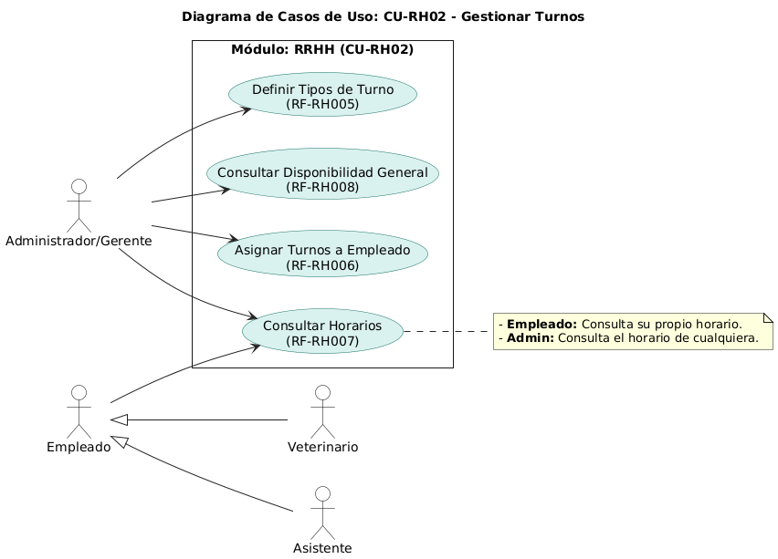

- **Actores Principales:** Administrador/Gerente, Veterinario, Asistente
- **Descripción:** Permite al Administrador/Gerente planificar y asignar turnos/guardias. Permite al personal consultar sus horarios.
- **Flujo Principal :**

  1.  El Actor (Administrador/Gerente, Veterinario, Asistente) accede a la gestión de turnos.
  2.  **Para crear/modificar tipo de turno (Administrador/Gerente) (invoca RF-RH005):**
      a. El Sistema permite definir/modificar nombre, hora de inicio y fin para cada tipo de turno.
  3.  **Para asignar turno a empleado (Administrador/Gerente) (invoca RF-RH006):**
      a. El Administrador/Gerente selecciona un empleado, un tipo de turno y un período/días específicos.
      b. El Sistema valida posibles conflictos y guarda las asignaciones.
  4.  **Para consultar horario de empleado (invoca RF-RH007):**
      a. El Empleado (Veterinario/Asistente) consulta su propio horario asignado.
      b. El Administrador/Gerente puede consultar el horario de cualquier empleado.
      c. El Sistema muestra una vista de calendario con los turnos.
  5.  **Para consultar disponibilidad de personal (Administrador/Gerente) (invoca RF-RH008):**
      a. El Sistema muestra una vista consolidada de los turnos de todo el personal, filtrable por rol o fecha, para facilitar la planificación.

**CU-RH03: Gestionar Servicios de la Clínica**

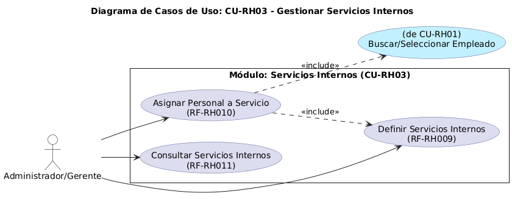

- **Actor Principal:** Administrador/Gerente
- **Descripción:** Permite al Administrador/Gerente definir y gestionar los tipos de servicios especiales o complementarios que ofrece la clínica (ej. "Farmacia", "Hospedaje") y asignar personal responsable.
- **Flujo Principal :**
  1.  El Administrador/Gerente accede a la sección de gestión de servicios internos.
  2.  **Para crear/modificar tipo de servicio interno (invoca RF-RH009):**
      a. El Sistema permite crear un nombre, una descripción y activar/desactivar cada servicio.
  3.  **Para asignar personal a servicio interno (invoca RF-RH010):**
      a. El Administrador/Gerente selecciona un servicio y uno o más empleados para asociarlos como responsables o participantes.
      b. El Sistema guarda esta asociación.
  4.  **Para consultar servicios internos activos (invoca RF-RH011):**
      a. El Sistema muestra una lista de todos los servicios internos definidos con su estado (activo/inactivo) y descripción.

---

### **Módulo: Gestión de Pagos y Facturación**

**CU-PG01: Registrar Pagos**

- **Actor Principal:** Asistente
- **Descripción:** Permite al Asistente registrar los pagos recibidos de los clientes por servicios o productos y generar los comprobantes correspondientes.
- **Flujo Principal :**

  1.  El Asistente inicia el proceso de registro de un pago, usualmente desde el perfil del cliente o una consulta/venta.
  2.  **Para registrar pago de servicio/producto (invoca RF-PG001):**
      a. El Asistente selecciona el cliente y/o mascota, y los servicios o productos a pagar (idealmente vinculados a una orden o consulta).
      b. El Asistente ingresa el monto pagado y selecciona el método de pago (efectivo, tarjeta, etc.).
      c. El Sistema valida que el monto sea consistente y registra el pago en la base de datos.
  3.  **Para generar comprobante de pago (invoca RF-PG002):**
      a. Inmediatamente después de registrar el pago, o al seleccionarlo posteriormente, el Sistema permite generar un comprobante/recibo (PDF imprimible) con los detalles del pago.

**CU-PG02: Consultar Historial de Pagos**

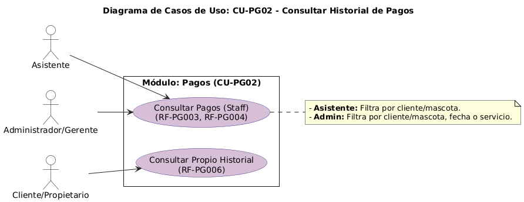

- **Actores Principales:** Asistente, Administrador/Gerente, Cliente/Propietario de Mascotas
- **Descripción:** Permite al personal de la clínica y a los Clientes/Propietarios (para sus propios registros) consultar el historial de pagos y facturas.
- **Flujo Principal :**

  1.  El Actor (Asistente, Administrador/Gerente, o Cliente/Propietario) inicia la consulta del historial de pagos.
  2.  **Para consultar pagos por cliente/mascota (Staff) (invoca RF-PG003):**
      a. El Asistente o Administrador/Gerente busca pagos asociados a un cliente o mascota específico.
      b. El Sistema muestra una lista de los pagos con detalles (fecha, monto, concepto, método).
  3.  **Para consultar pagos por fecha/servicio (Staff) (invoca RF-PG004):**
      a. El Administrador/Gerente filtra los pagos por un rango de fechas o por tipo de servicio/producto.
      b. El Sistema muestra los resultados correspondientes.
  4.  **Para consultar propio historial de pagos y facturas (Cliente/Propietario) (invoca RF-PG006):**
      a. El Cliente/Propietario accede a su sección de historial de pagos en el portal.
      b. El Sistema muestra una lista de sus pagos realizados, con detalles.
      c. El Sistema permite al Cliente/Propietario visualizar y/o descargar las facturas o comprobantes asociados.

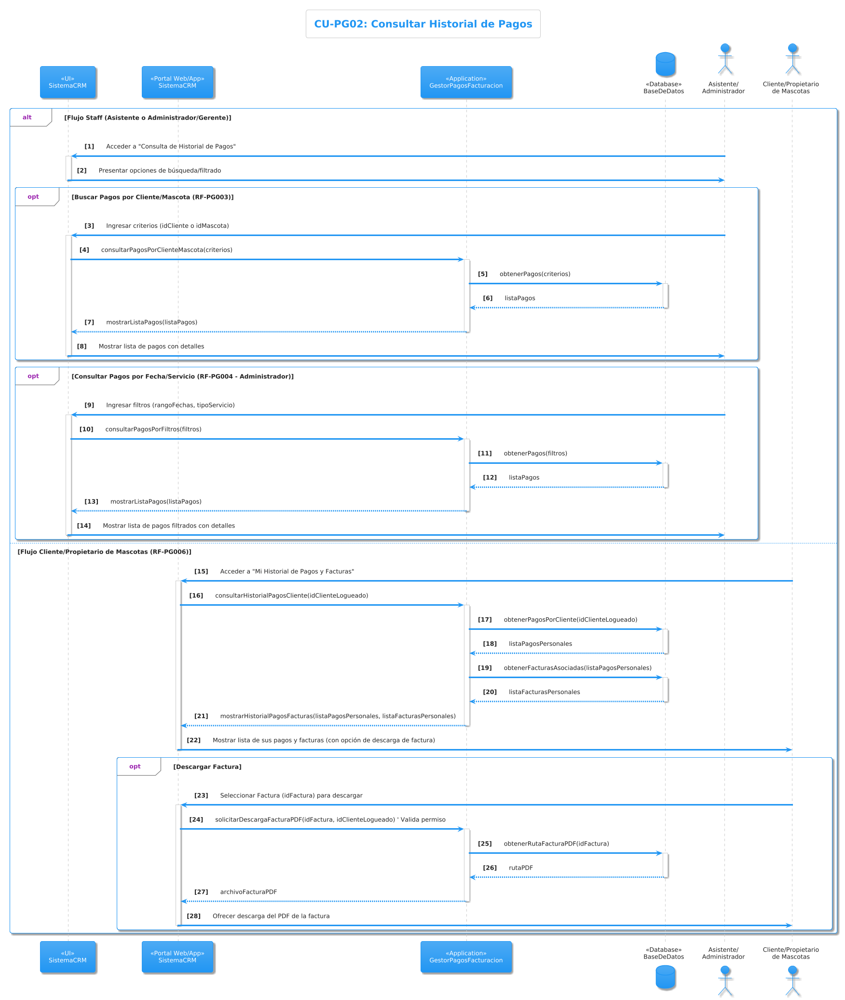

**CU-PG03: Generar Reportes Financieros**

- **Actor Principal:** Administrador/Gerente
- **Descripción:** Permite al Administrador/Gerente generar reportes resumidos de los ingresos y otras métricas financieras de la clínica.
- **Flujo Principal (invoca RF-PG005):**
  1.  El Administrador/Gerente accede a la sección de reportes financieros.
  2.  El Administrador/Gerente selecciona el tipo de reporte (ej. ingresos) y el período deseado (diario, semanal, mensual, anual).
  3.  El Sistema procesa los datos y genera el reporte, mostrando el total de ingresos y, opcionalmente, desgloses por tipo de servicio/producto o método de pago.
  4.  El reporte debe ser exportable (ej. CSV, PDF) para análisis externo o archivo.

