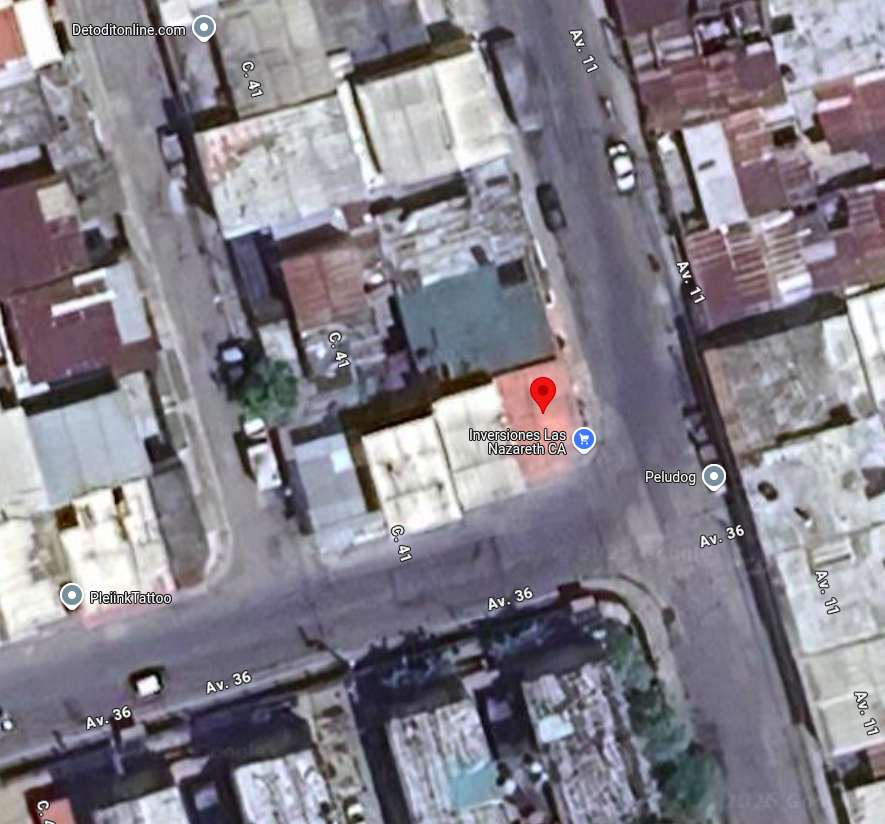
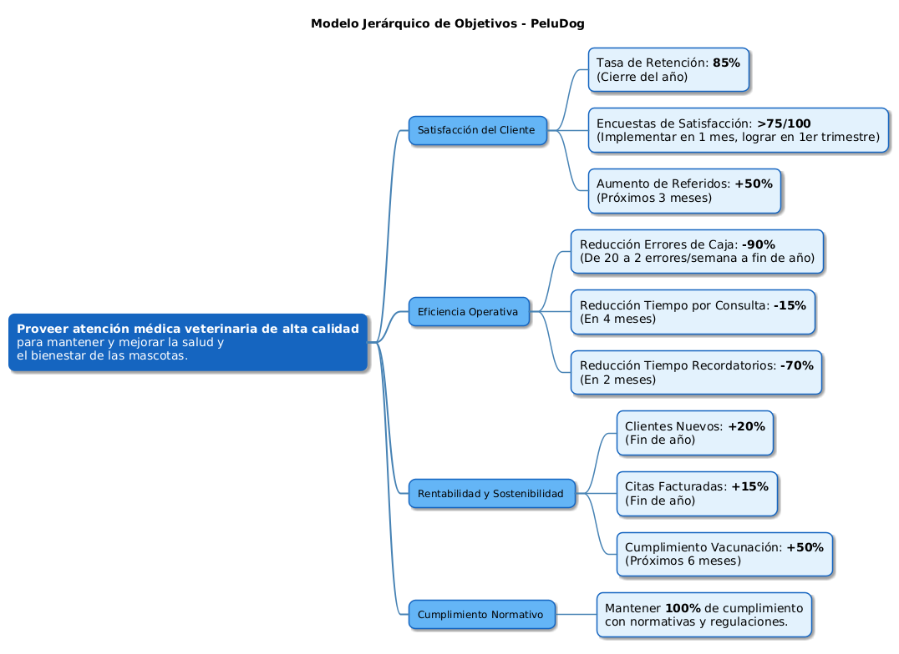
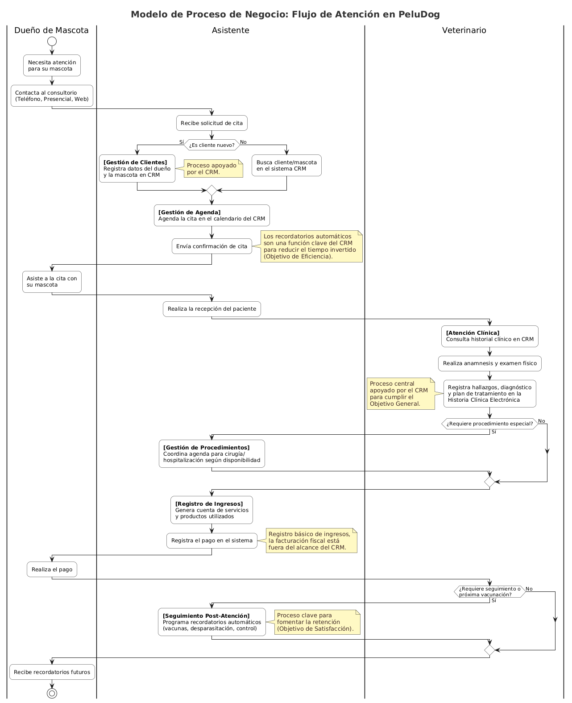
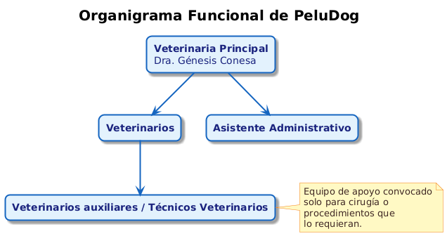
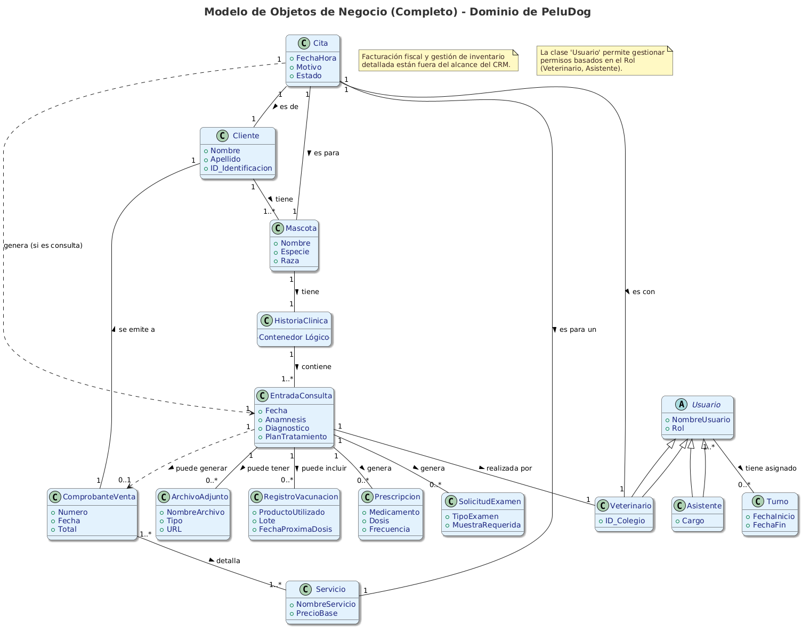

# **PST - Plataforma de gestión CRM para PeluDog.**

## **Integrantes:**

- Miguel Figuera C.I: 23.558.789
- Iromy Leon C.I: V-30.243.131
- Alejandra Herde C.I: V-23.711.974

### **Resumen:**

La propuesta plantea desarrollar un sistema CRM integral para el consultorio veterinario PeluDog, ubicado en La Mora I (La Victoria, Aragua), con el fin de digitalizar la gestión de citas, historias clínicas, vacunaciones, comunicaciones y pagos. El diagnóstico participativo detecta ineficiencias en los procesos manuales actuales y define como prioridad automatizar la agenda y los registros médicos. El plan de acción contempla fases de levantamiento de requerimientos, desarrollo, pruebas, capacitación e implementación, aprovechando los recursos humanos, tecnológicos y financieros disponibles. Los objetivos SMART se enfocan en elevar la satisfacción y retención de clientes, mejorar la eficiencia operativa, incrementar la rentabilidad y asegurar el cumplimiento normativo. El dominio de la aplicación abarca la gestión de clientes, mascotas, servicios y reportes, dejando fuera facturación fiscal e inventario avanzado.

# **Descripción:**

El presente diagnóstico participativo tiene como objetivo evaluar las necesidades, recursos y oportunidades existentes en el consultorio veterinario _PeluDog_, ubicado en la urbanización La Mora I, tercera entrada, calle 36, la Victoria Edo. Aragua. El consultorio, liderado por la Dra. Génesis Conesa, ofrece servicios de consulta, hospedaje y peluquería canina a precios accesibles. Reconociendo la importancia de la tecnología para optimizar la gestión y mejorar la calidad de los servicios, este diagnóstico se centra en la implementación de un Sistema de Gestión de Relaciones con los Clientes (CRM) adaptado a las necesidades específicas del consultorio.

La Dra. Génesis y PeluDog son pilares comunitarios pues participan tambien con regularidad en campañas de vacunación, y consultas veterinarias en servicios comunitarios.

Esto hace que tenga una cantidad de pacientes considerable dado que presta su servicios a la comunidad de la ciudad de La Victoria en distintos espacios a personas de distintos grupos socioeconómicos.

La participación activa de la Dra. Génesis y su asistente es fundamental para garantizar que el CRM resultante sea una herramienta verdaderamente útil y sostenible. Este proceso se alinea con los principios del desarrollo comunitario, buscando fortalecer la capacidad del consultorio para servir a su comunidad de manera eficiente y efectiva.

La implementación de un CRM para esta comunidad podria fomentar la atencion constante de sus mascotas, dando como resultado la detección temprana de enfermedades y un mejor control veterinario con dos consultas al año y los recordatorios para vacunación.

## **Localización Geográfica:**

Las coordenadas de peluDog según [maps.google.com](https://www.google.com/maps/place/10%C2%B013'45.9%22N+67%C2%B018'09.6%22W/@10.2293452,-67.3026976,91m/data=!3m1!1e3!4m5!3m4!4b1!8m2!3d10.2294169!4d-67.3026786?hl=es&entry=ttu&g_ep=EgoyMDI1MDYzMC4wIKXMDSoASAFQAw%3D%3D) son: long:10.2294169, lat: \-67.3026786

Esta ubicado en el urbanismo La Mora I, tercera entrada, av.11 con av.36, La Victoria Edo. Aragua.

   

## **Identificación de Problemas:**

El principal problema identificado es la falta de herramientas digitales que automaticen procesos clave en la gestión del consultorio. Esto se manifiesta en las siguientes áreas:

- **Gestión de citas:** El sistema actual de gestión de citas es manual, lo que puede generar errores, duplicaciones y dificultades para optimizar la agenda, afectando así la relación con los clientes de Pelugod.
- **Historias clínicas:** La información de los pacientes se registra de manera manual, lo que dificulta el acceso rápido a la información, el seguimiento de enfermedades crónicas y la generación de informes; incluso, en algunos casos se pueden traspapelar las historias.
- **Control de vacunación:** El seguimiento de los esquemas de vacunación se realiza manualmente, lo que aumenta el riesgo de olvidar fechas importantes y no recordar a los clientes la necesidad de refuerzos.
- **Comunicación con los clientes:** La falta de un sistema automatizado dificulta la comunicación proactiva con los clientes, como el envío de recordatorios de citas, consejos de cuidado o promociones.
- **Gestión de referencias y resultados de laboratorio:** La coordinación con otros profesionales y el registro de resultados de laboratorio se realiza de manera manual, lo que puede generar retrasos y errores en la comunicación.
- **Servicios**: Dada la naturaleza de multiples servicios que ofrece Peludog, es recomendable diferenciarlos dentro del CRM y estructurar los procesos requeridos para cada uno, siendo peluqueria, hospedaje y consulta servicios que tienen procesos y costos distintos.
- **Registro de Pagos:** Se realiza de forma manual por lo que no hay forma de entender el flujo de caja del negocio de forma rapida.

Estos problemas impactan negativamente la eficiencia del consultorio, la calidad de la atención al cliente y la capacidad de crecimiento del negocio.

**Análisis de Recursos:**

El consultorio La Mora I cuenta con una serie de recursos que facilitan la implementación del CRM:

- **Recursos humanos:** La Dra. Génesis Conesa y su asistente están comprometidas con el proyecto y dispuestas a participar activamente en el proceso de levantamiento de requerimientos y capacitación.
- **Recursos tecnológicos:** El consultorio cuenta con acceso a internet, un mini ups, una laptop, teléfonos inteligentes y una tablet, lo que facilita el uso de herramientas digitales y permitiría el acceso al crm incluso sin luz.
- **Recursos financieros:** El consultorio está dispuesto a invertir en el alojamiento mensual de la aplicación en un servidor (aproximadamente $25 dólares al mes), lo que demuestra su compromiso con la sostenibilidad del proyecto.
- **Conocimientos:** El equipo tiene conocimientos suficientes para ser usuario de un CRM sencillo y comprender los beneficios de la digitalización.
- **Ubicación y reputación:** El consultorio está bien ubicado en la urbanización La Mora I y goza de una buena reputación en la comunidad, lo que facilita la captación y retención de clientes.
- **Infraestructura física:** El espacio físico del consultorio, aunque integrado en una casa familiar, es adecuado para la prestación de servicios veterinarios y cuenta con todos los elementos necesarios para las consultas, el hospedaje y la peluquería.

**Priorización de Actividades:**

Considerando los problemas identificados y los recursos disponibles, se priorizan las siguientes actividades:

1. **Levantamiento de requerimientos:** Esta es la actividad prioritaria, ya que definirá las funcionalidades esenciales del CRM y garantizará que se adapte a las necesidades del consultorio. Se priorizarán las funcionalidades de gestión de citas e historias clínicas.
2. **Diseño y desarrollo del CRM:** Una vez definidos los requerimientos, se procederá al diseño y desarrollo del CRM. Se priorizará la creación de una interfaz amigable y fácil de usar.
3. **Pruebas y validación:** Antes de la implementación, se realizarán pruebas exhaustivas para garantizar que el CRM funcione correctamente y cumpla con los requerimientos definidos.
4. **Capacitación:** Se proporcionará capacitación al equipo del consultorio sobre el uso del CRM y la gestión de datos.
5. **Implementación y seguimiento:** Se implementará el CRM en el consultorio y se realizará un seguimiento continuo para identificar problemas y oportunidades de mejora.
6. **Mejora continua:** Se realizarán actualizaciones y mejoras al CRM en función de la retroalimentación del equipo del consultorio y las nuevas necesidades que surjan.

**Plan de Acción:**

El plan de acción se divide en las siguientes etapas:

**Fase 1: Preparación (Duración estimada: 1 día)**

- **Objetivo:** Establecer las bases para el proceso participativo.
- **Actividades:**
  - **Reunión inicial:** Realizar una reunión con la Dra. Génesis y su asistente para explicar el proceso de diagnóstico participativo, definir roles y responsabilidades, y establecer un cronograma de trabajo.
  - **Definir el alcance del CRM:** Aclarar los límites de las funcionalidades a incluir (inicialmente: citas, historias clínicas, recordatorios, registro de pagos, referencias).
  - **Preparar una guía de entrevista:** Elaborar preguntas clave para las entrevistas, enfocándose en los procesos actuales, puntos débiles, necesidades y expectativas.
  - **Crear plantillas para documentación:** Diseñar formatos para registrar la información recopilada (requerimientos funcionales, no funcionales, casos de uso).
- **Responsable:** El especialista en el levantamiento de requerimientos.

**Fase 2: Recopilación de Información (Duración estimada: 2-3 días)**

- **Objetivo:** Comprender a fondo los procesos actuales y las necesidades del consultorio.
- **Actividades:**
  - **Entrevistas individuales:** Realizar entrevistas detalladas con la Dra. Génesis y su asistente para comprender sus roles, tareas diarias y desafíos.
    - **Preguntas clave:**
      - ¿Cómo gestionan actualmente las citas? (Herramientas, procesos, problemas)
      - ¿Cómo registran la información de los pacientes? (Historias clínicas, vacunas, tratamientos)
      - ¿Cómo se comunican con los clientes? (Recordatorios, seguimiento)
      - ¿Qué información consideran crítica para la gestión del consultorio?
      - ¿Qué les gustaría automatizar o mejorar?
    -
  - **Observación directa (si es posible):** Observar el flujo de trabajo en el consultorio para identificar cuellos de botella y oportunidades de mejora.
  - **Análisis de documentos existentes:** Revisar los formatos de historias clínicas, hojas de citas, etc., para identificar la información relevante.
- **Responsables:** El especialista en levantamiento de requerimientos, Dra. Génesis y asistente.

**Fase 3: Análisis y Documentación de Requerimientos (Duración estimada: 2-3 días)**

- **Objetivo:** Traducir las necesidades del consultorio en requerimientos concretos para el CRM.
- **Actividades:**
  - **Taller participativo:** Realizar un taller con la Dra. Génesis y su asistente para analizar la información recopilada y definir los requerimientos funcionales y no funcionales del CRM.
    - **Ejemplo:** "El sistema debe permitir programar citas con diferentes tipos de servicios" (requerimiento funcional). "El sistema debe ser fácil de usar" (requerimiento no funcional).
  - **Creación de casos de uso:** Describir cómo los usuarios interactuarán con el CRM para realizar tareas específicas (ej., "Crear una nueva cita", "Consultar el historial de un paciente").
  - **Priorización de requerimientos:** Asignar prioridades a los requerimientos (alta, media, baja) según su importancia para el negocio.
- **Responsables:** El especialista en levantamiento de requerimientos, Dra. Génesis y asistente.

**Fase 4: Validación y Ajuste (Duración estimada: 1 día)**

- **Objetivo:** Asegurar que los requerimientos documentados reflejen las necesidades reales del consultorio.
- **Actividades:**
  - **Presentación de los requerimientos documentados:** Mostrar a la Dra. Génesis y a su asistente la lista de requerimientos, casos de uso y prioridades.
  - **Sesión de retroalimentación:** Solicitar comentarios y sugerencias para mejorar la precisión y claridad de los requerimientos.
  - **Ajuste de los requerimientos:** Modificar los requerimientos según la retroalimentación recibida.
- **Responsables:** El especialista en levantamiento de requerimientos, Dra. Génesis y asistente.

**Fase 5: Desarrollo, Implementación y Evaluación.**

- **Objetivo:** Crear un CRM funcional y adaptado a las necesidades del consultorio, y evaluar su impacto en la gestión y la calidad de los servicios.
- **Actividades:**
  - **Desarrollo del CRM:** Contratar a un desarrollador para construir el CRM según los requerimientos definidos.
  - **Pruebas y validación:** Realizar pruebas exhaustivas para asegurar que el CRM funcione correctamente.
  - **Capacitación:** Proporcionar capacitación al equipo del consultorio sobre el uso del CRM.
  - **Implementación:** Implementar el CRM en el consultorio.
  - **Seguimiento y evaluación:** Monitorear el uso del CRM y evaluar su impacto en la eficiencia, la calidad de la atención al cliente y la satisfacción del equipo.
  - **Mejora continua:** Realizar ajustes y mejoras al CRM según la retroalimentación del equipo del consultorio y las nuevas necesidades que surjan.
- **Responsables:** El especialista en levantamiento de requerimientos, el desarrollador del CRM, Dra. Génesis y asistente.

**Indicadores de Éxito:**

- Participación activa de la Dra. Génesis y su asistente en todas las fases del proyecto.
- Documento de requerimientos completo, claro y preciso.
- CRM funcional y adaptado a las necesidades del consultorio.
- Mejora en la eficiencia de la gestión de citas, historias clínicas y comunicación con los clientes.
- Aumento en la satisfacción del equipo del consultorio.
- Mejora en la calidad de la atención al cliente.

Este plan de acción busca empoderar al consultorio veterinario La Mora I para que utilice la tecnología de manera efectiva y sostenible, mejorando la calidad de sus servicios y fortaleciendo su papel en la comunidad al automatizar ciertas tareas y funcionando de respaldo de las historias clínicas de los pacientes.

   

# **Modelado del Dominio de la Aplicación.**

## **1\) Sistema de Negocios:**

**Consultorio Veterinario: PeluDog**.

Este es el entorno completo donde se realizan las actividades para proveer servicios de salud y bienestar animal. Incluye al personal (veterinarios, asistentes, administrativos), las instalaciones físicas, el equipamiento, los procesos de atención, la gestión administrativa y financiera, y la relación con los clientes (dueños de mascotas) y proveedores.

**Dominio de la Aplicación (Plataforma para CRM):** La aplicación se centrará en la gestión de la relación con los clientes (dueños de mascotas) y la gestión de la información clínica de las mascotas, así como los procesos administrativos directamente vinculados a la atención.

**Dentro del Dominio para la plataforma de gestión de CRM:**

1. Gestión de datos de clientes (dueños) y sus mascotas.
2. Gestión integral de la agenda de citas, en local o a domicilio (creación, modificación, cancelación, recordatorios, confirmaciones).
3. Gestión de esquemas de vacunación de los pacientes: recordatorios, costos y agenda de citas.
4. Gestión de la historia clínica electrónica de las mascotas (consultas, diagnósticos, tratamientos, vacunaciones, desparasitaciones, archivos adjuntos como exámenes).
5. Prescripción de tratamientos y generación de récipes.
6. Solicitud de exámenes de laboratorio.
7. Registro básico de ingresos y egresos por servicios y productos directamente relacionados con la consulta.
8. Gestión de recordatorios (citas, vacunas, desparasitaciones).
9. Gestión de servicios relacionados con la atención a las mascotas: hospedaje, cirugía, hospitalización, grooming (peluquería).
10. Gestión de personal y sus turnos en caso de multiples veterinarios o ayudantes (permisos y roles dentro de la aplicación).
11. Gestión de servicios y productos (usos dentro de las consultas de material médico) disponibles.

    **Fuera del Dominio**

12. Contabilidad financiera avanzada del consultorio (estados de resultados complejos, balances, impuestos).
13. Marketing y campañas publicitarias complejas.
14. Gestión avanzada de proveedores y compras.
15. Integración directa con equipos de laboratorio para recepción automática de resultados.

   

## **2\) Determinar los objetivos del sistema de negocio (Consultorio Veterinario):**

**Objetivo General**

Proveer atención médica veterinaria de alta calidad para mantener y mejorar la salud y el bienestar de las mascotas.

**Objetivos Específicos (S.M.A.R.T.)**

1. **Satisfacción del Cliente:**
   1. Lograr una tasa de retencion de clientes del 85% para el cierre del año en curso, medida como el porcentaje de clientes que regresan para una segunda cita o servicio en un periodo de 12 meses.
   2. Implementar encuestas de satisfacción automatizadas post-consulta en el primer mes, y alcanzar un puntaje promedio de 75/100 o superior para el final del primer trimestre, manteniendo o mejorando ese nivel durante el resto del año
   3. Aumentar los referidos directos inscritos en la plataforma de gestión CRM (recomendaciones de clientes y pacientes satisfechos) en un 50% en los proximos 3 meses.
2. **Eficiencia Operativa**:
   1. Reducir el número de discrepancias en las auditorías de caja semanales en un 90% para final de año, pasando de un promedio de 20 errores a 2 errores por semana.
   2. Reducir en un 15% el tiempo promedio por consulta (sin sacrificar calidad) mediante la digitalización de historiales clínicos y el uso de plantillas predefinidas para diagnósticos comunes, a implementar en 4 meses.
   3. Reducir el tiempo invertido en recordatorios de citas en un 70% dentro de los primeros 2 meses.
3. **Rentabilidad y Sostenibilidad**:
   1. Aumentar el número de clientes nuevos en un 20% para finales de año..
   2. Aumentar el número total de citas facturadas en un 15% para finales de año.
   3. Aumentar la tasa de cumplimiento del esquema de vacunación en un 50% en los próximos 6 meses, medido por el número de mascotas que reciben su dosis de refuerzo a tiempo gracias a los recordatorios automatizados.
4. **Cumplimiento Normativo**:

   1. Mantener un 100% del cumplimiento con todas las normativas del colegio de Médicos veterinarios de Venezuela y las regulaciones sanitarias a través del proceso presente en el software para las consultas veterinarias y su historial.
   
      

## **3)Procesos de Negocio Principales del Consultorio Veterinario:**

Como criterio general, solo seran apoyados aquellos procesos que impacten de forma clara en las relaciones entre la clínica y sus clientes (dueños de mascotas), favoreciendo así el objetivo de prestar atención veterinaria de calidad a las mascotas.

### **Gestión de Clientes y Pacientes Nuevos:**

- Objetivo: Registro de datos de identificación y creación de registro en el sistema.

- Justificación: Los datos de identificación de los pacientes y sus dueños son el activo fundamental para la gestión de las relaciones con el cliente. Sin un registro centralizado y preciso, es imposible medir la retención, personalizar la comunicación o implementar una estrategia de CRM efectiva. Este proceso es la base sobre la cual se construyen la lealtad del cliente y el crecimiento a largo plazo del consultorio "PeluDog".

- **Apoyado por la plataforma de gestión de CRM.**

### **Gestión de Agenda y Citas:**

- Objetivo: Manejo de la agenda de forma eficiente y eficaz promoviendo así una atención de alta calidad a los dueños y a las mascotas.

- Justificación: La agenda es el motor operativo y financiero del consultorio. Una gestión ineficiente provoca tiempos de espera prolongados (insatisfacción del cliente), espacios muertos (pérdida de ingresos) y estrés en el personal. Centralizar y automatizar este proceso con la plataforma CRM permite optimizar el tiempo del veterinario, reducir el ausentismo mediante recordatorios automáticos y ofrecer una experiencia de agendamiento fluida y profesional, impactando directamente en la eficiencia y la satisfacción del cliente.

- **Apoyado por la plataforma de gestión de CRM.**

### **Atención Clínica (Consulta Médica):**

- Objetivo: Proveer atención médica y tratamiento a las mascotas, así como atención médica preventiva.

- Justificación: Este es el proceso central que entrega el valor principal del negocio. Un historial clínico digitalizado, accesible y estandarizado es crucial para garantizar la calidad y continuidad de la atención médica. Reduce drásticamente el riesgo de errores médicos, agiliza el tiempo de consulta al tener toda la información al alcance y asegura que cada decisión clínica se base en un historial completo. Es una herramienta indispensable para cumplir con la misión de proveer atención de alta calidad y para mitigar riesgos profesionales.

- **Apoyado por la plataforma de gestión de CRM.**

### **Gestión de Procedimientos Especiales (Cirugías, Hospitalización \- si aplica):**

- Objetivo: Manejo adecuado de la agenda para dar prioridad a los procedimientos especiales.

- Justificación: Los procedimientos especiales representan eventos de alto valor económico y de alta criticidad para la salud del paciente. Su gestión requiere una coordinación superior a la de una consulta de rutina, involucrando la reserva de espacios, equipos y personal específico. Utilizar la plataforma para este fin asegura una planificación sin conflictos, una comunicación clara con el dueño (instrucciones pre y post operatorias) y un seguimiento riguroso, lo cual maximiza la rentabilidad y refuerza la confianza del cliente en los momentos más delicados.

- **Apoyado por la plataforma de gestión de CRM.**

### **Facturación:**

- Objetivo: Cumplimiento de las ordenanzas y leyes fiscales del país.

- Justificación: La legislación venezolana establece una serie de normativas para la homologación de cualquier sistema vinculado a la facturación que dificultan la adaptación de este software a dichos procesos y normativas. Por lo tanto, para minimizar la complejidad del proyecto y asegurar un enfoque en las áreas de mayor impacto CRM, se ha tomado la decisión estratégica de delimitar el alcance de la aplicación, excluyendo el manejo de facturas fiscales.

- **No Apoyado por la plataforma de gestión de CRM.**

### **Seguimiento Post-Atención:**

- Objetivo: Cuidado preventivo y educativo para la mascota y su dueño, así como fomento de la atención temprana y el mantenimiento de procesos de inmunidad como las vacunaciones y las desparasitaciones en los tiempos adecuados de acuerdo a las últimas dosis.

- Justificación: La lealtad del cliente se consolida después de que sale del consultorio. Un seguimiento proactivo demuestra un interés genuino en el bienestar de la mascota, transformando una visita transaccional en una relación a largo plazo. Automatizar este proceso a través del CRM es la única forma escalable de garantizar que ningún paciente se pierda de sus refuerzos de vacunas o seguimientos críticos, lo que no solo asegura ingresos recurrentes (rentabilidad), sino que también eleva la percepción de calidad y fomenta la medicina preventiva.

- **Apoyado por la plataforma de gestión de CRM.**

### **Gestión de Inventario (Básico):**

- Objetivo: Manejo adecuado de los recursos para la salud y el bienestar de los pacientes.

- Justificación: Aunque la gestión de inventario es vital para la rentabilidad y para evitar quiebres de stock de insumos críticos, su implementación completa (control de lotes, fechas de vencimiento, integración con proveedores) añade una capa significativa de complejidad al proyecto. Como decisión estratégica de alcance, se ha optado por enfocar los recursos de desarrollo en las funcionalidades de CRM y gestión clínica, que son el núcleo de la interacción con el cliente. El control de inventario podrá ser manejado por un sistema externo o en una fase posterior del proyecto.

- **No Apoyado por la plataforma de gestión de CRM.**

### **Gestión Administrativa General:**

- Objetivo: Reporte mensual sobre casos atendidos, casos comunes (posibles epidemias o focos de contagio), y otros datos similares para la toma de decisiones estratégica.

- \*: No se puede gestionar lo que no se mide. Este proceso convierte los datos operativos diarios en inteligencia de negocio. Los reportes generados por la plataforma permiten pasar de la intuición a la toma de decisiones basada en evidencia, identificando tendencias (ej. qué servicio es más rentable), midiendo el progreso hacia los objetivos SMART (ej. tasa de retención) y detectando oportunidades de crecimiento o problemas operativos. Es el proceso que permite al director del consultorio "trabajar en el negocio", no solo "dentro del negocio".

- **Apoyado por la plataforma de gestión de CRM.**

   

## **4\) Identificar los actores y especificar cómo ellos están organizados estructuralmente; esto es, determinar cuál es la estructura organizacional del sistema de negocios y qué actores participan en la ejecución de sus procesos de negocio.**

### **Organigrama**

La jerarquía dentro de PeluDog es la siguiente de acuerdo con un organigrama sencillo:

1. **Veterinaria Principal**: Dra. Génesis Conesa.
2. **Veterinarios.**.
3. **Asistente Administrativo.**
4. **Veterinarios auxiliares** / **Técnicos Veterinarios** (solo para cirugía o procedimientos que los requieran).

   

### **Actores del sistema de negocios**

- **Veterinario**:Gestión de Clientes y Pacientes (consulta de datos), Atención Clínica (registro completo), Prescripción, Solicitud de exámenes, Seguimiento (revisión de historial para recordatorios), gestion de inventario (uso de productos).

- **Asistente**:Gestión de Clientes y Pacientes Nuevos, Gestión de Agenda y Citas, Facturación y Cobro, Seguimiento Post-Atención (envío de recordatorios manuales), gestión de inventario (entradas y salidas de productos).

- **Dueño de Mascota:** Proporciona información para registro, solicita citas, recibe recordatorios, recibe atención para su mascota, realiza pagos. También conocido como cliente.

   

## **5\) Determinar y modelar los objetos de negocio que participan, intervienen o están relacionados con cada uno de los procesos de negocio del dominio.**

Estos son los principales "conceptos" o "entidades" con los que el consultorio veterinario trabaja y que la plataforma para manejo de CRM gestionará.

- **Objeto de Negocio: Cliente (Dueño de Mascota)**

  - **Descripción:** Persona responsable de la mascota.

  - **Atributos Clave:** Nombre, Apellido, DNI/Identificación, Dirección, Teléfono, Email.

  - **Relación con Procesos:** Creado en "Gestión de Clientes y Pacientes Nuevos". Utilizado en "Gestión de Agenda", "Atención Clínica", "Ingresos/Egresos", "Seguimiento", "Recordatorios de vacunacion y consultas"..

  - **Relación con otros Objetos:** Un Cliente _tiene_ una o más Mascotas. Un Cliente _recibe_ Notas de pago.

- **Objeto de Negocio: Mascota**

  - **Descripción:** Animal paciente del consultorio.

  - **Atributos Clave:** Nombre, Especie, Raza, Sexo, Fecha de Nacimiento/Edad Estimada, Color, Señas Particulares, Número de Chip, Alergias Conocidas, Estado (Activo/Fallecido), peso, enfermedades cronicas.

  - **Relación con Procesos:** Creado/actualizado en "Gestión de Clientes y Pacientes Nuevos". Es el sujeto principal en "Atención Clínica" y "Gestión de Agenda".

  - **Relación con otros Objetos:** Una Mascota _pertenece a_ un Cliente. Una Mascota _tiene una_ Historia Clínica. Una Mascota _tiene_ Citas, Una mascota tiene varios veterinarios.

- **Objeto de Negocio: Cita**

  - **Descripción:** Reserva de tiempo para una consulta o procedimiento.

  - **Atributos Clave:** Fecha, Hora, Veterinario Asignado, Mascota, Cliente, Motivo de la Cita, Estado (Programada, Confirmada, Cancelada, Realizada, No Asistió).

  - **Relación con Procesos:** Creada, modificada y gestionada en "Gestión de Agenda y Citas". Da origen a una "Consulta" dentro de la "Atención Clínica", da origen a un "Recordatorio".

  - **Relación con otros Objetos:** Una Cita _es para_ una Mascota (y su Cliente). Una Cita _es atendida por_ un Veterinario, una cita genera una entrada nueva en historia clinica.

- **Objeto de Negocio: Historia Clínica**

  - **Descripción:** Registro cronológico de todos los eventos médicos de una mascota.

  - **Atributos Clave:** Es más un contenedor que una entidad con atributos propios, su contenido son las Entradas de Consulta.

  - **Relación con Procesos:** Consultada y actualizada constantemente durante la "Atención Clínica".

  - **Relación con otros Objetos:** Una Historia Clínica _pertenece a_ una Mascota. Una Historia Clínica _contiene múltiples_ Entradas de Consulta/Visita.

- **Objeto de Negocio: Entrada de Consulta/Visita Médica**

  - **Descripción:** Registro detallado de una interacción médica específica.

  - **Atributos Clave:** Fecha, Veterinario, Peso, Temperatura, Anamnesis, Hallazgos Examen Físico, Diagnóstico(s), Plan de Tratamiento, Notas.

  - **Relación con Procesos:** Creada durante la "Atención Clínica".

  - **Relación con otros Objetos:** Una Entrada de Consulta _es parte de_ una Historia Clínica. Puede _tener asociados_ Archivos Adjuntos, Prescripciones, Solicitudes de Exámenes.

- **Objeto de Negocio: Prescripción (Récipe)**

  - **Descripción:** Indicación de un tratamiento farmacológico.

  - **Atributos Clave:** Fecha, Medicamento, Dosis, Frecuencia, Duración, Vía de Administración.

  - **Relación con Procesos:** Creada durante la "Atención Clínica".

  - **Relación con otros Objetos:** Una Prescripción _es parte de_ una Entrada de Consulta. Se refiere a un _Medicamento_ (puede ser un objeto de negocio separado si se gestiona inventario detallado).

- **Objeto de Negocio: Solicitud de Examen**

  - **Descripción:** Petición de pruebas diagnósticas.

  - **Atributos Clave:** Fecha, Tipo de Examen(es) Solicitado(s), Muestra(s) Requerida(s).

  - **Relación con Procesos:** Creada durante la "Atención Clínica".

  - **Relación con otros Objetos:** Una Solicitud de Examen _es parte de_ una Entrada de Consulta.

- **Objeto de Negocio: Archivo Adjunto**

  - **Descripción:** Documento o imagen digital asociado a una historia clínica.

  - **Atributos Clave:** Nombre del Archivo, Tipo de Archivo, Fecha de Carga, Descripción.

  - **Relación con Procesos:** Creado/adjuntado durante la "Atención Clínica".

  - **Relación con otros Objetos:** Un Archivo Adjunto _está asociado a_ una Entrada de Consulta.

- **Objeto de Negocio: Vacunación/Desparasitación (Registro)**

  - **Descripción:** Evento específico de administración de vacuna o desparasitante.

  - **Atributos Clave:** Fecha, Producto Utilizado, Lote, Fecha de Vencimiento del Producto, Próxima Dosis.

  - **Relación con Procesos:** Registrado durante la "Atención Clínica".

  - **Relación con otros Objetos:** Es un tipo especial de evento dentro de una Entrada de Consulta o puede ser una entidad separada vinculada.

- **Objeto de Negocio: Factura/Comprobante de Venta**

  - **Descripción:** Documento que detalla los servicios y productos cobrados.

  - **Atributos Clave:** Número de Factura, Fecha, Cliente, Mascota, Detalle de Ítems (Servicio/Producto, Cantidad, Precio Unitario, Precio Total), Subtotal, Impuestos, Total a Pagar, Estado del Pago.

  - **Relación con Procesos:** Generada en "Facturación y Cobro".

  - **Relación con otros Objetos:** Una Factura _se emite a_ un Cliente. Una Factura _puede estar relacionada con_ una o más Entradas de Consulta. _Contiene_ Ítems de Factura.

- **Objeto de Negocio: Ítem de Factura/Servicio/Producto**

  - **Descripción:** Un servicio prestado o producto vendido.

  - **Atributos Clave:** Código, Descripción, Precio. Si es producto de inventario: Stock actual.

  - **Relación con Procesos:** Utilizado en "Atención Clínica" (al prescribir o usar), "Gestión de Inventario" y "Facturación".

  - **Relación con otros Objetos:** Un Ítem _forma parte de_ una Factura.

- **Objeto de Negocio: Pago**

  - **Descripción:** Registro de un abono o pago completo de una factura.

  - **Atributos Clave:** Fecha, Monto, Método de Pago.

  - **Relación con Procesos:** Registrado en "Facturación y Cobro".

  - **Relación con otros Objetos:** Un Pago _se aplica a_ una Factura.

   

### **Matriz de Objetos vs. Procesos de Negocio (CRUD)**

| Objeto de Negocio      | Gestión de Clientes y Pacientes Nuevos | Gestión de Agenda y Citas | Atención Clínica (Consulta Médica) | Seguimiento Post-Atención | Registro de Ingresos (Básico) | Gestión Administrativa     |
| :--------------------- | :------------------------------------- | :------------------------ | :--------------------------------- | :------------------------ | :---------------------------- | :------------------------- |
| **Cliente (Dueño)**    | **C**, R, U                            | R                         | R                                  | R, U                      | R                             | R                          |
| **Mascota**            | **C**, R, U                            | R                         | R, U                               | R                         | R                             | R                          |
| **Cita**               |                                        | **C**, R, U, D            | R                                  | R, U                      |                               | R                          |
| **Historia Clínica**   |                                        |                           | **R**                              | R                         |                               | R                          |
| **EntradaConsulta**    |                                        |                           | **C**, R, U                        | R                         | R                             | R                          |
| **Prescripción**       |                                        |                           | **C**, R, U, D                     | R                         |                               | R                          |
| **SolicitudExamen**    |                                        |                           | **C**, R, U, D                     | R                         |                               | R                          |
| **ArchivoAdjunto**     |                                        |                           | **C**, R, D                        | R                         |                               | R                          |
| **RegistroVacunación** |                                        |                           | **C**, R, U                        | **R**, **U**              |                               | R                          |
| **ComprobanteVenta**   |                                        |                           | R                                  |                           | **C**, R                      | R                          |
| **Pago**               |                                        |                           |                                    |                           | **C**, R, U                   | R                          |
| **Servicio**           | R                                      | R                         | R                                  |                           | R                             | **C**, **R**, **U**        |
| **Usuario**            |                                        |                           |                                    |                           |                               | **C**, **R**, **U**, **D** |
| **Turno**              |                                        |                           |                                    |                           |                               | **C**, **R**, **U**, **D** |

---

**Leyenda CRUD:**

- **C** = Create (Crear)
- **R** = Read (Leer/Consultar)
- **U** = Update (Actualizar/Modificar)
- **D** = Delete (Borrar/Archivar)

   

### **Modelo de unidades:**

### **Matriz de Relaciones: Actores/Unidades vs. Procesos de Negocio (RACI)**

| Proceso de Negocio                             | Veterinaria Principal | Veterinario(s) | Asistente Administrativo | Veterinario Auxiliar | Dueño de Mascota (Cliente) |
| :--------------------------------------------- | :-------------------- | :------------- | :----------------------- | :------------------- | :------------------------- |
| **Gestión de Clientes y Pacientes Nuevos**     | **A**                 | I              | **R**                    | -                    | **C**                      |
| **Gestión de Agenda y Citas**                  | **A**                 | C              | **R**                    | -                    | **C**                      |
| **Atención Clínica (Consulta Médica)**         | **A**                 | **R**          | C                        | I                    | **C**                      |
| **Gestión de Procedimientos Especiales**       | **A**                 | **R**          | **R** (Coordina)         | **R** (Asiste)       | **C**                      |
| **Seguimiento Post-Atención**                  | **A**                 | C              | **R**                    | -                    | **I**                      |
| **Registro de Ingresos (Básico)**              | **A**                 | I              | **R**                    | -                    | **C**                      |
| **Gestión Administrativa (Reportes, Config.)** | **A**, **R**          | I              | I                        | -                    | -                          |

---

**Leyenda RACI:**

- **R** = Responsible (Responsable de ejecutar)
- **A** = Accountable (Responsable final)
- **C** = Consulted (Consultado)
- **I** = Informed (Informado)

   

# **Requisitos del sistema**
