# I **Abordaje del Caso: Desarrollo del Módulo de Atención Clínica para Veterinarios en el CRM**

**Fase 1: Comprensión y Levantamiento Inicial de Necesidades**

1.  **Entrevista Inicial con el Cliente (Consultorio Veterinario):**

    - **Objetivo:** Entender el flujo de trabajo actual del veterinario durante una consulta, qué información maneja, qué documentos genera, cuáles son sus principales puntos de dolor con el sistema actual (si existe) o con procesos manuales, y qué expectativas tiene para el nuevo módulo del CRM.
    - **Participantes Clave:** Veterinarios, personal administrativo que interactúa con la información clínica.
    - **Preguntas Clave:**
      - "Descríbame paso a paso lo que hace desde que un paciente llega hasta que se va, en términos de registro de información."
      - "¿Qué información considera absolutamente esencial registrar para cada mascota?"
      - "¿Cómo maneja actualmente las recetas, las órdenes de laboratorio, los resultados?"
      - "¿Qué problemas tiene con la búsqueda de historiales?"
      - "¿Necesita adjuntar archivos? ¿De qué tipo?"
      - "¿Hay algún estándar o catálogo que utilice para diagnósticos o medicamentos?"

2.  **Observación Directa:**

    - **Objetivo:** Observar a un veterinario en su entorno real de trabajo para captar detalles del flujo que podrían no surgir en una entrevista.
    - **Beneficio:** Identificar cuellos de botella, tareas repetitivas, y necesidades no verbalizadas.

3.  **Análisis de Documentación Existente:**

    - **Objetivo:** Revisar formatos de fichas clínicas actuales (si son en papel o en otro sistema), modelos de recetas, órdenes de laboratorio, etc.
    - **Beneficio:** Entender la estructura de la información y los datos que se manejan.

4.  **Definición de Actores y Casos de Uso de Alto Nivel (Iteración Inicial):**
    - A partir de la información recopilada, se identificaron los actores principales (Veterinario) y se esbozaron los casos de uso principales que proporcionaste:
      - Consultar historial
      - Crear nueva entrada en historial clínico
      - Consultar vacunación y desparasitación
      - Adjuntar archivos
      - Prescribir tratamiento (récipe)
      - Prescribir exámenes de laboratorio
    - Esta lista se validó con el cliente para asegurar que cubría las funcionalidades esenciales desde la perspectiva del veterinario.

**Fase 2: Detalle y Especificación de Requisitos**

1.  **Desglose de Casos de Uso:**

    - Cada caso de uso se analizó en mayor detalle para identificar los pasos específicos, flujos alternativos y excepciones.
    - _Ejemplo: Para "Crear nueva entrada en historial clínico", se pensó en todos los campos necesarios (anamnesis, examen físico, diagnóstico, etc.)._

2.  **Derivación de Requisitos Funcionales (RF):**

    - A partir del desglose de cada caso de uso, se redactaron los Requisitos Funcionales. Cada RF describe una capacidad específica que el sistema debe proveer para que el veterinario pueda ejecutar el caso de uso.
    - Se buscó que cada RF fuera:
      - **Específico:** Sin ambigüedades.
      - **Medible:** Que se pueda verificar si se cumplió o no (aunque la medición es más clara en RNF).
      - **Alcanzable:** Realista dentro del contexto del proyecto.
      - **Relevante:** Alineado con las necesidades del veterinario.
      - **Comprobable (Testable):** Que se pueda diseñar una prueba para verificarlo.
    - _Ejemplo: Para CU_AC02, surgió RF008: "El sistema deberá proveer campos para registrar: Fecha, Peso, Motivo, Anamnesis..."_

3.  **Identificación de Requisitos No Funcionales (RNF):**

    - Paralelamente, se consideraron las cualidades del sistema. Se pensó en:
      - **Usabilidad:** ¿Qué tan fácil debe ser para el veterinario usarlo? ¿Qué tan rápido debe poder realizar sus tareas?
      - **Rendimiento:** ¿Qué tiempos de respuesta son aceptables para que el flujo de trabajo no se interrumpa?
      - **Seguridad:** ¿Cómo se protegerá la información sensible de los pacientes? ¿Quién tendrá acceso?
      - **Fiabilidad:** ¿Qué tan disponible debe estar el sistema? ¿Cómo se manejarán los fallos y la pérdida de datos?
      - **Mantenibilidad y Compatibilidad:** Consideraciones para la evolución futura y el entorno técnico.
    - Estos RNF se basan en buenas prácticas de desarrollo de software y en las expectativas típicas para un sistema de gestión clínica. Se buscaron métricas o criterios objetivos cuando fue posible (ej. "respuesta en menos de 3 segundos").

4.  **Priorización de Requisitos (MVP - Producto Mínimo Viable):**
    - Si el tiempo o presupuesto son limitados, se trabajaría con el cliente para priorizar los RF y RNF. El objetivo sería definir un MVP que entregue el valor central para el veterinario (ej. consultar y registrar historia clínica básica, prescribir).
    - Los "opcionales" en los RF (como catálogos predefinidos) podrían ser parte de fases posteriores.

**Fase 3: Validación y Refinamiento**

1.  **Revisión de Requisitos con el Cliente:**

    - Se presentó la lista detallada de RF y RNF al cliente (veterinarios).
    - **Objetivo:** Confirmar que los requisitos reflejan correctamente sus necesidades, identificar omisiones, corregir malentendidos y ajustar prioridades.
    - Esta es una etapa crucial para asegurar que se está construyendo "el sistema correcto".

2.  **Creación de Prototipos o Mockups (Opcional pero Muy Recomendado):**
    - Para los RF más críticos o complejos, especialmente aquellos que involucran mucha interacción del usuario, se podrían crear prototipos de interfaz (wireframes, mockups interactivos).
    - **Beneficio:** Permite al veterinario visualizar cómo funcionará el sistema y dar retroalimentación temprana, antes de escribir mucho código. Esto es especialmente útil para validar la usabilidad (RNF001-RNF005).

**Fase 4: Hacia el Diseño y Desarrollo**

1.  **Diseño del Sistema:**

    - Con los requisitos aprobados, el equipo de desarrollo procede a diseñar la arquitectura del sistema, el modelo de datos (base de datos), y el diseño detallado de la interfaz de usuario.
    - Los RF guían el diseño de las funcionalidades.
    - Los RNF influyen en las decisiones de arquitectura y tecnología (ej. elección de base de datos para rendimiento, medidas de seguridad).

2.  **Desarrollo e Implementación:**

    - Se construye el software, módulo por módulo o iteración por iteración.

3.  **Pruebas:**
    - Se diseñan y ejecutan casos de prueba para verificar cada RF (¿El sistema hace lo que se supone que debe hacer?) y RNF (¿El sistema lo hace con la calidad esperada?).

**Consideraciones Continuas:**

- **Gestión de Cambios:** Es probable que surjan nuevos requisitos o cambios a los existentes durante el proyecto. Se debe tener un proceso para gestionar estos cambios de forma controlada.
- **Comunicación Constante:** Mantener una comunicación fluida con el cliente (veterinario) durante todo el proceso es vital.

Este abordaje busca asegurar que el producto final satisfaga las necesidades reales del veterinario, sea usable, eficiente y confiable, aportando valor al consultorio.

---

# **II. Actores Principales del CRM**

Estos son los roles que interactuarán con el sistema:

1.  **Asistente:** Encargado de la gestión de citas, registro de clientes y mascotas, facturación y comunicación inicial.
2.  **Veterinario:** Encargado de la atención clínica, registro de diagnósticos, tratamientos, prescripciones y seguimiento.
3.  **Administrador/Gerente:** Interesado en reportes, estadísticas, gestión de personal, configuración de servicios y supervisión general.
4.  **Cliente/Propietario de Mascotas:** Cliente directo del establecimiento veterinario, consumidor directo de los productos y servicios, con capacidad de interactuar con el sistema para funciones específicas (ej. portal de citas, consulta de su información y la de sus mascotas, historial de pagos).

---

# **III Requisitos del sistema**

## Requisitos Funcionales

### **Módulo: Gestión de Pacientes (Clientes y Mascotas)**

Este módulo se encarga del registro y administración de la información de los dueños y sus mascotas.

**CU-GP01: Gestionar Información de Clientes y Mascotas**

- **Actores Principales:** Asistente, Veterinario, Cliente/Propietario de Mascotas.
- **Descripción:** Este caso de uso permite al personal del consultorio y a los propios Clientes/Propietarios (para su información y la de sus mascotas) crear nuevos registros, así como buscar, visualizar y actualizar la información existente.
- **RFs Asociados:**

  - **RF-GP001: Registrar Nuevo Cliente**

    - Descripción: El Asistente o el Cliente/Propietario de Mascota podrán registrar la información de un nuevo dueño de mascota en el sistema.
    - Prioridad: Alta
    - Criterios de Aceptación:
      - El sistema debe mostrar un formulario para el ingreso de datos del cliente (ej. nombre, apellido, DNI, teléfono, email, dirección).
      - El sistema debe validar los campos obligatorios (ej. nombre, teléfono).
      - Al guardar, el nuevo cliente debe crearse en la base de datos.
      - El sistema debe permitir asociar una o más mascotas a este cliente durante el registro o posteriormente.

  - **RF-GP002: Registrar Nueva Mascota**

    - Descripción: El Asistente, Cliente/Propietario de Mascota o Veterinario podrá registrar la información de una nueva mascota, asociándola a un cliente existente (o al propio cliente si es él quien realiza la acción).
    - Prioridad: Alta
    - Criterios de Aceptación:
      - El sistema debe permitir seleccionar un cliente existente al cual asociar la mascota (si registra el Asistente/Veterinario) o asociarla automáticamente al perfil del Cliente/Propietario (si es él quien registra).
      - El sistema debe mostrar un formulario para el ingreso de datos de la mascota (ej. nombre, especie, raza, sexo, fecha de nacimiento, número de chip, color, señas particulares, foto).
      - El sistema debe validar los campos obligatorios (ej. nombre de mascota, especie).
      - Al guardar, la nueva mascota debe crearse y vincularse correctamente al cliente.

  - **RF-GP003: Buscar Cliente y/o Mascota**

    - Descripción: El Asistente o Veterinario podrá buscar clientes y/o mascotas existentes en el sistema utilizando diversos criterios.
    - Prioridad: Alta
    - Criterios de Aceptación:
      - El sistema debe proveer campos de búsqueda para clientes (ej. por nombre, DNI, teléfono).
      - El sistema debe proveer campos de búsqueda para mascotas (ej. por nombre, número de chip, nombre del dueño).
      - Los resultados de la búsqueda deben mostrar información clave para identificar al cliente/mascota.
      - El usuario debe poder seleccionar un cliente/mascota de los resultados para ver su información detallada.

  - **RF-GP004: Visualizar y Actualizar Datos de Cliente (Staff)**

    - Descripción: El Asistente o Veterinario podrá ver y modificar la información de un cliente existente.
    - Prioridad: Alta
    - Criterios de Aceptación:
      - Tras seleccionar un cliente, el sistema debe mostrar toda su información registrada.
      - El sistema debe permitir la edición de los campos del cliente.
      - El sistema debe guardar los cambios realizados en la base de datos.
      - El sistema debe mostrar la lista de mascotas asociadas al cliente, con acceso a sus perfiles.

  - **RF-GP005: Visualizar y Actualizar Datos de Mascota (Staff)**

    - Descripción: El Asistente o Veterinario podrá ver y modificar la información general de una mascota existente.
    - Prioridad: Alta
    - Criterios de Aceptación:
      - Tras seleccionar una mascota, el sistema debe mostrar toda su información general registrada (no la historia clínica detallada, que es parte de otro CU).
      - El sistema debe permitir la edición de los campos de la mascota.
      - El sistema debe guardar los cambios realizados en la base de datos.
      - El sistema debe mostrar la información del cliente dueño de la mascota.

  - **RF-GP006: Visualizar y Actualizar Datos de Mascota (Cliente/Propietario)**

    - Descripción: El Cliente/Propietario de Mascota podrá ver y modificar la información de sus propias mascotas registradas.
    - Prioridad: Alta
    - Criterios de Aceptación:
      - Tras seleccionar una de sus mascotas, el sistema debe mostrar toda su información general registrada (no la historia clínica detallada).
      - El sistema debe permitir la edición de los campos de la mascota por parte de su dueño.
      - El sistema debe guardar los cambios realizados en la base de datos.

  - **RF-GP007: Visualizar y Actualizar Datos Personales (Cliente/Propietario)**
    - Descripción: El Cliente/Propietario de Mascota podrá ver y modificar la información de su propio perfil.
    - Prioridad: Alta
    - Criterios de Aceptación:
      - Tras acceder a su perfil, el sistema debe mostrar al Cliente/Propietario toda su información personal registrada.
      - El sistema debe permitir la edición de sus propios campos.
      - El sistema debe guardar los cambios realizados en la base de datos.

---

### **Módulo: Gestión de Agenda y Citas**

Este módulo maneja la programación, consulta y seguimiento de las citas.

**CU-GA01: Gestionar Citas**

- **Actores Principales:** Asistente, Cliente/Propietario de Mascotas (para acciones online), Veterinario (para consulta de agenda)
- **Descripción:** Permite al Asistente (y potencialmente al Cliente/Propietario a través de un portal) agendar, reprogramar, cancelar y consultar citas. Permite al personal consultar la agenda y confirmar asistencias.
- **RFs Asociados:**

  - **RF-GA001: Consultar Disponibilidad Horaria**

    - Descripción: El Asistente o Cliente/Propietario de Mascota podrá consultar los horarios disponibles en la agenda del consultorio o de un veterinario específico.
    - Prioridad: Alta
    - Criterios de Aceptación:
      - El sistema debe mostrar una vista de calendario (diaria, semanal, mensual).
      - El sistema debe permitir filtrar la disponibilidad por veterinario (si hay más de uno).
      - Los bloques horarios ocupados deben estar claramente diferenciados de los disponibles.

  - **RF-GA002: Agendar Nueva Cita**

    - Descripción: El Asistente o Cliente/Propietario de Mascota podrá reservar una nueva cita para una mascota, seleccionando un horario disponible.
    - Prioridad: Alta
    - Criterios de Aceptación:
      - El sistema debe permitir seleccionar una mascota existente (o enlazar con CU-GP01/RF-GP002 si es nueva o el cliente gestiona sus mascotas).
      - El sistema debe permitir seleccionar un veterinario (si aplica), fecha y hora de la cita de entre los disponibles.
      - El sistema debe permitir ingresar el motivo de la cita.
      - Al confirmar, la cita debe registrarse y el horario debe marcarse como ocupado.
      - (Opcional) El sistema debe poder enviar una confirmación de cita al cliente (email/SMS).

  - **RF-GA003: Reprogramar Cita**

    - Descripción: El Asistente o Cliente/Propietario de Mascota podrá cambiar la fecha y/o hora de una cita existente (el cliente solo las suyas).
    - Prioridad: Media
    - Criterios de Aceptación:
      - El sistema debe permitir buscar y seleccionar una cita existente.
      - El sistema debe permitir elegir una nueva fecha/hora disponible.
      - Al confirmar, la cita original debe actualizarse y el bloqueo horario debe moverse.
      - (Opcional) El sistema debe poder enviar una notificación de reprogramación al cliente.

  - **RF-GA004: Cancelar Cita**

    - Descripción: El Asistente o Cliente/Propietario de Mascota podrá cancelar una cita agendada (el cliente solo las suyas).
    - Prioridad: Media
    - Criterios de Aceptación:
      - El sistema debe permitir buscar y seleccionar una cita existente.
      - Al confirmar la cancelación, la cita debe marcarse como cancelada y el horario liberarse.
      - (Opcional) El sistema debe poder enviar una notificación de cancelación al cliente.

  - **RF-GA005: Consultar Agenda (Vista Staff)**
    - Descripción: El Asistente o Veterinario podrá visualizar la agenda de citas programadas.
    - Prioridad: Alta
    - Criterios de Aceptación:
      - El sistema debe mostrar una vista de calendario con todas las citas (diaria, semanal, mensual).
      - Debe ser posible filtrar por veterinario.
      - Cada cita en la agenda debe mostrar información clave (hora, mascota, cliente, motivo).
      - El sistema debe permitir al Asistente confirmar la asistencia del cliente a una cita.

**CU-GA02: Gestionar Recordatorios de Citas**

- **Actor Principal:** Sistema, Asistente
- **Descripción:** El sistema se encarga de enviar recordatorios automáticos de citas, o permite al Asistente gestionarlos.
- **RFs Asociados:**

  - **RF-GA006: Enviar Recordatorio Automático de Cita**
    - Descripción: El sistema enviará recordatorios automáticos a los clientes sobre sus próximas citas.
    - Prioridad: Alta
    - Criterios de Aceptación:
      - El sistema debe permitir configurar el canal de envío (ej. email, SMS).
      - El sistema debe permitir configurar la antelación del recordatorio (ej. 24 horas antes).
      - El recordatorio debe incluir los detalles de la cita (fecha, hora, mascota).
      - (Opcional) El recordatorio puede incluir un enlace para confirmar o cancelar la cita (enlazando con RF-GA003, RF-GA004).

---

### **Módulo: Atención Clínica (Historia Clínica Electrónica)**

Este módulo es el núcleo para el Veterinario, donde se gestiona toda la actividad médica.

**CU-AC01: Consultar Historial Clínico de Mascota**

- **Actores Principales:** Veterinario, Asistente (potencialmente con vista limitada)
- **Descripción:** Permite al Veterinario (y Asistente) acceder y revisar toda la información médica registrada para una mascota.
- **RFs Asociados:**
  (Hereda RF-GP003 para la búsqueda inicial de la mascota si no se llega desde una cita)

  - **RF-AC001: Visualizar Historial Clínico Completo** (Corresponde a RF002, RF003 del original)

    - Descripción: El Veterinario podrá ver todas las entradas previas del historial clínico de la mascota seleccionada.
    - Prioridad: Alta
    - Criterios de Aceptación:
      - El sistema debe mostrar las entradas del historial en orden cronológico inverso (o permitir ordenamiento).
      - Cada entrada debe mostrar como mínimo: fecha, motivo de consulta, diagnóstico(s) principal(es), y veterinario que atendió.
      - El usuario debe poder expandir una entrada para ver todos sus detalles (anamnesis, examen, tratamientos, notas, etc.).

  - **RF-AC002: Visualizar Resumen de Alergias y Datos Relevantes** (Corresponde a RF005, RF006 del original)

    - Descripción: El sistema mostrará información crucial de la mascota de forma destacada al consultar su historial.
    - Prioridad: Alta
    - Criterios de Aceptación:
      - El sistema debe mostrar claramente las alergias conocidas de la mascota, si existen.
      - El sistema debe mostrar datos básicos de la mascota (especie, raza, sexo, edad/fecha de nacimiento, último peso registrado).

  - **RF-AC003: Visualizar Archivos Adjuntos del Historial** (Corresponde a RF004 del original)

    - Descripción: El Veterinario podrá acceder a los archivos digitales asociados a las entradas del historial clínico.
    - Prioridad: Alta
    - Criterios de Aceptación:
      - Para cada entrada del historial, el sistema debe listar los archivos adjuntos.
      - El sistema debe permitir la visualización o descarga de estos archivos.
      - Se deben mostrar las descripciones o etiquetas de los archivos adjuntos.

  - **RF-AC004: Consultar Registros Específicos de Vacunación y Desparasitación** (Corresponde a RF011, RF012, RF014, RF015 del original)
    - Descripción: El Veterinario podrá filtrar o acceder a una vista específica del historial para ver únicamente los registros de vacunación y desparasitación.
    - Prioridad: Media
    - Criterios de Aceptación:
      - El sistema debe permitir filtrar el historial para mostrar solo eventos de vacunación.
      - Para cada vacuna: mostrar fecha, nombre de vacuna, lote, vencimiento, próxima revacunación.
      - El sistema debe permitir filtrar el historial para mostrar solo eventos de desparasitación.
      - Para cada desparasitación: mostrar fecha, producto, dosis, próxima desparasitación.

**CU-AC02: Registrar Nueva Consulta / Actualizar Historia Clínica**

- **Actor Principal:** Veterinario
- **Descripción:** Este caso de uso permite al Veterinario crear una nueva entrada en la historia clínica durante una consulta, o actualizar una existente (bajo ciertas condiciones). Incluye el registro de hallazgos, diagnósticos, tratamientos, solicitud de exámenes y adjuntar archivos.
- **RFs Asociados:**

  - **RF-AC005: Iniciar Nueva Entrada de Historial Clínico** (Parcialmente RF007, RF009 del original)

    - Descripción: El Veterinario podrá crear una nueva entrada en el historial clínico para la mascota en consulta.
    - Prioridad: Alta
    - Criterios de Aceptación:
      - El sistema debe permitir seleccionar la mascota (si no viene de una cita preseleccionada).
      - La fecha y hora de la consulta deben autocompletarse con la actual, pero ser editables.
      - La entrada debe asociarse al veterinario que está logueado.

  - **RF-AC006: Registrar Datos de la Consulta** (Corresponde a RF008 del original)

    - Descripción: El Veterinario podrá registrar toda la información clínica relevante de la consulta.
    - Prioridad: Alta
    - Criterios de Aceptación:
      - El sistema debe proveer campos para: Peso, Temperatura.
      - El sistema debe proveer campo para Motivo de la consulta (texto libre y/o selección predefinida).
      - El sistema debe proveer campo para Anamnesis (texto libre).
      - El sistema debe proveer campo para Hallazgos del examen físico (texto libre, opcionalmente estructurado por sistema).
      - El sistema debe proveer campo para Diagnóstico(s) (texto libre y/o selección de catálogo - ej. CIE-Vet como opcional RF023/RF027).
      - El sistema debe proveer campo para Plan de tratamiento (texto libre general).
      - El sistema debe proveer campo para Notas adicionales.
      - Al guardar, la nueva entrada se añade al historial de la mascota.

  - **RF-AC007: Prescribir Tratamiento (Generar Récipe)** (Corresponde a RF021, RF022, RF023, RF024, RF025 del original)

    - Descripción: Dentro de una consulta, el Veterinario podrá añadir prescripciones de medicamentos y generar un récipe.
    - Prioridad: Alta
    - Criterios de Aceptación:
      - El sistema debe permitir añadir uno o más medicamentos a la prescripción.
      - Para cada medicamento: registrar nombre, presentación/concentración, dosis, vía, frecuencia, duración.
      - (Opcional Medio) El sistema puede ofrecer un catálogo de medicamentos para autocompletar.
      - Las prescripciones deben quedar guardadas como parte de la entrada del historial clínico.
      - El sistema debe permitir generar un documento de récipe (PDF imprimible) con datos del consultorio, veterinario, dueño, mascota, fecha y medicamentos prescritos.

  - **RF-AC008: Solicitar Exámenes de Laboratorio** (Corresponde a RF026, RF027, RF028, RF029 del original)

    - Descripción: Dentro de una consulta, el Veterinario podrá solicitar exámenes de laboratorio y generar una orden.
    - Prioridad: Alta
    - Criterios de Aceptación:
      - El sistema debe permitir seleccionar o ingresar los exámenes solicitados.
      - (Opcional Medio) El sistema puede ofrecer un catálogo de exámenes disponibles.
      - Las solicitudes de exámenes deben quedar guardadas como parte de la entrada del historial clínico.
      - El sistema debe permitir generar una orden de exámenes (PDF imprimible) con datos del consultorio, veterinario, dueño, mascota, fecha y exámenes solicitados.

  - **RF-AC009: Adjuntar Archivos a la Entrada Clínica** (Corresponde a RF017, RF018, RF019, RF020 del original)

    - Descripción: Durante la creación o edición de una entrada clínica, el Veterinario podrá adjuntar archivos digitales.
    - Prioridad: Alta
    - Criterios de Aceptación:
      - El sistema debe permitir cargar uno o más archivos.
      - El sistema debe soportar formatos comunes (PDF, JPG, PNG, DOCX, DICOM).
      - Los archivos deben quedar vinculados a la entrada específica del historial.
      - El sistema debe permitir añadir una descripción/etiqueta a cada archivo.

  - **RF-AC010: Registrar Aplicación de Vacunas y Desparasitantes** (Corresponde a RF013, RF016 del original, si se hace durante una consulta)

    - Descripción: El Veterinario podrá registrar la aplicación de vacunas o desparasitantes como parte de la consulta.
    - Prioridad: Alta
    - Criterios de Aceptación:
      - El sistema debe permitir seleccionar/ingresar el nombre de la vacuna, lote, fecha de vencimiento del producto.
      - El sistema debe permitir calcular y/o registrar la próxima fecha de revacunación.
      - El sistema debe permitir seleccionar/ingresar el nombre del desparasitante, dosis.
      - El sistema debe permitir calcular y/o registrar la próxima fecha de desparasitación.
      - Esta información debe quedar registrada en la entrada del historial clínico y ser visible en la consulta de registros específicos (RF-AC004).

  - **RF-AC011: Editar Entrada de Historial Clínico Reciente** (Corresponde a RF010 del original)
    - Descripción: El Veterinario podrá modificar una entrada de historial clínico recientemente creada, con auditoría.
    - Prioridad: Media
    - Criterios de Aceptación:
      - El sistema debe permitir la edición de una entrada dentro de un período configurable (ej. 24h, antes del cierre diario).
      - Cualquier modificación debe registrarse en una bitácora de auditoría (quién, qué, cuándo).
      - Los campos críticos (ej. diagnóstico, prescripción) podrían tener restricciones adicionales o requerir justificación.

---

### **Módulo: Gestión de Recursos Humanos y Servicios Internos**

Este módulo se encarga del registro y administración del personal de la clínica, sus horarios y los servicios internos que ofrece el consultorio.

**CU-RH01: Gestionar Personal de la Clínica**

- **Actores Principales:** Administrador/Gerente
- **Descripción:** Permite al Administrador/Gerente registrar, actualizar y gestionar la información del personal de la clínica, incluyendo sus roles.
- **RFs Asociados:**

  - **RF-RH001: Registrar Nuevo Empleado**

    - Descripción: El Administrador/Gerente podrá registrar la información de un nuevo empleado en el sistema.
    - Prioridad: Alta
    - Criterios de Aceptación:
      - El sistema debe mostrar un formulario para el ingreso de datos del empleado (ej. nombre, apellido, DNI, teléfono, email, dirección, fecha de contratación).
      - El sistema debe validar los campos obligatorios (ej. nombre, DNI, rol).
      - Al guardar, el nuevo empleado debe crearse en la base de datos.
      - El sistema debe permitir asignar uno o más roles al empleado (ej. Veterinario, Asistente, Peluquero Canino, Limpieza, Administrativo).

  - **RF-RH002: Visualizar y Actualizar Datos de Empleado**

    - Descripción: El Administrador/Gerente podrá ver y modificar la información de un empleado existente.
    - Prioridad: Alta
    - Criterios de Aceptación:
      - Tras seleccionar un empleado, el sistema debe mostrar toda su información registrada.
      - El sistema debe permitir la edición de los campos del empleado.
      - El sistema debe guardar los cambios realizados en la base de datos.

  - **RF-RH003: Asignar/Modificar Rol de Empleado**

    - Descripción: El Administrador/Gerente podrá asignar o modificar los roles de un empleado.
    - Prioridad: Alta
    - Criterios de Aceptación:
      - El sistema debe permitir seleccionar uno o varios roles predefinidos para un empleado.
      - El sistema debe actualizar los permisos de acceso del empleado según su rol.

  - **RF-RH004: Desactivar/Activar Empleado**
    - Descripción: El Administrador/Gerente podrá desactivar temporal o permanentemente la cuenta de un empleado, impidiendo su acceso al sistema, o reactivarla.
    - Prioridad: Media
    - Criterios de Aceptación:
      - El sistema debe permitir cambiar el estado de un empleado a "activo" o "inactivo".
      - Los empleados inactivos no deben poder iniciar sesión.
      - El historial de acciones del empleado debe conservarse.

**CU-RH02: Gestionar Turnos y Guardias**

- **Actores Principales:** Administrador/Gerente, Veterinario, Asistente
- **Descripción:** Permite al Administrador/Gerente planificar y asignar turnos y guardias al personal, y al personal consultar sus horarios.
- **RFs Asociados:**

  - **RF-RH005: Crear/Modificar Turno**

    - Descripción: El Administrador/Gerente podrá definir y modificar los tipos de turnos y guardias (ej. "Turno Mañana", "Guardia Nocturna", "Descanso").
    - Prioridad: Alta
    - Criterios de Aceptación:
      - El sistema debe permitir definir un nombre, hora de inicio y fin para cada tipo de turno.
      - El sistema debe permitir asociar un turno a un día específico o a un rango de fechas.

  - **RF-RH006: Asignar Turno a Empleado**

    - Descripción: El Administrador/Gerente podrá asignar turnos y guardias a empleados específicos para un período determinado.
    - Prioridad: Alta
    - Criterios de Aceptación:
      - El sistema debe permitir seleccionar un empleado y asignarle uno o más turnos para días específicos.
      - El sistema debe mostrar posibles conflictos de horario al asignar turnos.
      - El sistema debe guardar las asignaciones de turnos.

  - **RF-RH007: Consultar Horario de Empleado**

    - Descripción: Cualquier empleado podrá consultar su propio horario de turnos y guardias asignados. El Administrador/Gerente podrá consultar el horario de cualquier empleado.
    - Prioridad: Alta
    - Criterios de Aceptación:
      - El sistema debe mostrar una vista de calendario con los turnos asignados al empleado.
      - Debe ser posible filtrar por semana o mes.

  - **RF-RH008: Consultar Disponibilidad de Personal**
    - Descripción: El Administrador/Gerente podrá consultar la disponibilidad general del personal para planificar turnos o asignar tareas.
    - Prioridad: Media
    - Criterios de Aceptación:
      - El sistema debe mostrar una vista consolidada de los turnos de todo el personal.
      - Debe ser posible filtrar por rol o por fecha.

**CU-RH03: Gestionar Servicios de la Clínica**

- **Actores Principales:** Administrador/Gerente
- **Descripción:** Permite al Administrador/Gerente definir y gestionar los tipos de servicios especiales o complementarios que ofrece la clínica, y asignar personal responsable.
- **RFs Asociados:**

  - **RF-RH009: Crear/Modificar Tipo de Servicio Interno**

    - Descripción: El Administrador/Gerente podrá definir nuevos tipos de servicios que la clínica ofrece (ej. "Servicio de Emergencia", "Farmacia", "Delivery de Medicamentos", "Atención a Domicilio", "Hospedaje").
    - Prioridad: Alta
    - Criterios de Aceptación:
      - El sistema debe permitir crear un nombre y una descripción para cada servicio.
      - El sistema debe permitir activar o desactivar un servicio.

  - **RF-RH010: Asignar Personal a Servicio Interno**

    - Descripción: El Administrador/Gerente podrá asignar personal específico como responsable o participante de un tipo de servicio interno.
    - Prioridad: Media
    - Criterios de Aceptación:
      - El sistema debe permitir seleccionar uno o más empleados para asociarlos a un tipo de servicio.
      - Esta asignación puede influir en la visibilidad de tareas o reportes relacionados con ese servicio.

  - **RF-RH011: Consultar Servicios Internos Activos**
    - Descripción: El Administrador/Gerente podrá consultar la lista de servicios internos que la clínica tiene definidos y activos.
    - Prioridad: Baja
    - Criterios de Aceptación:
      - El sistema debe mostrar una lista de todos los servicios internos con su estado (activo/inactivo) y descripción.

---

### **Módulo: Gestión de Pagos y Facturación**

Este módulo se encarga del registro, consulta y reporte de los pagos recibidos por los servicios y productos de la clínica.

**CU-PG01: Registrar Pagos**

- **Actores Principales:** Asistente
- **Descripción:** Permite al Asistente registrar los pagos recibidos de los clientes por servicios o productos.
- **RFs Asociados:**

  - **RF-PG001: Registrar Pago de Servicio/Producto**

    - Descripción: El Asistente podrá registrar un pago recibido de un cliente, asociándolo a uno o varios servicios o productos.
    - Prioridad: Alta
    - Criterios de Aceptación:
      - El sistema debe permitir seleccionar el cliente y/o la mascota asociada al pago.
      - El sistema debe permitir seleccionar los servicios o productos por los cuales se realiza el pago (idealmente vinculados a una factura o consulta previa).
      - El sistema debe permitir ingresar el monto pagado.
      - El sistema debe permitir seleccionar el método de pago (ej. efectivo, tarjeta de crédito/débito, transferencia, cheque).
      - El sistema debe validar que el monto pagado sea consistente con el total a pagar (o registrar un saldo pendiente/a favor).
      - Al guardar, el pago debe registrarse en la base de datos.

  - **RF-PG002: Generar Comprobante de Pago**
    - Descripción: El sistema debe poder generar un comprobante o recibo de pago para el cliente.
    - Prioridad: Alta
    - Criterios de Aceptación:
      - El comprobante debe incluir detalles del consultorio, fecha, monto, método de pago, y los servicios/productos pagados.
      - El comprobante debe ser imprimible (ej. PDF).

**CU-PG02: Consultar Historial de Pagos**

- **Actores Principales:** Asistente, Administrador/Gerente, Cliente/Propietario de Mascotas
- **Descripción:** Permite a los usuarios consultar los registros de pagos.
- **RFs Asociados:**

  - **RF-PG003: Consultar Pagos por Cliente/Mascota (Staff)**

    - Descripción: El Asistente o Administrador/Gerente podrá consultar todos los pagos realizados por un cliente o para una mascota específica.
    - Prioridad: Alta
    - Criterios de Aceptación:
      - El sistema debe permitir buscar pagos asociados a un cliente o mascota.
      - Los resultados deben mostrar la fecha, monto, servicios/productos pagados y método de pago.

  - **RF-PG004: Consultar Pagos por Fecha/Servicio (Staff)**

    - Descripción: El Administrador/Gerente podrá consultar pagos filtrados por rango de fechas o por tipo de servicio.
    - Prioridad: Media
    - Criterios de Aceptación:
      - El sistema debe permitir filtrar pagos por un rango de fechas.
      - El sistema debe permitir filtrar pagos por uno o varios tipos de servicio/producto.

  - **RF-PG006: Consultar Propio Historial de Pagos y Facturas (Cliente/Propietario)**
    - Descripción: El Cliente/Propietario de Mascota podrá consultar su propio historial de pagos y descargar las facturas asociadas.
    - Prioridad: Media
    - Criterios de Aceptación:
      - El sistema debe mostrar al Cliente/Propietario una lista de sus pagos realizados, con fecha, monto y concepto.
      - El sistema debe permitir al Cliente/Propietario visualizar y/o descargar las facturas o comprobantes asociados a sus pagos.

**CU-PG03: Generar Reportes Financieros**

- **Actores Principales:** Administrador/Gerente
- **Descripción:** Permite al Administrador/Gerente generar reportes resumidos de los ingresos de la clínica.
- **RFs Asociados:**

  - **RF-PG005: Generar Reporte de Ingresos**
    - Descripción: El sistema debe poder generar reportes de ingresos consolidados por períodos (diario, semanal, mensual, anual).
    - Prioridad: Alta
    - Criterios de Aceptación:
      - El reporte debe mostrar el total de ingresos para el período seleccionado.
      - El reporte puede desglosar los ingresos por tipo de servicio/producto o método de pago.
      - El reporte debe ser exportable (ej. CSV, PDF).

## Requisitos no funcionales (RNF):

**1. Usability (Usabilidad)**

- **RNF-USA-001 (Facilidad de Aprendizaje):** Un veterinario o asistente nuevo, con conocimientos informáticos básicos, debería poder realizar tareas principales (p. ej., crear una nueva entrada clínica, consultar el historial, prescribir medicación) con menos de 2 horas de formación.
- **RNF-USA-002 (Eficiencia de Uso):** Una vez que dominen el sistema, los usuarios deben poder completar tareas comunes y frecuentes (p. ej., crear una receta estándar después de ingresar un diagnóstico) en un promedio de 3-5 interacciones del usuario (clics o selecciones).
- **RNF-USA-003 (Satisfacción del Usuario):** El sistema debería alcanzar una puntuación de satisfacción del usuario de al menos 7/10 en encuestas posteriores a la implementación centradas en la facilidad de uso y el soporte al flujo de trabajo.
- **RNF-USA-004 (Prevención y Recuperación de Errores):** El sistema debería proporcionar mensajes de confirmación claros para acciones críticas (p. ej., guardar un registro clínico, eliminar un archivo adjunto) y permitir la corrección fácil de errores de ingreso de datos antes del envío final, cuando sea apropiado. La eliminación de datos críticos debería requerir una confirmación explícita.

**2. Performance & Scalability (Rendimiento y Escalabilidad)**

- **RNF-PER-001 (Tiempo de Respuesta):**
  - La carga del historial clínico completo de una mascota (hasta 50 entradas) no debería tardar más de 3 segundos.
  - El guardado de una nueva entrada clínica (incluyendo datos básicos de consulta, una receta y una orden de laboratorio) debería completarse en 2 segundos.
  - Los resultados de búsqueda de pacientes o clientes deberían aparecer en 2 segundos para consultas típicas.
- **RNF-PER-002 (Usuarios Concurrentes):** El sistema debe soportar hasta 10 usuarios concurrentes activos (veterinarios y asistentes) realizando tareas clínicas y administrativas típicas sin una degradación notable del rendimiento (es decir, los tiempos de respuesta no deberían aumentar en más del 20% en comparación con un escenario de un solo usuario).
- **RNF-PER-003 (Volumen de Datos):** El sistema debe gestionar y recuperar datos de manera eficiente para al menos 10.000 mascotas y 500.000 entradas de historial clínico durante 5 años sin una degradación significativa del rendimiento.
- **RNF-SCL-001 (Escalabilidad):** La arquitectura del sistema debería permitir un aumento del 50% en el número de usuarios y del 100% en el volumen de datos durante los próximos 3 años solo con escalado de hardware o cambios mínimos de configuración de software, sin requerir una re-arquitectura importante.

**3. Availability & Reliability (Disponibilidad y Fiabilidad)**

- **RNF-AVA-001 (Tiempo de Actividad del Sistema):** El módulo clínico debe estar disponible el 99.5% del tiempo durante las horas operativas definidas de la clínica (p. ej., de lunes a sábado, de 8 AM a 8 PM).
- **RNF-REL-001 (Integridad de los Datos):** Todos los datos clínicos guardados en el sistema deben almacenarse y recuperarse con precisión sin corrupción ni pérdida. Las transacciones (p. ej., guardar una entrada clínica) deben ser atómicas.
- **RNF-REL-002 (Copia de Seguridad y Recuperación):**
  - **Objetivo de Punto de Recuperación (RPO):** En caso de una falla mayor, la pérdida de datos no debe exceder las 24 horas (copias de seguridad diarias).
  - **Objetivo de Tiempo de Recuperación (RTO):** El sistema debería ser restaurable a un estado operativo en un plazo de 4 horas tras una falla mayor.
- **RNF-REL-003 (Tolerancia a Fallos):** El sistema debería manejar los errores comunes con elegancia (p. ej., interrupciones de red durante el envío de datos) e informar al usuario adecuadamente, intentando preservar los datos ingresados siempre que sea posible.

**4. Security (Seguridad)**

- **RNF-SEC-001 (Control de Acceso):** El acceso a los datos clínicos del paciente debe estar restringido según los roles de usuario (p. ej., el Veterinario puede crear/editar/ver todos los datos clínicos; el Asistente puede tener acceso de solo lectura al historial clínico o acceso de escritura restringido a ciertas secciones).
- **RNF-SEC-002 (Confidencialidad de los Datos):** Los datos sensibles de pacientes y clientes (información de identificación personal, registros clínicos) deben protegerse contra el acceso no autorizado. Los datos deberían estar encriptados en tránsito (p. ej., HTTPS) y en reposo (para la base de datos).
- **RNF-SEC-003 (Pistas de Auditoría):** Todas las creaciones, modificaciones y eliminaciones de registros clínicos, recetas y órdenes de laboratorio deben registrarse con el ID de usuario, la marca de tiempo y los detalles del cambio.
- **RNF-SEC-004 (Autenticación):** Los usuarios deben ser autenticados mediante un mecanismo seguro de nombre de usuario y contraseña. Se deben aplicar políticas de contraseña (complejidad, caducidad, bloqueo).
- **RNF-SEC-005 (Validación de Entradas):** El sistema debe validar todas las entradas del usuario para prevenir vulnerabilidades de seguridad comunes como la inyección SQL o Cross-Site Scripting (XSS).

**5. Maintainability & Compatibility (Mantenibilidad y Compatibilidad)**

- **RNF-MAI-001 (Modularidad):** El módulo clínico debería desarrollarse con un diseño modular para facilitar actualizaciones, correcciones de errores y futuras mejoras con un impacto mínimo en otras partes del CRM.
- **RNF-MAI-002 (Testeabilidad):** El sistema debería diseñarse para permitir pruebas automatizadas de funcionalidades clave.
- **RNF-COM-001 (Compatibilidad con Navegadores):** La interfaz de usuario debe ser completamente funcional y mostrarse correctamente en las dos últimas versiones de los principales navegadores web (p. ej., Chrome, Firefox, Edge, Safari).
- **RNF-COM-002 (Exportación de Datos):** El sistema debería proporcionar un mecanismo para que los usuarios autorizados exporten datos clínicos de pacientes en un formato común y estructurado (p. ej., CSV, PDF) para mascotas individuales si se requiere para transferencia o por razones legales.

---

# **IV. Modelo de Negocio del Consultorio Veterinario**

Este modelo describe cómo el consultorio veterinario crea, entrega y captura valor como negocio.

1.  **Propuesta de Valor:**

    - **Cuidado Médico Integral y Especializado para Mascotas:** Ofrecer servicios de diagnóstico, tratamiento, cirugía y prevención de enfermedades para diversas especies animales (perros, gatos, exóticos, etc.).
    - **Atención Personalizada y Empática:** Brindar un trato cercano y comprensivo tanto a las mascotas como a sus dueños, generando confianza y tranquilidad.
    - **Bienestar Animal y Salud Preventiva:** Promover la salud a largo plazo de las mascotas mediante programas de vacunación, desparasitación, chequeos regulares y asesoramiento nutricional.
    - **Respuesta Rápida en Casos de Urgencia (si aplica):** Disponibilidad para atender emergencias y situaciones críticas que requieran atención inmediata.
    - **Asesoramiento y Educación a Dueños:** Proporcionar información clara y útil a los propietarios sobre el cuidado, manejo y necesidades de sus mascotas.

2.  **Segmentos de Clientes:**

    - **Dueños de Mascotas Domésticas:** Principalmente propietarios de perros y gatos.
    - **Dueños de Animales Exóticos:** (Si el consultorio tiene especialización) Propietarios de aves, reptiles, pequeños mamíferos, etc.
    - **Criadores de Animales:** Personas dedicadas a la cría profesional de ciertas razas.
    - **Organizaciones de Rescate Animal/Refugios:** (Potencialmente) Colaboraciones para el cuidado de animales rescatados.

3.  **Canales:**

    - **Consultorio Físico:** El espacio principal donde se realizan las consultas, tratamientos y cirugías.
    - **Teléfono:** Para agendar citas, consultas rápidas y comunicación directa.
    - **Página Web / Redes Sociales / Portal del Cliente (CRM):** Para información del consultorio, servicios ofrecidos, consejos de salud, agendamiento online, consulta de información personal y de mascotas, historial de pagos.
    - **Recomendaciones Boca a Boca:** Un canal crucial basado en la satisfacción de clientes anteriores.
    - **(Opcional) Visitas a Domicilio:** Para casos específicos o clientes con dificultades de movilidad.

4.  **Relación con Clientes:**

    - **Asistencia Personal Dedicada:** Interacción directa y personalizada del veterinario y personal auxiliar durante la visita.
    - **Autoservicio (Portal del Cliente):** Permitir a los clientes gestionar su información, la de sus mascotas, citas e historial de pagos de forma autónoma.
    - **Seguimiento Post-Consulta:** Contacto para verificar la evolución de la mascota tras un tratamiento o cirugía.
    - **Construcción de Confianza a Largo Plazo:** Fomentar una relación duradera basada en la calidad del servicio y el cuidado genuino por las mascotas.
    - **Programas de Fidelización (opcional):** Descuentos por visitas frecuentes, planes de salud, etc.
    - **Comunicación Proactiva:** Recordatorios para vacunas, desparasitaciones o chequeos anuales.

5.  **Fuentes de Ingresos:**

    - **Consultas Veterinarias:** Cobro por la evaluación médica de la mascota.
    - **Servicios Médicos y Quirúrgicos:** Vacunaciones, desparasitaciones, esterilizaciones, cirugías diversas, tratamientos de enfermedades.
    - **Pruebas Diagnósticas:** Análisis de laboratorio (sangre, orina, heces), radiografías, ecografías.
    - **Venta de Productos:** Medicamentos, alimentos especializados, productos de higiene, antiparasitarios, accesorios.
    - **Servicios Adicionales (si se ofrecen):** Hospitalización, peluquería canina/felina, guardería.

6.  **Actividades Clave:**

    - **Diagnóstico y Tratamiento:** Evaluar, diagnosticar y tratar enfermedades y lesiones en animales.
    - **Medicina Preventiva:** Aplicar vacunas, desparasitantes, realizar chequeos de salud.
    - **Cirugías:** Realizar procedimientos quirúrgicos necesarios.
    - **Gestión de Historias Clínicas:** Mantener registros detallados de cada paciente (facilitado por el CRM).
    - **Atención al Cliente:** Agendar citas, resolver dudas, gestionar pagos (facilitado por el CRM).
    - **Gestión de Agenda y Personal:** Programación de citas y turnos (facilitado por el CRM).
    - **Gestión de Inventario:** Controlar el stock de medicamentos, alimentos y suministros.
    - **Educación al Propietario:** Informar y aconsejar sobre el cuidado de las mascotas.
    - **Marketing y Promoción:** Dar a conocer los servicios del consultorio.
    - **Facturación y Gestión Financiera:** Generar facturas, registrar pagos, generar reportes (facilitado por el CRM).

7.  **Recursos Clave:**

    - **Personal Cualificado:** Veterinarios con licencia y experiencia, técnicos/asistentes veterinarios, personal de recepción, administrador/gerente.
    - **Instalaciones Físicas:** Consultorios equipados, quirófano (si aplica), sala de espera, área de hospitalización (si aplica), recepción.
    - **Equipamiento Médico y Diagnóstico:** Instrumental quirúrgico, equipos de rayos X, ecógrafo, microscopio, material de laboratorio.
    - **Stock de Medicamentos y Suministros Veterinarios.**
    - **Conocimiento y Expertise Veterinario.**
    - **Licencias y Permisos:** Para operar legalmente.
    - **Software de Gestión (CRM):** Para organizar citas, historias clínicas, facturación, gestión de personal, etc.

8.  **Socios Clave:**

    - **Proveedores de Medicamentos y Productos Veterinarios:** Laboratorios farmacéuticos, distribuidores de alimentos.
    - **Laboratorios de Análisis Clínicos Externos:** Para pruebas especializadas que no se realizan in-house.
    - **Especialistas Veterinarios Externos:** Para derivaciones de casos complejos (oncólogos, cardiólogos veterinarios, etc.).
    - **Servicios de Cremación o Cementerios de Mascotas.**
    - **Proveedores de Equipamiento Médico.**
    - **(Opcional) Empresas de Seguros para Mascotas.**

9.  **Estructura de Costos:**
    - Salarios y Beneficios del Personal.
    - Alquiler o Hipoteca y Mantenimiento de las Instalaciones.
    - Compra de Medicamentos, Vacunas, Alimentos y Suministros Veterinarios.
    - Adquisición, Mantenimiento y Calibración de Equipamiento Médico.
    - Costos de Marketing y Publicidad.
    - Servicios Públicos (luz, agua, internet).
    - Seguros (responsabilidad civil, de instalaciones).
    - Impuestos y Licencias.
    - Formación Continua del Personal.
    - Costos de Software (CRM) y mantenimiento tecnológico.

Este modelo de negocio, centrado exclusivamente en el consultorio, establece la base sobre la cual el CRM que vas a desarrollar puede aportar un valor significativo al optimizar muchas de estas actividades y mejorar la gestión de los recursos y las relaciones con los clientes.

---

# **V. Procesos de Negocio Clave (Flujos de Trabajo)**

1.  **Proceso: Gestión de Nueva Mascota y Primera Visita (Cliente se registra/es registrado)**

    - Cliente contacta para primera cita / Cliente se auto-registra online.
    - Recepcionista/Sistema: `CU-GP01: Gestionar Información de Clientes y Mascotas` (específicamente RF-GP001, RF-GP002).
    - Recepcionista/Cliente: `CU-GA01: Gestionar Citas` (específicamente RF-GA002 Agendar Nueva Cita).
    - (Días antes) Sistema/Recepcionista: `CU-GA02: Gestionar Recordatorios de Citas` (específicamente RF-GA006 Enviar Recordatorio).
    - Cliente llega. Recepcionista: `CU-GA01: Gestionar Citas` (específicamente RF-GA005 Confirmar Asistencia).
    - Veterinario: `CU-AC01: Consultar Historial Clínico de Mascota` (estará vacío o con datos iniciales).
    - Veterinario: `CU-AC02: Registrar Nueva Consulta / Actualizar Historia Clínica` (específicamente RF-AC005, RF-AC006).
    - Si aplica, Veterinario: `CU-AC02` (específicamente RF-AC007 Prescribir Tratamiento).
    - Si aplica, Veterinario: `CU-AC02` (específicamente RF-AC010 Registrar Vacunación/Desparasitación).
    - Si aplica, Veterinario: `CU-AC02` (específicamente RF-AC009 Adjuntar Archivos).
    - Recepcionista: `CU-PG01: Registrar Pagos` (específicamente RF-PG001 Registrar Pago, RF-PG002 Generar Comprobante).
    - (Si se programó seguimiento) Recepcionista/Cliente: `CU-GA01: Gestionar Citas` (RF-GA002 Agendar Nueva Cita).

2.  **Proceso: Visita de Seguimiento/Control de Mascota Existente**

    - Cliente contacta para cita / Sistema envía recordatorio (`CU-GA02`) y cliente contacta.
    - Recepcionista: `CU-GP01` (RF-GP003 Buscar Cliente/Mascota).
    - Recepcionista/Cliente: `CU-GA01` (RF-GA002 Agendar Nueva Cita).
    - (Días antes) Sistema/Recepcionista: `CU-GA02` (RF-GA006 Enviar Recordatorio).
    - Cliente llega. Recepcionista: `CU-GA01` (RF-GA005 Confirmar Asistencia).
    - Veterinario: `CU-AC01: Consultar Historial Clínico de Mascota`.
    - Veterinario: `CU-AC02: Registrar Nueva Consulta / Actualizar Historia Clínica`.
    - (Pasos siguientes similares al proceso anterior: prescripción, vacunación, cobro, etc.).

3.  **Proceso: Gestión de Recordatorios Proactivos (Vacunación/Desparasitación)**

    - Sistema (diariamente/semanalmente): Identifica mascotas que requieren vacunación/desparasitación (`CU-AC01` RF-AC004 para fechas).
    - Sistema: `CU-GA02: Gestionar Recordatorios de Citas` (adaptado para recordatorios de salud) para enviar notificación a los clientes correspondientes.
    - (Alternativa) Recepcionista: Revisa manualmente listado de recordatorios pendientes y contacta.

4.  **Proceso: Reprogramación o Cancelación de Cita**

    - Cliente contacta para cambiar/cancelar cita / Cliente gestiona online.
    - Recepcionista/Cliente: `CU-GP01` (RF-GP003 Buscar Cliente/Mascota) si es necesario para ubicar la cita.
    - Recepcionista/Cliente: `CU-GA01` (RF-GA003 Reprogramar Cita o RF-GA004 Cancelar Cita).
    - Si reprograma, Sistema/Recepcionista: `CU-GA02` (RF-GA006 Enviar Recordatorio) para la nueva fecha.

5.  **Proceso: Gestión de Personal y Turnos (Administrador/Gerente)**

    - Administrador/Gerente: `CU-RH01: Gestionar Personal de la Clínica` (para altas, bajas, modificaciones de empleados y roles).
    - Administrador/Gerente: `CU-RH02: Gestionar Turnos y Guardias` (para definir turnos y asignarlos).
    - Personal (Veterinario, Asistente): `CU-RH02` (RF-RH007 Consultar Horario).

6.  **Proceso: Cierre de Caja y Reporte de Ingresos (Asistente, Administrador/Gerente)**
    - Asistente: Realiza cuadre de caja diario.
    - Administrador/Gerente: `CU-PG03: Generar Reportes Financieros` (RF-PG005 Generar Reporte de Ingresos) para análisis.

## Diagrama de Actividades con los procesos de mayor peso del software:

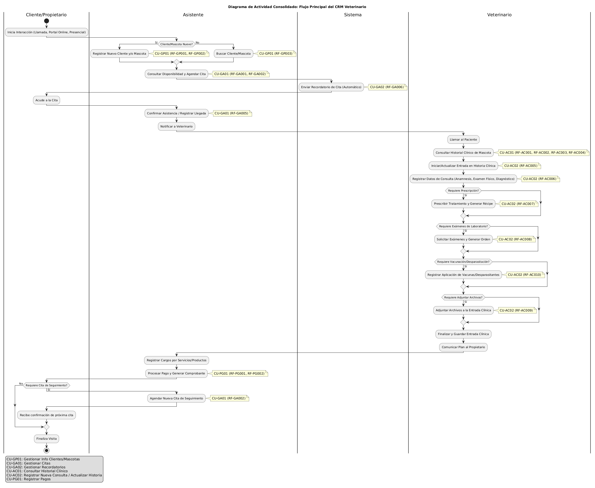

---

# **VI Caso de uso**:

**Actores Principales del CRM (Reconfirmados):**

- **Asistente:** Encargado de la gestión de citas, registro de clientes y mascotas, facturación y comunicación inicial.
- **Veterinario:** Encargado de la atención clínica, registro de diagnósticos, tratamientos, prescripciones y seguimiento.
- **Cliente/Propietario de Mascotas:** Propietario de la mascota que interactúa con el sistema para ciertas funciones (ej. portal de citas, gestión de su información y la de sus mascotas, consulta de historial de pagos).
- **Administrador/Gerente:** Responsable de la gestión de personal, configuración de servicios, reportes financieros y supervisión general.
- **Sistema:** Realiza acciones automáticas (ej. envío de recordatorios).

---

### **Módulo: Gestión de Pacientes (Clientes y Mascotas)**

**CU-GP01: Gestionar Información de Clientes y Mascotas**

- **Actores Principales:** Asistente, Veterinario, Cliente/Propietario de Mascotas
- **Descripción:** Permite al personal del consultorio y a los propios Clientes/Propietarios (para su información y la de sus mascotas) crear nuevos registros, así como buscar, visualizar y actualizar la información existente.
- **Flujo Principal:**
  1.  El actor (Asistente, Veterinario o Cliente/Propietario) inicia la gestión.
  2.  El Sistema presenta opciones según el actor:
      - **Asistente/Veterinario:**
        - Iniciar registro de Nuevo Cliente (invoca RF-GP001).
        - Iniciar registro de Nueva Mascota (asociada a un cliente existente) (invoca RF-GP002).
        - Buscar Cliente y/o Mascota (invoca RF-GP003) para luego visualizar/actualizar (invoca RF-GP004, RF-GP005).
      - **Cliente/Propietario de Mascotas (vía portal):**
        - Registrarse como Nuevo Cliente (si el sistema lo permite directamente) (invoca RF-GP001).
        - Visualizar/Actualizar sus Datos Personales (invoca RF-GP007).
        - Registrar Nueva Mascota (asociada a su perfil) (invoca RF-GP002).
        - Visualizar/Actualizar Datos de sus Mascotas (invoca RF-GP006).
  3.  **Si se registra nuevo cliente (RF-GP001):**
      a. El Actor (Asistente o Cliente/Propietario) ingresa los datos del cliente en el formulario provisto.
      b. El Sistema valida los datos y guarda el cliente.
      c. Si es el Asistente, el Sistema permite asociar mascotas. Si es el Cliente/Propietario, puede proceder a registrar sus mascotas.
  4.  **Si se registra nueva mascota (RF-GP002):**
      a. El Actor (Asistente, Veterinario o Cliente/Propietario) selecciona un cliente existente (si aplica Asistente/Veterinario) o la mascota se asocia automáticamente al perfil del Cliente/Propietario.
      b. El Actor ingresa los datos de la mascota en el formulario provisto.
      c. El Sistema valida los datos y guarda la mascota, vinculándola al cliente.
  5.  **Si se busca cliente/mascota (Asistente/Veterinario) (RF-GP003):**
      a. El Actor ingresa criterios de búsqueda.
      b. El Sistema muestra los resultados.
      c. El Actor selecciona un cliente/mascota de la lista.
  6.  **Si se visualiza/actualiza cliente (Asistente/Veterinario) (RF-GP004):**
      a. Tras seleccionar un cliente, el Sistema muestra sus datos.
      b. El Actor puede modificar los datos y el Sistema guarda los cambios.
      d. El Sistema muestra las mascotas asociadas al cliente.
  7.  **Si se visualiza/actualiza mascota (Asistente/Veterinario) (RF-GP005):**
      a. Tras seleccionar una mascota, el Sistema muestra sus datos generales.
      b. El Actor puede modificar los datos y el Sistema guarda los cambios.
      d. El Sistema muestra información del dueño.
  8.  **Si el Cliente/Propietario visualiza/actualiza sus datos personales (RF-GP007):**
      a. El Cliente/Propietario accede a su perfil. El Sistema muestra sus datos.
      b. El Cliente/Propietario modifica sus datos. El Sistema guarda los cambios.
  9.  **Si el Cliente/Propietario visualiza/actualiza datos de su mascota (RF-GP006):**
      a. El Cliente/Propietario selecciona una de sus mascotas. El Sistema muestra sus datos.
      b. El Cliente/Propietario modifica los datos. El Sistema guarda los cambios.
      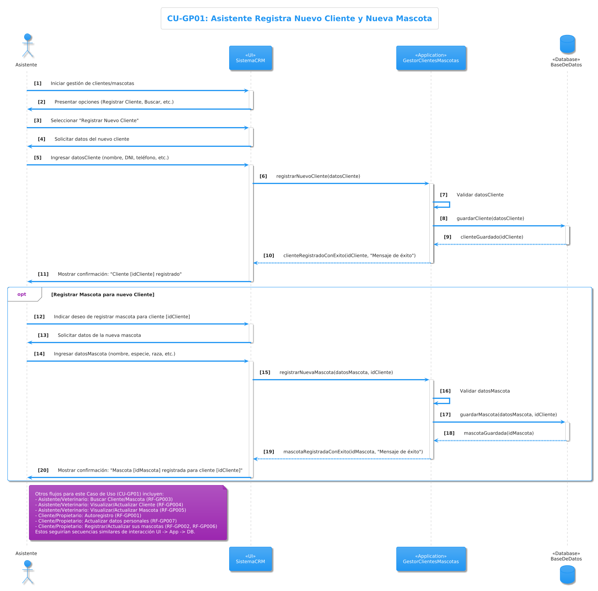

---

### **Módulo: Gestión de Agenda y Citas**

**CU-GA01: Gestionar Citas**

- **Actores Principales:** Asistente, Cliente/Propietario de Mascotas, Veterinario
- **Descripción:** Permite al Asistente y al Cliente/Propietario (a través de un portal) consultar disponibilidad, agendar, reprogramar y cancelar citas. Permite al personal (Asistente, Veterinario) consultar la agenda y confirmar asistencias.
- **Flujo Principal :**

  1.  El actor (Asistente o Cliente/Propietario) inicia la gestión de citas. El Veterinario puede iniciarla para consultar la agenda.
  2.  **Para consultar disponibilidad (RF-GA001):**
      a. El Actor (Asistente/Cliente/Propietario) accede a la función.
      b. El Sistema muestra una vista de calendario con horarios disponibles/ocupados, filtrable por veterinario.
  3.  **Para agendar nueva cita (RF-GA002):**
      a. El Actor (Asistente/Cliente/Propietario) selecciona mascota (previamente registrada o la registra en el flujo si es necesario - ver CU-GP01), veterinario (si aplica), fecha/hora disponible y motivo.
      b. El Sistema registra la cita, marca el horario como ocupado y (opcionalmente) envía confirmación al Cliente/Propietario.
  4.  **Para reprogramar cita (RF-GA003):**
      a. El Actor (Asistente/Cliente/Propietario) busca y selecciona una cita existente (Cliente/Propietario solo las suyas).
      b. El Actor elige una nueva fecha/hora disponible.
      c. El Sistema actualiza la cita, mueve el bloqueo horario y (opcionalmente) envía notificación al Cliente/Propietario.
  5.  **Para cancelar cita (RF-GA004):**
      a. El Actor (Asistente/Cliente/Propietario) busca y selecciona una cita existente (Cliente/Propietario solo las suyas).
      b. El Sistema marca la cita como cancelada, libera el horario y (opcionalmente) envía notificación al Cliente/Propietario.
  6.  **Para consultar agenda (Vista Staff - Asistente/Veterinario) (RF-GA005):**
      a. El Actor (Asistente/Veterinario) accede a la agenda.
      b. El Sistema muestra el calendario con todas las citas (filtrable por veterinario), mostrando detalles clave (hora, mascota, cliente, motivo).
      c. El Asistente puede usar esta vista para confirmar la asistencia del cliente a una cita.
      

**CU-GA02: Gestionar Recordatorios de Citas**

- **Actor Principal:** Sistema, Asistente
- **Descripción:** El Sistema se encarga de enviar recordatorios automáticos de citas, o permite al Asistente gestionarlos.
- **Flujo Principal (RF-GA006):**
  1.  El Sistema, basado en configuraciones (canal de envío, antelación), identifica citas próximas.
  2.  El Sistema envía recordatorios a los Clientes/Propietarios con los detalles de la cita.
  3.  (Opcional) El recordatorio incluye enlaces para que el Cliente/Propietario pueda confirmar o solicitar cancelación/reprogramación (invocando partes de CU-GA01).
  4.  (Alternativa) El Asistente puede revisar una lista de recordatorios pendientes generada por el sistema y gestionarlos manualmente (ej. llamada telefónica).
      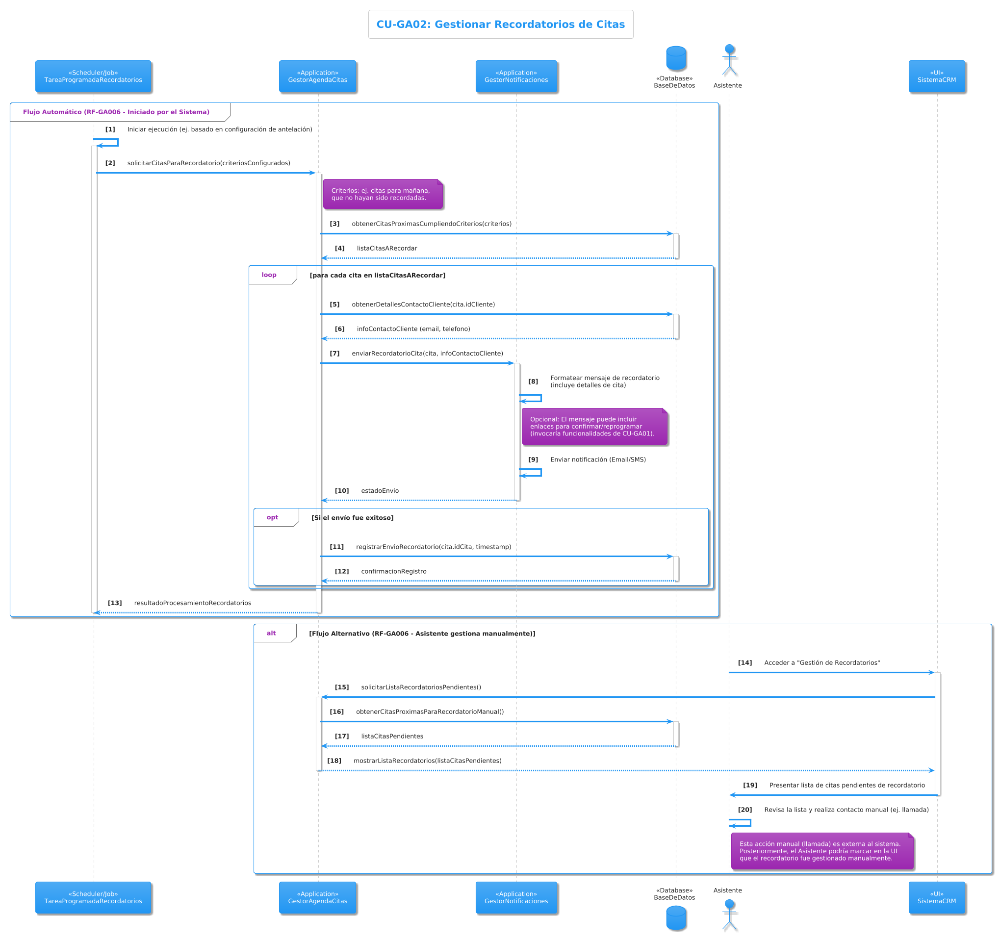

---

### **Módulo: Atención Clínica (Historia Clínica Electrónica)**

**CU-AC01: Consultar Historial Clínico de Mascota**

- **Actores Principales:** Veterinario, Asistente (con vista potencialmente limitada)
- **Descripción:** Permite al Veterinario (y Asistente) acceder y revisar toda la información médica registrada para una mascota, incluyendo resúmenes, archivos adjuntos y registros específicos de vacunación/desparasitación.
- **Flujo Principal :**

  1.  El Actor (Veterinario/Asistente) selecciona una mascota (puede heredar de CU-GP01 o una cita).
  2.  **Para visualizar historial completo (RF-AC001):**
      a. El Sistema muestra las entradas del historial en orden cronológico (o configurable), con datos clave (fecha, motivo, diagnóstico, veterinario).
      b. El Actor puede expandir una entrada para ver todos sus detalles (anamnesis, examen, tratamientos, notas, etc.).
  3.  **Para visualizar resumen de alergias y datos relevantes (RF-AC002):**
      a. El Sistema muestra de forma destacada alergias conocidas y datos básicos de la mascota (especie, raza, sexo, edad/fecha de nacimiento, último peso registrado).
  4.  **Para visualizar archivos adjuntos (RF-AC003):**
      a. Para cada entrada del historial, o en una sección dedicada, el Sistema lista los archivos adjuntos.
      b. El Actor puede visualizar o descargar los archivos. Se muestra descripción/etiqueta.
  5.  **Para consultar registros específicos de vacunación y desparasitación (RF-AC004):**
      a. El Actor utiliza filtros o accede a una sección específica para ver solo eventos de vacunación o desparasitación.
      b. El Sistema muestra detalles relevantes para cada tipo de evento (fecha, producto, lote, próxima dosis, etc.).
      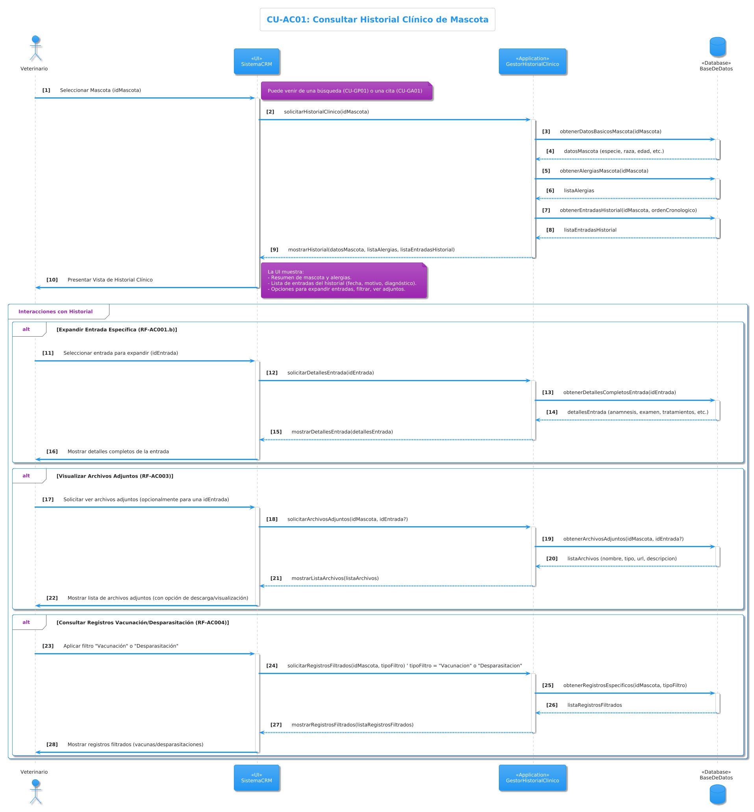

**CU-AC02: Registrar Nueva Consulta / Actualizar Historia Clínica**

- **Actor Principal:** Veterinario
- **Descripción:** Permite al Veterinario crear una nueva entrada en la historia clínica durante una consulta, o actualizar una existente (bajo condiciones). Incluye registro de hallazgos, diagnósticos, tratamientos, solicitud de exámenes, aplicación de vacunas/desparasitantes y adjuntar archivos.
- **Flujo Principal :**
  1.  El Veterinario inicia una nueva entrada de historial clínico para una mascota seleccionada (invoca RF-AC005). La fecha/hora se autocompletan (editables), y se asocia al veterinario logueado.
  2.  **Registrar datos de la consulta (invoca RF-AC006):**
      a. El Sistema provee campos para Peso, Temperatura, Motivo de consulta, Anamnesis, Hallazgos del examen físico, Diagnóstico(s) (con opción de catálogo), Plan de tratamiento, Notas adicionales.
      b. El Veterinario ingresa la información correspondiente.
  3.  **Prescribir tratamiento (Generar Récipe) (invoca RF-AC007):**
      a. Dentro de la entrada, el Veterinario añade uno o más medicamentos con detalles (nombre, dosis, vía, frecuencia, duración; opcionalmente desde catálogo).
      b. Las prescripciones se guardan como parte de la entrada del historial.
      c. El Sistema permite generar un documento de récipe (PDF) con todos los datos necesarios.
  4.  **Solicitar exámenes de laboratorio (invoca RF-AC008):**
      a. Dentro de la entrada, el Veterinario selecciona/ingresa los exámenes requeridos (opcionalmente desde catálogo).
      b. Las solicitudes se guardan como parte de la entrada del historial.
      c. El Sistema permite generar una orden de exámenes (PDF) con todos los datos necesarios.
  5.  **Adjuntar archivos a la entrada clínica (invoca RF-AC009):**
      a. El Veterinario carga uno o más archivos digitales (PDF, JPG, DICOM, etc.) con descripciones/etiquetas.
      b. Los archivos se vinculan a la entrada específica del historial.
  6.  **Registrar aplicación de vacunas y desparasitantes (invoca RF-AC010):**
      a. El Veterinario registra detalles de la vacuna/desparasitante aplicado (nombre, lote, próxima fecha, etc.).
      b. Esta información se guarda en la entrada del historial clínico y es visible en la consulta de registros específicos (RF-AC004).
  7.  El Veterinario guarda la entrada completa. El Sistema la añade al historial de la mascota.
  8.  **Editar entrada de historial clínico reciente (invoca RF-AC011) (Flujo Alternativo/Posterior):**
      a. Dentro de un período configurable (ej. 24h), el Veterinario puede seleccionar y modificar una entrada reciente.
      b. El Sistema registra cualquier modificación en una bitácora de auditoría (quién, qué, cuándo). Campos críticos pueden tener restricciones adicionales.
      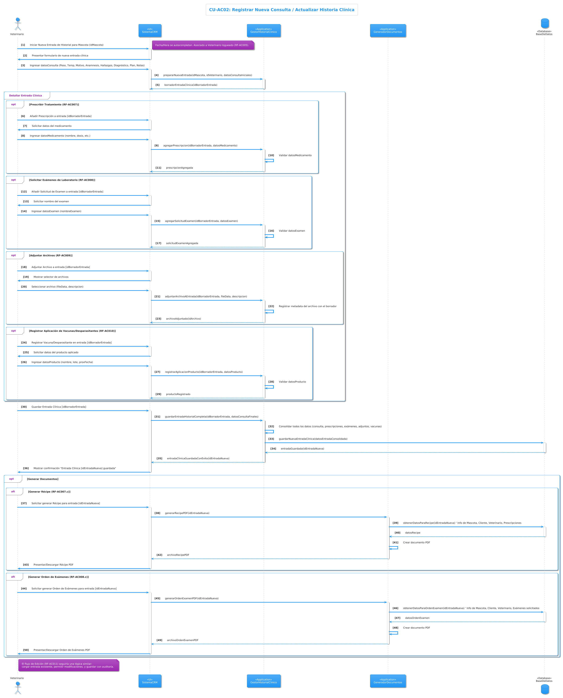

---

### **Módulo: Gestión de Recursos Humanos y Servicios Internos**

**CU-RH01: Gestionar Personal de la Clínica**

- **Actor Principal:** Administrador/Gerente
- **Descripción:** Permite al Administrador/Gerente registrar, actualizar y gestionar la información del personal de la clínica, incluyendo sus roles y estado.
- **Flujo Principal :**

  1.  El Administrador/Gerente accede a la sección de gestión de personal.
  2.  **Para registrar nuevo empleado (invoca RF-RH001):**
      a. El Sistema presenta un formulario para datos del empleado.
      b. El Administrador/Gerente ingresa los datos (nombre, DNI, rol, etc.).
      c. El Sistema valida y guarda el nuevo empleado.
  3.  **Para visualizar y actualizar datos de empleado (invoca RF-RH002):**
      a. El Administrador/Gerente busca y selecciona un empleado.
      b. El Sistema muestra la información del empleado.
      c. El Administrador/Gerente puede modificar los datos. El Sistema guarda los cambios.
  4.  **Para asignar/modificar rol de empleado (invoca RF-RH003):**
      a. El Administrador/Gerente selecciona un empleado.
      b. El Sistema permite modificar los roles asignados (ej. Veterinario, Asistente).
      c. El Sistema actualiza los permisos de acceso del empleado según su nuevo rol.
  5.  **Para desactivar/activar empleado (invoca RF-RH004):**
      a. El Administrador/Gerente selecciona un empleado.
      b. El Sistema permite cambiar el estado del empleado a "activo" o "inactivo", afectando su acceso.
      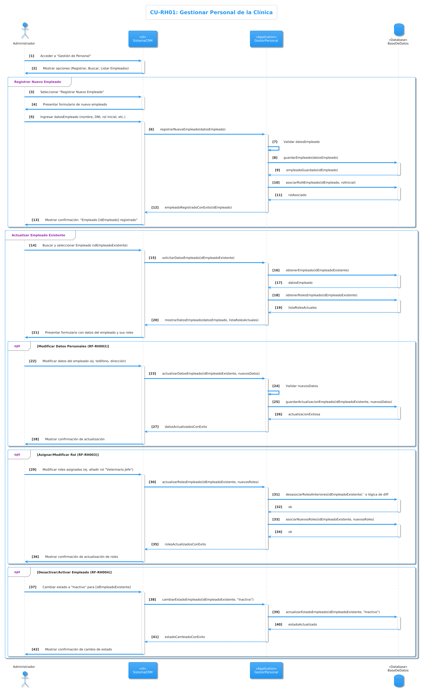

**CU-RH02: Gestionar Turnos y Guardias**

- **Actores Principales:** Administrador/Gerente, Veterinario, Asistente
- **Descripción:** Permite al Administrador/Gerente planificar y asignar turnos/guardias. Permite al personal consultar sus horarios.
- **Flujo Principal :**

  1.  El Actor (Administrador/Gerente, Veterinario, Asistente) accede a la gestión de turnos.
  2.  **Para crear/modificar tipo de turno (Administrador/Gerente) (invoca RF-RH005):**
      a. El Sistema permite definir/modificar nombre, hora de inicio y fin para cada tipo de turno.
  3.  **Para asignar turno a empleado (Administrador/Gerente) (invoca RF-RH006):**
      a. El Administrador/Gerente selecciona un empleado, un tipo de turno y un período/días específicos.
      b. El Sistema valida posibles conflictos y guarda las asignaciones.
  4.  **Para consultar horario de empleado (invoca RF-RH007):**
      a. El Empleado (Veterinario/Asistente) consulta su propio horario asignado.
      b. El Administrador/Gerente puede consultar el horario de cualquier empleado.
      c. El Sistema muestra una vista de calendario con los turnos.
  5.  **Para consultar disponibilidad de personal (Administrador/Gerente) (invoca RF-RH008):**
      a. El Sistema muestra una vista consolidada de los turnos de todo el personal, filtrable por rol o fecha, para facilitar la planificación.
      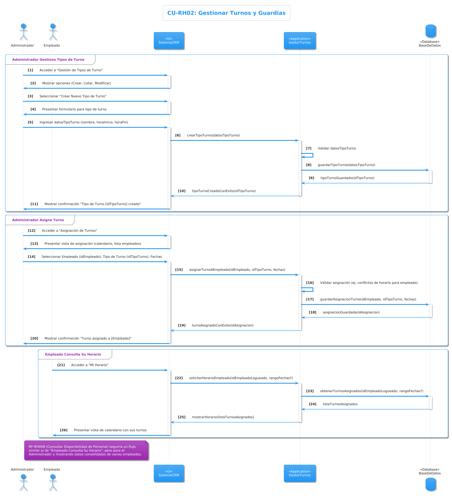

**CU-RH03: Gestionar Servicios de la Clínica**

- **Actor Principal:** Administrador/Gerente
- **Descripción:** Permite al Administrador/Gerente definir y gestionar los tipos de servicios especiales o complementarios que ofrece la clínica (ej. "Farmacia", "Hospedaje") y asignar personal responsable.
- **Flujo Principal :**
  1.  El Administrador/Gerente accede a la sección de gestión de servicios internos.
  2.  **Para crear/modificar tipo de servicio interno (invoca RF-RH009):**
      a. El Sistema permite crear un nombre, una descripción y activar/desactivar cada servicio.
  3.  **Para asignar personal a servicio interno (invoca RF-RH010):**
      a. El Administrador/Gerente selecciona un servicio y uno o más empleados para asociarlos como responsables o participantes.
      b. El Sistema guarda esta asociación.
  4.  **Para consultar servicios internos activos (invoca RF-RH011):**
      a. El Sistema muestra una lista de todos los servicios internos definidos con su estado (activo/inactivo) y descripción.
      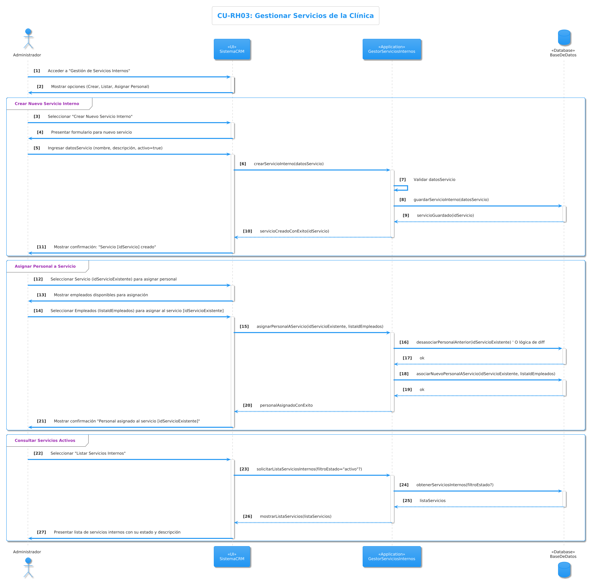

---

### **Módulo: Gestión de Pagos y Facturación**

**CU-PG01: Registrar Pagos**

- **Actor Principal:** Asistente
- **Descripción:** Permite al Asistente registrar los pagos recibidos de los clientes por servicios o productos y generar los comprobantes correspondientes.
- **Flujo Principal :**

  1.  El Asistente inicia el proceso de registro de un pago, usualmente desde el perfil del cliente o una consulta/venta.
  2.  **Para registrar pago de servicio/producto (invoca RF-PG001):**
      a. El Asistente selecciona el cliente y/o mascota, y los servicios o productos a pagar (idealmente vinculados a una orden o consulta).
      b. El Asistente ingresa el monto pagado y selecciona el método de pago (efectivo, tarjeta, etc.).
      c. El Sistema valida que el monto sea consistente y registra el pago en la base de datos.
  3.  **Para generar comprobante de pago (invoca RF-PG002):**
      a. Inmediatamente después de registrar el pago, o al seleccionarlo posteriormente, el Sistema permite generar un comprobante/recibo (PDF imprimible) con los detalles del pago.
      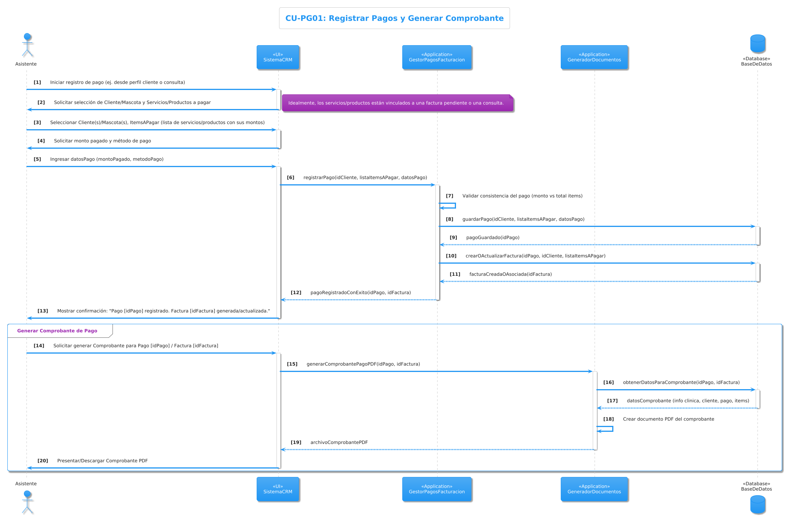

**CU-PG02: Consultar Historial de Pagos**

- **Actores Principales:** Asistente, Administrador/Gerente, Cliente/Propietario de Mascotas
- **Descripción:** Permite al personal de la clínica y a los Clientes/Propietarios (para sus propios registros) consultar el historial de pagos y facturas.
- **Flujo Principal :**

  1.  El Actor (Asistente, Administrador/Gerente, o Cliente/Propietario) inicia la consulta del historial de pagos.
  2.  **Para consultar pagos por cliente/mascota (Staff) (invoca RF-PG003):**
      a. El Asistente o Administrador/Gerente busca pagos asociados a un cliente o mascota específico.
      b. El Sistema muestra una lista de los pagos con detalles (fecha, monto, concepto, método).
  3.  **Para consultar pagos por fecha/servicio (Staff) (invoca RF-PG004):**
      a. El Administrador/Gerente filtra los pagos por un rango de fechas o por tipo de servicio/producto.
      b. El Sistema muestra los resultados correspondientes.
  4.  **Para consultar propio historial de pagos y facturas (Cliente/Propietario) (invoca RF-PG006):**
      a. El Cliente/Propietario accede a su sección de historial de pagos en el portal.
      b. El Sistema muestra una lista de sus pagos realizados, con detalles.
      c. El Sistema permite al Cliente/Propietario visualizar y/o descargar las facturas o comprobantes asociados.
      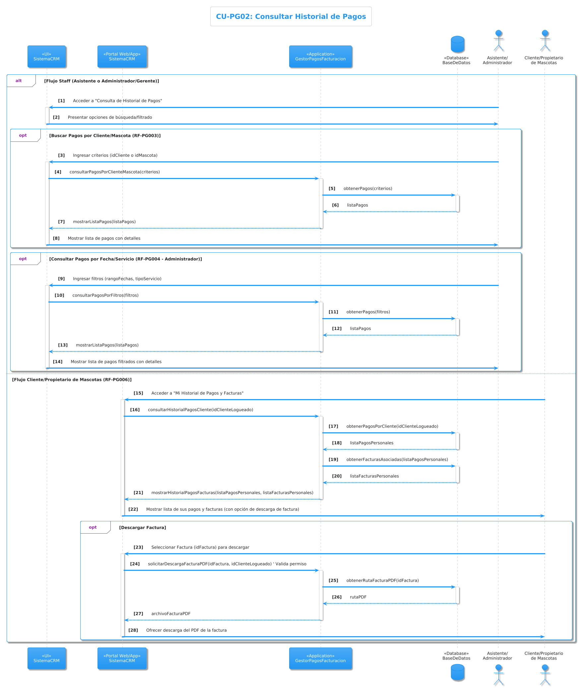

**CU-PG03: Generar Reportes Financieros**

- **Actor Principal:** Administrador/Gerente
- **Descripción:** Permite al Administrador/Gerente generar reportes resumidos de los ingresos y otras métricas financieras de la clínica.
- **Flujo Principal (invoca RF-PG005):**
  1.  El Administrador/Gerente accede a la sección de reportes financieros.
  2.  El Administrador/Gerente selecciona el tipo de reporte (ej. ingresos) y el período deseado (diario, semanal, mensual, anual).
  3.  El Sistema procesa los datos y genera el reporte, mostrando el total de ingresos y, opcionalmente, desgloses por tipo de servicio/producto o método de pago.
  4.  El reporte debe ser exportable (ej. CSV, PDF) para análisis externo o archivo.
      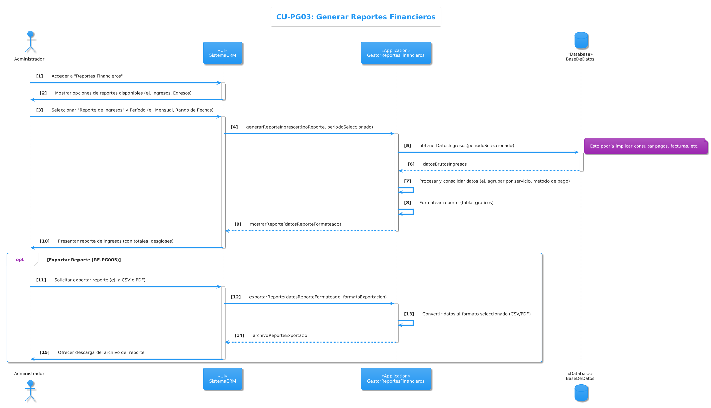

# **VII Modelo de Dominio y Diagrama de Clases**

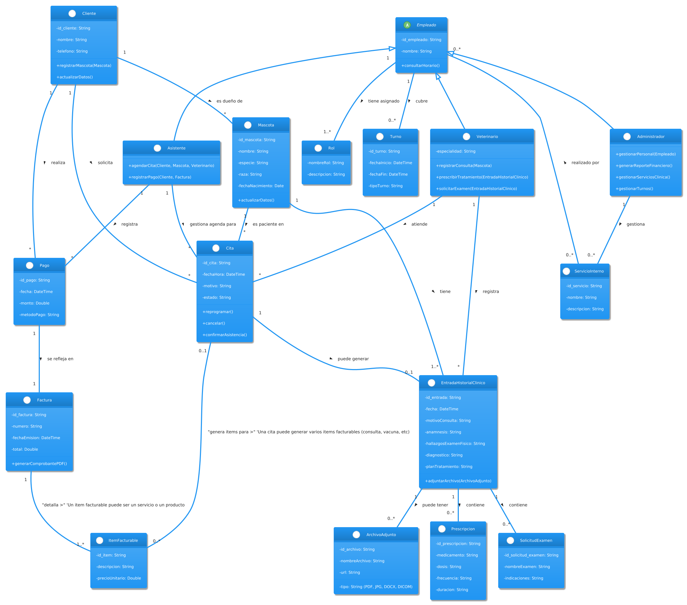
