# Ingeniería de Software - CRM Veterinario

## Introducción

El proyecto consiste en el desarrollo de un módulo de Atención Clínica para un sistema CRM (Customer Relationship Management) destinado a consultorios veterinarios. El objetivo principal es optimizar el flujo de trabajo del personal de la clínica (veterinarios, asistentes, administradores) y mejorar la experiencia del cliente (dueño de la mascota).

El sistema aborda la gestión integral de la información del paciente (mascota) y su dueño, la administración de citas, el registro detallado de la historia clínica electrónica, la gestión de recursos humanos, el registro de pagos y la generación de reportes.

## Requisitos Funcionales

A continuación se detallan los requisitos funcionales del sistema, agrupados por módulo.

### **Módulo: Gestión de Pacientes (Clientes y Mascotas)**

Este módulo se encarga del registro y administración de la información de los dueños y sus mascotas.

**CU-GP01: Gestionar Información de Clientes y Mascotas**

- **Actores Principales:** Asistente, Veterinario, Cliente/Propietario de Mascotas.
- **Descripción:** Este caso de uso permite al personal del consultorio y a los propios Clientes/Propietarios (para su información y la de sus mascotas) crear nuevos registros, así como buscar, visualizar y actualizar la información existente.
- **RFs Asociados:**

  - **RF-GP001: Registrar Nuevo Cliente**

    - Descripción: El Asistente o el Cliente/Propietario de Mascota podrán registrar la información de un nuevo dueño de mascota en el sistema.
    - Prioridad: Alta
    - Criterios de Aceptación:
      - El sistema debe mostrar un formulario para el ingreso de datos del cliente (ej. nombre, apellido, DNI, teléfono, email, dirección).
      - El sistema debe validar los campos obligatorios (ej. nombre, teléfono).
      - Al guardar, el nuevo cliente debe crearse en la base de datos.
      - El sistema debe permitir asociar una o más mascotas a este cliente durante el registro o posteriormente.

  - **RF-GP002: Registrar Nueva Mascota**

    - Descripción: El Asistente, Cliente/Propietario de Mascota o Veterinario podrá registrar la información de una nueva mascota, asociándola a un cliente existente (o al propio cliente si es él quien realiza la acción).
    - Prioridad: Alta
    - Criterios de Aceptación:
      - El sistema debe permitir seleccionar un cliente existente al cual asociar la mascota (si registra el Asistente/Veterinario) o asociarla automáticamente al perfil del Cliente/Propietario (si es él quien registra).
      - El sistema debe mostrar un formulario para el ingreso de datos de la mascota (ej. nombre, especie, raza, sexo, fecha de nacimiento, número de chip, color, señas particulares, foto).
      - El sistema debe validar los campos obligatorios (ej. nombre de mascota, especie).
      - Al guardar, la nueva mascota debe crearse y vincularse correctamente al cliente.

  - **RF-GP003: Buscar Cliente y/o Mascota**

    - Descripción: El Asistente o Veterinario podrá buscar clientes y/o mascotas existentes en el sistema utilizando diversos criterios.
    - Prioridad: Alta
    - Criterios de Aceptación:
      - El sistema debe proveer campos de búsqueda para clientes (ej. por nombre, DNI, teléfono).
      - El sistema debe proveer campos de búsqueda para mascotas (ej. por nombre, número de chip, nombre del dueño).
      - Los resultados de la búsqueda deben mostrar información clave para identificar al cliente/mascota.
      - El usuario debe poder seleccionar un cliente/mascota de los resultados para ver su información detallada.

  - **RF-GP004: Visualizar y Actualizar Datos de Cliente (Staff)**

    - Descripción: El Asistente o Veterinario podrá ver y modificar la información de un cliente existente.
    - Prioridad: Alta
    - Criterios de Aceptación:
      - Tras seleccionar un cliente, el sistema debe mostrar toda su información registrada.
      - El sistema debe permitir la edición de los campos del cliente.
      - El sistema debe guardar los cambios realizados en la base de datos.
      - El sistema debe mostrar la lista de mascotas asociadas al cliente, con acceso a sus perfiles.

  - **RF-GP005: Visualizar y Actualizar Datos de Mascota (Staff)**

    - Descripción: El Asistente o Veterinario podrá ver y modificar la información general de una mascota existente.
    - Prioridad: Alta
    - Criterios de Aceptación:
      - Tras seleccionar una mascota, el sistema debe mostrar toda su información general registrada (no la historia clínica detallada, que es parte de otro CU).
      - El sistema debe permitir la edición de los campos de la mascota.
      - El sistema debe guardar los cambios realizados en la base de datos.
      - El sistema debe mostrar la información del cliente dueño de la mascota.

  - **RF-GP006: Visualizar y Actualizar Datos de Mascota (Cliente/Propietario)**

    - Descripción: El Cliente/Propietario de Mascota podrá ver y modificar la información de sus propias mascotas registradas.
    - Prioridad: Alta
    - Criterios de Aceptación:
      - Tras seleccionar una de sus mascotas, el sistema debe mostrar toda su información general registrada (no la historia clínica detallada).
      - El sistema debe permitir la edición de los campos de la mascota por parte de su dueño.
      - El sistema debe guardar los cambios realizados en la base de datos.

  - **RF-GP007: Visualizar y Actualizar Datos Personales (Cliente/Propietario)**
    - Descripción: El Cliente/Propietario de Mascota podrá ver y modificar la información de su propio perfil.
    - Prioridad: Alta
    - Criterios de Aceptación:
      - Tras acceder a su perfil, el sistema debe mostrar al Cliente/Propietario toda su información personal registrada.
      - El sistema debe permitir la edición de sus propios campos.
      - El sistema debe guardar los cambios realizados en la base de datos.

### **Módulo: Gestión de Agenda y Citas**

Este módulo maneja la programación, consulta y seguimiento de las citas.

**CU-GA01: Gestionar Citas**

- **Actores Principales:** Asistente, Cliente/Propietario de Mascotas (para acciones online), Veterinario (para consulta de agenda)
- **Descripción:** Permite al Asistente (y potencialmente al Cliente/Propietario a través de un portal) agendar, reprogramar, cancelar y consultar citas. Permite al personal consultar la agenda y confirmar asistencias.
- **RFs Asociados:**

  - **RF-GA001: Consultar Disponibilidad Horaria**

    - Descripción: El Asistente o Cliente/Propietario de Mascota podrá consultar los horarios disponibles en la agenda del consultorio o de un veterinario específico.
    - Prioridad: Alta
    - Criterios de Aceptación:
      - El sistema debe mostrar una vista de calendario (diaria, semanal, mensual).
      - El sistema debe permitir filtrar la disponibilidad por veterinario (si hay más de uno).
      - Los bloques horarios ocupados deben estar claramente diferenciados de los disponibles.

  - **RF-GA002: Agendar Nueva Cita**

    - Descripción: El Asistente o Cliente/Propietario de Mascota podrá reservar una nueva cita para una mascota, seleccionando un horario disponible.
    - Prioridad: Alta
    - Criterios de Aceptación:
      - El sistema debe permitir seleccionar una mascota existente (o enlazar con CU-GP01/RF-GP002 si es nueva o el cliente gestiona sus mascotas).
      - El sistema debe permitir seleccionar un veterinario (si aplica), fecha y hora de la cita de entre los disponibles.
      - El sistema debe permitir ingresar el motivo de la cita.
      - Al confirmar, la cita debe registrarse y el horario debe marcarse como ocupado.
      - (Opcional) El sistema debe poder enviar una confirmación de cita al cliente (email/SMS).

  - **RF-GA003: Reprogramar Cita**

    - Descripción: El Asistente o Cliente/Propietario de Mascota podrá cambiar la fecha y/o hora de una cita existente (el cliente solo las suyas).
    - Prioridad: Media
    - Criterios de Aceptación:
      - El sistema debe permitir buscar y seleccionar una cita existente.
      - El sistema debe permitir elegir una nueva fecha/hora disponible.
      - Al confirmar, la cita original debe actualizarse y el bloqueo horario debe moverse.
      - (Opcional) El sistema debe poder enviar una notificación de reprogramación al cliente.

  - **RF-GA004: Cancelar Cita**

    - Descripción: El Asistente o Cliente/Propietario de Mascota podrá cancelar una cita agendada (el cliente solo las suyas).
    - Prioridad: Media
    - Criterios de Aceptación:
      - El sistema debe permitir buscar y seleccionar una cita existente.
      - Al confirmar la cancelación, la cita debe marcarse como cancelada y el horario liberarse.
      - (Opcional) El sistema debe poder enviar una notificación de cancelación al cliente.

  - **RF-GA005: Consultar Agenda (Vista Staff)**
    - Descripción: El Asistente o Veterinario podrá visualizar la agenda de citas programadas.
    - Prioridad: Alta
    - Criterios de Aceptación:
      - El sistema debe mostrar una vista de calendario con todas las citas (diaria, semanal, mensual).
      - Debe ser posible filtrar por veterinario.
      - Cada cita en la agenda debe mostrar información clave (hora, mascota, cliente, motivo).
      - El sistema debe permitir al Asistente confirmar la asistencia del cliente a una cita.

**CU-GA02: Gestionar Recordatorios de Citas**

- **Actor Principal:** Sistema, Asistente
- **Descripción:** El sistema se encarga de enviar recordatorios automáticos de citas, o permite al Asistente gestionarlos.
- **RFs Asociados:**

  - **RF-GA006: Enviar Recordatorio Automático de Cita**
    - Descripción: El sistema enviará recordatorios automáticos a los clientes sobre sus próximas citas.
    - Prioridad: Alta
    - Criterios de Aceptación:
      - El sistema debe permitir configurar el canal de envío (ej. email, SMS).
      - El sistema debe permitir configurar la antelación del recordatorio (ej. 24 horas antes).
      - El recordatorio debe incluir los detalles de la cita (fecha, hora, mascota).
      - (Opcional) El recordatorio puede incluir un enlace para confirmar o cancelar la cita (enlazando con RF-GA003, RF-GA004).

### **Módulo: Atención Clínica (Historia Clínica Electrónica)**

Este módulo es el núcleo para el Veterinario, donde se gestiona toda la actividad médica.

**CU-AC01: Consultar Historial Clínico de Mascota**

- **Actores Principales:** Veterinario, Asistente (potencialmente con vista limitada)
- **Descripción:** Permite al Veterinario (y Asistente) acceder y revisar toda la información médica registrada para una mascota.
- **RFs Asociados:**
  (Hereda RF-GP003 para la búsqueda inicial de la mascota si no se llega desde una cita)

  - **RF-AC001: Visualizar Historial Clínico Completo** (Corresponde a RF002, RF003 del original)

    - Descripción: El Veterinario podrá ver todas las entradas previas del historial clínico de la mascota seleccionada.
    - Prioridad: Alta
    - Criterios de Aceptación:
      - El sistema debe mostrar las entradas del historial en orden cronológico inverso (o permitir ordenamiento).
      - Cada entrada debe mostrar como mínimo: fecha, motivo de consulta, diagnóstico(s) principal(es), y veterinario que atendió.
      - El usuario debe poder expandir una entrada para ver todos sus detalles (anamnesis, examen, tratamientos, notas, etc.).

  - **RF-AC002: Visualizar Resumen de Alergias y Datos Relevantes** (Corresponde a RF005, RF006 del original)

    - Descripción: El sistema mostrará información crucial de la mascota de forma destacada al consultar su historial.
    - Prioridad: Alta
    - Criterios de Aceptación:
      - El sistema debe mostrar claramente las alergias conocidas de la mascota, si existen.
      - El sistema debe mostrar datos básicos de la mascota (especie, raza, sexo, edad/fecha de nacimiento, último peso registrado).

  - **RF-AC003: Visualizar Archivos Adjuntos del Historial** (Corresponde a RF004 del original)

    - Descripción: El Veterinario podrá acceder a los archivos digitales asociados a las entradas del historial clínico.
    - Prioridad: Alta
    - Criterios de Aceptación:
      - Para cada entrada del historial, el sistema debe listar los archivos adjuntos.
      - El sistema debe permitir la visualización o descarga de estos archivos.
      - Se deben mostrar las descripciones o etiquetas de los archivos adjuntos.

  - **RF-AC004: Consultar Registros Específicos de Vacunación y Desparasitación** (Corresponde a RF011, RF012, RF014, RF015 del original)
    - Descripción: El Veterinario podrá filtrar o acceder a una vista específica del historial para ver únicamente los registros de vacunación y desparasitación.
    - Prioridad: Media
    - Criterios de Aceptación:
      - El sistema debe permitir filtrar el historial para mostrar solo eventos de vacunación.
      - Para cada vacuna: mostrar fecha, nombre de vacuna, lote, vencimiento, próxima revacunación.
      - El sistema debe permitir filtrar el historial para mostrar solo eventos de desparasitación.
      - Para cada desparasitación: mostrar fecha, producto, dosis, próxima desparasitación.

**CU-AC02: Registrar Nueva Consulta / Actualizar Historia Clínica**

- **Actor Principal:** Veterinario
- **Descripción:** Este caso de uso permite al Veterinario crear una nueva entrada en la historia clínica durante una consulta, o actualizar una existente (bajo ciertas condiciones). Incluye el registro de hallazgos, diagnósticos, tratamientos, solicitud de exámenes y adjuntar archivos.
- **RFs Asociados:**

  - **RF-AC005: Iniciar Nueva Entrada de Historial Clínico** (Parcialmente RF007, RF009 del original)

    - Descripción: El Veterinario podrá crear una nueva entrada en el historial clínico para la mascota en consulta.
    - Prioridad: Alta
    - Criterios de Aceptación:
      - El sistema debe permitir seleccionar la mascota (si no viene de una cita preseleccionada).
      - La fecha y hora de la consulta deben autocompletarse con la actual, pero ser editables.
      - La entrada debe asociarse al veterinario que está logueado.

  - **RF-AC006: Registrar Datos de la Consulta** (Corresponde a RF008 del original)

    - Descripción: El Veterinario podrá registrar toda la información clínica relevante de la consulta.
    - Prioridad: Alta
    - Criterios de Aceptación:
      - El sistema debe proveer campos para: Peso, Temperatura.
      - El sistema debe proveer campo para Motivo de la consulta (texto libre y/o selección predefinida).
      - El sistema debe proveer campo para Anamnesis (texto libre).
      - El sistema debe proveer campo para Hallazgos del examen físico (texto libre, opcionalmente estructurado por sistema).
      - El sistema debe proveer campo para Diagnóstico(s) (texto libre y/o selección de catálogo - ej. CIE-Vet como opcional RF023/RF027).
      - El sistema debe proveer campo para Plan de tratamiento (texto libre general).
      - El sistema debe proveer campo para Notas adicionales.
      - Al guardar, la nueva entrada se añade al historial de la mascota.

  - **RF-AC007: Prescribir Tratamiento (Generar Récipe)** (Corresponde a RF021, RF022, RF023, RF024, RF025 del original)

    - Descripción: Dentro de una consulta, el Veterinario podrá añadir prescripciones de medicamentos y generar un récipe.
    - Prioridad: Alta
    - Criterios de Aceptación:
      - El sistema debe permitir añadir uno o más medicamentos a la prescripción.
      - Para cada medicamento: registrar nombre, presentación/concentración, dosis, vía, frecuencia, duración.
      - (Opcional Medio) El sistema puede ofrecer un catálogo de medicamentos para autocompletar.
      - Las prescripciones deben quedar guardadas como parte de la entrada del historial clínico.
      - El sistema debe permitir generar un documento de récipe (PDF imprimible) con datos del consultorio, veterinario, dueño, mascota, fecha y medicamentos prescritos.

  - **RF-AC008: Solicitar Exámenes de Laboratorio** (Corresponde a RF026, RF027, RF028, RF029 del original)

    - Descripción: Dentro de una consulta, el Veterinario podrá solicitar exámenes de laboratorio y generar una orden.
    - Prioridad: Alta
    - Criterios de Aceptación:
      - El sistema debe permitir seleccionar o ingresar los exámenes solicitados.
      - (Opcional Medio) El sistema puede ofrecer un catálogo de exámenes disponibles.
      - Las solicitudes de exámenes deben quedar guardadas como parte de la entrada del historial clínico.
      - El sistema debe permitir generar una orden de exámenes (PDF imprimible) con datos del consultorio, veterinario, dueño, mascota, fecha y exámenes solicitados.

  - **RF-AC009: Adjuntar Archivos a la Entrada Clínica** (Corresponde a RF017, RF018, RF019, RF020 del original)

    - Descripción: Durante la creación o edición de una entrada clínica, el Veterinario podrá adjuntar archivos digitales.
    - Prioridad: Alta
    - Criterios de Aceptación:
      - El sistema debe permitir cargar uno o más archivos.
      - El sistema debe soportar formatos comunes (PDF, JPG, PNG, DOCX, DICOM).
      - Los archivos deben quedar vinculados a la entrada específica del historial.
      - El sistema debe permitir añadir una descripción/etiqueta a cada archivo.

  - **RF-AC010: Registrar Aplicación de Vacunas y Desparasitantes** (Corresponde a RF013, RF016 del original, si se hace durante una consulta)

    - Descripción: El Veterinario podrá registrar la aplicación de vacunas o desparasitantes como parte de la consulta.
    - Prioridad: Alta
    - Criterios de Aceptación:
      - El sistema debe permitir seleccionar/ingresar el nombre de la vacuna, lote, fecha de vencimiento del producto.
      - El sistema debe permitir calcular y/o registrar la próxima fecha de revacunación.
      - El sistema debe permitir seleccionar/ingresar el nombre del desparasitante, dosis.
      - El sistema debe permitir calcular y/o registrar la próxima fecha de desparasitación.
      - Esta información debe quedar registrada en la entrada del historial clínico y ser visible en la consulta de registros específicos (RF-AC004).

  - **RF-AC011: Editar Entrada de Historial Clínico Reciente** (Corresponde a RF010 del original)
    - Descripción: El Veterinario podrá modificar una entrada de historial clínico recientemente creada, con auditoría.
    - Prioridad: Media
    - Criterios de Aceptación:
      - El sistema debe permitir la edición de una entrada dentro de un período configurable (ej. 24h, antes del cierre diario).
      - Cualquier modificación debe registrarse en una bitácora de auditoría (quién, qué, cuándo).
      - Los campos críticos (ej. diagnóstico, prescripción) podrían tener restricciones adicionales o requerir justificación.

### **Módulo: Gestión de Recursos Humanos y Servicios Internos**

Este módulo se encarga del registro y administración del personal de la clínica, sus horarios y los servicios internos que ofrece el consultorio.

**CU-RH01: Gestionar Personal de la Clínica**

- **Actores Principales:** Administrador/Gerente
- **Descripción:** Permite al Administrador/Gerente registrar, actualizar y gestionar la información del personal de la clínica, incluyendo sus roles.
- **RFs Asociados:**

  - **RF-RH001: Registrar Nuevo Empleado**

    - Descripción: El Administrador/Gerente podrá registrar la información de un nuevo empleado en el sistema.
    - Prioridad: Alta
    - Criterios de Aceptación:
      - El sistema debe mostrar un formulario para el ingreso de datos del empleado (ej. nombre, apellido, DNI, teléfono, email, dirección, fecha de contratación).
      - El sistema debe validar los campos obligatorios (ej. nombre, DNI, rol).
      - Al guardar, el nuevo empleado debe crearse en la base de datos.
      - El sistema debe permitir asignar uno o más roles al empleado (ej. Veterinario, Asistente, Peluquero Canino, Limpieza, Administrativo).

  - **RF-RH002: Visualizar y Actualizar Datos de Empleado**

    - Descripción: El Administrador/Gerente podrá ver y modificar la información de un empleado existente.
    - Prioridad: Alta
    - Criterios de Aceptación:
      - Tras seleccionar un empleado, el sistema debe mostrar toda su información registrada.
      - El sistema debe permitir la edición de los campos del empleado.
      - El sistema debe guardar los cambios realizados en la base de datos.

  - **RF-RH003: Asignar/Modificar Rol de Empleado**

    - Descripción: El Administrador/Gerente podrá asignar o modificar los roles de un empleado.
    - Prioridad: Alta
    - Criterios de Aceptación:
      - El sistema debe permitir seleccionar uno o varios roles predefinidos para un empleado.
      - El sistema debe actualizar los permisos de acceso del empleado según su nuevo rol.

  - **RF-RH004: Desactivar/Activar Empleado**
    - Descripción: El Administrador/Gerente podrá desactivar temporal o permanentemente la cuenta de un empleado, impidiendo su acceso al sistema, o reactivarla.
    - Prioridad: Media
    - Criterios de Aceptación:
      - El sistema debe permitir cambiar el estado de un empleado a "activo" o "inactivo".
      - Los empleados inactivos no deben poder iniciar sesión.
      - El historial de acciones del empleado debe conservarse.

**CU-RH02: Gestionar Turnos y Guardias**

- **Actores Principales:** Administrador/Gerente, Veterinario, Asistente
- **Descripción:** Permite al Administrador/Gerente planificar y asignar turnos y guardias al personal, y al personal consultar sus horarios.
- **RFs Asociados:**

  - **RF-RH005: Crear/Modificar Turno**

    - Descripción: El Administrador/Gerente podrá definir y modificar los tipos de turnos y guardias (ej. "Turno Mañana", "Guardia Nocturna", "Descanso").
    - Prioridad: Alta
    - Criterios de Aceptación:
      - El sistema debe permitir definir un nombre, hora de inicio y fin para cada tipo de turno.
      - El sistema debe permitir asociar un turno a un día específico o a un rango de fechas.

  - **RF-RH006: Asignar Turno a Empleado**

    - Descripción: El Administrador/Gerente podrá asignar turnos y guardias a empleados específicos para un período determinado.
    - Prioridad: Alta
    - Criterios de Aceptación:
      - El sistema debe permitir seleccionar un empleado y asignarle uno o más turnos para días específicos.
      - El sistema debe mostrar posibles conflictos de horario al asignar turnos.
      - El sistema debe guardar las asignaciones de turnos.

  - **RF-RH007: Consultar Horario de Empleado**

    - Descripción: Cualquier empleado podrá consultar su propio horario de turnos y guardias asignados. El Administrador/Gerente podrá consultar el horario de cualquier empleado.
    - Prioridad: Alta
    - Criterios de Aceptación:
      - El sistema debe mostrar una vista de calendario con los turnos asignados al empleado.
      - Debe ser posible filtrar por semana o mes.

  - **RF-RH008: Consultar Disponibilidad de Personal**
    - Descripción: El Administrador/Gerente podrá consultar la disponibilidad general del personal para planificar turnos o asignar tareas.
    - Prioridad: Media
    - Criterios de Aceptación:
      - El sistema debe mostrar una vista consolidada de los turnos de todo el personal.
      - Debe ser posible filtrar por rol o por fecha.

**CU-RH03: Gestionar Servicios de la Clínica**

- **Actores Principales:** Administrador/Gerente
- **Descripción:** Permite al Administrador/Gerente definir y gestionar los tipos de servicios especiales o complementarios que ofrece la clínica, y asignar personal responsable.
- **RFs Asociados:**

  - **RF-RH009: Crear/Modificar Tipo de Servicio Interno**

    - Descripción: El Administrador/Gerente podrá definir nuevos tipos de servicios que la clínica ofrece (ej. "Servicio de Emergencia", "Farmacia", "Delivery de Medicamentos", "Atención a Domicilio", "Hospedaje").
    - Prioridad: Alta
    - Criterios de Aceptación:
      - El sistema debe permitir crear un nombre y una descripción para cada servicio.
      - El sistema debe permitir activar o desactivar un servicio.

  - **RF-RH010: Asignar Personal a Servicio Interno**

    - Descripción: El Administrador/Gerente podrá asignar personal específico como responsable o participante de un tipo de servicio interno.
    - Prioridad: Media
    - Criterios de Aceptación:
      - El sistema debe permitir seleccionar uno o más empleados para asociarlos a un tipo de servicio.
      - Esta asignación puede influir en la visibilidad de tareas o reportes relacionados con ese servicio.

  - **RF-RH011: Consultar Servicios Internos Activos**
    - Descripción: El Administrador/Gerente podrá consultar la lista de servicios internos que la clínica tiene definidos y activos.
    - Prioridad: Baja
    - Criterios de Aceptación:
      - El sistema debe mostrar una lista de todos los servicios internos con su estado (activo/inactivo) y descripción.

### **Módulo: Gestión de Pagos**

Este módulo se encarga del registro, consulta y reporte de los pagos recibidos por los servicios y productos de la clínica.

**CU-PG01: Registrar Pagos**

- **Actores Principales:** Asistente
- **Descripción:** Permite al Asistente registrar los pagos recibidos de los clientes por servicios o productos.
- **RFs Asociados:**

  - **RF-PG001: Registrar Pago de Servicio/Producto**

    - Descripción: El Asistente podrá registrar un pago recibido de un cliente, asociándolo a uno o varios servicios o productos.
    - Prioridad: Alta
    - Criterios de Aceptación:
      - El sistema debe permitir seleccionar el cliente y/o la mascota asociada al pago.
      - El sistema debe permitir seleccionar los servicios o productos por los cuales se realiza el pago (idealmente vinculados a una factura o consulta previa).
      - El sistema debe permitir ingresar el monto pagado.
      - El sistema debe permitir seleccionar el método de pago (ej. efectivo, tarjeta de crédito/débito, transferencia, cheque).
      - El sistema debe validar que el monto pagado sea consistente con el total a pagar (o registrar un saldo pendiente/a favor).
      - Al guardar, el pago debe registrarse en la base de datos.

  - **RF-PG002: Generar Nota de Pago**
    - Descripción: El sistema debe poder generar un comprobante o recibo de pago para el cliente.
    - Prioridad: Alta
    - Criterios de Aceptación:
      - El comprobante debe incluir detalles del consultorio, fecha, monto, método de pago, y los servicios/productos pagados.
      - El comprobante debe ser imprimible (ej. PDF).

**CU-PG02: Consultar Historial de Pagos**

- **Actores Principales:** Asistente, Administrador/Gerente, Cliente/Propietario de Mascotas
- **Descripción:** Permite a los usuarios consultar los registros de pagos.
- **RFs Asociados:**

  - **RF-PG003: Consultar Pagos por Cliente/Mascota (Staff)**

    - Descripción: El Asistente o Administrador/Gerente podrá consultar todos los pagos realizados por un cliente o para una mascota específica.
    - Prioridad: Alta
    - Criterios de Aceptación:
      - El sistema debe permitir buscar pagos asociados a un cliente o mascota.
      - Los resultados deben mostrar la fecha, monto, servicios/productos pagados y método de pago.

  - **RF-PG004: Consultar Pagos por Fecha/Servicio (Staff)**

    - Descripción: El Administrador/Gerente podrá consultar pagos filtrados por rango de fechas o por tipo de servicio.
    - Prioridad: Media
    - Criterios de Aceptación:
      - El sistema debe permitir filtrar pagos por un rango de fechas.
      - El sistema debe permitir filtrar pagos por uno o varios tipos de servicio/producto.

  - **RF-PG006: Consultar Propio Historial de Pagos y Notas de Pago (Cliente/Propietario)**
    - Descripción: El Cliente/Propietario de Mascota podrá consultar su propio historial de pagos y descargar las facturas asociadas.
    - Prioridad: Media
    - Criterios de Aceptación:
      - El sistema debe mostrar al Cliente/Propietario una lista de sus pagos realizados, con fecha, monto y concepto.
      - El sistema debe permitir al Cliente/Propietario visualizar y/o descargar las facturas o comprobantes asociados a sus pagos.

**CU-PG03: Generar Reportes Financieros**

- **Actores Principales:** Administrador/Gerente
- **Descripción:** Permite al Administrador/Gerente generar reportes resumidos de los ingresos de la clínica.
- **RFs Asociados:**

  - **RF-PG005: Generar Reporte de Ingresos**
    - Descripción: El sistema debe poder generar reportes de ingresos consolidados por períodos (diario, semanal, mensual, anual).
    - Prioridad: Alta
    - Criterios de Aceptación:
      - El reporte debe mostrar el total de ingresos para el período seleccionado.
      - El reporte puede desglosar los ingresos por tipo de servicio/producto o método de pago.
      - El reporte debe ser exportable (ej. CSV, PDF).

## Requisitos No Funcionales

A continuación se detallan los requisitos no funcionales del sistema, agrupados por categoría.

**1. Usability (Usabilidad)**

- **RNF-USA-001 (Facilidad de Aprendizaje):** Un veterinario o asistente nuevo, con conocimientos informáticos básicos, debería poder realizar tareas principales (p. ej., crear una nueva entrada clínica, consultar el historial, prescribir medicación) con menos de 2 horas de formación.
- **RNF-USA-002 (Eficiencia de Uso):** Una vez que dominen el sistema, los usuarios deben poder completar tareas comunes y frecuentes (p. ej., crear una receta estándar después de ingresar un diagnóstico) en un promedio de 3-5 interacciones del usuario (clics o selecciones).
- **RNF-USA-003 (Satisfacción del Usuario):** El sistema debería alcanzar una puntuación de satisfacción del usuario de al menos 7/10 en encuestas posteriores a la implementación centradas en la facilidad de uso y el soporte al flujo de trabajo.
- **RNF-USA-004 (Prevención y Recuperación de Errores):** El sistema debería proporcionar mensajes de confirmación claros para acciones críticas (p. ej., guardar un registro clínico, eliminar un archivo adjunto) y permitir la corrección fácil de errores de ingreso de datos antes del envío final, cuando sea apropiado. La eliminación de datos críticos debería requerir una confirmación explícita.

**2. Performance & Scalability (Rendimiento y Escalabilidad)**

- **RNF-PER-001 (Tiempo de Respuesta):**
  - La carga del historial clínico completo de una mascota (hasta 50 entradas) no debería tardar más de 3 segundos.
  - El guardado de una nueva entrada clínica (incluyendo datos básicos de consulta, una receta y una orden de laboratorio) debería completarse en 2 segundos.
  - Los resultados de búsqueda de pacientes o clientes deberían aparecer en 2 segundos para consultas típicas.
- **RNF-PER-002 (Usuarios Concurrentes):** El sistema debe soportar hasta 10 usuarios concurrentes activos (veterinarios y asistentes) realizando tareas clínicas y administrativas típicas sin una degradación notable del rendimiento (es decir, los tiempos de respuesta no deberían aumentar en más del 20% en comparación con un escenario de un solo usuario).
- **RNF-PER-003 (Volumen de Datos):** El sistema debe gestionar y recuperar datos de manera eficiente para al menos 10.000 mascotas y 500.000 entradas de historial clínico durante 5 años sin una degradación significativa del rendimiento.
- **RNF-SCL-001 (Escalabilidad):** La arquitectura del sistema debería permitir un aumento del 50% en el número de usuarios y del 100% en el volumen de datos durante los próximos 3 años solo con escalado de hardware o cambios mínimos de configuración de software, sin requerir una re-arquitectura importante.

**3. Availability & Reliability (Disponibilidad y Fiabilidad)**

- **RNF-AVA-001 (Tiempo de Actividad del Sistema):** El módulo clínico debe estar disponible el 99.5% del tiempo durante las horas operativas definidas de la clínica (p. ej., de lunes a sábado, de 8 AM a 8 PM).
- **RNF-REL-001 (Integridad de los Datos):** Todos los datos clínicos guardados en el sistema deben almacenarse y recuperarse con precisión sin corrupción ni pérdida. Las transacciones (p. ej., guardar una entrada clínica) deben ser atómicas.
- **RNF-REL-002 (Copia de Seguridad y Recuperación):**
  - **Objetivo de Punto de Recuperación (RPO):** En caso de una falla mayor, la pérdida de datos no debe exceder las 24 horas (copias de seguridad diarias).
  - **Objetivo de Tiempo de Recuperación (RTO):** El sistema debería ser restaurable a un estado operativo en un plazo de 4 horas tras una falla mayor.
- **RNF-REL-003 (Tolerancia a Fallos):** El sistema debería manejar los errores comunes con elegancia (p. ej., interrupciones de red durante el envío de datos) e informar al usuario adecuadamente, intentando preservar los datos ingresados siempre que sea posible.

**4. Security (Seguridad)**

- **RNF-SEC-001 (Control de Acceso):** El acceso a los datos clínicos del paciente debe estar restringido según los roles de usuario (p. ej., el Veterinario puede crear/editar/ver todos los datos clínicos; el Asistente puede tener acceso de solo lectura al historial clínico o acceso de escritura restringido a ciertas secciones).
- **RNF-SEC-002 (Confidencialidad de los Datos):** Los datos sensibles de pacientes y clientes (información de identificación personal, registros clínicos) deben protegerse contra el acceso no autorizado. Los datos deberían estar encriptados en tránsito (p. ej., HTTPS) y en reposo (para la base de datos).
- **RNF-SEC-003 (Pistas de Auditoría):** Todas las creaciones, modificaciones y eliminaciones de registros clínicos, recetas y órdenes de laboratorio deben registrarse con el ID de usuario, la marca de tiempo y los detalles del cambio.
- **RNF-SEC-004 (Autenticación):** Los usuarios deben ser autenticados mediante un mecanismo seguro de nombre de usuario y contraseña. Se deben aplicar políticas de contraseña (complejidad, caducidad, bloqueo).
- **RNF-SEC-005 (Validación de Entradas):** El sistema debe validar todas las entradas del usuario para prevenir vulnerabilidades de seguridad comunes como la inyección SQL o Cross-Site Scripting (XSS).

**5. Maintainability & Compatibility (Mantenibilidad y Compatibilidad)**

- **RNF-MAI-001 (Modularidad):** El módulo clínico debería desarrollarse con un diseño modular para facilitar actualizaciones, correcciones de errores y futuras mejoras con un impacto mínimo en otras partes del CRM.
- **RNF-MAI-002 (Testeabilidad):** El sistema debería diseñarse para permitir pruebas automatizadas de funcionalidades clave.
- **RNF-COM-001 (Compatibilidad con Navegadores):** La interfaz de usuario debe ser completamente funcional y mostrarse correctamente en las dos últimas versiones de los principales navegadores web (p. ej., Chrome, Firefox, Edge, Safari).
- **RNF-COM-002 (Exportación de Datos):** El sistema debería proporcionar un mecanismo para que los usuarios autorizados exporten datos clínicos de pacientes en un formato común y estructurado (p. ej., CSV, PDF) para mascotas individuales si se requiere para transferencia o por razones legales.

## Casos de Uso

A continuación se presentan los casos de uso del sistema.

### Módulo: Gestión de Pacientes (Clientes y Mascotas)

**CU-GP01: Gestionar Información de Clientes y Mascotas**
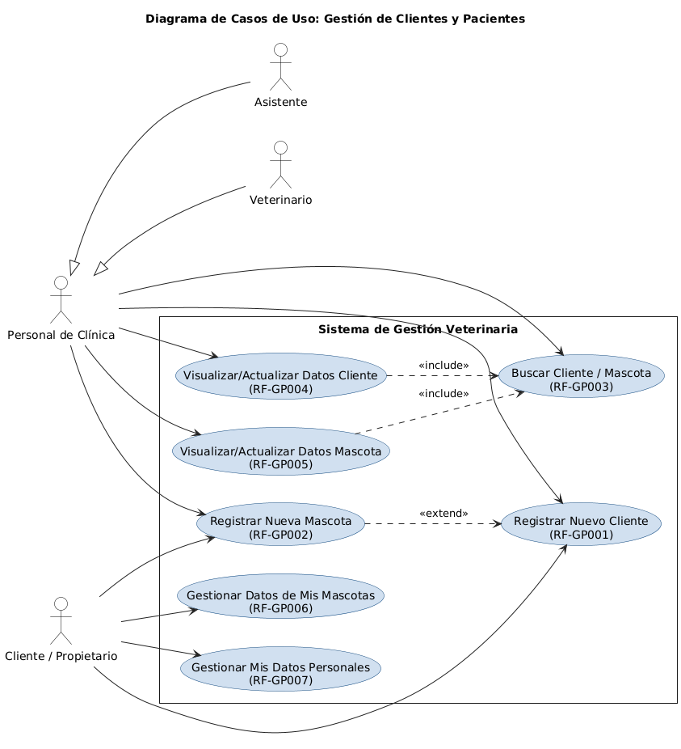

- **Actores Principales:** Asistente, Veterinario, Cliente/Propietario de Mascotas
- **Descripción:** Permite al personal del consultorio y a los propios Clientes/Propietarios (para su información y la de sus mascotas) crear nuevos registros, así como buscar, visualizar y actualizar la información existente.
- **Flujo Principal:**
  1. El actor (Asistente, Veterinario o Cliente/Propietario) inicia la gestión.
  2. El Sistema presenta opciones según el actor para registrar, buscar, visualizar o actualizar la información del cliente y/o la mascota.
  3. El actor ingresa los datos necesarios en los formularios provistos por el sistema.
  4. El sistema valida y guarda la información en la base de datos, asociando las mascotas a sus respectivos dueños.

### Módulo: Gestión de Agenda y Citas

**CU-GA01: Gestionar Citas**
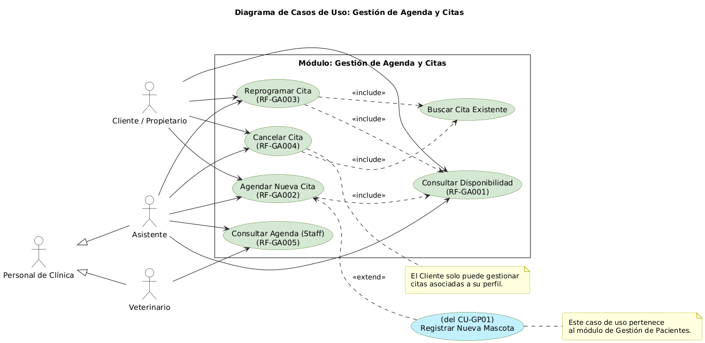

- **Actores Principales:** Asistente, Cliente/Propietario de Mascotas, Veterinario
- **Descripción:** Permite al Asistente y al Cliente/Propietario (a través de un portal) consultar disponibilidad, agendar, reprogramar y cancelar citas. Permite al personal (Asistente, Veterinario) consultar la agenda y confirmar asistencias.
- **Flujo Principal:**
  1. El actor (Asistente o Cliente/Propietario) inicia la gestión de citas. El Veterinario puede iniciarla para consultar la agenda.
  2. El actor consulta la disponibilidad horaria en una vista de calendario.
  3. Para agendar una nueva cita, el actor selecciona una mascota, un veterinario (si aplica), una fecha/hora disponible y el motivo. El sistema registra la cita.
  4. Para reprogramar o cancelar una cita existente, el actor la busca, la selecciona y realiza la acción deseada. El sistema actualiza el estado de la cita y libera el horario si es cancelada.
  5. El personal de la clínica puede consultar la agenda completa y confirmar la asistencia de los clientes.

**CU-GA02: Gestionar Recordatorios de Citas**
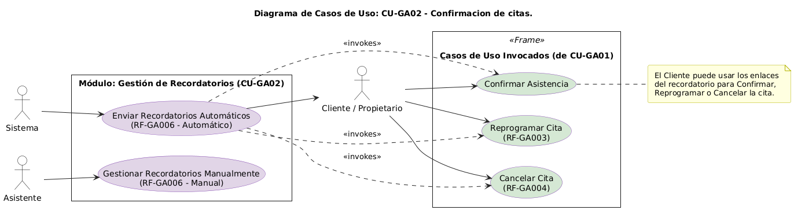

- **Actor Principal:** Sistema, Asistente
- **Descripción:** El Sistema se encarga de enviar recordatorios automáticos de citas, o permite al Asistente gestionarlos.
- **Flujo Principal:**
  1. El Sistema, basado en configuraciones predefinidas (ej. 24 horas antes), identifica las citas próximas.
  2. El Sistema envía automáticamente recordatorios a los clientes a través del canal configurado (email, SMS), incluyendo los detalles de la cita.
  3. Opcionalmente, el recordatorio puede incluir enlaces para que el cliente confirme o solicite una reprogramación.

### Módulo: Atención Clínica (Historia Clínica Electrónica)

**CU-AC01: Consultar Historial Clínico de Mascota**
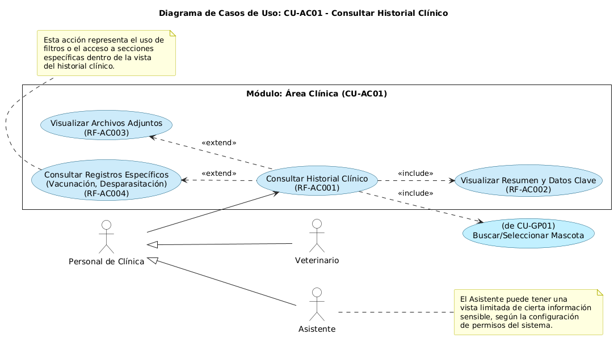

- **Actores Principales:** Veterinario, Asistente (con vista potencialmente limitada)
- **Descripción:** Permite al Veterinario (y Asistente) acceder y revisar toda la información médica registrada para una mascota, incluyendo resúmenes, archivos adjuntos y registros específicos de vacunación/desparasitación.
- **Flujo Principal:**
  1. El actor (Veterinario/Asistente) selecciona una mascota.
  2. El sistema presenta el historial clínico completo, mostrando las entradas en orden cronológico.
  3. El sistema resalta información crucial como alergias y datos básicos de la mascota.
  4. El actor puede expandir cada entrada para ver detalles, visualizar o descargar archivos adjuntos y filtrar el historial para ver registros específicos como vacunaciones.

**CU-AC02: Registrar Nueva Consulta / Actualizar Historia Clínica**
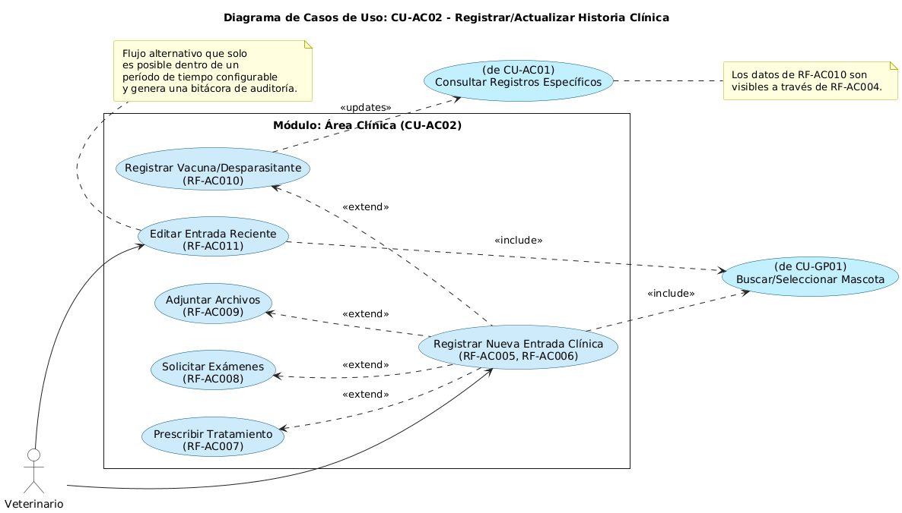

- **Actor Principal:** Veterinario
- **Descripción:** Permite al Veterinario crear una nueva entrada en la historia clínica durante una consulta, o actualizar una existente (bajo condiciones). Incluye registro de hallazgos, diagnósticos, tratamientos, solicitud de exámenes, aplicación de vacunas/desparasitantes y adjuntar archivos.
- **Flujo Principal:**
  1. El Veterinario inicia una nueva entrada de historial para una mascota.
  2. El Veterinario registra los datos de la consulta (peso, temperatura, anamnesis, diagnóstico, etc.).
  3. Dentro de la misma entrada, el Veterinario puede prescribir tratamientos (generando un récipe en PDF), solicitar exámenes de laboratorio (generando una orden en PDF), adjuntar archivos (resultados, imágenes) y registrar la aplicación de vacunas o desparasitantes.
  4. El Veterinario guarda la entrada, que se añade al historial de la mascota.
  5. El sistema permite editar la entrada durante un tiempo limitado, registrando cualquier cambio en una bitácora de auditoría.

### Módulo: Gestión de Recursos Humanos y Servicios Internos

**CU-RH01: Gestionar Personal de la Clínica**
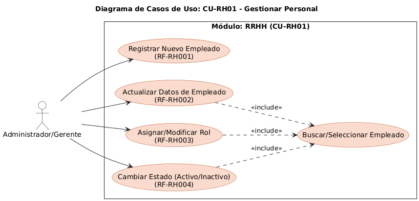

- **Actor Principal:** Administrador/Gerente
- **Descripción:** Permite al Administrador/Gerente registrar, actualizar y gestionar la información del personal de la clínica, incluyendo sus roles y estado.
- **Flujo Principal:**
  1. El Administrador/Gerente accede a la sección de gestión de personal.
  2. Desde allí, puede registrar un nuevo empleado, modificar los datos de uno existente, asignarle o cambiarle roles (lo que ajusta sus permisos en el sistema) y cambiar su estado a "activo" o "inactivo".

**CU-RH02: Gestionar Turnos y Guardias**
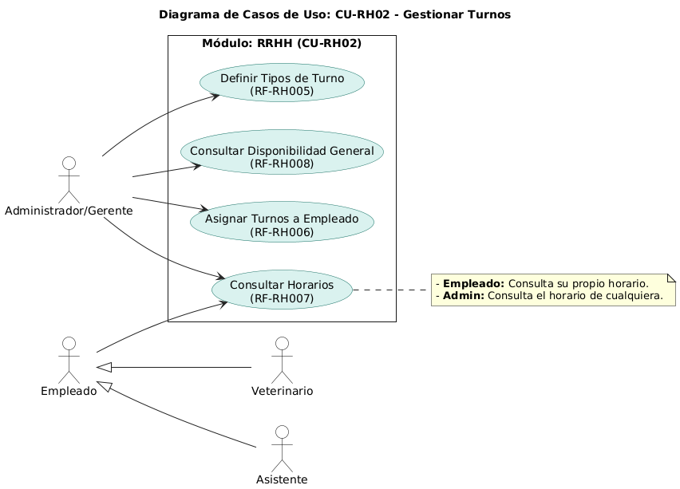

- **Actores Principales:** Administrador/Gerente, Veterinario, Asistente
- **Descripción:** Permite al Administrador/Gerente planificar y asignar turnos/guardias. Permite al personal consultar sus horarios.
- **Flujo Principal:**
  1. El Administrador/Gerente define los tipos de turnos (ej. "Turno Mañana").
  2. Luego, asigna estos turnos a los empleados en un calendario, y el sistema valida posibles conflictos.
  3. Cualquier empleado puede consultar su propio horario. El Administrador/Gerente puede ver el de todo el personal para facilitar la planificación.

**CU-RH03: Gestionar Servicios de la Clínica**
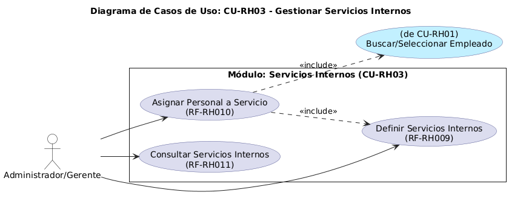

- **Actor Principal:** Administrador/Gerente
- **Descripción:** Permite al Administrador/Gerente definir y gestionar los tipos de servicios especiales o complementarios que ofrece la clínica (ej. "Farmacia", "Hospedaje") y asignar personal responsable.
- **Flujo Principal:**
  1. El Administrador/Gerente crea y describe los servicios internos que ofrece la clínica.
  2. Puede asignar uno o más empleados a cada servicio.
  3. Puede consultar una lista de todos los servicios definidos y su estado (activo/inactivo).

### Módulo: Gestión de Pagos

**CU-PG01: Registrar Pagos**
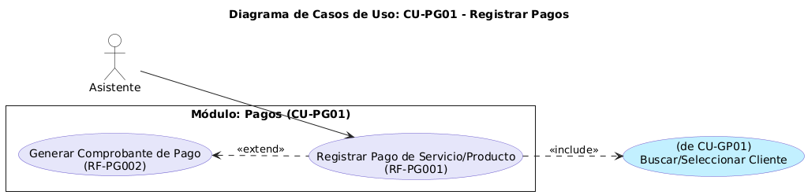

- **Actor Principal:** Asistente
- **Descripción:** Permite al Asistente registrar los pagos recibidos de los clientes por servicios o productos y generar las notas de pago correspondientes.
- **Flujo Principal:**
  1. El Asistente inicia el proceso de registro de un pago.
  2. Selecciona el cliente/mascota y los servicios o productos a pagar.
  3. Ingresa el monto y el método de pago. El sistema valida y registra el pago.
  4. Inmediatamente después, el sistema permite generar una nota de pago en PDF con los detalles de la transacción.

**CU-PG02: Consultar Historial de Pagos**
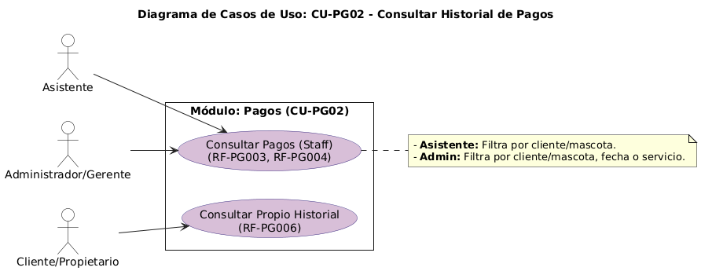

- **Actores Principales:** Asistente, Administrador/Gerente, Cliente/Propietario de Mascotas
- **Descripción:** Permite al personal de la clínica y a los Clientes/Propietarios (para sus propios registros) consultar el historial de pagos y notas de pago.
- **Flujo Principal:**
  1. El actor inicia la consulta del historial de pagos.
  2. El personal de la clínica puede buscar pagos por cliente, mascota, fecha o servicio.
  3. El Cliente/Propietario puede acceder a su portal para ver su propio historial de pagos.
  4. En todos los casos, el sistema muestra una lista detallada de los pagos y permite visualizar o descargar las notas de pago asociadas.

**CU-PG03: Generar Reportes Financieros**
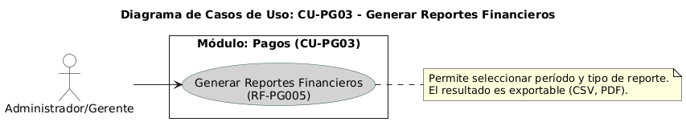

- **Actor Principal:** Administrador/Gerente
- **Descripción:** Permite al Administrador/Gerente generar reportes resumidos de los ingresos de la clínica.
- **Flujo Principal:**
  1. El Administrador/Gerente accede a la sección de reportes.
  2. Selecciona el tipo de reporte (ej. ingresos) y el período deseado (diario, semanal, mensual).
  3. El sistema procesa los datos y genera el reporte, que puede ser desglosado por tipo de servicio o método de pago.
  4. El reporte es exportable (ej. CSV, PDF) para análisis externo.
