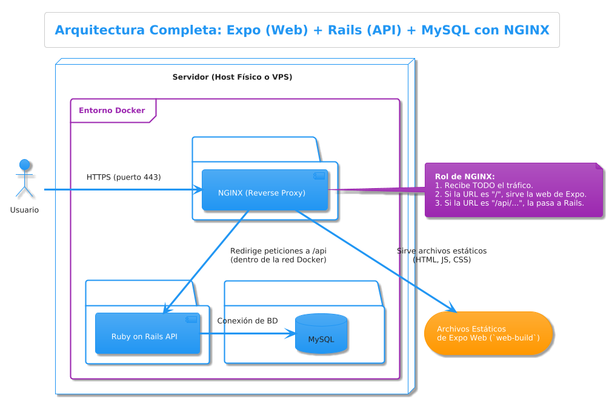

# Arquitectura Técnica Establecida - PeluDog CRM

## 1. Introducción y Filosofía

Esta arquitectura técnica definitiva establece el diseño técnico completo para el sistema PeluDog CRM. La filosofía central es crear un sistema robusto, mantenible y, fundamentalmente, fácil de instalar y desplegar para la comunidad de código abierto. Está diseñado para escalar desde una implementación inicial en un único servidor hasta una arquitectura distribuida conforme crezca la demanda.

La elección de tecnologías busca un equilibrio entre madurez, productividad de desarrollo, facilidad de escalamiento y un ecosistema sólido que facilite la implementación de las funcionalidades requeridas.

---

## 2. Arquitectura de 3 Capas Containerizada

### **Capa de Backend (Servidor)**

- **Tecnología:** Ruby on Rails 7+ (modo `api_only`)
- **Ruby Version:** 3.3+
- **Responsabilidades:**
  - Exponer una **API RESTful** segura para que el frontend consuma los datos
  - Implementar toda la **lógica de negocio** y las reglas del dominio (cálculos de vacunación, gestión de citas, etc.)
  - Gestionar la **autenticación y autorización** de usuarios mediante JWT
  - Realizar **validaciones de datos** a nivel de modelo para garantizar la integridad
  - Gestionar **backups automáticos** de la base de datos
  - Manejar **archivos multimedia** con ActiveStorage

- **Modo `api_only`:** El backend no generará vistas HTML. Su única responsabilidad es recibir y responder a peticiones con formato JSON, manteniendo la arquitectura ligera y enfocada.

- **Autenticación (JWT):**
  - Sistema de autenticación stateless basado en **JSON Web Tokens**
  - **No se usarán sesiones del lado del servidor**
  - Controladores específicos para registro, inicio de sesión y recuperación de contraseña
  - Token JWT firmado que el cliente almacena y envía en la cabecera `Authorization: Bearer <token>`

### **Capa de Frontend (Aplicación Cliente)**

- **Tecnología:** **Expo (React Native) con TypeScript**
- **Versiones:** Expo SDK 52+, React Native 0.76+
- **Responsabilidades:**
  - Renderizar la **interfaz de usuario** para veterinarios, asistentes y clientes
  - Gestionar el **estado de la aplicación** con React Hooks reutilizables
  - Realizar peticiones a la **API del backend**
  - Incluir **Landing Page personalizable** como pantalla de inicio

- **Tecnologías Complementarias:**
  - **Estilos:** Tailwind CSS con NativeWind
  - **Notificaciones:** `react-native-toast-message`
  - **HTTP Client:** Axios con interceptores para JWT automático
  - **Tipado:** TypeScript para interfaces y tipos seguros

### **Capa de Persistencia (Base de Datos)**

- **Base de Datos:** MySQL 8.0+
- **Responsabilidades:**
  - Almacenar datos persistentes: usuarios, clientes, mascotas, historias clínicas, citas, pagos
  - Soporte para backups automáticos diarios
  - Gestión de volúmenes persistentes para archivos multimedia

---

## 3. Gestión de Archivos y ActiveStorage

### **Estrategia de Almacenamiento**

ActiveStorage se configurará inicialmente para persistencia local en disco, facilitando la instalación y configuración inicial. La estructura de almacenamiento será organizada para garantizar la integridad y facilitar futuras migraciones.

**Estructura de Almacenamiento Local:**
- Archivos originales organizados por fecha y tipo
- Variaciones de imagen generadas automáticamente (thumbnails)
- Archivos temporales con limpieza automática

**Tipos de Archivos Soportados:**
- **Imágenes:** JPEG, PNG, WebP (fotos de mascotas, documentos escaneados)
- **Documentos:** PDF (historias clínicas, reportes)
- **Límites:** 50MB por archivo inicialmente, escalable según necesidades

---

## 4. Sistema de Backups Automatizado

### **Estrategia de Backup con Whenever Gem**

El sistema implementará backups automáticos diarios utilizando la gema Whenever para programar tareas cron. Esta estrategia garantiza la continuidad del servicio y la protección de datos críticos.

**Configuración de Backups:**
- **Frecuencia:** Diaria a las 2:00 AM
- **Retención:** Se conservan los 6 backups más recientes.
- **Compresión:** Automática con gzip para optimizar espacio
- **Restauración:** Comando específico desde Rails para recuperación rápida

---

## 5. Orquestación y Despliegue con Docker

### **Estrategia de Containerización**

La arquitectura utiliza Docker Compose para orquestar todos los servicios necesarios, manteniendo la simplicidad de instalación mientras proporciona flexibilidad para el escalamiento futuro.

**Servicios Containerizados:**
- **NGINX:** Proxy inverso y servidor de archivos estáticos
- **Rails Backend:** API server con todas las dependencias
- **Frontend Web:** Contenedor que sirve la compilación estática para web (PWA) de la aplicación Expo.
- **MySQL:** Base de datos con configuraciones optimizadas

**Volúmenes Persistentes:**
- Base de datos MySQL
- Almacenamiento ActiveStorage
- Backups de base de datos
- Archivos estáticos del frontend

---

## 6. Estrategia de Escalamiento

### **Importancia del Escalamiento Vertical Primero**

El escalamiento vertical debe ser la primera opción antes de considerar el escalamiento horizontal. Esto es crítico por varias razones:

1. **Simplicidad Operacional:** Mantener un único servidor es significativamente más simple de administrar, monitorear y debuggear
2. **Menor Complejidad de Código:** No requiere modificaciones en la aplicación para manejar estado distribuido
3. **Costos Reducidos:** Un servidor más potente es generalmente más económico que múltiples servidores más pequeños
4. **Menor Latencia:** Sin overhead de comunicación entre servicios
5. **Facilidad de Backup y Restauración:** Un solo punto de datos facilita las operaciones de backup

### **6.1 Fase 1: Escalamiento Vertical Extensivo (0-300 usuarios concurrentes)**

Como primer paso en el escalamiento vertical, y antes de escalar horizontalmente, se puede introducir **Redis** para gestionar el caché de la aplicación y aliviar la carga sobre la base de datos.

**Proceso de Backup:**
1. Generación automática del dump de MySQL
2. Compresión del archivo resultante
3. Eliminación automática de backups antiguos
4. Logging de operaciones para auditoría

**Comando de Restauración:**
El sistema incluirá un comando específico desde Rails que permita restaurar la base de datos desde cualquier backup disponible, facilitando la recuperación ante desastres.

---

## 5. Orquestación y Despliegue con Docker

### **Estrategia de Containerización**

La arquitectura utiliza Docker Compose para orquestar todos los servicios necesarios, manteniendo la simplicidad de instalación mientras proporciona flexibilidad para el escalamiento futuro.

**Servicios Containerizados:**
- **NGINX:** Proxy inverso y servidor de archivos estáticos
- **Rails Backend:** API server con todas las dependencias
- **Frontend Web:** Compilación web de la aplicación Expo
- **MySQL:** Base de datos con configuraciones optimizadas
- **Redis:** Cache y gestión de sesiones (agregado en escalamiento vertical)

**Volúmenes Persistentes:**
- Base de datos MySQL
- Almacenamiento ActiveStorage
- Backups de base de datos
- Archivos estáticos del frontend

---

## 6. Estrategia de Escalamiento

### **Importancia del Escalamiento Vertical Primero**

El escalamiento vertical debe ser la primera opción antes de considerar el escalamiento horizontal. Esto es crítico por varias razones:

1. **Simplicidad Operacional:** Mantener un único servidor es significativamente más simple de administrar, monitorear y debuggear
2. **Menor Complejidad de Código:** No requiere modificaciones en la aplicación para manejar estado distribuido
3. **Costos Reducidos:** Un servidor más potente es generalmente más económico que múltiples servidores más pequeños
4. **Menor Latencia:** Sin overhead de comunicación entre servicios
5. **Facilidad de Backup y Restauración:** Un solo punto de datos facilita las operaciones de backup

### **6.1 Fase 1: Escalamiento Vertical Extensivo (0-300 usuarios concurrentes)**

**Hardware Progresivo:**
- **Inicial:** 4 cores, 8GB RAM, 500GB SSD
- **Medio:** 8 cores, 16GB RAM, 1TB SSD
- **Avanzado:** 16 cores, 32GB RAM, 2TB NVMe SSD
- **Máximo:** 32 cores, 64GB RAM, 4TB NVMe SSD

**Optimización de Workers y Threads:**
El escalamiento vertical permite aumentar significativamente el número de workers de Puma y threads por worker sin los problemas de sincronización que aparecen en arquitecturas distribuidas.

- **Workers de Puma:** Se pueden incrementar desde 4 hasta 12-16 workers en un servidor potente
- **Threads por Worker:** Aumentar de 5 hasta 25-30 threads por worker
- **Conexiones de Base de Datos:** Pool de conexiones escalable hasta 400-500 conexiones simultáneas
- **Memoria Cache:** Redis puede utilizar 8-16GB de RAM para caching agresivo

**Límites Reales del Escalamiento Vertical:**
Un servidor bien optimizado puede manejar entre 250-300 usuarios concurrentes reales (no solo conexiones) antes de necesitar escalamiento horizontal. Este límite considera:
- Operaciones complejas de base de datos (historias clínicas, reportes)
- Subida/descarga de archivos multimedia
- Procesamiento de imágenes con ActiveStorage
- Consultas pesadas de reportes y analíticas

### **6.2 Transición al Escalamiento Horizontal (300+ usuarios concurrentes)**

**Cuándo Escalar Horizontalmente:**
- CPU constantemente por encima del 80%
- Memoria RAM utilizada por encima del 85%
- Tiempo de respuesta de la base de datos > 200ms consistentemente
- Cola de requests en NGINX/Puma creciendo constantemente

### **6.3 Gestión de Variables de Entorno en Load Balancer**

**Problema de Consistencia de ENV:**
Cuando se escala horizontalmente, todas las instancias de Rails deben compartir las mismas variables de entorno para garantizar comportamiento consistente. Esto incluye:
- Claves de encriptación (SECRET_KEY_BASE, JWT_SECRET_KEY)
- Configuraciones de base de datos
- Configuraciones de Redis
- Configuraciones de ActiveStorage

**Solución con Archivos ENV Compartidos:**
1. **Archivo ENV Central:** Un único archivo `.env.scaling` compartido entre todas las instancias
2. **Montaje de Volumen:** Docker monta este archivo en todas las instancias de backend
3. **Sincronización:** Cualquier cambio en variables se refleja inmediatamente en todas las instancias
4. **Versionado:** Git tracks de archivos ENV para control de cambios

**Gestión de Sesiones Distribuidas:**
- **Redis Centralizado:** Todas las instancias comparten el mismo Redis para sesiones
- **JWT Stateless:** Preferir JWT sobre sesiones cuando sea posible
- **Sticky Sessions:** NGINX puede configurarse para mantener usuarios en la misma instancia

### **6.4 Separación de ActiveStorage y Race Conditions**

**Problemas con ActiveStorage Distribuido:**
Cuando múltiples instancias de Rails manejan subida de archivos simultáneamente, pueden ocurrir race conditions y corrupción de datos:

1. **Race Conditions en Escritura:** Dos instancias intentando escribir el mismo archivo
2. **Inconsistencia de Metadatos:** Base de datos actualizada en una instancia pero archivo no disponible en otras
3. **Limpieza de Archivos Temporales:** Conflictos cuando múltiples instancias limpian archivos

**Solución: Servidor de Storage Dedicado**
1. **MinIO como Servidor Dedicado:** Separar ActiveStorage a un contenedor MinIO dedicado
2. **API S3 Compatible:** Todas las instancias Rails hablan con MinIO via API S3
3. **Consistencia Garantizada:** MinIO maneja la consistencia y concurrencia automáticamente
4. **Eliminación de Race Conditions:** MinIO es responsible de la escritura atómica

**Proceso de Migración de Storage:**
1. **Instalación de MinIO:** Nuevo contenedor con volúmenes persistentes
2. **Configuración de Rails:** Cambiar ActiveStorage de `local` a `amazon` (MinIO)
3. **Migración de Archivos Existentes:** Rake task para transferir archivos locales a MinIO
4. **Verificación de Integridad:** Confirmar que todos los archivos fueron migrados correctamente
5. **Limpieza:** Eliminar archivos locales después de verificar migración

**Configuración de MinIO en Escalamiento:**
- **Replicación:** MinIO puede configurarse con múltiples nodos para redundancia
- **CDN:** Servir archivos estáticos through CDN para mejor performance
- **Backup:** MinIO se integra con estrategias de backup existentes

### **6.5 Arquitectura Distribuida Final (1000+ usuarios concurrentes)**

**Migración desde Docker:**
El proceso de migración desde contenedores Docker a servidores especializados debe ser gradual y sin interrupciones:

1. **Preparación de Infraestructura:** Configurar servidores dedicados
2. **Migración de Base de Datos:** Establecer replicación Master-Slave
3. **Migración de Storage:** Mover ActiveStorage a cluster distribuido
4. **Migración de Aplicación:** Desplegar Rails en múltiples servidores
5. **Migración de Load Balancer:** HAProxy/NGINX en servidores dedicados
6. **Verificación y Rollback:** Planes de rollback en cada fase

---

## 7. Monitoreo y Observabilidad

### **Métricas Clave de Escalamiento**

- **Performance:** Tiempo de respuesta API, throughput por instancia
- **Base de Datos:** Conexiones activas, queries lentas, replication lag
- **Archivos:** Espacio usado, velocidad de upload, race conditions detectadas
- **Backups:** Éxito/fallo de backups, tiempo de restauración
- **Workers:** Utilización de workers, queue depth, thread pool

### **Alertas Críticas**

- CPU por encima del 85% por más de 5 minutos
- Memoria RAM por encima del 90%
- Tiempo de respuesta de base de datos > 300ms
- Fallos de backup
- Errores en ActiveStorage (indicativo de race conditions)

---

## 8. Seguridad y Compliance

### **Medidas de Seguridad Escalables**

- **Datos Médicos:** Encriptación en reposo y tránsito, independiente de la arquitectura
- **Backups:** Encriptación de archivos de backup, múltiples ubicaciones en arquitectura distribuida
- **Acceso:** Logs de auditoría centralizados
- **SSL/TLS:** Certificados automáticos con Let's Encrypt, load balancer termination

### **Compliance en Arquitectura Distribuida**

- **LGPD/GDPR:** Derecho al olvido implementado en todas las instancias
- **Logs de Auditoría:** Centralización de logs para compliance
- **Retención de Datos:** Políticas consistentes across all services

---

## 9. Objetivo Estratégico de Replicabilidad

La arquitectura está diseñada para ser **fácilmente replicable** por otras clínicas veterinarias con mínima personalización. La estructura de datos común permite:

1. **Intercambio seguro de información** entre clínicas
2. **Referencia de pacientes** sin transferencias manuales
3. **Actualizaciones centralizadas** del sistema
4. **Comunidad de desarrollo** colaborativa

El proceso de instalación mantiene la simplicidad de `docker-compose up` en la fase inicial, con un path claro de escalamiento que no requiere reescritura de la aplicación base.

---

## 10. Documentación Técnica Complementaria

Para detalles técnicos específicos, configuraciones y código de implementación, consultar:

- **[AnexosArquitectura.md](./AnexosArquitectura.md)** - Configuraciones técnicas completas
- **[EnvsTemplate.md](./EnvsTemplate.md)** - Variables de entorno para todas las fases